# MOC - 第5章 大数定律与中心极限定理

> [!info] 本章定位
> 第5章是**连接概率论与数理统计的桥梁**。前四章建立了刻画随机现象的数学模型（事件、随机变量、分布、数字特征），但都属于"已知分布推断概率"的演绎框架。本章从两个方向突破这一局限：
>
> - **大数定律**回答"为什么可以用频率估计概率、用样本均值估计总体均值"——它是统计推断的**合理性依据**，说明大量重复试验下随机现象呈现稳定性。
> - **中心极限定理**回答"为什么正态分布如此普遍"——它是统计推断的**工具性基础**，说明大量独立随机因素叠加的分布近似正态，从而为第6–8章用正态分布做抽样推断提供理论支撑。
>
> 本章上承 [[4.2 方差、标准差]]（方差是切比雪夫不等式与大数定律的关键量）与 [[2.5 常见分布：0-1、二项、泊松、均匀、指数、正态]]（二项分布、正态分布），下启 [[MOC - 第6章]]（统计量与抽样分布）与 [[MOC - 第7章]]（参数估计）。理解本章后，"频率$\to$概率""样本均值$\to$总体均值""和的分布$\to$正态"这三条统计直觉才有了严格的数学保证。

## 学习路线图

```mermaid
flowchart TD
    A[第4章 期望、方差] --> B[5.1 切比雪夫不等式]
    B -->|给出概率上界估计工具| C[5.2 大数定律]
    B -->|证明切比雪夫大数定律的关键| C
    C -->|频率稳定于概率| D[5.3 独立同分布 CLT]
    D -->|和的标准化趋于标准正态| E[5.4 棣莫弗-拉普拉斯定理]
    E -->|二项分布的正态近似| F[第6章 数理统计基础]
    D -->|正态近似的普遍性| F
    C -->|样本均值估计总体均值| G[第7章 参数估计]
    F --> G

    H[第2章 二项分布 B n p] --> E
    I[第2章 正态分布 N mu sigma^2] --> D
```

> [!tip] 学习顺序建议
> 严格按 **5.1 → 5.2 → 5.3 → 5.4** 顺序学习。5.1 的切比雪夫不等式是 5.2 切比雪夫大数定律的证明工具；5.2 依概率收敛的概念是 5.3、5.4 极限定理表述的基础；5.4 是 5.3 在二项分布情形的特例。切忌跳过依概率收敛定义直接套 CLT 公式。

## 知识点导航

| 节次 | 主题 | 入口 | 核心结论 | 关键公式 |
| ---- | ---- | ---- | -------- | -------- |
| 5.1 | 切比雪夫不等式 | [[5.1 切比雪夫不等式]] | 用方差估计偏差概率的上界 | $P\{\|X-E(X)\|\geq\epsilon\}\leq\dfrac{D(X)}{\epsilon^2}$ |
| 5.2 | 大数定律 | [[5.2 大数定律]] | 频率/样本均值依概率收敛 | $\dfrac{1}{n}\sum X_i \xrightarrow{P} \mu$ |
| 5.3 | 独立同分布中心极限定理 | [[5.3 独立同分布中心极限定理]] | 和的标准化分布趋于标准正态 | $\dfrac{\sum X_i-n\mu}{\sqrt n\,\sigma}\xrightarrow{d}N(0,1)$ |
| 5.4 | 棣莫弗-拉普拉斯定理 | [[5.4 棣莫弗-拉普拉斯定理]] | 二项分布的正态近似 | $\dfrac{Y_n-np}{\sqrt{np(1-p)}}\xrightarrow{d}N(0,1)$ |

## 核心考点

> [!warning] 高频考点（7点）
> 1. **切比雪夫不等式估界**：给定期望方差，求 $P\{|X-\mu|<\epsilon\}$ 的下界或 $P\{|X-\mu|\geq k\sigma\}$ 的上界。注意 $\epsilon$ 与 $k\sigma$ 的换算。
> 2. **依概率收敛定义判别**：判断给定随机变量序列是否依概率收敛，写 $\varepsilon-N$ 语言定义 $\lim_{n\to\infty}P\{|X_n-a|\geq\varepsilon\}=0$。
> 3. **三个大数定律的条件区分**：切比雪夫要求独立+方差有界；辛钦要求独立同分布+期望存在（不要求方差存在）；伯努利是辛钦在 0-1 分布情形的特例。易错点是混淆"方差有界"与"方差存在"。
> 4. **CLT 标准化**：构造 $\dfrac{\sum X_i-n\mu}{\sqrt n\,\sigma}$，注意分子是和而非均值，均值情形用 $\dfrac{\bar X-\mu}{\sigma/\sqrt n}$。
> 5. **棣莫弗-拉普拉斯近似计算**：二项分布 $B(n,p)$ 概率，注意**连续性修正** $\pm 0.5$。
> 6. **近似条件判别**：$np\geq 5$ 且 $n(1-p)\geq 5$ 才用正态近似；$n$ 大 $p$ 小用泊松近似。
> 7. **大数定律证明题**：用切比雪夫不等式证 $\bar X_n \xrightarrow{P} \mu$，关键是验证方差有界或 $D(\bar X_n)\to 0$。

## 自测题

> [!example] 自测题 1
> 设 $X$ 的期望 $\mu=10$，方差 $\sigma^2=4$。用切比雪夫不等式估计 $P\{|X-10|\geq 6\}$ 的上界。
> > [!success]- 参考答案
> > $\epsilon=6$，$P\{|X-10|\geq 6\}\leq \dfrac{4}{6^2}=\dfrac{1}{9}\approx 0.111$。

> [!example] 自测题 2
> 判断对错：辛钦大数定律要求随机变量序列独立、同分布、方差存在。
> > [!success]- 参考答案
> > 错。辛钦大数定律只要求**独立同分布 + 期望存在**，不要求方差存在。这是它与切比雪夫大数定律的关键区别。

> [!example] 自测题 3
> 设 $X_i$（$i=1,2,\ldots$）独立同分布，$E(X_i)=\mu$，$D(X_i)=\sigma^2$。求 $P\{\sum_{i=1}^{50}X_i>50\mu+5\sigma\}$ 的近似值（用 $\Phi$ 表示）。
> > [!success]- 参考答案
> > 由 CLT，$\dfrac{\sum X_i-50\mu}{\sqrt{50}\sigma}\sim\approx N(0,1)$。原式 $=P\left\{\dfrac{\sum X_i-50\mu}{\sqrt{50}\sigma}>\dfrac{5\sigma}{\sqrt{50}\sigma}\right\}=1-\Phi\left(\dfrac{5}{\sqrt{50}}\right)=1-\Phi\left(\dfrac{\sqrt 2}{2}\right)$。

> [!example] 自测题 4
> 掷一枚均匀硬币 100 次，用棣莫弗-拉普拉斯定理求正面次数在 40 到 60 之间的概率（含端点，用 $\Phi$ 表示）。
> > [!success]- 参考答案
> > $Y\sim B(100,0.5)$，$np=50$，$\sqrt{np(1-p)}=5$。带连续性修正：$P\{39.5<Y<60.5\}=P\left\{\dfrac{39.5-50}{5}<\dfrac{Y-50}{5}<\dfrac{60.5-50}{5}\right\}=\Phi(2.1)-\Phi(-2.1)=2\Phi(2.1)-1$。

## 章节导航

- 上一级：[[MOC - 概率论与数理统计B]]
- 上一章：[[MOC - 第4章]]（随机变量的数字特征）
- 下一章：[[MOC - 第6章]]（数理统计基础）
- 本章习题：[[MOC - 第5章习题]]
- 下一章习题：[[MOC - 第6章习题]]

## 关联

- 上游：[[4.1 数学期望定义与性质]]、[[4.2 方差、标准差]]、[[2.5 常见分布：0-1、二项、泊松、均匀、指数、正态]]
- 下游：[[6.1 总体、样本、统计量]]、[[6.4 正态总体统计量分布]]、[[7.1 矩估计]]、[[7.3 估计量评价标准]]（一致性）
- 跨章：[[MOC - 高等数学A(1)]]（极限理论是依概率收敛的数学基础）
