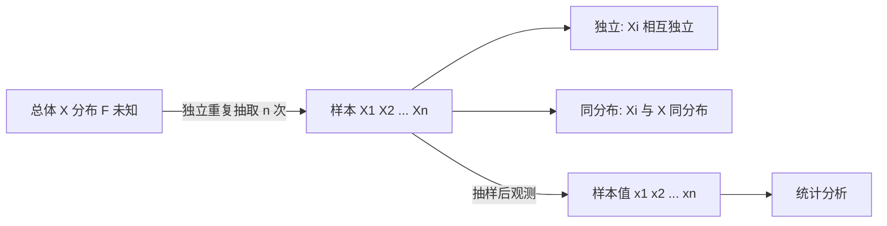
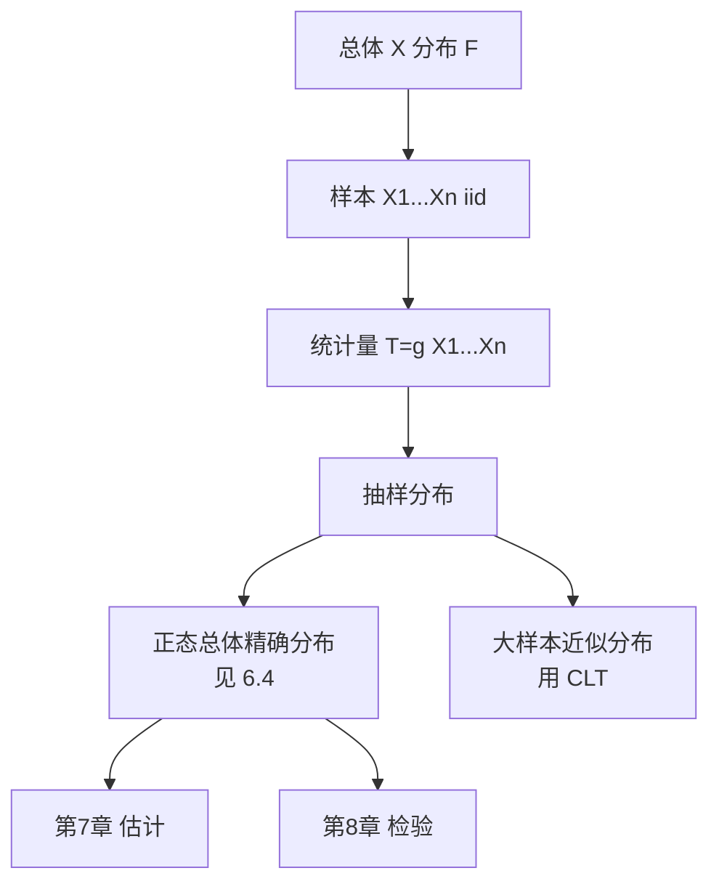

# 6.1 总体、样本、统计量

> [!info] 本节定位
> 本节是数理统计的**概念起点**，定义三个基础对象：总体（研究对象的数量指标全体）、样本（从总体中抽取的部分个体）、统计量（样本的不含未知参数的函数）。它们把"以部分推断整体"这一统计思想形式化：总体是未知的"整体"，样本是观测到的"部分"，统计量是从部分提取信息的"加工工具"。后续 [[6.2 样本均值、样本方差、样本矩]]、[[6.3 三大抽样分布：χ²分布、t分布、F分布]]、[[6.4 正态总体统计量分布]] 都建立在本节概念之上。

## 6.1.1 总体

> [!definition] 总体
> 在数理统计中，**总体**（population）是指研究对象的**某项数量指标的全体**，用一个随机变量 $X$ 表示。$X$ 的分布称为**总体分布**，其数字特征（期望、方差等）称为**总体数字特征**。

> [!tip] 概念说明
> - 总体不是"对象的全体"，而是"**数量指标的全体**"。例如研究某厂灯泡寿命，总体是"所有灯泡的寿命"这个数量指标，而非"所有灯泡"本身。
> - 用随机变量 $X$ 表示总体后，"$X\sim N(\mu,\sigma^2)$"等价于"总体服从正态分布"。
> - 总体分布通常是**未知**的（或含未知参数），统计推断的目的就是基于样本对它作出判断。
> - 总体的每一个取值称为**个体**。

## 6.1.2 样本与简单随机样本

> [!definition] 样本
> 从总体 $X$ 中随机抽取 $n$ 个个体 $X_1,X_2,\ldots,X_n$，称为来自总体 $X$ 的**容量为 $n$ 的样本**。这 $n$ 个个体在抽样前是随机变量，抽样后得到具体的数值 $x_1,x_2,\ldots,x_n$，称为**样本观察值**（样本值）。

> [!definition] 简单随机样本
> 若样本 $X_1,X_2,\ldots,X_n$ 满足：
> 1. **独立**：$X_1,X_2,\ldots,X_n$ 相互独立；
> 2. **同分布**：每个 $X_i$ 与总体 $X$ 同分布，
>
> 则称其为来自总体 $X$ 的**简单随机样本**，记作 $X_1,\ldots,X_n\stackrel{iid}{\sim}X$。

> [!tip] 为什么要求独立同分布
> - **独立**保证各次观测互不干扰，信息不重复。
> - **同分布**保证每个 $X_i$ 都能反映总体 $X$ 的信息。
> - 这两条是 [[5.2 大数定律]]（辛钦大数定律）和 [[5.3 独立同分布中心极限定理]] 的前提，从而支撑"用 $\bar X$ 估计 $\mu$"等统计推断的合法性。
> - 实际抽样中，**有放回抽样**自然满足 i.i.d.；**无放回抽样**当总体容量远大于样本容量（一般 $\geq 10$ 倍）时近似 i.i.d.。

> [!warning] 易错点
> 1. 样本 $X_i$ 是**随机变量**，不是数；样本值 $x_i$ 才是数。计算 $E(\bar X)$、$D(\bar X)$ 时把 $X_i$ 当随机变量处理。
> 2. "简单随机样本"特指**独立同分布**，比一般"随机样本"要求更强。
> 3. 来自总体 $N(\mu,\sigma^2)$ 的样本 $X_1,\ldots,X_n$，意味着 $X_i\stackrel{iid}{\sim}N(\mu,\sigma^2)$。

## 6.1.3 统计量

> [!definition] 统计量
> 设 $X_1,X_2,\ldots,X_n$ 是来自总体 $X$ 的样本，$g(x_1,x_2,\ldots,x_n)$ 是一个**不含未知参数**的 $n$ 元函数。则称 $T=g(X_1,X_2,\ldots,X_n)$ 为**统计量**。

> [!note] 关键性质
> - 统计量是**样本的函数**，由于样本是随机变量，统计量也是**随机变量**，有自己的分布（称为**抽样分布**）。
> - "不含未知参数"是核心：已知参数（如样本容量 $n$）可出现；未知参数（如总体 $\mu,\sigma^2$）不可出现。
> - 统计量的分布可能依赖未知参数（如 $\bar X\sim N(\mu,\sigma^2/n)$ 依赖 $\mu,\sigma^2$），这不妨碍 $\bar X$ 是统计量——只要 $\bar X$ 这个**表达式**不含未知参数即可。

> [!example] 例题 6.1.1（判别统计量）
> 设 $X_1,\ldots,X_n$ 来自 $N(\mu,\sigma^2)$（$\mu,\sigma^2$ 未知）。判别下列是否为统计量：
> （1）$\bar X=\dfrac{1}{n}\sum X_i$；
> （2）$X_1-X_2$；
> （3）$\dfrac{\bar X-\mu}{\sigma}$；
> （4）$\dfrac{1}{n}\sum(X_i-\bar X)^2$；
> （5）$\dfrac{1}{\sigma^2}\sum(X_i-\mu)^2$；
> （6）$\max(X_1,\ldots,X_n)$。
>
> **解答**
> - （1）是；（2）是；（4）是；（6）是：均不含未知参数。
> - （3）含 $\mu,\sigma$，不是统计量。
> - （5）含 $\mu,\sigma^2$，不是统计量。
>
> **关键**：判别标准只看**表达式是否含未知参数**，与统计量分布是否依赖参数无关。

## 6.1.4 常用统计量引入

> [!tip] 常用统计量（详见 [[6.2 样本均值、样本方差、样本矩]]）
> 设 $X_1,\ldots,X_n$ 来自总体 $X$，常用统计量有：
> - **样本均值**：$\bar X=\dfrac{1}{n}\sum_{i=1}^n X_i$
> - **样本方差**：$S^2=\dfrac{1}{n-1}\sum_{i=1}^n(X_i-\bar X)^2$
> - **样本标准差**：$S=\sqrt{S^2}$
> - **样本 $k$ 阶原点矩**：$A_k=\dfrac{1}{n}\sum_{i=1}^n X_i^k$
> - **样本 $k$ 阶中心矩**：$B_k=\dfrac{1}{n}\sum_{i=1}^n(X_i-\bar X)^k$

## 6.1.5 自由度概念

> [!definition] 自由度
> 自由度（degrees of freedom）指统计量中**能够独立变化的分量个数**，等于样本容量 $n$ 减去独立约束条件的个数。
>
> 例如 $\sum_{i=1}^n(X_i-\bar X)^2$ 中，$n$ 个偏差 $X_i-\bar X$ 满足一个约束 $\sum(X_i-\bar X)=0$，故独立变化的分量有 $n-1$ 个，自由度为 $n-1$。

> [!tip] 自由度的作用
> - 决定 $\chi^2$、$t$、$F$ 等分布的参数（如 $\chi^2(n-1)$ 中的 $n-1$）。
> - 解释样本方差分母为 $n-1$：因 $\sum(X_i-\bar X)^2$ 只有 $n-1$ 个独立偏差，除以 $n-1$ 才是"平均每个自由度的平方偏差"。
> - 详见 [[6.2 样本均值、样本方差、样本矩]] 与 [[6.3 三大抽样分布：χ²分布、t分布、F分布]]。

## 6.1.6 抽样分布的概念

> [!definition] 抽样分布
> 统计量的分布称为**抽样分布**。例如 $\bar X$ 的分布、$S^2$ 的分布、$\chi^2$、$t$、$F$ 等都是抽样分布。
>
> 抽样分布是统计推断的核心工具：[[7.1 矩估计]]、[[7.3 估计量评价标准]]、[[8.3 正态总体均值假设检验（Z检验、t检验）]] 等都依赖抽样分布来构造估计量或检验统计量。

## 小结

- 总体 $X$：研究对象的某数量指标，分布通常未知。
- 样本 $X_1,\ldots,X_n$：来自总体的 $n$ 个个体，简单随机样本要求独立同分布。
- 统计量：样本的不含未知参数的函数，本身是随机变量，有抽样分布。
- 自由度：统计量中独立变化分量的个数，等于 $n$ 减约束数。
- 后续内容（$\bar X,S^2$ 的数字特征、三大分布、正态总体抽样定理）都建立在本节概念上。

## 关联

- 上游：[[2.5 常见分布：0-1、二项、泊松、均匀、指数、正态]]（总体分布举例）、[[5.2 大数定律]]（i.i.d. 假设的依据）
- 下游：[[6.2 样本均值、样本方差、样本矩]]、[[6.3 三大抽样分布：χ²分布、t分布、F分布]]、[[6.4 正态总体统计量分布]]、[[7.1 矩估计]]、[[7.3 估计量评价标准]]
- 章导航：[[MOC - 第6章]]
