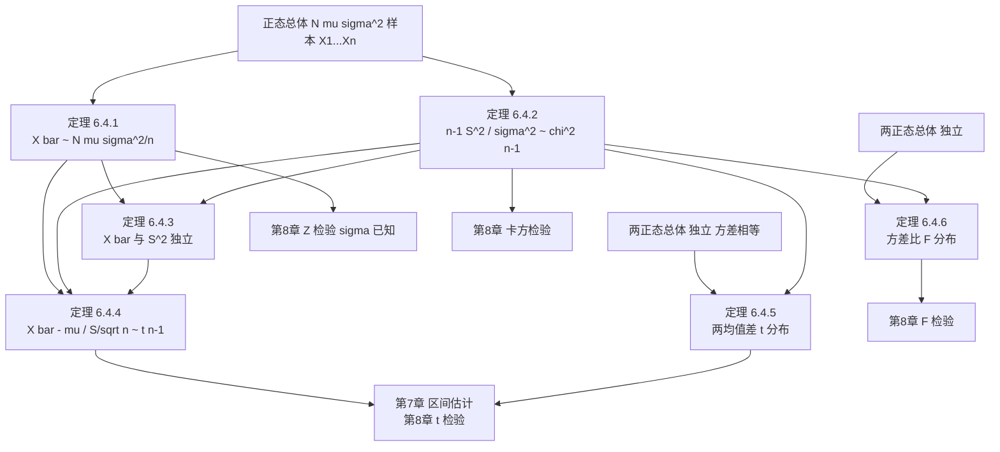

# 6.4 正态总体统计量分布

> [!info] 本节定位
> 本节是第6章的**应用核心**：在正态总体 $N(\mu,\sigma^2)$ 假设下，推导 $\bar X$、$S^2$ 及其组合的**精确分布**。这些定理是 [[7.1 矩估计]]、[[7.3 估计量评价标准]]中**区间估计**与 [[8.3 正态总体均值假设检验（Z检验、t检验）]]、[[8.4 正态总体方差假设检验（卡方检验、F检验）]]中**检验统计量**的直接来源。本节定理的证明用到 [[6.3 三大抽样分布：χ²分布、t分布、F分布]]的全部工具，其中**$\bar X$ 与 $S^2$ 独立**是最深刻、最常用的结论。

## 6.4.1 单正态总体情形

> [!theorem] 定理 6.4.1（样本均值的分布）
> 设 $X_1,X_2,\ldots,X_n$ 来自正态总体 $N(\mu,\sigma^2)$。则
> $$\bar X\sim N(\mu,\sigma^2/n),\qquad \dfrac{\bar X-\mu}{\sigma/\sqrt n}\sim N(0,1).$$

> [!proof]- 证明
> 由正态分布的可加性：$\sum_{i=1}^n X_i\sim N(n\mu,n\sigma^2)$。
> 故 $\bar X=\dfrac{1}{n}\sum X_i\sim N\!\left(\mu,\dfrac{\sigma^2}{n}\right)$。标准化即得第二式。

> [!theorem] 定理 6.4.2（样本方差的分布）
> 设 $X_1,\ldots,X_n$ 来自 $N(\mu,\sigma^2)$。则
> $$\dfrac{(n-1)S^2}{\sigma^2}\sim\chi^2(n-1).$$

> [!note] 自由度为何是 $n-1$
> $\sum(X_i-\bar X)^2$ 中 $n$ 个偏差满足约束 $\sum(X_i-\bar X)=0$，自由度 $n-1$。这与 [[6.2 样本均值、样本方差、样本矩]] 中样本方差分母 $n-1$ 一致。

> [!proof]- 证明思路
> 标准化：令 $Z_i=\dfrac{X_i-\mu}{\sigma}\sim N(0,1)$。则
> $$\sum_{i=1}^n\!\left(\dfrac{X_i-\mu}{\sigma}\right)^2=\sum Z_i^2\sim\chi^2(n).$$
> 又可分解（关键恒等式）：
> $$\sum_{i=1}^n\!\left(\dfrac{X_i-\mu}{\sigma}\right)^2=\sum_{i=1}^n\!\left(\dfrac{X_i-\bar X}{\sigma}\right)^2+\dfrac{n(\bar X-\mu)^2}{\sigma^2}=\dfrac{(n-1)S^2}{\sigma^2}+\left(\dfrac{\bar X-\mu}{\sigma/\sqrt n}\right)^2.$$
> 左边 $\sim\chi^2(n)$，第二项 $\sim\chi^2(1)$（标准正态平方）；由 [[#定理 6.4.3]] 知两项独立，再由 $\chi^2$ 可加性得 $\dfrac{(n-1)S^2}{\sigma^2}\sim\chi^2(n-1)$。

> [!theorem] 定理 6.4.3（$\bar X$ 与 $S^2$ 独立）
> 设 $X_1,\ldots,X_n$ 来自正态总体 $N(\mu,\sigma^2)$。则 $\bar X$ 与 $S^2$ **相互独立**。

> [!warning] 重要且非显然
> 这一定理**仅在正态总体下成立**！对非正态总体，$\bar X$ 与 $S^2$ 一般不独立。它是构造 $t$ 统计量的关键：因 $\bar X$ 与 $S^2$ 独立，才能用 $t$ 分布定义推出 $\dfrac{\bar X-\mu}{S/\sqrt n}\sim t(n-1)$。

> [!theorem] 定理 6.4.4（$\bar X$ 与 $S^2$ 的 $t$ 分布组合）
> 设 $X_1,\ldots,X_n$ 来自 $N(\mu,\sigma^2)$。则
> $$\dfrac{\bar X-\mu}{S/\sqrt n}\sim t(n-1).$$

> [!proof]- 证明
> 由定理 6.4.1：$\dfrac{\bar X-\mu}{\sigma/\sqrt n}\sim N(0,1)$。
> 由定理 6.4.2：$\dfrac{(n-1)S^2}{\sigma^2}\sim\chi^2(n-1)$。
> 由定理 6.4.3：两者独立。
> 故由 $t$ 分布定义：
> $$\dfrac{\dfrac{\bar X-\mu}{\sigma/\sqrt n}}{\sqrt{\dfrac{(n-1)S^2/\sigma^2}{n-1}}}=\dfrac{\bar X-\mu}{S/\sqrt n}\sim t(n-1).$$

> [!tip] 定理 6.4.4 的意义
> - 当 $\sigma$ **已知**时，用 $\dfrac{\bar X-\mu}{\sigma/\sqrt n}\sim N(0,1)$ 推断 $\mu$（[[8.3 正态总体均值假设检验（Z检验、t检验）]]中的 $Z$ 检验）。
> - 当 $\sigma$ **未知**时（更常见），用 $\dfrac{\bar X-\mu}{S/\sqrt n}\sim t(n-1)$ 推断 $\mu$（$t$ 检验）。
> - 这就是为什么"小样本、方差未知"时必须用 $t$ 而非正态。

## 6.4.2 两正态总体情形

> [!theorem] 定理 6.4.5（两样本均值差的 $t$ 分布）
> 设 $X_1,\ldots,X_{n_1}$ 来自 $N(\mu_1,\sigma^2)$，$Y_1,\ldots,Y_{n_2}$ 来自 $N(\mu_2,\sigma^2)$（**两总体方差相同**），且两样本**独立**。记 $\bar X,\bar Y$ 为各自样本均值，$S_1^2,S_2^2$ 为各自样本方差。令
> $$S_w^2=\dfrac{(n_1-1)S_1^2+(n_2-1)S_2^2}{n_1+n_2-2}.$$
> 则
> $$\dfrac{(\bar X-\bar Y)-(\mu_1-\mu_2)}{S_w\sqrt{1/n_1+1/n_2}}\sim t(n_1+n_2-2).$$

> [!proof]- 证明思路
> - $\bar X-\bar Y\sim N\!\left(\mu_1-\mu_2,\sigma^2\!\left(\dfrac{1}{n_1}+\dfrac{1}{n_2}\right)\right)$（独立正态之差仍正态）。
> - 标准化：$\dfrac{(\bar X-\bar Y)-(\mu_1-\mu_2)}{\sigma\sqrt{1/n_1+1/n_2}}\sim N(0,1)$。
> - 由定理 6.4.2 与 $\chi^2$ 可加性：$\dfrac{(n_1-1)S_1^2+(n_2-1)S_2^2}{\sigma^2}\sim\chi^2(n_1+n_2-2)$。
> - 由 $\bar X$ 与 $S_1^2$、$\bar Y$ 与 $S_2^2$、两样本相互独立，知上述 $N(0,1)$ 量与 $\chi^2$ 量独立。
> - 由 $t$ 分布定义得结论。

> [!warning] 适用条件
> - 两总体**方差相等**（$\sigma_1^2=\sigma_2^2=\sigma^2$，方差齐性）；
> - 两样本**独立**；
> - 都服从正态分布。
> 若方差不等，需用 Welch $t$ 检验（近似 $t$，自由度修正），超出本课程范围。

> [!theorem] 定理 6.4.6（两样本方差比的 $F$ 分布）
> 设 $X_1,\ldots,X_{n_1}$ 来自 $N(\mu_1,\sigma_1^2)$，$Y_1,\ldots,Y_{n_2}$ 来自 $N(\mu_2,\sigma_2^2)$，两样本**独立**（方差不必相等）。则
> $$\dfrac{S_1^2/\sigma_1^2}{S_2^2/\sigma_2^2}\sim F(n_1-1,n_2-1).$$

> [!proof]- 证明
> 由定理 6.4.2：$\dfrac{(n_1-1)S_1^2}{\sigma_1^2}\sim\chi^2(n_1-1)$，$\dfrac{(n_2-1)S_2^2}{\sigma_2^2}\sim\chi^2(n_2-1)$。
> 两样本独立故上述两个 $\chi^2$ 量独立。由 $F$ 分布定义：
> $$\dfrac{\dfrac{(n_1-1)S_1^2/\sigma_1^2}{n_1-1}}{\dfrac{(n_2-1)S_2^2/\sigma_2^2}{n_2-1}}=\dfrac{S_1^2/\sigma_1^2}{S_2^2/\sigma_2^2}\sim F(n_1-1,n_2-1).$$

## 6.4.3 推导链与定理间关系

## 6.4.4 例题

> [!example] 例题 6.4.1
> 设 $X_1,\ldots,X_{16}$ 来自 $N(\mu,\sigma^2)$。指出下列统计量的分布：
> （1）$\bar X$；（2）$\dfrac{15S^2}{\sigma^2}$；（3）$\dfrac{\bar X-\mu}{S/4}$；（4）$\dfrac{\bar X-\mu}{\sigma/4}$。
>
> **解答**
> - （1）$\bar X\sim N(\mu,\sigma^2/16)$；
> - （2）$\dfrac{15S^2}{\sigma^2}\sim\chi^2(15)$；
> - （3）$\dfrac{\bar X-\mu}{S/\sqrt{16}}=\dfrac{\bar X-\mu}{S/4}\sim t(15)$；
> - （4）$\dfrac{\bar X-\mu}{\sigma/\sqrt{16}}=\dfrac{\bar X-\mu}{\sigma/4}\sim N(0,1)$。

> [!example] 例题 6.4.2
> 设 $X_1,\ldots,X_9$ 来自 $N(0,4)$。求 $P\{\bar X>1\}$ 与 $P\{S^2>4\}$。
>
> **解答** $\mu=0$，$\sigma^2=4$，$n=9$。
> - $\bar X\sim N(0,4/9)$，$\sigma_{\bar X}=2/3$。$P\{\bar X>1\}=1-\Phi\!\left(\dfrac{1-0}{2/3}\right)=1-\Phi(1.5)\approx 0.0668$。
> - $\dfrac{8S^2}{4}=2S^2\sim\chi^2(8)$。$P\{S^2>4\}=P\{2S^2>8\}=P\{\chi^2(8)>8\}$。查表 $\chi^2_{0.50}(8)\approx 7.344$，故 $P\{\chi^2(8)>8\}\approx 0.43$（介于 $0.4$ 与 $0.5$ 之间，精确值约 $0.433$）。

> [!example] 例题 6.4.3（两样本 $F$）
> 设 $X_1,\ldots,X_6$ 来自 $N(\mu_1,\sigma_1^2)$，$Y_1,\ldots,Y_{10}$ 来自 $N(\mu_2,\sigma_2^2)$，两样本独立。求 $\dfrac{S_1^2/\sigma_1^2}{S_2^2/\sigma_2^2}$ 的分布，并写出 $P\{F>F_{0.05}(5,9)\}$ 的值。
>
> **解答** 由定理 6.4.6，$\dfrac{S_1^2/\sigma_1^2}{S_2^2/\sigma_2^2}\sim F(5,9)$。$P\{F>F_{0.05}(5,9)\}=0.05$。

> [!example] 例题 6.4.4（两样本 $t$）
> 设 $X_1,\ldots,X_8$ 来自 $N(\mu_1,\sigma^2)$，$Y_1,\ldots,Y_{10}$ 来自 $N(\mu_2,\sigma^2)$，两样本独立。写出 $\dfrac{(\bar X-\bar Y)-(\mu_1-\mu_2)}{S_w\sqrt{1/8+1/10}}$ 的分布，其中 $S_w^2=\dfrac{7S_1^2+9S_2^2}{16}$。
>
> **解答** 由定理 6.4.5，自由度 $n_1+n_2-2=8+10-2=16$，故 $\sim t(16)$。

## 6.4.5 定理汇总表

| 编号 | 统计量 | 分布 | 适用条件 |
| ---- | ---- | ---- | ---- |
| 6.4.1 | $\bar X$ | $N(\mu,\sigma^2/n)$ | 单正态总体 |
| 6.4.2 | $\dfrac{(n-1)S^2}{\sigma^2}$ | $\chi^2(n-1)$ | 单正态总体 |
| 6.4.3 | $\bar X,S^2$ | 独立 | 单正态总体 |
| 6.4.4 | $\dfrac{\bar X-\mu}{S/\sqrt n}$ | $t(n-1)$ | 单正态总体，$\sigma$ 未知 |
| 6.4.5 | $\dfrac{(\bar X-\bar Y)-(\mu_1-\mu_2)}{S_w\sqrt{1/n_1+1/n_2}}$ | $t(n_1+n_2-2)$ | 两独立正态总体，方差相等 |
| 6.4.6 | $\dfrac{S_1^2/\sigma_1^2}{S_2^2/\sigma_2^2}$ | $F(n_1-1,n_2-1)$ | 两独立正态总体 |

## 小结

- 单正态总体：$\bar X\sim N(\mu,\sigma^2/n)$，$\dfrac{(n-1)S^2}{\sigma^2}\sim\chi^2(n-1)$，$\bar X\perp S^2$，$\dfrac{\bar X-\mu}{S/\sqrt n}\sim t(n-1)$。
- 两正态总体（方差相等）：均值差用 $t(n_1+n_2-2)$；方差比用 $F(n_1-1,n_2-1)$。
- $\bar X\perp S^2$ 是正态总体的特殊性质，构造 $t$ 统计量的关键。
- 这些定理是第7章区间估计与第8章假设检验的直接工具。

## 关联

- 上游：[[6.1 总体、样本、统计量]]、[[6.2 样本均值、样本方差、样本矩]]、[[6.3 三大抽样分布：χ²分布、t分布、F分布]]、[[2.5 常见分布：0-1、二项、泊松、均匀、指数、正态]]
- 下游：[[7.3 估计量评价标准]]（区间估计）、[[8.3 正态总体均值假设检验（Z检验、t检验）]]（$Z$/$t$ 检验）、[[8.4 正态总体方差假设检验（卡方检验、F检验）]]（$\chi^2$/$F$ 检验）
- 章导航：[[MOC - 第6章]]
