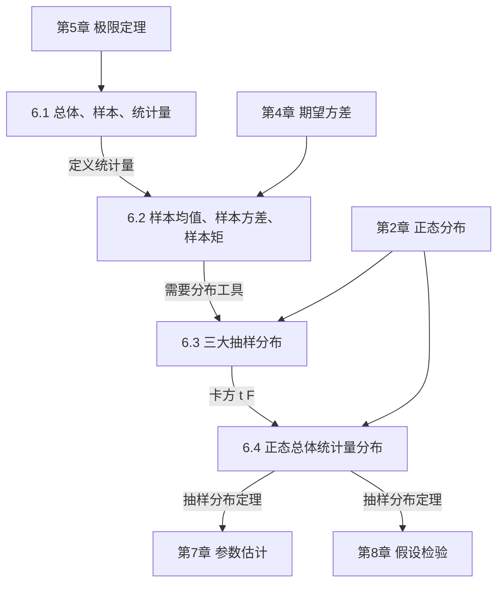

# MOC - 第6章 数理统计基础

> [!info] 本章定位
> 第6章是数理统计部分的**起点**，从"已知分布算概率"转向"已知样本推断总体"。本章引入三个核心概念：
>
> - **总体与样本**：把研究对象数量化为随机变量 $X$（总体），把抽到的 $n$ 个个体看作独立同分布的 $X_1,\ldots,X_n$（简单随机样本）。
> - **统计量**：样本的不含未知参数的函数（如 $\bar X$、$S^2$），是统计推断的基本工具，本身也是随机变量，有分布（抽样分布）。
> - **抽样分布**：$\chi^2$、$t$、$F$ 三大分布及正态总体下 $\bar X$、$S^2$ 的精确分布，是 [[MOC - 第7章]]（参数估计）和 [[MOC - 第8章]]（假设检验）的**直接计算工具**。
>
> 本章上承 [[5.3 独立同分布中心极限定理]]（正态近似的普遍性为正态总体的中心地位提供背景）、[[4.5 常见分布数字特征汇总]]（期望方差工具），下启 [[7.1 矩估计]]、[[7.3 估计量评价标准]]、[[8.3 正态总体均值假设检验（Z检验、t检验）]]、[[8.4 正态总体方差假设检验（卡方检验、F检验）]]。

## 学习路线图

> [!tip] 学习顺序建议
> 严格按 **6.1 → 6.2 → 6.3 → 6.4** 顺序学习。6.1 引入样本与统计量概念；6.2 定义常用统计量并讨论其数字特征；6.3 引入三大抽样分布作为分布工具；6.4 用 6.3 的工具推导正态总体下统计量的精确分布。三大抽样分布（6.3）是本章**重点与难点**，必须掌握定义、密度形状、可加性/对称性、分位点查表。

## 知识点导航

| 节次 | 主题 | 入口 | 核心结论 | 关键公式 |
| ---- | ---- | ---- | -------- | -------- |
| 6.1 | 总体、样本、统计量 | [[6.1 总体、样本、统计量]] | 简单随机样本 i.i.d.；统计量不含未知参数 | $X_1,\ldots,X_n\stackrel{iid}{\sim}X$ |
| 6.2 | 样本均值、样本方差、样本矩 | [[6.2 样本均值、样本方差、样本矩]] | $\bar X$、$S^2$（分母 $n-1$）的定义与数字特征 | $S^2=\dfrac{1}{n-1}\sum(X_i-\bar X)^2$，$E(S^2)=\sigma^2$ |
| 6.3 | 三大抽样分布 | [[6.3 三大抽样分布：χ²分布、t分布、F分布]] | $\chi^2$、$t$、$F$ 的定义、性质、分位点 | $\chi^2=\sum Z_i^2$，$T=\dfrac{Z}{\sqrt{\chi^2/n}}$，$F=\dfrac{\chi_1^2/n_1}{\chi_2^2/n_2}$ |
| 6.4 | 正态总体统计量分布 | [[6.4 正态总体统计量分布]] | 正态总体下 $\bar X$、$S^2$ 及其组合的精确分布 | $\bar X\sim N(\mu,\sigma^2/n)$，$\dfrac{(n-1)S^2}{\sigma^2}\sim\chi^2(n-1)$ |

## 核心考点

> [!warning] 高频考点（8点）
> 1. **统计量判别**：判断样本的函数是否为统计量（关键看是否含未知参数）。如 $\dfrac{\bar X-\mu}{\sigma}$ 在 $\mu,\sigma$ 未知时不是统计量。
> 2. **样本方差分母**：$S^2=\dfrac{1}{n-1}\sum(X_i-\bar X)^2$，分母是 $n-1$ 不是 $n$。这是 [[7.3 估计量评价标准]]中无偏性的要求。
> 3. **$E(\bar X)=\mu$，$D(\bar X)=\sigma^2/n$，$E(S^2)=\sigma^2$**：三大基本数字特征，必背必会推导。
> 4. **三大分布定义**：$\chi^2=\sum Z_i^2$（$Z_i$ 独立标准正态）；$T=\dfrac{Z}{\sqrt{\chi^2/n}}$（$Z,\chi^2$ 独立）；$F=\dfrac{\chi_1^2/n_1}{\chi_2^2/n_2}$（独立）。注意独立性条件！
> 5. **可加性**：$\chi^2(n_1)+\chi^2(n_2)\sim\chi^2(n_1+n_2)$（独立时）。$t$、$F$ 一般不可加。
> 6. **$t$ 分布对称性**：$t_{1-\alpha}(n)=-t_\alpha(n)$；$F$ 分布倒数性质：$F_{1-\alpha}(n_1,n_2)=\dfrac{1}{F_\alpha(n_2,n_1)}$。
> 7. **正态总体抽样定理**：$\bar X\sim N(\mu,\sigma^2/n)$，$\dfrac{(n-1)S^2}{\sigma^2}\sim\chi^2(n-1)$，$\bar X$ 与 $S^2$ 独立，$\dfrac{\bar X-\mu}{S/\sqrt n}\sim t(n-1)$。
> 8. **两正态总体情形**：$\dfrac{(\bar X-\bar Y)-(\mu_1-\mu_2)}{S_w\sqrt{1/n_1+1/n_2}}\sim t(n_1+n_2-2)$，$\dfrac{S_1^2/\sigma_1^2}{S_2^2/\sigma_2^2}\sim F(n_1-1,n_2-1)$。

## 自测题

> [!example] 自测题 1
> 设 $X_1,\ldots,X_n$ 来自总体 $N(\mu,\sigma^2)$（$\mu,\sigma^2$ 均未知）。下列哪些是统计量？
> （a）$\bar X$（b）$\dfrac{\bar X-\mu}{\sigma}$（c）$\dfrac{1}{n}\sum(X_i-\bar X)^2$（d）$\max X_i$
> > [!success]- 参考答案
> > （a）（c）（d）是统计量；（b）含未知参数 $\mu,\sigma$，不是统计量。

> [!example] 自测题 2
> 设 $X_1,\ldots,X_{10}$ 来自 $N(2,4)$。求 $E(\bar X)$、$D(\bar X)$、$E(S^2)$。
> > [!success]- 参考答案
> > $E(\bar X)=\mu=2$；$D(\bar X)=\sigma^2/n=4/10=0.4$；$E(S^2)=\sigma^2=4$。

> [!example] 自测题 3
> 设 $X\sim N(0,1)$，$Y\sim\chi^2(10)$，$X,Y$ 独立。指出 $\dfrac{X}{\sqrt{Y/10}}$ 的分布。
> > [!success]- 参考答案
> > 由 $t$ 分布定义，$\dfrac{X}{\sqrt{Y/10}}\sim t(10)$。

> [!example] 自测题 4
> 设 $X_1,\ldots,X_{16}$ 来自 $N(\mu,\sigma^2)$。求 $P\left\{\dfrac{\bar X-\mu}{S/4}\leq t_{0.05}(15)\right\}$ 与 $P\left\{\dfrac{15S^2}{\sigma^2}\leq \chi^2_{0.95}(15)\right\}$ 的值。
> > [!success]- 参考答案
> > 由 [[6.4 正态总体统计量分布]]：$\dfrac{\bar X-\mu}{S/\sqrt{16}}=\dfrac{\bar X-\mu}{S/4}\sim t(15)$，故前者 $=P\{T\leq t_{0.05}(15)\}$。注意 $t_{0.05}$ 是**下侧** 5% 分位点（负值），所以此概率 $=0.05$。后者 $\dfrac{15S^2}{\sigma^2}\sim\chi^2(15)$，故 $=0.95$。

## 章节导航

- 上一级：[[MOC - 概率论与数理统计B]]
- 上一章：[[MOC - 第5章]]（大数定律与中心极限定理）
- 下一章：[[MOC - 第7章]]（参数估计）
- 本章习题：[[MOC - 第6章习题]]
- 下一章习题：[[MOC - 第7章习题]]

## 关联

- 上游：[[2.5 常见分布：0-1、二项、泊松、均匀、指数、正态]]（正态分布）、[[4.1 数学期望定义与性质]]、[[4.2 方差、标准差]]、[[4.5 常见分布数字特征汇总]]、[[5.3 独立同分布中心极限定理]]
- 下游：[[7.1 矩估计]]、[[7.2 极大似然估计]]、[[7.3 估计量评价标准]]、[[8.3 正态总体均值假设检验（Z检验、t检验）]]、[[8.4 正态总体方差假设检验（卡方检验、F检验）]]
- 跨章：[[MOC - 高等数学A(1)]]（Gamma 函数是 $\chi^2$ 分布密度的工具）
