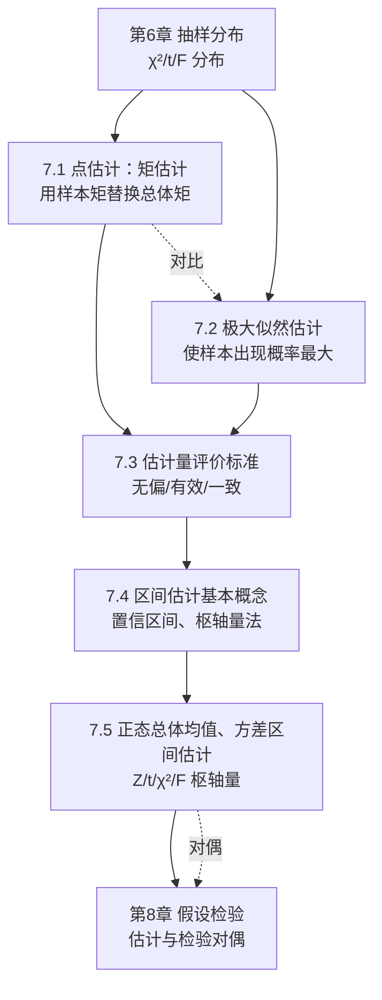

# MOC - 第7章 参数估计

> [!info] 本章定位
> 参数估计是统计推断的核心，承接第6章的抽样分布理论，回答"**总体分布类型已知但参数未知时，如何用样本估计未知参数**"这一根本问题。它分为两条互补的主线：
> - **点估计**（7.1–7.3）：用一个样本函数（统计量）作为未知参数的近似值，给出"一个数"。核心方法有矩估计与极大似然估计，并用无偏性、有效性、一致性评判估计量优劣。
> - **区间估计**（7.4–7.5）：在点估计基础上给出参数所在的范围与可靠程度，回答"参数大概在哪个区间、有多大把握"。核心工具是枢轴量法。
>
> 本章是第8章假设检验的直接前置——区间估计与假设检验存在**对偶关系**，同一枢轴量既可构造置信区间也可构造检验的接受域。

## 学习路线图

## 知识点导航

| 节次 | 主题 | 入口 | 核心概念 |
| ---- | ---- | ---- | -------- |
| 7.1 | 点估计：矩估计 | [[7.1 点估计：矩估计]] | 点估计问题、样本矩替换总体矩、辛钦大数定律 |
| 7.2 | 极大似然估计 | [[7.2 极大似然估计]] | 似然函数、对数似然、MLE 不变性与渐近正态 |
| 7.3 | 估计量评价标准 | [[7.3 估计量评价标准（无偏、有效、一致）]] | 无偏性、有效性、一致性（相合性） |
| 7.4 | 区间估计基本概念 | [[7.4 区间估计基本概念]] | 置信区间、置信水平 $1-\alpha$、枢轴量法 |
| 7.5 | 正态总体均值、方差区间估计 | [[7.5 正态总体均值、方差区间估计]] | 单/两正态总体均值差与方差比的区间估计 |

## 核心考点

> [!warning] 本章高频考点
> 1. **矩估计求解**：列出总体前 $k$ 阶矩关于参数的表达式，令其等于样本矩，解方程组。注意多参数情形方程数与参数数相等。
> 2. **极大似然估计求解**：构造似然函数 $\to$ 取对数 $\to$ 求导令零 $\to$ 解参数；注意似然函数不可导（如均匀分布）时用最值法直接分析。
> 3. **均匀分布 $U(0,\theta)$ 的 MLE 与矩估计不同**：MLE 为 $\hat\theta=\max\{X_i\}$（有偏），矩估计为 $\hat\theta=2\bar X$，二者不可混淆。
> 4. **样本方差无偏性**：$S^2=\frac{1}{n-1}\sum(X_i-\bar X)^2$ 无偏，而 $\frac{1}{n}\sum(X_i-\bar X)^2$ 有偏，分母为 $n-1$ 的来源必须掌握。
> 5. **有效性比较**：在无偏估计中方差小者更有效，常考两个无偏估计方差的比较。
> 6. **置信区间公式记忆**：单正态总体 $\mu$（$\sigma$ 已知 Z / $\sigma$ 未知 t）、$\sigma^2$（$\mu$ 已知 / 未知 χ²）四类公式必须对应正确枢轴量。
> 7. **枢轴量法步骤**：找分布已知且不含未知参数的枢轴量 $\to$ 定分位点 $\to$ 反解参数区间。
> 8. **置信水平 $1-\alpha$ 的频率解释**：反复抽样多次，约 $100(1-\alpha)\%$ 的区间包含真值，而非"参数落在区间的概率"。

## 自测题

> [!question]- 1. 设 $X_1,\ldots,X_n$ 来自 $N(\mu,\sigma^2)$，$\mu,\sigma^2$ 均未知，写出 $\mu,\sigma^2$ 的矩估计。
> $\hat\mu=\bar X$，$\hat\sigma^2=\frac{1}{n}\sum_{i=1}^n(X_i-\bar X)^2$（注意矩估计用 $n$ 作分母，与无偏样本方差 $S^2$ 的 $n-1$ 不同）。

> [!question]- 2. 设 $X_1,\ldots,X_n$ 来自 $U(0,\theta)$，求 $\theta$ 的 MLE 与矩估计，并比较。
> MLE：$\hat\theta_L=X_{(n)}=\max\{X_i\}$（似然 $L=1/\theta^n$ 在 $\theta\geq X_{(n)}$ 下随 $\theta$ 减小而增大，取 $\theta=X_{(n)}$）。
> 矩估计：$E(X)=\theta/2=\bar X$，故 $\hat\theta_M=2\bar X$。二者一般不相等。

> [!question]- 3. 为什么样本方差分母是 $n-1$ 而不是 $n$？
> 因为 $\sum(X_i-\bar X)^2$ 用 $\bar X$ 代替真值 $\mu$ 引入一个线性约束 $\sum(X_i-\bar X)=0$，自由度减少 1。除以 $n-1$ 才使 $E(S^2)=\sigma^2$，即无偏。

> [!question]- 4. $\sigma^2$ 已知时 $\mu$ 的 $1-\alpha$ 置信区间是什么？$\sigma^2$ 未知时又如何？
> 已知：$\bar X\pm z_{\alpha/2}\dfrac{\sigma}{\sqrt n}$，枢轴量 $Z=\dfrac{\bar X-\mu}{\sigma/\sqrt n}\sim N(0,1)$。
> 未知：$\bar X\pm t_{\alpha/2}(n-1)\dfrac{S}{\sqrt n}$，枢轴量 $T=\dfrac{\bar X-\mu}{S/\sqrt n}\sim t(n-1)$。

## 章节导航

- 上一级：[[MOC - 概率论与数理统计B]]
- 上一章：[[MOC - 第6章]]
- 下一章：[[MOC - 第8章]]
- 本章习题：[[MOC - 第7章习题]]
- 下一章习题：[[MOC - 第8章习题]]
