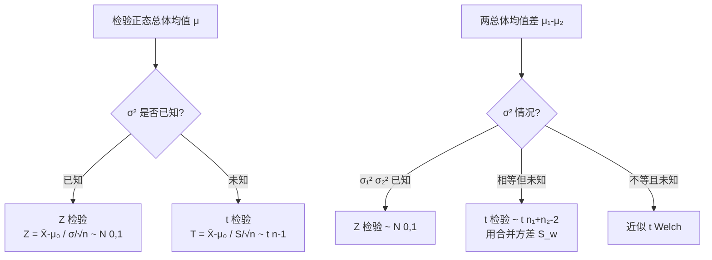

# 8.3 正态总体均值假设检验（Z检验、t检验）

> [!abstract] 本节概述
> 本节用 [[8.2 显著性水平、拒绝域|五步法]] 系统给出正态总体均值 $\mu$ 的假设检验，分**单总体**（$\sigma^2$ 已知用 $Z$ 检验，$\sigma^2$ 未知用 $t$ 检验）与**两总体均值差**（$\sigma_i^2$ 已知用 $Z$，相等未知用 $t$）。所用统计量与 [[7.5 正态总体均值、方差区间估计|区间估计]] 的枢轴量一一对应（对偶）。

## 一、检验方法选择决策树

## 二、单正态总体 $\mu$ 的检验

设 $X_1,\ldots,X_n\sim N(\mu,\sigma^2)$，检验 $H_0:\mu=\mu_0$（或 $\leq,\geq$）。

### 1. $\sigma^2$ 已知——Z 检验

> [!theorem] Z 检验
> 检验统计量
> $$Z=\frac{\bar X-\mu_0}{\sigma/\sqrt n}\sim N(0,1)\quad(H_0\text{ 成立时}).$$
>
> | $H_1$ | 拒绝域 |
> | ---- | ---- |
> | $\mu\neq\mu_0$（双边） | $\lvert Z\rvert>z_{\alpha/2}$ |
> | $\mu>\mu_0$（右侧） | $Z>z_{\alpha}$ |
> | $\mu<\mu_0$（左侧） | $Z<-z_{\alpha}$ |

> [!proof] 依据
> $\bar X\sim N(\mu,\sigma^2/n)$，在 $\mu=\mu_0$ 下标准化得 $Z\sim N(0,1)$。由标准正态对称性，双边各取 $\alpha/2$，单边取一侧 $\alpha$。

### 2. $\sigma^2$ 未知——t 检验

> [!theorem] t 检验
> 检验统计量
> $$T=\frac{\bar X-\mu_0}{S/\sqrt n}\sim t(n-1)\quad(H_0\text{ 成立时}),$$
> 其中 $S=\sqrt{S^2}$，$S^2=\dfrac{1}{n-1}\sum(X_i-\bar X)^2$。
>
> | $H_1$ | 拒绝域 |
> | ---- | ---- |
> | $\mu\neq\mu_0$（双边） | $\lvert T\rvert>t_{\alpha/2}(n-1)$ |
> | $\mu>\mu_0$（右侧） | $T>t_{\alpha}(n-1)$ |
> | $\mu<\mu_0$（左侧） | $T<-t_{\alpha}(n-1)$ |

> [!proof] 依据
> $\sigma$ 未知时用 $S$ 代替，由抽样分布定理 $T=\dfrac{\bar X-\mu}{S/\sqrt n}\sim t(n-1)$，代入 $\mu=\mu_0$ 得检验统计量。

> [!warning] 自由度
> $t$ 检验自由度为 $n-1$（因 $S^2$ 用 $\bar X$ 估计 $\mu$ 损失一自由度）。大样本（$n\geq30$）时 $t$ 分布接近 $N(0,1)$，可用 $z$ 近似。

## 三、两正态总体均值差的检验

设 $X_1,\ldots,X_{n_1}\sim N(\mu_1,\sigma_1^2)$，$Y_1,\ldots,Y_{n_2}\sim N(\mu_2,\sigma_2^2)$，两样本独立。检验 $H_0:\mu_1-\mu_2=\delta$（常 $\delta=0$）。

### 1. $\sigma_1^2,\sigma_2^2$ 已知——Z 检验

> [!theorem] 两样本 Z 检验
> $$Z=\frac{(\bar X-\bar Y)-\delta}{\sqrt{\sigma_1^2/n_1+\sigma_2^2/n_2}}\sim N(0,1).$$
> 拒绝域形式同单总体 $Z$ 检验（双侧 $|Z|>z_{\alpha/2}$ 等）。

### 2. $\sigma_1^2=\sigma_2^2=\sigma^2$ 未知——t 检验（pooled）

> [!theorem] 两样本 t 检验
> $$T=\frac{(\bar X-\bar Y)-\delta}{S_w\sqrt{1/n_1+1/n_2}}\sim t(n_1+n_2-2),$$
> 其中 $S_w^2=\dfrac{(n_1-1)S_1^2+(n_2-1)S_2^2}{n_1+n_2-2}$。
>
> | $H_1$ | 拒绝域 |
> | ---- | ---- |
> | $\mu_1-\mu_2\neq\delta$ | $\lvert T\rvert>t_{\alpha/2}(n_1+n_2-2)$ |
> | $\mu_1-\mu_2>\delta$ | $T>t_{\alpha}(n_1+n_2-2)$ |
> | $\mu_1-\mu_2<\delta$ | $T<-t_{\alpha}(n_1+n_2-2)$ |

> [!note] 前提
> 两总体方差相等是使用 pooled $t$ 检验的前提。若方差不等，先用 $F$ 检验判断方差齐性（见 [[8.4 正态总体方差假设检验（χ²检验、F检验）]]），不等时用近似 $t$（Welch）法。

## 四、汇总表

| 检验对象 | 条件 | 统计量 | 分布 | 双边拒绝域 |
| ---- | ---- | ---- | ---- | ---- |
| 单总体 $\mu$ | $\sigma^2$ 已知 | $\dfrac{\bar X-\mu_0}{\sigma/\sqrt n}$ | $N(0,1)$ | $\lvert Z\rvert>z_{\alpha/2}$ |
| 单总体 $\mu$ | $\sigma^2$ 未知 | $\dfrac{\bar X-\mu_0}{S/\sqrt n}$ | $t(n-1)$ | $\lvert T\rvert>t_{\alpha/2}(n-1)$ |
| 两总体 $\mu_1-\mu_2$ | $\sigma_i^2$ 已知 | $\dfrac{(\bar X-\bar Y)-\delta}{\sqrt{\sigma_1^2/n_1+\sigma_2^2/n_2}}$ | $N(0,1)$ | $\lvert Z\rvert>z_{\alpha/2}$ |
| 两总体 $\mu_1-\mu_2$ | $\sigma_1^2=\sigma_2^2$ 未知 | $\dfrac{(\bar X-\bar Y)-\delta}{S_w\sqrt{1/n_1+1/n_2}}$ | $t(n_1+n_2-2)$ | $\lvert T\rvert>t_{\alpha/2}(n_1+n_2-2)$ |

## 五、典型例题

> [!example] 例1（t 检验）
> 某元件寿命 $X\sim N(\mu,\sigma^2)$，$\sigma^2$ 未知。标准 $\mu_0=1000$（小时）。抽 $n=9$ 测得 $\bar x=980$，$s=30$。问寿命是否显著低于标准（$\alpha=0.05$）？

**解**（五步法）：
1. 关心"是否低于"，左侧单边：$H_0:\mu\geq1000$，$H_1:\mu<1000$。
2. $\sigma^2$ 未知，用 $T=\dfrac{\bar X-\mu_0}{S/\sqrt n}\sim t(8)$。
3. 左侧单边，拒绝域 $T<-t_{0.05}(8)$。查表 $t_{0.05}(8)=1.860$，故拒绝域 $T<-1.860$。
4. $T=\dfrac{980-1000}{30/3}=\dfrac{-20}{10}=-2$。
5. $-2<-1.860$，落入拒绝域，**拒绝 $H_0$**，认为寿命显著低于标准。

> [!example] 例2（两总体 t 检验）
> 两台机床加工同种零件，直径分别服从 $N(\mu_1,\sigma^2)$、$N(\mu_2,\sigma^2)$（方差相等）。各抽 $n_1=n_2=8$，$\bar x=20.0$，$\bar y=19.5$，$s_1^2=0.10$，$s_2^2=0.14$。问两机床加工直径有无显著差异（$\alpha=0.05$）？

**解**：
1. 双边：$H_0:\mu_1=\mu_2$（即 $\mu_1-\mu_2=0$），$H_1:\mu_1\neq\mu_2$。
2. 方差相等未知，用 $T=\dfrac{\bar X-\bar Y}{S_w\sqrt{1/8+1/8}}\sim t(14)$。
3. 双边拒绝域 $|T|>t_{0.025}(14)=2.145$。
4. $S_w^2=\dfrac{7\times0.10+7\times0.14}{14}=0.12$，$S_w=\sqrt{0.12}$。
   $T=\dfrac{0.5}{\sqrt{0.12}\cdot\sqrt{0.25}}=\dfrac{0.5}{\sqrt{0.03}}=\dfrac{0.5}{0.1732}\approx2.887$。
5. $2.887>2.145$，拒绝 $H_0$，认为有显著差异。

## 小结

- 单总体 $\mu$：$\sigma$ 已知用 $Z\sim N(0,1)$，未知用 $t(n-1)$。
- 两总体 $\mu_1-\mu_2$：方差已知用 $Z$，方差相等未知用 pooled $t(n_1+n_2-2)$。
- 拒绝域由 $H_1$ 决定：双边两侧各 $\alpha/2$，单边一侧 $\alpha$。
- 检验统计量 = 区间估计枢轴量代入 $\theta_0$，体现对偶。

## 关联

- 本章导航：[[MOC - 第8章]]
- 上一节：[[8.2 显著性水平、拒绝域]]
- 下一节：[[8.4 正态总体方差假设检验（χ²检验、F检验）]]、[[8.5 P值简单介绍]]
- 对偶（区间估计）：[[7.5 正态总体均值、方差区间估计]]
- 抽样分布：[[6.4 正态总体统计量分布]]
- 本章习题：[[MOC - 第8章习题]]
