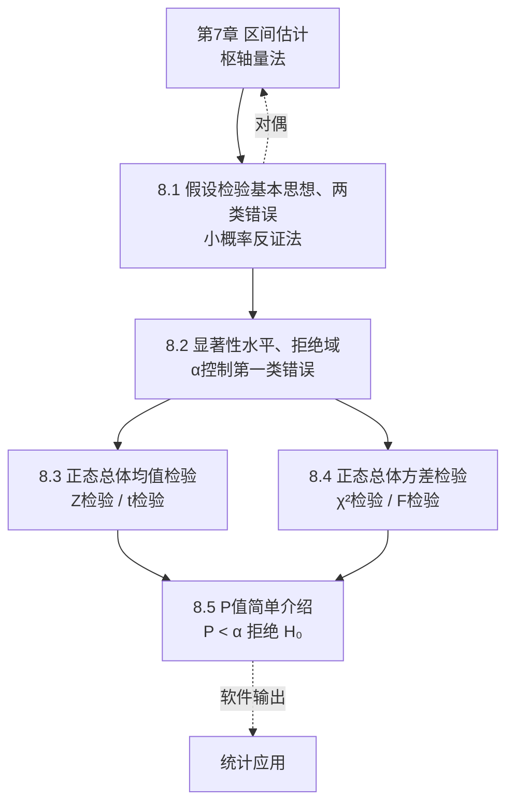

# MOC - 第8章 假设检验

> [!info] 本章定位
> 假设检验是统计推断的第二大核心，承接 [[MOC - 第7章|参数估计]]，回答"**关于总体参数的某个假设是否成立**"。其思想是**小概率反证法**：先假设 $H_0$ 成立，若在此假设下样本观测结果属于"小概率事件"（落入拒绝域），则拒绝 $H_0$；否则接受。本章与区间估计存在**对偶关系**：同一枢轴量既可构造置信区间（估计），也可构造检验的接受域（检验）。

## 学习路线图

## 知识点导航

| 节次 | 主题 | 入口 | 核心概念 |
| ---- | ---- | ---- | -------- |
| 8.1 | 假设检验基本思想、两类错误 | [[8.1 假设检验基本思想、两类错误]] | 小概率反证法、原假设 $H_0$、两类错误 |
| 8.2 | 显著性水平、拒绝域 | [[8.2 显著性水平、拒绝域]] | $\alpha$、检验统计量、拒绝域、检验步骤 |
| 8.3 | 正态总体均值假设检验 | [[8.3 正态总体均值假设检验（Z检验、t检验）]] | $Z$ 检验、$t$ 检验、单/双边 |
| 8.4 | 正态总体方差假设检验 | [[8.4 正态总体方差假设检验（χ²检验、F检验）]] | $\chi^2$ 检验、$F$ 检验、方差齐性 |
| 8.5 | P值简单介绍 | [[8.5 P值简单介绍]] | P值定义、$P<\alpha$ 判据、与临界值法关系 |

## 核心考点

> [!warning] 本章高频考点
> 1. **两类错误辨析**：第一类错误（弃真）$\alpha=P\{\text{拒}H_0|H_0\text{真}\}$；第二类错误（取伪）$\beta=P\{\text{接}H_0|H_0\text{假}\}$。样本量固定时减小一个必增大另一个。
> 2. **原假设含等号原则**：$H_0$ 中须含"$=$"（或 $\leq,\geq$），以保证检验统计量在 $H_0$ 下分布确定；$H_1$ 用 $>,<,\neq$。
> 3. **单边 vs 双边由 $H_1$ 决定**：$H_1:\mu\neq\mu_0$ 双边，$H_1:\mu>\mu_0$ 右侧单边，$H_1:\mu<\mu_0$ 左侧单边。单边拒绝域在一侧，双边在两侧各 $\alpha/2$。
> 4. **均值检验选 Z 还是 t**：$\sigma^2$ 已知用 $Z\sim N(0,1)$；$\sigma^2$ 未知用 $T\sim t(n-1)$。自由度必记准。
> 5. **方差检验选 χ² 还是 F**：单总体方差用 $\chi^2$（$\mu$ 已知自由度 $n$，未知自由度 $n-1$）；两总体方差比用 $F$（方差齐性检验）。
> 6. **拒绝域公式方向**：$\chi^2$ 单边右侧 $\chi^2>\chi_\alpha^2$，双边 $\chi^2>\chi_{\alpha/2}^2$ 或 $\chi^2<\chi_{1-\alpha/2}^2$。
> 7. **与区间估计的对偶**：$\mu$ 的 $1-\alpha$ 置信区间包含 $\mu_0$ $\Leftrightarrow$ 在水平 $\alpha$ 下接受 $H_0:\mu=\mu_0$。
> 8. **P 值判据**：$P<\alpha$ 拒绝 $H_0$；P 值是"$H_0$ 成立时出现当前或更极端结果的概率"，**不是** $H_0$ 为真的概率。

## 自测题

> [!question]- 1. 第一类错误和第二类错误分别是什么？样本量固定时二者关系如何？
> 第一类（弃真）$\alpha=P\{\text{拒}H_0|H_0\text{真}\}$；第二类（取伪）$\beta=P\{\text{接}H_0|H_0\text{假}\}$。样本量固定时减小 $\alpha$ 会增大 $\beta$，反之亦然。

> [!question]- 2. $\sigma^2$ 未知时检验 $H_0:\mu=\mu_0$ 用什么统计量？服从什么分布？
> $T=\dfrac{\bar X-\mu_0}{S/\sqrt n}\sim t(n-1)$（自由度 $n-1$）。

> [!question]- 3. 单边检验与双边检验的拒绝域有何区别？由什么决定？
> 由备择假设 $H_1$ 决定。双边 $H_1:\mu\neq\mu_0$ 拒绝域在两侧各 $\alpha/2$；单边 $H_1:\mu>\mu_0$ 拒绝域在右侧 $\alpha$，$H_1:\mu<\mu_0$ 在左侧 $\alpha$。

> [!question]- 4. P 值小于 $\alpha$ 意味着什么？P 值表示"$H_0$ 为真的概率"吗？
> $P<\alpha$ 意味拒绝 $H_0$。P 值**不**表示 $H_0$ 为真的概率，而是 $H_0$ 成立时出现当前或更极端统计量值的概率。

## 章节导航

- 上一级：[[MOC - 概率论与数理统计B]]
- 上一章：[[MOC - 第7章]]（区间估计与假设检验对偶）
- 本章习题：[[MOC - 第8章习题]]
- 上一章习题：[[MOC - 第7章习题]]
- 下一章：课程结束（第8章为本课程最后一章）
