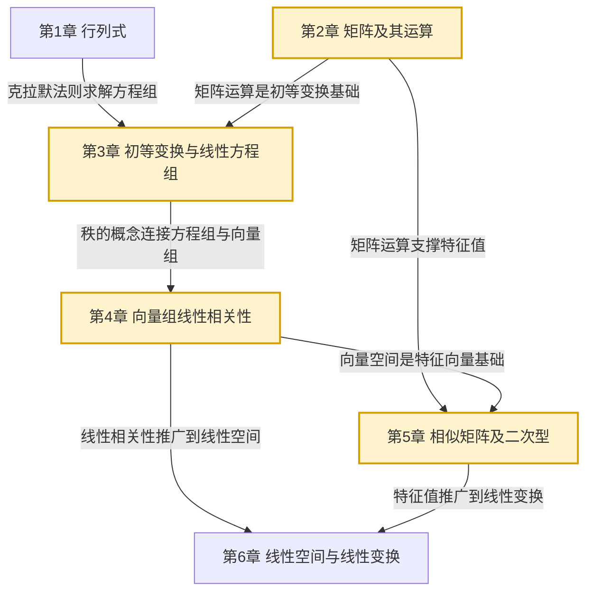

# MOC - 线性代数A

> [!info] 课程定位
> 线性代数A 是理工科本科生的核心数学基础课，研究**有限维线性空间上的线性关系**。它要解决的核心问题是：如何求解线性方程组（行列式与矩阵）、如何刻画向量间的线性相关性（向量组与秩）、如何分析线性变换的不变量（特征值与特征向量）、如何研究二次型的分类（正定性与标准形）。线性代数是 [[MOC - 高等数学A(2)]]（多元微积分的雅可比矩阵、海森矩阵）、[[MOC - 概率论与数理统计B]]（协方差矩阵、多元正态分布）的数学工具，也是机器学习、计算机图形学、量子力学的代数基础。

## 课程摘要

本课程围绕"**行列式—矩阵—方程组—向量组—特征值—二次型—线性空间**"七条主线展开：

1. 行列式定义（逆序数/递归）、性质、展开定理、克拉默法则；
2. 矩阵运算（线性运算、乘法、转置、逆、伴随、分块）；
3. 矩阵初等变换、矩阵秩、线性方程组解的判定与高斯消元；
4. 向量组线性相关性、极大无关组、齐次/非齐次方程组解结构；
5. 内积与正交、特征值与特征向量、相似对角化、实对称矩阵正交对角化；
6. 二次型及其矩阵表示、正交变换化标准形、惯性定理与正定性判定；
7. 线性空间基与维数、坐标变换、线性变换的矩阵表示（选学）。

## 章节结构与依赖关系

## 章节导航

| 章节 | 主题 | 入口 | 小节数 | 核心考点 |
| ---- | ---- | ---- | ------ | -------- |
| 第1章 | 行列式 | [[MOC - 第1章]] | 5 | 行列式性质、展开定理、克拉默法则 |
| 第2章 | 矩阵及其运算 | [[MOC - 第2章]] | 6 | 矩阵乘法、逆矩阵、伴随矩阵、分块矩阵 |
| 第3章 | 初等变换与线性方程组 | [[MOC - 第3章]] | 5 | 初等变换、矩阵秩、解的判定 |
| 第4章 | 向量组线性相关性 | [[MOC - 第4章]] | 5 | 线性相关/无关、极大无关组、基础解系 |
| 第5章 | 相似矩阵及二次型 | [[MOC - 第5章]] | 8 | 特征值、对角化、正交矩阵、正定二次型 |
| 第6章 | 线性空间与线性变换（选学） | [[MOC - 第6章]] | 5 | 基与维数、坐标变换、线性变换矩阵 |

## 三大核心思想

> [!abstract] 线性代数的核心思想
> 1. **线性组合与线性表示**：向量组、方程组、矩阵的秩都建立在"线性组合"这一概念上。线性方程组是否有解取决于常数列能否由系数列线性表示；向量组是否线性相关取决于是否存在"非平凡"的线性组合为零。
>
> 2. **不变量与分类**：秩是矩阵在初等变换下的不变量；特征值是矩阵在相似变换下的不变量；正负惯性指数是二次型在可逆线性变换下的不变量。通过不变量对对象进行分类是代数学的核心方法。
>
> 3. **分解与对角化**：矩阵的 LU 分解（初等变换）、QR 分解（正交化）、谱分解（特征值分解）都将复杂矩阵分解为简单矩阵的乘积。对角化是最重要的分解形式，它将一般线性变换化为最简单的伸缩变换。

## 与上下游课程的衔接

- **先修**：高中代数（多项式、方程组求解）
- **后续**：抽象代数（群、环、域）、数值线性代数、最优化方法
- **关联**：[[MOC - 高等数学A(2)]]（雅可比矩阵、海森矩阵、多元函数极值的二次型判定）、[[MOC - 概率论与数理统计B]]（协方差矩阵、多元正态分布）、离散数学（线性码）

## 章节导航

- 上一级：[[MOC - 数学基础]]
- 关联课程：[[MOC - 高等数学A(1)]]、[[MOC - 高等数学A(2)]]、[[MOC - 概率论与数理统计B]]

## 相关标签

#线性代数 #行列式 #矩阵 #线性方程组 #向量组 #特征值 #二次型 #线性空间
