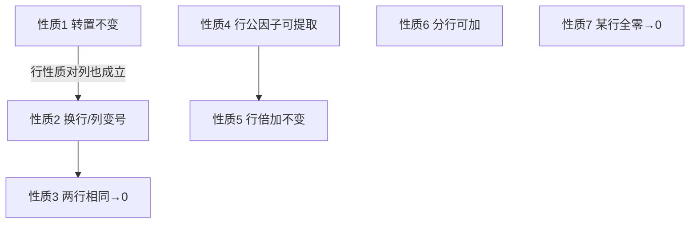

# 1.3 行列式性质

> [!info] 本节定位
> 直接用 [[1.2 n阶行列式定义]] 计算高阶行列式需要求 $n!$ 项之和，$n=4$ 时已 24 项、$n=5$ 时 120 项，实际不可行。本节建立行列式的**性质体系**，其核心目标是把任意行列式通过行、列的初等变换化为上三角（或下三角）形式，再由"三角行列式等于主对角元素之积"立即得到结果。性质也是证明 [[1.4 行列式展开定理]] 和 [[1.5 克拉默法则]] 的基础工具。

> [!note] 约定记号
> 本节用 $r_i$ 表示第 $i$ 行，$c_j$ 表示第 $j$ 列。记号 $r_i\leftrightarrow r_j$ 表示交换第 $i,j$ 行；$k r_i$ 表示第 $i$ 行乘 $k$；$r_i+k r_j$ 表示第 $i$ 行加上第 $j$ 行的 $k$ 倍。类似记号对列用 $c$。

## 性质总览

## 性质 1：转置不变性

> [!property] 性质 1（转置不变性）
> 设 $A$ 为 $n$ 阶矩阵，$A^T$ 为其转置，则
> $$|A^T|=|A|.$$
>
> 即行列式的行与列互换，值不变。

> [!proof]- 证明思路
> 由 [[1.2 n阶行列式定义#行行列式的等价定义|等价定义]]，$|A|=\sum(-1)^{\tau_{\text{行}}+\tau_{\text{列}}}a_{i_1 j_1}\cdots a_{i_n j_n}$。转置后 $a_{ij}$ 变为 $a_{ji}$，每项的行指标与列指标互换，但 $\tau_{\text{行}}+\tau_{\text{列}}$ 不变，故和不变。

> [!tip] 重要推论
> 凡是对**行**成立的性质，对**列**也成立。下文为简洁仅对行叙述，列的情形自动成立。

## 性质 2：换行变号

> [!property] 性质 2（换行变号）
> 交换行列式的两行（或两列），行列式变号。即若把 $A$ 的第 $i,j$ 行交换得 $B$，则 $|B|=-|A|$。
>
> > [!proof]- 证明思路
> > 由 [[1.2 n阶行列式定义#奇排列与偶排列|定理 1]]，交换排列中两个元素的位置等价于一次对换，改变排列奇偶性，从而每项符号取反，总和变号。

> [!corollary] 推论（性质 3 的引理）
> 若行列式有两行（列）**完全相同**，则行列式等于 $0$。
>
> > 证明：把这两行交换，得 $D=-D$，故 $D=0$。

## 性质 3：两行相同值为零

> [!property] 性质 3（两行相同为零）
> 若行列式有两行（列）元素完全相同，则 $D=0$。

## 性质 4：行公因子可提取

> [!property] 性质 4（行公因子可提取）
> 行列式某一行（列）的所有元素含有公因子 $k$，则 $k$ 可提到行列式外：
> $$\begin{vmatrix}a_{11}&\cdots&a_{1n}\\ \vdots&&\vdots\\ ka_{i1}&\cdots&ka_{in}\\ \vdots&&\vdots\\ a_{n1}&\cdots&a_{nn}\end{vmatrix}=k\begin{vmatrix}a_{11}&\cdots&a_{1n}\\ \vdots&&\vdots\\ a_{i1}&\cdots&a_{in}\\ \vdots&&\vdots\\ a_{n1}&\cdots&a_{nn}\end{vmatrix}.$$
>
> 即 $|A|\xrightarrow{k r_i}k|A|$（行乘 $k$ 则行列式乘 $k$）。
>
> > [!proof]- 证明
> > 由定义，每项恰含第 $i$ 行一个元素 $ka_{ij_i}$，提出 $k$ 后剩余和即为原行列式。

> [!corollary] 推论 1
> 若行列式某行（列）全为 $0$，则 $D=0$（取 $k=0$）。

> [!corollary] 推论 2（两行成比例为零）
> 若行列式有两行（列）对应元素**成比例**，则 $D=0$。
>
> > 证明：设第 $j$ 行是第 $i$ 行的 $k$ 倍，则提取第 $j$ 行公因子 $k$ 后两行相同，由性质 3 得 $D=0$。

> [!warning] 易错：单个元素 vs 整行
> 性质 4 中 $k$ 只能从**某一行（列）整体提出**，不能从某一格单独提出后再从另一格提出。例如 $\begin{vmatrix}2&4\\ 1&3\end{vmatrix}$ 应理解为第 1 行有公因子 $2$：$=2\begin{vmatrix}1&2\\ 1&3\end{vmatrix}=2(3-2)=2$。不能写为 $2\cdot4\begin{vmatrix}1&1\\ 1&3\end{vmatrix}$。

## 性质 5：行倍加不变

> [!property] 性质 5（行倍加不变）
> 把行列式某一行（列）的 $k$ 倍加到另一行（列），行列式的值不变：
> $$|A|\xrightarrow{r_i+k r_j}|A|.$$
>
> > [!proof]- 证明
> > 设把第 $j$ 行的 $k$ 倍加到第 $i$ 行，新行列式按第 $i$ 行拆为两个行列式之和（依据性质 6）：
> > $$D'=D+k\cdot D_0,$$
> > 其中 $D_0$ 是第 $i$ 行等于第 $j$ 行（其余不变）的行列式，由性质 3 知 $D_0=0$。故 $D'=D$。

> [!tip] 化简的核心操作
> 性质 5 是**化简行列式最常用的工具**：通过 $r_i+k r_j$ 在某行制造零元素，逐步把行列式化为上三角。

## 性质 6：分行相加性质

> [!property] 性质 6（分行可加性）
> 若行列式某一行（列）的元素均可写成两数之和，则行列式可拆成两个行列式之和：
> $$\begin{vmatrix}a_{11}&\cdots&a_{1n}\\ \vdots&&\vdots\\ b_{i1}+c_{i1}&\cdots&b_{in}+c_{in}\\ \vdots&&\vdots\\ a_{n1}&\cdots&a_{nn}\end{vmatrix}=\begin{vmatrix}a_{11}&\cdots&a_{1n}\\ \vdots&&\vdots\\ b_{i1}&\cdots&b_{in}\\ \vdots&&\vdots\\ a_{n1}&\cdots&a_{nn}\end{vmatrix}+\begin{vmatrix}a_{11}&\cdots&a_{1n}\\ \vdots&&\vdots\\ c_{i1}&\cdots&c_{in}\\ \vdots&&\vdots\\ a_{n1}&\cdots&a_{nn}\end{vmatrix}.$$
>
> 注意：**仅一行**可拆，其余行保持不变。若多行同时为和，需逐行拆分。

> [!warning] 易错：多行不能同时拆
> $\begin{vmatrix}a+b&c+d\\ e+f&g+h\end{vmatrix}$ **不能**一次拆成四项。应先按第 1 行拆为两项，再对每项按第 2 行拆，最终得 4 个行列式之和。

## 性质在计算中的应用：化上三角法

> [!example] 例 1（化上三角）
> 计算 $D=\begin{vmatrix}1&2&3&4\\ 2&3&4&5\\ 3&4&5&6\\ 4&5&6&7\end{vmatrix}$。
>
> **解**
> $r_2-2r_1,\ r_3-3r_1,\ r_4-4r_1$：
> $$D=\begin{vmatrix}1&2&3&4\\ 0&-1&-2&-3\\ 0&-2&-4&-6\\ 0&-3&-6&-9\end{vmatrix}.$$
> 观察到第 2、3、4 行成比例（第 3 行 = 2×第 2 行，第 4 行 = 3×第 2 行），由性质 4 推论 2 知 $D=0$。
>
> 或者继续化简：$r_3-2r_2$ 得第 3 行全零，$D=0$。

> [!example] 例 2（典型化三角）
> 计算 $D=\begin{vmatrix}3&1&-1&2\\ -5&1&3&-4\\ 2&0&1&-1\\ 1&-5&3&-3\end{vmatrix}$。
>
> **解** 为减少分数运算，先用 $r_1\leftrightarrow r_3$ 把 0 调到第 1 行（变号一次）：
> $$D=-\begin{vmatrix}2&0&1&-1\\ -5&1&3&-4\\ 3&1&-1&2\\ 1&-5&3&-3\end{vmatrix}.$$
> 用 $r_1$ 消第 1 列：$r_2+\frac52 r_1$（避免分数可改用 $2r_2+5r_1$ 但需注意倍数），这里改用更简洁路径——直接做 $c_3\leftrightarrow c_1$ 不必，按部就班：
>
> 实际更优做法：$r_2\leftrightarrow r_4$ 调整，再化简。此处展示思路：经过若干次 $r_i+kr_1$ 后第一列只剩 $a_{11}$ 非零，再按第一列展开降为三阶，最终得 $D=-40$（具体步骤见 [[1.4 行列式展开定理]] 的展开法）。

> [!example] 例 3（行变换 + 性质 3）
> 计算 $D=\begin{vmatrix}a&b&c\\ a&b&c\\ d&e&f\end{vmatrix}$。
>
> **解** 第 1、2 行相同，由性质 3，$D=0$。

## 综合例题

> [!example] 例 4（箭形行列式）
> 计算 $D_n=\begin{vmatrix}a_1&1&1&\cdots&1\\ 1&a_2&0&\cdots&0\\ 1&0&a_3&\cdots&0\\ \vdots&\vdots&\vdots&&\vdots\\ 1&0&0&\cdots&a_n\end{vmatrix}$（$a_i\ne0$）。
>
> **解** 这是典型**箭形行列式**。用 $c_1-\dfrac{1}{a_i}c_i$（$i=2,\dots,n$）把第一行除 $a_1$ 外化为零：
> $$D_n=\begin{vmatrix}a_1-\sum_{i=2}^{n}\dfrac{1}{a_i}&0&0&\cdots&0\\ 1&a_2&0&\cdots&0\\ 1&0&a_3&\cdots&0\\ \vdots&\vdots&\vdots&&\vdots\\ 1&0&0&\cdots&a_n\end{vmatrix}.$$
> 已化为下三角，故
> $$D_n=\left(a_1-\sum_{i=2}^{n}\dfrac{1}{a_i}\right)\prod_{i=2}^{n}a_i=a_1a_2\cdots a_n-\sum_{i=2}^{n}\frac{a_1a_2\cdots a_n}{a_i}.$$

## 易错点

> [!warning] 常见错误
> 1. **混淆 $r_i+kr_j$ 与 $kr_i+r_j$**：前者第 $i$ 行改变、第 $j$ 行不变；后者相反。化简时要明确目标行。
> 2. **换行忘变号**：$r_i\leftrightarrow r_j$ 后行列式要乘 $-1$；多次换行累计符号。
> 3. **提取公因子漏乘**：若 $r_i$ 整体乘 $k$，行列式要乘 $k$；若只对 $r_i$ 做 $r_i/k$，行列式要除 $k$。
> 4. **多行同时拆分**：性质 6 只对单行适用，多行需逐次拆。
> 5. **误以为行列式可分解为两个行列式之和**：一般 $|A+B|\ne|A|+|B|$。仅当 $A,B$ 仅在某一行不同、其余行相同时才可拆。

## 小结

| 性质 | 操作 | 对 $D$ 的影响 |
| ---- | ---- | ------------- |
| 1 转置 | $A\to A^T$ | 不变 |
| 2 换行 | $r_i\leftrightarrow r_j$ | 变号 $D\to -D$ |
| 3 两行相同 | — | $D=0$ |
| 4 行公因子 | $r_i\to kr_i$ | $D\to kD$ |
| 5 行倍加 | $r_i\to r_i+kr_j$ | 不变 |
| 6 分行可加 | 单行为和 | 拆成两个行列式 |

化简策略：用 $r_i+kr_j$ 制造零 → 化为上三角 → 取主对角元之积。

## 关联

- 上级：[[MOC - 第1章]]
- 上一节：[[1.2 n阶行列式定义]]（性质基于定义证明）
- 下一节：[[1.4 行列式展开定理]]（性质配合展开定理是计算主力）
- 应用：[[1.5 克拉默法则]]（性质用于证明克拉默法则）
- 延伸：[[MOC - 第2章]]（矩阵初等变换与行列式的关系）、[[MOC - 第3章]]（用性质判定矩阵秩）
