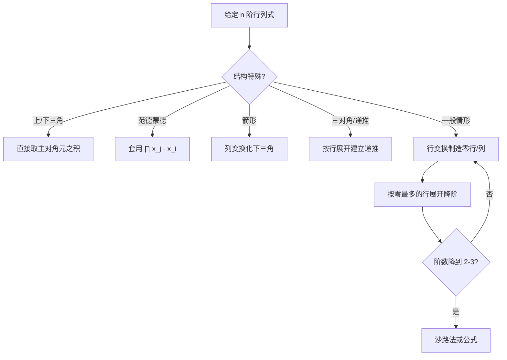

# 1.4 行列式展开定理

> [!info] 本节定位
> [[1.3 行列式性质]] 提供了化简工具，但仍需一种**降阶**方法处理高阶行列式。展开定理（拉普拉斯展开）建立 $n$ 阶行列式与 $n-1$ 阶行列式的关系：按某行（列）展开为"该行元素 × 对应代数余子式"之和。它是行列式计算的核心工具——先用性质在某行制造零，再按该行展开，可大幅降低计算量。本节还给出展开定理的推论（异行代数余子式之和为零）和著名的**范德蒙德行列式**。

## 余子式与代数余子式

> [!definition] 定义 1（余子式）
> 在 $n$ 阶行列式 $D=|a_{ij}|$ 中，划去元素 $a_{ij}$ 所在的第 $i$ 行和第 $j$ 列，剩下的 $(n-1)^2$ 个元素按原相对位置构成的 $n-1$ 阶行列式，称为 $a_{ij}$ 的**余子式**（minor），记作 $M_{ij}$。

> [!definition] 定义 2（代数余子式）
> 称
> $$A_{ij}=(-1)^{i+j}M_{ij}$$
> 为 $a_{ij}$ 的**代数余子式**（cofactor）。
>
> 即代数余子式 = 余子式乘上符号因子 $(-1)^{i+j}$。符号由 $i+j$ 的奇偶决定：$i+j$ 为偶取正，为奇取负。可借助"棋盘格"记忆：
> $$\begin{matrix}+&-&+&-&\cdots\\ -&+&-&+&\cdots\\ +&-&+&-&\cdots\\ \vdots&&\vdots&&\ddots\end{matrix}$$
> 左上角 $(1,1)$ 为 $+$。

> [!example] 例 1
> 在 $D=\begin{vmatrix}1&2&3\\ 4&5&6\\ 7&8&9\end{vmatrix}$ 中，求 $a_{23}=6$ 的余子式与代数余子式。
>
> **解** 划去第 2 行第 3 列，剩余 $\begin{vmatrix}1&2\\ 7&8\end{vmatrix}$。
> - $M_{23}=\begin{vmatrix}1&2\\ 7&8\end{vmatrix}=8-14=-6$；
> - $A_{23}=(-1)^{2+3}M_{23}=(-1)^5\cdot(-6)=6$。

## 展开定理

> [!theorem] 定理 1（行列式按一行（列）展开定理）
> 行列式 $D$ 等于它的任意一行（列）的各元素与其对应代数余子式的乘积之和：
> $$\boxed{\;D=a_{i1}A_{i1}+a_{i2}A_{i2}+\cdots+a_{in}A_{in}=\sum_{k=1}^{n}a_{ik}A_{ik}\;}\quad(\text{按第 } i \text{ 行展开})$$
> $$\boxed{\;D=a_{1j}A_{1j}+a_{2j}A_{2j}+\cdots+a_{nj}A_{nj}=\sum_{k=1}^{n}a_{kj}A_{kj}\;}\quad(\text{按第 } j \text{ 列展开})$$
>
> 即任意选定一行（列），把行列式降为 $n-1$ 阶。

### 证明思路

> [!proof]- 证明思路（按第 $i$ 行展开）
> 目标：证明 $D=\sum_{j=1}^{n}a_{ij}A_{ij}$。
>
> **第一步**：先证一个特殊情形——某行除了一个元素 $a_{ij}$ 外其余为 $0$，此时 $D=a_{ij}A_{ij}$。
>
> 设 $a_{ij}$ 位于第 $i$ 行第 $j$ 列，其余第 $i$ 行元素为 $0$。通过行列交换把 $a_{ij}$ 移到 $(n,n)$ 位置：先把第 $i$ 行依次与第 $i+1,i+2,\dots,n$ 行交换（共 $n-i$ 次），再把第 $j$ 列依次与第 $j+1,\dots,n$ 列交换（共 $n-j$ 次）。总计 $2n-i-j$ 次换行换列，行列式变号 $(-1)^{2n-i-j}=(-1)^{i+j}$。
>
> 此时新行列式形如
> $$D'=\begin{vmatrix}*&\cdots&*&0\\ \vdots&&\vdots&\vdots\\ *&\cdots&*&0\\ 0&\cdots&0&a_{ij}\end{vmatrix},$$
> 按 [[1.2 n阶行列式定义]]，非零项必须取第 $n$ 行的 $a_{ij}$，剩余部分恰为余子式 $M_{ij}$。故 $D'=a_{ij}M_{ij}$。
>
> 结合变号：$D=(-1)^{i+j}D'=(-1)^{i+j}a_{ij}M_{ij}=a_{ij}A_{ij}$。
>
> **第二步**：对一般情形，把第 $i$ 行拆为 $n$ 个"只含一个元素"的行向量之和（由 [[1.3 行列式性质#性质 6 分行相加性质|性质 6]] 分行可加）：
> $$(a_{i1},a_{i2},\dots,a_{in})=a_{i1}(1,0,\dots,0)+a_{i2}(0,1,\dots,0)+\cdots+a_{in}(0,\dots,0,1).$$
> 由行列式对行的线性性，$D=\sum_{j=1}^{n}a_{ij}A_{ij}$。

## 展开定理的推论

> [!corollary] 推论 1（异行代数余子式之和为零）
> 行列式某一行（列）的各元素与**另一行（列）**对应元素的代数余子式乘积之和为零：
> $$a_{i1}A_{k1}+a_{i2}A_{k2}+\cdots+a_{in}A_{kn}=0\quad(i\ne k).$$
>
> > [!proof]- 证明
> > 把 $a_{i1},\dots,a_{in}$ 替换到第 $k$ 行构造一个辅助行列式 $D'$，其第 $k$ 行等于第 $i$ 行：
> > $$D'=\begin{vmatrix}\vdots\\ a_{i1}&a_{i2}&\cdots&a_{in}\\ \vdots\end{vmatrix}\leftarrow\text{第 }k\text{ 行}$$
> > 由 [[1.3 行列式性质#性质 3 两行相同值为零|性质 3]]，$D'=0$（两行相同）。但按第 $k$ 行展开：
> > $$D'=a_{i1}A_{k1}+a_{i2}A_{k2}+\cdots+a_{in}A_{kn}=0.$$
> > 注意 $A_{kj}$ 是原行列式第 $k$ 行第 $j$ 列元素的代数余子式，与辅助行列式相同（删第 $k$ 行后不涉及第 $i$ 行元素）。

> [!note] 合并书写
> 定理 1 与推论 1 可合并为
> $$\sum_{k=1}^{n}a_{ik}A_{jk}=\delta_{ij}D=\begin{cases}D,&i=j\\ 0,&i\ne j\end{cases}$$
> 其中 $\delta_{ij}$ 为 Kronecker 记号。这一形式在 [[MOC - 第2章]] 推导 $AA^*=|A|E$ 时直接使用。

## 范德蒙德行列式

> [!theorem] 定理 2（范德蒙德行列式）
> 设 $x_1,x_2,\dots,x_n$ 为 $n$ 个数（不必互异，但行列式为零当且仅当存在 $i\ne j$ 使 $x_i=x_j$），称
> $$V_n=\begin{vmatrix}1&1&\cdots&1\\ x_1&x_2&\cdots&x_n\\ x_1^2&x_2^2&\cdots&x_n^2\\ \vdots&\vdots&&\vdots\\ x_1^{n-1}&x_2^{n-1}&\cdots&x_n^{n-1}\end{vmatrix}$$
> 为 **$n$ 阶范德蒙德行列式**（Vandermonde determinant），其值为
> $$\boxed{\;V_n=\prod_{1\le i<j\le n}(x_j-x_i)\;}$$
> 即所有"后项减前项"的乘积，共 $\dfrac{n(n-1)}{2}$ 个因子。

### 范德蒙德行列式的证明

> [!proof]- 证明（数学归纳法 + 列变换）
> **基础**：$n=2$ 时 $V_2=\begin{vmatrix}1&1\\ x_1&x_2\end{vmatrix}=x_2-x_1$，结论成立。
>
> **归纳**：设 $V_{n-1}=\prod_{1\le i<j\le n-1}(x_j-x_i)$ 成立。对 $V_n$ 做列变换：从最后一列起，依次 $c_k\leftarrow c_k-x_1 c_{k-1}$（$k=n,n-1,\dots,2$）。这把第 1 行除 $a_{11}=1$ 外全化为 $0$，且第 $i$ 行第 $j$ 列元素变为 $x_j^{i-1}-x_1 x_j^{i-2}=x_j^{i-2}(x_j-x_1)$（$i\ge 2$）。
>
> 按第 1 行展开：
> $$V_n=1\cdot(-1)^{1+1}\begin{vmatrix}x_2-x_1&x_3-x_1&\cdots&x_n-x_1\\ x_2(x_2-x_1)&x_3(x_3-x_1)&\cdots&x_n(x_n-x_1)\\ \vdots&\vdots&&\vdots\\ x_2^{n-2}(x_2-x_1)&x_3^{n-2}(x_3-x_1)&\cdots&x_n^{n-2}(x_n-x_1)\end{vmatrix}.$$
>
> 每列提取公因子 $(x_j-x_1)$（$j=2,\dots,n$）：
> $$V_n=\prod_{j=2}^{n}(x_j-x_1)\cdot\begin{vmatrix}1&1&\cdots&1\\ x_2&x_3&\cdots&x_n\\ \vdots&\vdots&&\vdots\\ x_2^{n-2}&x_3^{n-2}&\cdots&x_n^{n-2}\end{vmatrix}.$$
>
> 后一行列式恰为 $x_2,\dots,x_n$ 的 $n-1$ 阶范德蒙德行列式 $V_{n-1}$，由归纳假设等于 $\prod_{2\le i<j\le n}(x_j-x_i)$。故
> $$V_n=\prod_{j=2}^{n}(x_j-x_1)\cdot\prod_{2\le i<j\le n}(x_j-x_i)=\prod_{1\le i<j\le n}(x_j-x_i).$$

> [!tip] 识别技巧
> 题目若出现"幂次递增"的列（或行），应立即识别为范德蒙德结构，直接套公式。常见变形：转置后行变幂次、变量取特殊值（如 $1,2,\dots,n$）等。

## 典型例题

> [!example] 例 2（先化简后展开）
> 计算 $D=\begin{vmatrix}3&1&-1&2\\ -5&1&3&-4\\ 2&0&1&-1\\ 1&-5&3&-3\end{vmatrix}$。
>
> **解** 第 3 行已含一个零，选其为展开行。先在该行制造更多零：
> - $c_3\leftrightarrow c_1$（变号）：$D=-\begin{vmatrix}1&1&3&2\\ 3&1&-5&-4\\ 1&0&2&-1\\ 3&-5&1&-3\end{vmatrix}$；
> - 用 $r_2-3r_1,\ r_3-r_1,\ r_4-3r_1$ 把第 1 列化为 $(1,0,0,0)^T$；
> - 按第 1 列展开降为三阶，继续化简得 $D=40$。
>
> **关键**：选择含零最多的行/列展开，并先用 $r_i+kr_j$ 在该行制造更多零，可极大减少计算量。

> [!example] 例 3（范德蒙德直接套用）
> 计算 $V=\begin{vmatrix}1&1&1&1\\ 1&2&3&4\\ 1&4&9&16\\ 1&8&27&64\end{vmatrix}$。
>
> **解** 识别为 $x_1=1,x_2=2,x_3=3,x_4=4$ 的范德蒙德行列式：
> $$V=\prod_{1\le i<j\le 4}(x_j-x_i)=(2-1)(3-1)(4-1)(3-2)(4-2)(4-3)=1\cdot2\cdot3\cdot1\cdot2\cdot1=12.$$

> [!example] 例 4（递推法）
> 计算 $n$ 阶三对角行列式
> $$D_n=\begin{vmatrix}a&b&0&\cdots&0\\ c&a&b&\cdots&0\\ 0&c&a&\cdots&0\\ \vdots&\vdots&\vdots&&\vdots\\ 0&0&0&\cdots&a\end{vmatrix}.$$
>
> **解** 按第 1 行展开：
> $$D_n=a\cdot D_{n-1}-b\cdot\begin{vmatrix}c&b&0&\cdots\\ 0&a&b&\cdots\\ \vdots&&\ddots&\end{vmatrix}=a D_{n-1}-bc\,D_{n-2}.$$
> 即递推 $D_n=aD_{n-1}-bc\,D_{n-2}$，初值 $D_1=a$，$D_2=a^2-bc$。
>
> **特例** $a=2,\ b=c=-1$：递推 $D_n=2D_{n-1}-D_{n-2}$，$D_1=2,D_2=3$，解得 $D_n=n+1$。

## 计算策略小结

## 易错点

> [!warning] 常见错误
> 1. **代数余子式漏符号**：$A_{ij}=(-1)^{i+j}M_{ij}$，不能写成 $A_{ij}=M_{ij}$。
> 2. **展开时用错行**：按第 $i$ 行展开时余子式必须是删第 $i$ 行得到，不能删其他行。
> 3. **推论 1 误用**：$a_{i1}A_{j1}+\cdots+a_{in}A_{jn}=0$ 要求 $i\ne j$；当 $i=j$ 时为 $D$。
> 4. **范德蒙德因子顺序**：公式是 $x_j-x_i$（$i<j$），不是 $x_i-x_j$；若反向乘积会引入 $(-1)^{n(n-1)/2}$ 的符号。
> 5. **递推时忽略初始条件**：递推式需要 $D_1,D_2$ 等初值才能唯一确定 $D_n$。

## 小结

- 余子式 $M_{ij}$ 与代数余子式 $A_{ij}=(-1)^{i+j}M_{ij}$ 是展开定理的基本对象。
- 展开定理：$D=\sum_k a_{ik}A_{ik}$（按行）或 $D=\sum_k a_{kj}A_{kj}$（按列），把 $n$ 阶降为 $n-1$ 阶。
- 推论：$\sum_k a_{ik}A_{jk}=\delta_{ij}D$，异行为零。
- 范德蒙德行列式 $V_n=\prod_{1\le i<j\le n}(x_j-x_i)$，是必须记住的标准结论。
- 计算策略：先用 [[1.3 行列式性质|性质]] 制造零，再按零最多的行（列）展开降阶。

## 关联

- 上级：[[MOC - 第1章]]
- 上一节：[[1.3 行列式性质]]（性质用于化简后展开）
- 下一节：[[1.5 克拉默法则]]（展开定理是证明克拉默法则的关键工具）
- 后续应用：[[MOC - 第2章]]（伴随矩阵 $A^*$ 与逆矩阵公式 $A^{-1}=\dfrac{A^*}{|A|}$）
- 关联：[[MOC - 高等数学A(2)]]（雅可比行列式即为函数变换的局部伸缩因子）
