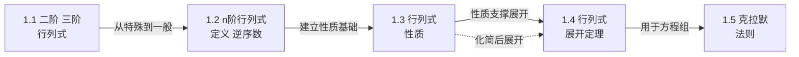

# MOC - 第1章 行列式

> [!info] 本章定位
> 行列式是线性代数的起点，它本质上是定义在方阵上的一个**多重线性交替函数**，把一个 $n$ 阶方阵 $A$ 映射为一个数 $D=|A|$。本章要解决的核心问题是：① 给出 $n$ 阶行列式的严格定义（由排列与逆序数刻画）；② 建立行列式的性质体系与按行/列展开定理，使行列式可计算、可化简；③ 用行列式作为工具求解一类特殊线性方程组——即**克拉默法则**。掌握本章是学习 [[MOC - 第2章]]（矩阵运算中行列式与逆矩阵的关系）和 [[MOC - 第3章]]（矩阵秩的可逆判定）的前提。

## 学习路线图

## 知识点导航

| 节 | 主题 | 核心要点 | 入口 |
| -- | ---- | -------- | ---- |
| 1.1 | 二阶、三阶行列式 | 对角线法则、沙路法、与二元/三元方程组消元结果的对应 | [[1.1 二阶、三阶行列式]] |
| 1.2 | n阶行列式定义 | 排列、逆序数 $\tau$、奇偶排列、$\displaystyle D=\sum_{j_1\cdots j_n}(-1)^{\tau}a_{1j_1}\cdots a_{nj_n}$、上下三角与对角行列式 | [[1.2 n阶行列式定义]] |
| 1.3 | 行列式性质 | 转置不变、换行变号、两行相同为零、行公因子提取、行倍加不变、分行可加 | [[1.3 行列式性质]] |
| 1.4 | 行列式展开定理 | 余子式 $M_{ij}$、代数余子式 $A_{ij}=(-1)^{i+j}M_{ij}$、按行/列展开、异行代数余子式之和为零、范德蒙德行列式 | [[1.4 行列式展开定理]] |
| 1.5 | 克拉默法则 | $x_j=D_j/D$、解存在唯一条件 $D\ne 0$、齐次方程组只有零解的充要条件、法则的局限 | [[1.5 克拉默法则]] |

## 核心考点

> [!warning] 重点掌握
> 1. **逆序数的计算与符号判定**：能快速写出任意排列的逆序数并判定奇偶，正确计算行列式定义式中某一项的符号。
> 2. **行列式定义的等价表述**：行指标固定与列指标固定两种写法及其等价性，理解 $(-1)^{\tau(j_1j_2\cdots j_n)}$ 的来源。
> 3. **利用性质化简行列式**：通过行（列）倍加、提取公因子、换行变号等把行列式化为上三角或出现零行，从而快速求值。
> 4. **展开定理的灵活运用**：先利用性质在某行（列）制造尽可能多的零，再按该行（列）展开降阶。
> 5. **范德蒙德行列式**：识别 $\prod_{1\le i<j\le n}(x_j-x_i)$ 结构并能套用结论。
> 6. **克拉默法则的应用与限制**：用 $D_j/D$ 求解变量较少的线性方程组；理解 $D\ne 0$ 是充分必要条件，$D=0$ 时法则失效。
> 7. **齐次方程组只有零解的充要条件**：$D\ne 0$ 等价于齐次方程组只有零解，这是后续判断矩阵可逆、向量组线性无关的雏形。

## 自测题

> [!question] 自测题 1
> 计算四阶排列 $p=p_1p_2p_3p_4=4132$ 的逆序数 $\tau(p)$，并判定其奇偶。

> > [!check]- 参考答案
> > 逐位统计前面比它大的元素个数：4 前有 0 个；1 前有 1 个（4）；3 前有 1 个（4）；2 前有 2 个（4,3）。故 $\tau(4132)=0+1+1+2=4$，为偶排列，对应行列式定义项符号为 $(-1)^4=+1$。

> [!question] 自测题 2
> 计算行列式
> $$D=\begin{vmatrix}1&2&3\\4&5&6\\7&8&0\end{vmatrix}.$$

> > [!check]- 参考答案
> > 用第一行展开或直接沙路法：
> > $D=1\cdot(5\cdot0-6\cdot8)-2\cdot(4\cdot0-6\cdot7)+3\cdot(4\cdot8-5\cdot7)$
> > $=1\cdot(-48)-2\cdot(-42)+3\cdot(-3)=-48+84-9=27$。

> [!question] 自测题 3
> 计算四阶范德蒙德行列式 $V=\begin{vmatrix}1&1&1&1\\1&2&3&4\\1&4&9&16\\1&8&27&64\end{vmatrix}$。

> > [!check]- 参考答案
> > 识别为 $x_1=1,x_2=2,x_3=3,x_4=4$ 的范德蒙德行列式：
> > $$V=\prod_{1\le i<j\le 4}(x_j-x_i)=(2-1)(3-1)(4-1)(3-2)(4-2)(4-3)=1\cdot2\cdot3\cdot1\cdot2\cdot1=12.$$

> [!question] 自测题 4
> 用克拉默法则求解方程组
> $$\begin{cases}2x_1+x_2=5\\ x_1-3x_2=-1\end{cases}.$$

> > [!check]- 参考答案
> > $D=\begin{vmatrix}2&1\\1&-3\end{vmatrix}=-6-1=-7\ne 0$。
> > $D_1=\begin{vmatrix}5&1\\-1&-3\end{vmatrix}=-15+1=-14$；$D_2=\begin{vmatrix}2&5\\1&-1\end{vmatrix}=-2-5=-7$。
> > 故 $x_1=D_1/D=2$，$x_2=D_2/D=1$。

## 章节导航

- 上一级：[[MOC - 线性代数A]]
- 下一章：[[MOC - 第2章]]
- 本章习题：[[MOC - 第1章习题]]
- 关联课程：[[MOC - 高等数学A(2)]]（雅可比行列式）、[[MOC - 概率论与数理统计B]]（协方差行列式）
