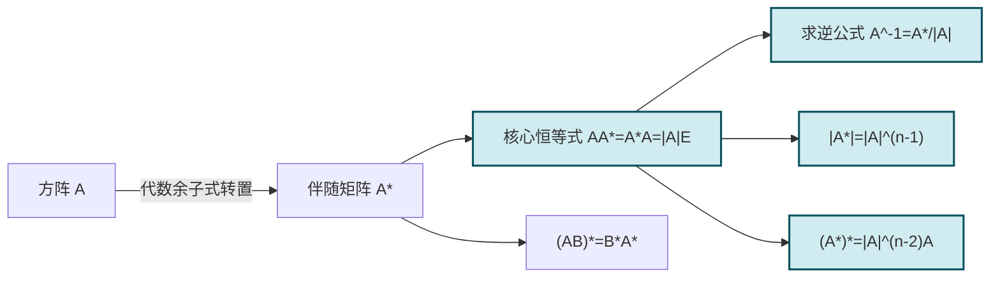

# 2.6 伴随矩阵

> [!info] 本节定位
> [[2.4 逆矩阵]] 给出了"$|A|\ne0$ 则 $A$ 可逆"的判定，但要把逆矩阵**算出来**，需要一个由 $A$ 本身构造的、与 $A$ 相乘得到 $|A|E$ 的"伙伴矩阵"——这就是**伴随矩阵** $A^*$。本节要回答：
> 1. 伴随矩阵如何由 [[第1章 行列式|代数余子式]] 构造？为何要**转置**？
> 2. 核心恒等式 $AA^*=A^*A=|A|E$ 为何成立？它的依据是行列式的展开定理与"异行异列代数余子式之和为零"。
> 3. 由核心恒等式能推出哪些重要推论（求逆公式、$|A^*|=|A|^{n-1}$、$(A^*)^*=|A|^{n-2}A$ 等）？
>
> 伴随矩阵是低阶求逆的主要工具，也是各类性质证明的常考点。

## 一、伴随矩阵的定义

> [!definition] 代数余子式
> 设 $A=(a_{ij})_{n\times n}$，划去第 $i$ 行第 $j$ 列后所得 $n-1$ 阶子式记为 $M_{ij}$，称
>
> $$A_{ij}=(-1)^{i+j}M_{ij}$$
>
> 为元素 $a_{ij}$ 的**代数余子式**。详见 [[第1章 行列式]]。

> [!definition] 伴随矩阵
> 设 $A=(a_{ij})_{n\times n}$，以 $A$ 的各元素代数余子式 $A_{ij}$ 为元素构造矩阵 $(A_{ij})_{n\times n}$，再取其**转置**，所得矩阵称为 $A$ 的**伴随矩阵**，记作 $A^*$（或 $\operatorname{adj}A$）：
>
> $$A^*=\big(A_{ij}\big)^T_{n\times n}=\begin{pmatrix}A_{11}&A_{21}&\cdots&A_{n1}\\A_{12}&A_{22}&\cdots&A_{n2}\\\vdots&\vdots&\ddots&\vdots\\A_{1n}&A_{2n}&\cdots&A_{nn}\end{pmatrix}.$$
>
> 即 $(A^*)_{ij}=A_{ji}$——**第 $i$ 行第 $j$ 列放的是 $a_{ji}$ 的代数余子式**。

> [!note] 为何要转置
> 行列式按第 $i$ 行展开为 $|A|=\sum_j a_{ij}A_{ij}$，要使矩阵乘积 $AA^*$ 的第 $(i,j)$ 元恰为 $\sum_k a_{ik}A_{jk}$，需要 $A^*$ 的第 $k$ 行第 $j$ 列元素为 $A_{jk}$，即 $(A^*)_{kj}=A_{jk}$，这正是转置后的排列。**转置是为了让"同行代数余子式"对齐"同行元素"**，使展开定理直接表现为矩阵乘法。

## 二、核心恒等式

> [!theorem] 伴随矩阵基本恒等式
> 对任意 $n$ 阶方阵 $A$（$n\ge2$），
>
> $$\boxed{AA^*=A^*A=|A|E_n.}$$
>
> 此式对**一切方阵**成立，不要求 $A$ 可逆。

> [!proof]
> 计算 $AA^*$ 的第 $(i,j)$ 元。由 $(A^*)_{kj}=A_{jk}$：
> $$(AA^*)_{ij}=\sum_{k=1}^{n}a_{ik}(A^*)_{kj}=\sum_{k=1}^{n}a_{ik}A_{jk}.$$
> 分两种情形：
> - **$i=j$**：$\sum_{k=1}^{n}a_{ik}A_{ik}=|A|$，这是行列式按第 $i$ 行的展开定理。
> - **$i\ne j$**：$\sum_{k=1}^{n}a_{ik}A_{jk}$ 是把第 $j$ 行的代数余子式与第 $i$ 行元素配对求和。它等价于把 $A$ 的第 $j$ 行替换成第 $i$ 行后所得矩阵按第 $j$ 行展开——但该矩阵有两行相同，行列式为 $0$。故该和为 $0$。
>
> 综合得 $(AA^*)_{ij}=|A|\cdot\delta_{ij}$，即 $AA^*=|A|E$。
> 同理可证 $A^*A=|A|E$（按列展开 + 异列代数余子式之和为零）。
>
> 关键依据：[[第1章 行列式|行列式展开定理]] 及其推论"某行元素与另一行代数余子式乘积之和为零"。

## 三、用伴随矩阵求逆

> [!corollary] 伴随矩阵求逆公式
> 若 $|A|\ne0$（即 $A$ 可逆），则
>
> $$\boxed{A^{-1}=\frac{A^*}{|A|}=\frac{1}{|A|}A^*.}$$
>
> 这是 [[2.4 逆矩阵|逆矩阵]] 的显式求法，证明见 [[2.4 逆矩阵]] 充分性部分。

> [!example] 例题 1　三阶矩阵伴随法求逆
> 求 $A=\begin{pmatrix}1&2&3\\2&2&1\\3&4&3\end{pmatrix}$ 的逆矩阵。
>
> > [!check]- 解答
> > **第 1 步**：算 $|A|=2$（计算见 [[2.4 逆矩阵]] 例题 2）。
> > **第 2 步**：求代数余子式并构造 $A^*$。
> > $\begin{aligned}A_{11}&=2,\ A_{12}&=-3,\ A_{13}&=2,\\A_{21}&=6,\ A_{22}&=-6,\ A_{23}&=2,\\A_{31}&=-4,\ A_{32}&=5,\ A_{33}&=-2.\end{aligned}$
> > 代数余子式矩阵 $\begin{pmatrix}2&-3&2\\6&-6&2\\-4&5&-2\end{pmatrix}$，转置得
> > $$A^*=\begin{pmatrix}2&6&-4\\-3&-6&5\\2&2&-2\end{pmatrix}.$$
> > **第 3 步**：$A^{-1}=\dfrac{1}{2}A^*=\begin{pmatrix}1&3&-2\\-\frac32&-3&\frac52\\1&1&-1\end{pmatrix}$。
> >
> > 校验：可任取一元素验证 $AA^{-1}=E$，例如 $(1,1)$ 元 $=1\cdot1+2\cdot(-\frac32)+3\cdot1=1-3+3=1$ ✓。

## 四、伴随矩阵的重要性质

> [!property] 伴随矩阵性质总表
> 设 $A$ 为 $n$ 阶方阵（$n\ge2$），$k$ 为数，下列性质成立（部分需 $A$ 可逆）：
>
> | 编号 | 性质 | 条件 |
> | ---- | ---- | ---- |
> | (1) | $AA^*=A^*A=\|A\|E$ | 任意方阵 |
> | (2) | $A^{-1}=\dfrac{A^*}{\|A\|}$ | $\|A\|\ne0$ |
> | (3) | $\|A^*\|=\|A\|^{n-1}$ | 任意方阵 |
> | (4) | $(A^*)^*=\|A\|^{n-2}A$ | $n\ge2$（$n=2$ 时 $(A^*)^*=A$） |
> | (5) | $(kA)^*=k^{n-1}A^*$ | 任意方阵 |
> | (6) | $(AB)^*=B^*A^*$ | $A,B$ 同阶方阵 |
> | (7) | $(A^T)^*=(A^*)^T$ | 任意方阵 |
> | (8) | $(A^{-1})^*=(A^*)^{-1}=\dfrac{A}{\|A\|}$ | $\|A\|\ne0$ |

下面给出关键性质的证明。

> [!proof] 性质 (3)：$|A^*|=|A|^{n-1}$
> 对核心恒等式 $AA^*=|A|E$ 两边取行列式，用 [[2.3 矩阵转置、方阵行列式|乘积行列式]] $|AB|=|A||B|$：
> $$|A|\cdot|A^*|=\big||A|E\big|=\big(|A|\big)^n\cdot|E|=|A|^n.$$
> - 若 $|A|\ne0$，两边除以 $|A|$ 得 $|A^*|=|A|^{n-1}$。
> - 若 $|A|=0$：当 $n=2$ 时可直接验证 $A^*$ 形如 $\begin{pmatrix}a_{22}&-a_{12}\\-a_{21}&a_{11}\end{pmatrix}$，$|A^*|=|A|=0=|A|^{n-1}$；当 $n\ge3$ 时，$|A|=0\Rightarrow \operatorname{rank}A\le n-1$，可证 $\operatorname{rank}A^*\le1$（详见 [[MOC - 第3章]] 秩的性质），故 $|A^*|=0=|A|^{n-1}$。
>
> 综合两种情形，$|A^*|=|A|^{n-1}$ 对一切 $n$ 阶方阵成立。

> [!proof] 性质 (4)：$(A^*)^*=|A|^{n-2}A$
> 将核心恒等式应用于 $A^*$ 本身（视 $A^*$ 为方阵）：
> $$A^*\cdot(A^*)^*=|A^*|E.$$
> 由性质 (3) $|A^*|=|A|^{n-1}$，故
> $$A^*(A^*)^*=|A|^{n-1}E.\quad(\star)$$
> 另一方面，核心恒等式 $A^*A=|A|E$ 两边左乘 $A^*$ 的某种组合…更直接地：将 $AA^*=|A|E$ 两边左乘 $(A^*)^*$、右乘 $A$，或采用如下推导。
>
> **当 $|A|\ne0$**：$A$ 可逆，$A^*$ 也可逆（因 $|A^*|=|A|^{n-1}\ne0$）。由 $(\star)$ 两边左乘 $(A^*)^{-1}=\dfrac{A}{|A|}$（性质 (8)）：
> $$(A^*)^*=(A^*)^{-1}|A|^{n-1}E=\frac{A}{|A|}\cdot|A|^{n-1}=|A|^{n-2}A.$$
> **当 $|A|=0$**：等式右边为 $0$，需证 $(A^*)^*=O$。此为 $n\ge3$ 的结论（$\operatorname{rank}A^*\le1\Rightarrow (A^*)^*=O$，见 [[MOC - 第3章]] 秩的关系）；$n=2$ 时直接计算可得 $(A^*)^*=A$，恰好等于 $|A|^{2-2}A=A$。两种情形统一为 $(A^*)^*=|A|^{n-2}A$。
>
> > [!note] $n=2$ 的特殊性
> > 对二阶方阵，$(A^*)^*=A$ 恒成立（与 $|A|$ 是否为零无关），这与公式 $|A|^{n-2}A=|A|^0 A=A$ 一致。二阶伴随矩阵的"对合性"是常用结论。

> [!proof] 性质 (5)：$(kA)^*=k^{n-1}A^*$
> $kA$ 的第 $(i,j)$ 元代数余子式：划去一行一列后为 $k^{n-1}$ 乘以 $A$ 的对应 $n-1$ 阶子式（因每行提一个 $k$，共 $n-1$ 行），再乘 $(-1)^{i+j}$，得 $k^{n-1}A_{ij}$。故 $(kA)^*=\big(k^{n-1}A_{ij}\big)^T=k^{n-1}(A_{ij})^T=k^{n-1}A^*$。

> [!proof] 性质 (6)：$(AB)^*=B^*A^*$
> **当 $A,B$ 均可逆**（故 $AB$ 可逆）：由求逆公式与逆的反序律 $(AB)^{-1}=B^{-1}A^{-1}$，再结合 $|AB|=|A||B|$：
> $$(AB)^*=\frac{(AB)^{-1}}{1}\cdot|AB|=|AB|\cdot(AB)^{-1}=|A||B|\cdot B^{-1}A^{-1}=\big(|B|B^{-1}\big)\big(|A|A^{-1}\big)=B^* A^*.$$
> （此处用到 $A^*=|A|A^{-1}$，即 $|A|A^{-1}=A^*$，由 $A^{-1}=\dfrac{A^*}{|A|}$ 反推。）
> **一般情形**：当 $A$ 或 $B$ 不可逆时，可用"连续性"论证——将 $A,B$ 视为参数族 $A+tE$、$B+tE$ 在 $t\to0$ 的极限，对可逆情形的恒等式取极限即得。本课程一般只要求掌握可逆情形的证明。

> [!proof] 性质 (8)：$(A^{-1})^*=\dfrac{A}{|A|}$
> 由求逆公式 $A^{-1}=\dfrac{A^*}{|A|}$ 反解：$A^*=|A|A^{-1}$。把此式应用于 $A^{-1}$：
> $$(A^{-1})^*=|A^{-1}|\cdot(A^{-1})^{-1}=\frac{1}{|A|}\cdot A=\frac{A}{|A|}.$$
> 又因 $A^*$ 可逆且 $(A^*)^{-1}=\dfrac{1}{|A|}A$（由 $A^*A=|A|E$），故 $(A^*)^{-1}=(A^{-1})^*=\dfrac{A}{|A|}$。

## 五、典型例题

> [!example] 例题 2　伴随矩阵行列式
> 设 $A$ 为 3 阶方阵，$|A|=2$，求 $|A^*|$、$|(A^*)^*|$、$|2A^*|$。
>
> > [!check]- 解答
> > - $|A^*|=|A|^{n-1}=|A|^2=4$。
> > - $(A^*)^*=|A|^{n-2}A=|A|A=2A$，故 $|(A^*)^*|=|2A|=2^3|A|=8\cdot2=16$。
> > - $|2A^*|=2^3|A^*|=8\cdot4=32$（$A^*$ 是 3 阶矩阵，$|kA^*|=k^3|A^*|$）。

> [!example] 例题 3　利用 $AA^*=|A|E$ 解矩阵方程
> 设 $A$ 为 3 阶方阵，$|A|=\dfrac12$，且 $A^*X=E+X$，求 $X$。
>
> > [!check]- 解答
> > $A^*X-X=E$，即 $(A^*-E)X=E$，需解出 $X=(A^*-E)^{-1}$（若 $A^*-E$ 可逆）。但更巧妙的做法是利用 $A^*=|A|A^{-1}=\dfrac12 A^{-1}$。
> >
> > $|A|A^{-1}X=X+E$，两边左乘 $A$：$|A|X=AX+A$，即 $\dfrac12 X=AX+A$，$(\dfrac12 E-A)X=A$。这仍需 $A$ 的具体值。
> >
> > 本题给的是抽象关系，应直接用 $A^*$ 性质：
> > - 由 $|A^*|=|A|^2=\dfrac14\ne0$，$A^*$ 可逆；$|A^*-E|$ 是否为 $0$ 需进一步信息。
> >
> > **改用恒等式**：方程 $A^*X=E+X\Rightarrow A^*X-X=E\Rightarrow(A^*-E)X=E$。两边取行列式未必方便。换思路——把 $A^*X=E+X$ 两边左乘 $A$：
> > $$AA^*X=A(E+X)=A+AX\Rightarrow |A|EX=A+AX\Rightarrow \frac12 X=A+AX.$$
> > 故 $\Big(\frac12 E-A\Big)X=A$。若 $\frac12 E-A$ 可逆，$X=\Big(\frac12 E-A\Big)^{-1}A$。
> >
> > 在题目未给 $A$ 具体值时，应理解为求用 $A$ 表出的表达式。最终答案为 $X=\Big(\dfrac12 E-A\Big)^{-1}A$，或等价地 $X=\Big(\dfrac{A^*}{|A|}-E\Big)^{-1}=(2A^*-E)^{-1}$。
>
> > [!warning] 抽象矩阵方程
> > 此类题目的关键是**用 $AA^*=|A|E$ 把 $A^*$ 转化为 $|A|A^{-1}$**，从而把方程化为关于 $A$ 的方程。考试中若 $A$ 给定，则代入数值即可。

> [!example] 例题 4　二阶伴随的对合性
> 设 $A=\begin{pmatrix}a&b\\c&d\end{pmatrix}$，验证 $(A^*)^*=A$。
>
> > [!check]- 解答
> > 二阶伴随口诀"主对调、副变号"：$A^*=\begin{pmatrix}d&-b\\-c&a\end{pmatrix}$。
> > 再求一次伴随：$(A^*)^*=\begin{pmatrix}a&-(-b)\\-(-c)&d\end{pmatrix}=\begin{pmatrix}a&b\\c&d\end{pmatrix}=A$。
> > 故二阶情形 $(A^*)^*=A$ 恒成立，与公式 $|A|^{n-2}A=|A|^0 A=A$ 一致。

## 六、易错点与说明

> [!warning] 常见误区
> 1. **伴随矩阵忘记转置**：定义 $A^*=(A_{ij})^T$，第 $(i,j)$ 位是 $A_{ji}$，不是 $A_{ij}$。这是求逆计算最常见错误。
> 2. **$|A^*|=|A|$**：错。应为 $|A|^{n-1}$，指数与阶数有关。
> 3. **$(A^*)^*=A$ 普遍成立**：仅 $n=2$ 时恒成立；$n\ge3$ 时为 $|A|^{n-2}A$，当 $|A|=0$ 时为 $O$（零矩阵）。
> 4. **$(AB)^*=A^*B^*$**：错。应为 $B^*A^*$（反序），与逆的反序律一致。
> 5. **$AA^*=E$**：错。应为 $AA^*=|A|E$，多一个 $|A|$ 因子；仅当 $|A|=1$ 时才退化为 $E$。
> 6. **$|A|=0$ 时认为 $A^*$ 不存在**：$A^*$ 由代数余子式构造，对任意方阵都存在；只是此时不可用 $A^{-1}=\dfrac{A^*}{|A|}$ 求逆（分母为零）。

## 本节小结

| 公式 | 适用条件 |
| ---- | -------- |
| $A^*=(A_{ij})^T$ | 任意方阵 |
| $AA^*=A^*A=\|A\|E$ | 任意方阵（核心） |
| $A^{-1}=\dfrac{A^*}{\|A\|}$ | $\|A\|\ne0$ |
| $\|A^*\|=\|A\|^{n-1}$ | 任意方阵 |
| $(A^*)^*=\|A\|^{n-2}A$ | $n\ge2$；$n=2$ 即 $(A^*)^*=A$ |
| $(kA)^*=k^{n-1}A^*$ | 任意方阵 |
| $(AB)^*=B^*A^*$ | 同阶方阵 |
| $(A^T)^*=(A^*)^T$ | 任意方阵 |
| $(A^{-1})^*=\dfrac{A}{\|A\|}$ | $\|A\|\ne0$ |

## 章节导航

- 返回：[[MOC - 第2章]]
- 上一节：[[2.5 分块矩阵]]
- 关联：[[2.4 逆矩阵]]（求逆公式的应用与证明） · [[第1章 行列式]]（代数余子式、展开定理） · [[2.5 分块矩阵]]（分块对角阵的伴随） · [[MOC - 第3章]]（秩与伴随矩阵的关系）

## 相关标签

#线性代数 #矩阵 #伴随矩阵 #代数余子式
