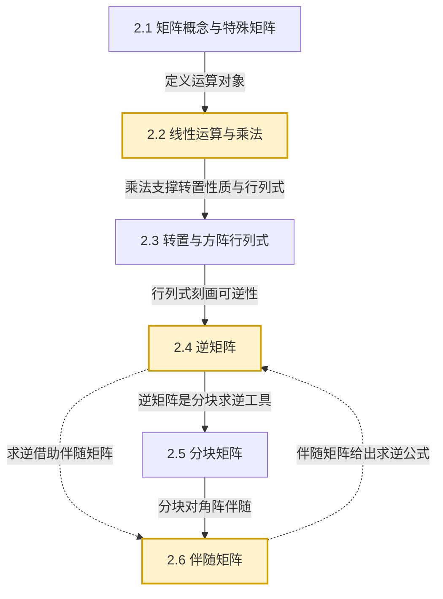

# MOC - 第2章 矩阵及其运算

> [!info] 本章定位
> 第1章用**行列式**研究了方阵的一个不变量，但行列式只能处理方阵且无法直接表达"线性映射的复合"。本章引入**矩阵**这一更一般的对象：它既是数表的紧凑记法，也是线性变换、方程组、向量组的统一载体。本章要解决的核心问题是：
> 1. 如何对矩阵定义合理的运算（加、乘、转置、幂），使它既能反映线性关系的复合，又保持良好的代数结构？
> 2. 在方阵范围内，何时存在"乘法逆元"（逆矩阵），如何用 [[第1章 行列式|行列式]] 与伴随矩阵把它算出来？
> 3. 对大规模矩阵，如何用**分块**思想化繁为简、分而治之？
>
> 本章是后续 [[MOC - 第3章]]（初等变换本质上是矩阵乘法）、[[MOC - 第5章]]（特征值依赖于矩阵乘法与逆）的运算基础。

## 学习路线图



> [!tip] 学习顺序提示
> 标准教学顺序中，**伴随矩阵**常作为逆矩阵的求逆工具先讲。本库将其单列为 2.6，便于集中掌握其性质体系；建议在阅读 2.4 逆矩阵的"伴随矩阵法"时，跳转 [[2.6 伴随矩阵]] 对照学习。

## 知识点导航

| 小节 | 主题 | 入口 | 核心内容 | 重要度 |
| ---- | ---- | ---- | -------- | ------ |
| 2.1 | 矩阵概念与常见特殊矩阵 | [[2.1 矩阵概念与常见特殊矩阵]] | 矩阵定义、零/单位/对角/数量/三角/对称/反对称矩阵 | ★★ |
| 2.2 | 矩阵线性运算、乘法 | [[2.2 矩阵线性运算、乘法]] | 加法、数乘、矩阵乘法法则、幂 | ★★★★★ |
| 2.3 | 矩阵转置、方阵行列式 | [[2.3 矩阵转置、方阵行列式]] | 转置性质、\|AB\|=\|A\|\|B\|、方阵多项式 | ★★★★ |
| 2.4 | 逆矩阵 | [[2.4 逆矩阵]] | 定义、唯一性、性质、可逆充要条件、求逆方法 | ★★★★★ |
| 2.5 | 分块矩阵 | [[2.5 分块矩阵]] | 分块运算、分块对角阵、分块求逆 | ★★★★ |
| 2.6 | 伴随矩阵 | [[2.6 伴随矩阵]] | 定义、AA\*=A\*A=\|A\|E、求逆公式、\|A\*\| 与 (A\*)\* | ★★★★★ |

## 核心考点

> [!summary] 本章高频考点
> 1. **矩阵乘法的元素级计算**：给定 $A_{m\times s}$、$B_{s\times n}$，准确写出 $C=AB$ 中指定元素 $c_{ij}=\sum_{k=1}^{s}a_{ik}b_{kj}$（见 [[2.2 矩阵线性运算、乘法]]）。
> 2. **乘法不满足交换律与消去律**：能构造反例 $AB\ne BA$、$AB=AC$ 但 $B\ne C$；理解 $AB=O$ 未必 $A=O$ 或 $B=O$。
> 3. **转置与行列式的运算性质**：$(AB)^T=B^TA^T$、$|AB|=|A||B|$、$|kA|=k^n|A|$，注意 $n$ 是阶数。
> 4. **逆矩阵的判定与求法**：用 $|A|\ne0$ 判定可逆；用伴随矩阵法 $A^{-1}=\dfrac{A^*}{|A|}$ 求低阶逆矩阵（见 [[2.4 逆矩阵]]、[[2.6 伴随矩阵]]）。
> 5. **逆矩阵性质链**：$(A^{-1})^{-1}=A$、$(AB)^{-1}=B^{-1}A^{-1}$、$(A^T)^{-1}=(A^{-1})^T$、$|A^{-1}|=\dfrac{1}{|A|}$。
> 6. **伴随矩阵性质证明**：$AA^*=A^*A=|A|E$ 是核心恒等式；由此推出 $|A^*|=|A|^{n-1}$、$(A^*)^*=|A|^{n-2}A$。
> 7. **分块对角矩阵的运算与求逆**：$\begin{pmatrix}A_1&\\&A_2\end{pmatrix}^{-1}=\begin{pmatrix}A_1^{-1}&\\&A_2^{-1}\end{pmatrix}$。
> 8. **解矩阵方程**：$AX=B$ 型方程，在 $A$ 可逆时 $X=A^{-1}B$，注意左右乘顺序不可交换。

## 关键概念关系

```mermaid
flowchart LR
    M[矩阵 A]
    Det{|A| 是否为 0}
    Inv[可逆矩阵 A^-1]
    Adj[伴随矩阵 A*]
    Block[分块矩阵]

    M --> Det
    Det -->|非零| Inv
    Det -->|为零| Sing[奇异矩阵]
    Adj -->|公式 A^-1=A*/|A|| Inv
    Inv -->|性质| Adj
    M -->|分块| Block
    Block -->|分块求逆| Inv

    classDef key fill:#d1ecf1,stroke:#0c5460,stroke-width:2px
    class Inv,Adj key
```

## 自测题

> [!question] 自测 1（乘法运算）
> 设 $A=\begin{pmatrix}1&2\\3&4\end{pmatrix}$，$B=\begin{pmatrix}0&1\\1&0\end{pmatrix}$，求 $AB$ 与 $BA$，并验证 $AB\ne BA$。
>
> > [!check]- 答案
> > $AB=\begin{pmatrix}2&1\\4&3\end{pmatrix}$，$BA=\begin{pmatrix}3&4\\1&2\end{pmatrix}$。二者不等，说明矩阵乘法一般不满足交换律。

> [!question] 自测 2（行列式性质）
> 设 $A$ 为 3 阶方阵且 $|A|=-2$，求 $|2A|$、$|A^{-1}|$ 与 $|A^*|$。
>
> > [!check]- 答案
> > $|2A|=2^3|A|=8\times(-2)=-16$；$|A^{-1}|=\dfrac{1}{|A|}=-\dfrac{1}{2}$；$|A^*|=|A|^{n-1}=|A|^2=4$。

> [!question] 自测 3（求逆）
> 用伴随矩阵法求 $A=\begin{pmatrix}1&2&3\\2&2&1\\3&4&3\end{pmatrix}$ 的逆矩阵。
>
> > [!check]- 答案
> > $|A|=2$，$A^*=\begin{pmatrix}2&6&-4\\-3&-6&5\\2&2&-2\end{pmatrix}$，故 $A^{-1}=\dfrac{1}{2}A^*=\begin{pmatrix}1&3&-2\\-\frac32&-3&\frac52\\1&1&-1\end{pmatrix}$。详见 [[2.6 伴随矩阵]]。

> [!question] 自测 4（分块求逆）
> 设 $M=\begin{pmatrix}A&O\\O&B\end{pmatrix}$ 为分块对角矩阵，$A,B$ 均可逆，写出 $M^{-1}$。
>
> > [!check]- 答案
> > $M^{-1}=\begin{pmatrix}A^{-1}&O\\O&B^{-1}\end{pmatrix}$。详见 [[2.5 分块矩阵]]。

## 重点思想

> [!abstract] 贯穿本章的三个观点
> 1. **矩阵是线性映射的代数化身**：乘法 $AB$ 对应线性映射的复合 $T_B\circ T_A$，乘法不交换正源于映射复合不交换。
> 2. **行列式是可逆性的判据**：$|A|\ne0$ 把"可逆"这一代数性质转化为一个可计算的数值判定，体现了代数与计算的桥梁。
> 3. **分块是结构化降维**：把大矩阵按结构切成子块后，运算规则保持形式不变，是处理大规模问题与揭示块结构（如对角化、Schur 补）的核心技巧。

## 章节导航

- 上一级：[[MOC - 线性代数A]]
- 上一章：[[MOC - 第1章]]（行列式）
- 下一章：[[MOC - 第3章]]（矩阵初等变换与线性方程组）
- 本章习题：[[MOC - 第2章习题]]
- 本章小节：[[2.1 矩阵概念与常见特殊矩阵]] · [[2.2 矩阵线性运算、乘法]] · [[2.3 矩阵转置、方阵行列式]] · [[2.4 逆矩阵]] · [[2.5 分块矩阵]] · [[2.6 伴随矩阵]]

## 相关标签

#线性代数 #矩阵 #矩阵乘法 #逆矩阵 #伴随矩阵 #分块矩阵
