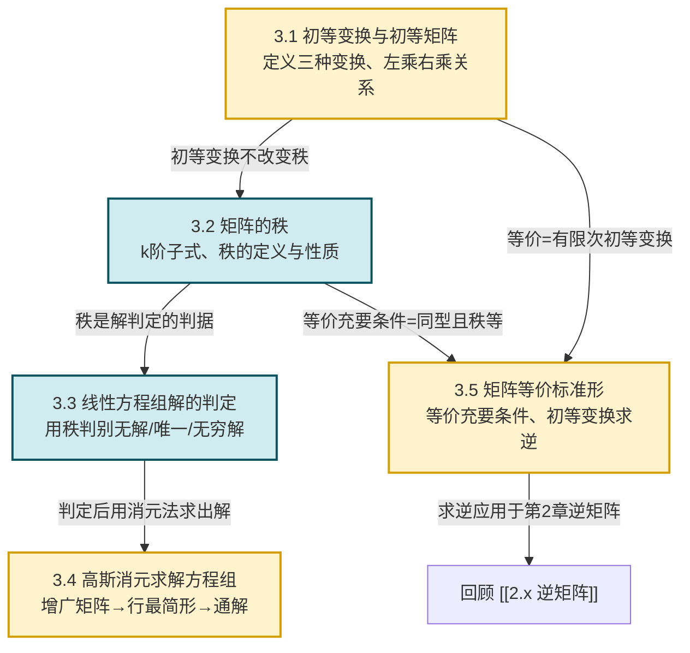

# MOC - 第3章 矩阵初等变换与线性方程组

> [!info] 本章定位
> 本章是线性代数的**枢纽章**，承前启后：以 [[3.1 初等变换、初等矩阵|初等变换]] 为统一工具，把"矩阵的秩—方程组的解—向量组的线性相关性"三大主题串联起来。
>
> 它要解决的核心问题是：
> 1. 如何用一套**机械可执行**的操作（初等变换）化简矩阵，而不改变其关键不变量（秩、可逆性、方程组解集合）？
> 2. 如何**仅凭秩**这一数值就判别线性方程组是无解、唯一解还是无穷多解，跳过具体求解过程？
> 3. 如何把任意矩阵**标准化**为唯一确定的"等价标准形"，从而给出矩阵等价的充要条件？
>
> 本章结论直接服务于 [[MOC - 第4章|第4章 向量组线性相关性]]（秩即极大无关组所含向量数）和 [[MOC - 第5章|第5章 相似矩阵及二次型]]（初等变换求逆、矩阵分解）。

## 学习路线图

## 知识点导航

| 小节 | 主题 | 入口 | 核心内容 | 关键定理/方法 |
| ---- | ---- | ---- | -------- | ------------- |
| 3.1 | 初等变换、初等矩阵 | [[3.1 初等变换、初等矩阵]] | 三种行/列变换、初等矩阵、左乘右乘法则 | 初等矩阵可逆且逆仍为初等矩阵 |
| 3.2 | 矩阵的秩 | [[3.2 矩阵的秩]] | k阶子式、秩的定义、求秩方法、秩的不等式 | 初等变换不改变秩 |
| 3.3 | 线性方程组解的判定 | [[3.3 线性方程组解的判定]] | $Ax=b$ 的矩阵表示、增广矩阵、秩判据 | 解的判定定理（核心） |
| 3.4 | 高斯消元求解方程组 | [[3.4 高斯消元求解方程组]] | 消元回代、行最简形、含参数讨论 | 行最简形→通解 |
| 3.5 | 矩阵等价标准形 | [[3.5 矩阵等价标准形]] | 矩阵等价、标准形、求逆矩阵 | 等价充要条件、$(A\|E)\to(E\|A^{-1})$ |

## 核心考点

> [!warning] 高频考点（必考 6 项 + 拓展 2 项）
> 1. **三种初等变换与初等矩阵**的对应关系（左乘行变换、右乘列变换）；初等矩阵的逆矩阵形式。
> 2. **求矩阵的秩**：用初等行变换化阶梯形，非零行数即秩。
> 3. **解的判定定理**：以 $r(A)$ 与 $r(A,b)$、$n$ 的关系判断无解/唯一解/无穷多解；齐次 $Ax=0$ 有非零解的充要条件 $r(A)<n$。
> 4. **高斯消元法**完整流程：写出增广矩阵→化行最简形→写出通解（自由变量赋参）。
> 5. **含参数线性方程组讨论**：对参数取值分类讨论秩的关系。
> 6. **初等变换求逆矩阵**：$(A\mid E)\xrightarrow{\text{行变换}}(E\mid A^{-1})$；若左侧无法化为 $E$ 则 $A$ 不可逆。
> 7. （拓展）秩的不等式证明：$r(A+B)\le r(A)+r(B)$、$r(AB)\le\min(r(A),r(B))$。
> 8. （拓展）矩阵等价标准形 $\begin{pmatrix}E_r&O\\O&O\end{pmatrix}$ 与等价充要条件。

## 核心概念速查

> [!definition] 三种初等行变换
> 设 $A$ 为 $m\times n$ 矩阵：
> - **换行** $r_i\leftrightarrow r_j$：交换第 $i,j$ 两行；
> - **倍乘** $kr_i$（$k\ne 0$）：第 $i$ 行乘非零常数 $k$；
> - **倍加** $r_i+kr_j$：第 $j$ 行的 $k$ 倍加到第 $i$ 行。
>
> 将"行"换为"列"即得三种初等列变换。六种变换统称**初等变换**。

> [!theorem] 解的判定定理（克洛内克-卡佩里定理）
> 设 $A$ 为 $m\times n$ 矩阵，$\boldsymbol b\in\mathbb{F}^m$，记 $\bar A=(A,\boldsymbol b)$ 为增广矩阵，则 $A\boldsymbol x=\boldsymbol b$：
> - **无解** $\iff r(A)<r(\bar A)$；
> - **唯一解** $\iff r(A)=r(\bar A)=n$；
> - **无穷多解** $\iff r(A)=r(\bar A)=r<n$。
>
> 详见 [[3.3 线性方程组解的判定]]。

> [!definition] 矩阵的秩
> 矩阵 $A$ 中**非零子式的最高阶数**称为 $A$ 的秩，记 $r(A)$ 或 $\mathrm{rank}(A)$。规定零矩阵的秩为 $0$。详见 [[3.2 矩阵的秩]]。

## 自测题

> [!question] 自测题 1（解的判定）
> 设 $A$ 为 $3\times 4$ 矩阵，若 $A\boldsymbol x=\boldsymbol 0$ 只有零解，则 $r(A)=$ ？此时 $A\boldsymbol x=\boldsymbol b$（$\boldsymbol b\ne\boldsymbol 0$）解的情况如何？
>
> > [!success]- 答案
> > $A\boldsymbol x=\boldsymbol 0$ 只有零解 $\iff r(A)=n=4$。但 $A$ 是 $3\times 4$ 矩阵，$r(A)\le 3<4$，故假设不成立——本题前提"只有零解"不可能，说明 $A\boldsymbol x=\boldsymbol 0$ 必有非零解。
> > 反过来想：当 $r(A)=3=\min(3,4)$ 时，$A\boldsymbol x=\boldsymbol b$ 若有解（需 $r(\bar A)=3$），则 $r<n=4$，必为无穷多解；若 $r(\bar A)=4>3=r(A)$，则无解。

> [!question] 自测题 2（求秩）
> 求矩阵 $A=\begin{pmatrix}1&2&3\\2&4&6\\-1&1&0\end{pmatrix}$ 的秩。
>
> > [!success]- 答案
> > 第二行是第一行的 2 倍，故 $r_2-2r_1\to0$；再 $r_3+r_1\to(0,3,3)$，得阶梯形 $\begin{pmatrix}1&2&3\\0&0&0\\0&3&3\end{pmatrix}$，交换得 $\begin{pmatrix}1&2&3\\0&3&3\\0&0&0\end{pmatrix}$，非零行数 $=2$，故 $r(A)=2$。

> [!question] 自测题 3（初等变换求逆）
> 用初等行变换求 $A=\begin{pmatrix}1&2\\3&4\end{pmatrix}$ 的逆矩阵。
>
> > [!success]- 答案
> > $(A\mid E)=\begin{pmatrix}1&2&1&0\\3&4&0&1\end{pmatrix}\xrightarrow{r_2-3r_1}\begin{pmatrix}1&2&1&0\\0&-2&-3&1\end{pmatrix}\xrightarrow{-\frac12 r_2}\begin{pmatrix}1&2&1&0\\0&1&3/2&-1/2\end{pmatrix}\xrightarrow{r_1-2r_2}\begin{pmatrix}1&0&-2&1\\0&1&3/2&-1/2\end{pmatrix}$
> > 故 $A^{-1}=\begin{pmatrix}-2&1\\3/2&-1/2\end{pmatrix}$（可验算 $AA^{-1}=E$）。

> [!question] 自测题 4（含参数方程组）
> 讨论方程组 $\begin{cases}x_1+x_2+x_3=1\\x_1+2x_2+ax_3=2\\x_1+ax_2+3x_3=1\end{cases}$ 的解的情况。
>
> > [!success]- 答案
> > 增广矩阵 $\bar A=\begin{pmatrix}1&1&1&1\\1&2&a&2\\1&a&3&1\end{pmatrix}\xrightarrow{\substack{r_2-r_1\\r_3-r_1}}\begin{pmatrix}1&1&1&1\\0&1&a-1&1\\0&a-1&2&0\end{pmatrix}\xrightarrow{r_3-(a-1)r_2}\begin{pmatrix}1&1&1&1\\0&1&a-1&1\\0&0&2-(a-1)^2&1-(a-1)\end{pmatrix}$。
> > 记 $D=2-(a-1)^2=3-a^2+2a=(3-a)(1+a)$。
> > - 当 $a\ne 3$ 且 $a\ne -1$：$D\ne 0$，$r(A)=r(\bar A)=3$，**唯一解**；
> > - 当 $a=-1$：$D=0$，右下角元素 $1-(-2)=3\ne 0$，$r(A)=2<r(\bar A)=3$，**无解**；
> > - 当 $a=3$：$D=0$，右下角元素 $1-2=-1\ne 0$，$r(A)=2<r(\bar A)=3$，**无解**。
> > 综上：$a\ne\pm 1,3$ 即 $a\notin\{-1,3\}$ 时唯一解；$a\in\{-1,3\}$ 时无解；本题不存在无穷多解情形。
> > （进一步分析可知 $a\notin\{-1,3\}$ 实为 $a\ne -1$ 且 $a\ne 3$，即除这两个值外都唯一解。）

## 关键思想回顾

> [!abstract] 三大主线在本章的汇合
> 1. **初等变换是机械工具，秩是不变量**：所有初等变换都保持秩不变，因此可以把矩阵化到最简形态而秩不变——这正是"等价标准形"得以成立的逻辑基础。
> 2. **秩是方程组解的"判据"**：$r(A)$ 反映系数矩阵所含独立方程的个数；$r(\bar A)$ 反映加入常数列后是否引入新的独立约束。两者差值直接决定解的存在性。
> 3. **化简—判定—求解**三步范式：先用初等变换化简（求秩 / 化行最简形），再用秩判定解的结构，最后写出通解。这一范式贯穿后续 [[MOC - 第4章|第4章 向量组]] 的基础解系。

## 章节导航

- 上一级：[[MOC - 线性代数A]]
- 上一章：[[MOC - 第2章]]（待建）
- 下一章：[[MOC - 第4章]]（待建）
- 本章习题：[[MOC - 第3章习题]]

## 相关标签

#线性代数 #初等变换 #矩阵秩 #线性方程组 #高斯消元 #等价标准形
