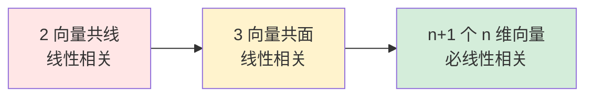

# 4.2 向量组线性相关与无关

> [!info] 本节定位
> 本节回答"一组向量中是否存在'多余'的向量"——即能否用其余向量线性表示某一向量。这是 [[4.1 n维向量概念、线性表示|线性表示]] 在 $\boldsymbol\beta=\boldsymbol0$ 这一特殊情形下的深化，也是 [[4.3 向量组极大无关组、向量组的秩|极大无关组]] 概念的逻辑前提。
>
> 核心是把"是否相关"翻译为"齐次方程组 $\sum k_i\boldsymbol\alpha_i=\boldsymbol0$ 是否有非零解"，从而调用第 3 章的秩判据。

## 一、线性相关与线性无关的定义

> [!definition] 线性相关与线性无关
> 设 $\boldsymbol\alpha_1,\boldsymbol\alpha_2,\dots,\boldsymbol\alpha_m\in\mathbb{F}^n$（$m\ge 1$）。若存在**不全为零**的数 $k_1,k_2,\dots,k_m\in\mathbb{F}$ 使
> $$k_1\boldsymbol\alpha_1+k_2\boldsymbol\alpha_2+\cdots+k_m\boldsymbol\alpha_m=\boldsymbol0\tag{*}$$
> 则称向量组 $\boldsymbol\alpha_1,\dots,\boldsymbol\alpha_m$ **线性相关**；否则称其**线性无关**。
>
> 线性无关等价于：式 $(*)$ 仅在 $k_1=k_2=\cdots=k_m=0$ 时成立。

> [!note] 定义的对象与前提
> - 定义的对象是**向量组**，不是单个向量；单个向量 $\boldsymbol\alpha$ 线性相关 $\iff\boldsymbol\alpha=\boldsymbol0$。
> - "不全为零"指 $k_1,\dots,k_m$ 中至少一个不为 $0$；并非全部非零。
> - 讨论相关性时默认 $m\ge 1$；含零向量的任一向量组必相关（取零向量系数为 $1$，其余为 $0$）。

## 二、判定方法（核心）

> [!theorem] 线性相关判定定理
> 设 $\boldsymbol\alpha_1,\dots,\boldsymbol\alpha_m\in\mathbb{F}^n$，按列拼成矩阵 $A=(\boldsymbol\alpha_1,\dots,\boldsymbol\alpha_m)$（$n\times m$）。则
> $$\boldsymbol\alpha_1,\dots,\boldsymbol\alpha_m\text{ 线性相关}\iff A\boldsymbol x=\boldsymbol0\text{ 有非零解}\iff r(A)<m$$
> $$\boldsymbol\alpha_1,\dots,\boldsymbol\alpha_m\text{ 线性无关}\iff A\boldsymbol x=\boldsymbol0\text{ 只有零解}\iff r(A)=m$$

> [!proof] 证明
> 注意 $\sum_{i=1}^m k_i\boldsymbol\alpha_i=A\boldsymbol k$，其中 $\boldsymbol k=(k_1,\dots,k_m)^\top$。故"存在不全为零的 $k_i$ 使 $\sum k_i\boldsymbol\alpha_i=\boldsymbol0$"等价于"存在 $\boldsymbol k\ne\boldsymbol0$ 使 $A\boldsymbol k=\boldsymbol0$"，即 $A\boldsymbol x=\boldsymbol0$ 有非零解。
>
> 由 [[3.3 线性方程组解的判定|齐次方程组解的判定]]，$A\boldsymbol x=\boldsymbol0$ 有非零解 $\iff r(A)<m$（$m$ 为未知数个数，即 $A$ 的列数）。证毕。

> [!theorem] 方阵情形的行列式判据
> 当 $m=n$（向量个数等于向量维数）时，$A$ 为 $n$ 阶方阵，此时
> $$\boldsymbol\alpha_1,\dots,\boldsymbol\alpha_n\text{ 线性相关}\iff |A|=0$$
> $$\boldsymbol\alpha_1,\dots,\boldsymbol\alpha_n\text{ 线性无关}\iff |A|\ne 0$$
> 此时 $A$ 可逆 $\iff$ 向量组线性无关。

> [!tip] 判定方法的选择
> | 情形 | 推荐方法 |
> | ---- | -------- |
> | $m=n$（方阵） | 直接算 $|A|$，为 $0$ 则相关，非 $0$ 则无关 |
> | $m\ne n$ 或 $n$ 较大 | 初等行变换化阶梯形，看 $r(A)$ 与 $m$ 关系 |
> | $m>n$（向量多于维数） | **必相关**（$r(A)\le n<m$），无需计算 |
> | 抽象向量组 | 用定义：假设 $\sum k_i\boldsymbol\alpha_i=\boldsymbol0$ 推 $k_i$ 是否全为零 |

## 三、线性相关与线性表示的关系

> [!theorem] 线性相关的等价刻画
> 向量组 $\boldsymbol\alpha_1,\dots,\boldsymbol\alpha_m$（$m\ge 2$）线性相关 $\iff$ 其中至少有一个向量可由其余向量线性表示。

> [!proof] 证明
> ($\Rightarrow$) 设相关，存在不全为零的 $k_1,\dots,k_m$ 使 $\sum k_i\boldsymbol\alpha_i=\boldsymbol0$。不妨设 $k_j\ne 0$，则
> $$\boldsymbol\alpha_j=-\frac{k_1}{k_j}\boldsymbol\alpha_1-\cdots-\frac{k_{j-1}}{k_j}\boldsymbol\alpha_{j-1}-\frac{k_{j+1}}{k_j}\boldsymbol\alpha_{j+1}-\cdots-\frac{k_m}{k_j}\boldsymbol\alpha_m$$
> 即 $\boldsymbol\alpha_j$ 可由其余向量线性表示。
>
> ($\Leftarrow$) 设 $\boldsymbol\alpha_j=k_1\boldsymbol\alpha_1+\cdots+k_{j-1}\boldsymbol\alpha_{j-1}+k_{j+1}\boldsymbol\alpha_{j+1}+\cdots+k_m\boldsymbol\alpha_m$，移项得 $k_1\boldsymbol\alpha_1+\cdots+(-1)\boldsymbol\alpha_j+\cdots+k_m\boldsymbol\alpha_m=\boldsymbol0$，$\boldsymbol\alpha_j$ 的系数 $-1\ne 0$，故相关。

> [!warning] 注意
> 上述等价刻画要求 $m\ge 2$。单个向量 $\boldsymbol\alpha$ 相关 $\iff\boldsymbol\alpha=\boldsymbol0$，与"可由其余表示"无关（无其余向量）。
>
> "至少一个"不代表"每一个"：例如 $\boldsymbol\alpha_1=(1,0)^\top,\boldsymbol\alpha_2=(2,0)^\top,\boldsymbol\alpha_3=(0,1)^\top$ 线性相关，但 $\boldsymbol\alpha_3$ 不能由 $\boldsymbol\alpha_1,\boldsymbol\alpha_2$ 表示。

## 四、线性相关与无关的重要性质

> [!property] 相关/无关的基本性质
> 1. **含零向量必相关**：若 $\boldsymbol\alpha_i=\boldsymbol0$，取 $k_i=1$，其余为 $0$，得 $\sum k_j\boldsymbol\alpha_j=\boldsymbol0$。
> 2. **部分相关 $\Rightarrow$ 整体相关**：若 $\boldsymbol\alpha_1,\dots,\boldsymbol\alpha_r$（$r<m$）相关，则 $\boldsymbol\alpha_1,\dots,\boldsymbol\alpha_r,\dots,\boldsymbol\alpha_m$ 必相关。
> 3. **整体无关 $\Rightarrow$ 部分无关**：性质 2 的逆否命题。若 $\boldsymbol\alpha_1,\dots,\boldsymbol\alpha_m$ 无关，则其任一非空子组无关。
> 4. **低维无关组接长向量保持无关性"看条件"**：设 $\boldsymbol\alpha_i\in\mathbb{F}^r$ 线性无关，$\boldsymbol\beta_i\in\mathbb{F}^s$，则"接长"向量 $\tilde{\boldsymbol\alpha}_i=\begin{pmatrix}\boldsymbol\alpha_i\\ \boldsymbol\beta_i\end{pmatrix}\in\mathbb{F}^{r+s}$ 未必无关（但若无关则原组必无关）。
> 5. **截短向量可能由无关变相关**：若 $\begin{pmatrix}\boldsymbol\alpha_i\\ \boldsymbol\beta_i\end{pmatrix}$ 无关，则 $\boldsymbol\alpha_i$ 必无关；反之不成立。
> 6. **$m>n$ 必相关**：$n$ 维向量组中向量个数超过 $n$ 时必线性相关（因 $r(A)\le n<m$）。
> 7. **正交组必无关**：两两正交的非零向量组线性无关（设 $\sum k_i\boldsymbol\alpha_i=\boldsymbol0$，与 $\boldsymbol\alpha_j$ 作内积得 $k_j\|\boldsymbol\alpha_j\|^2=0$，因 $\boldsymbol\alpha_j\ne\boldsymbol0$ 故 $k_j=0$）。

> [!proof] 性质 2（部分相关 $\Rightarrow$ 整体相关）
> 设 $\boldsymbol\alpha_1,\dots,\boldsymbol\alpha_r$ 相关，存在不全零的 $k_1,\dots,k_r$ 使 $\sum_{i=1}^r k_i\boldsymbol\alpha_i=\boldsymbol0$。补充 $k_{r+1}=\cdots=k_m=0$，则 $\sum_{i=1}^m k_i\boldsymbol\alpha_i=\boldsymbol0$ 仍成立且系数 $(k_1,\dots,k_r,0,\dots,0)$ 不全为零，故整体相关。

## 五、几何意义

> [!abstract] 几何解释
> - **2 个向量相关** $\iff$ 共线（即存在 $k$ 使 $\boldsymbol\alpha_2=k\boldsymbol\alpha_1$，或 $\boldsymbol\alpha_1=\boldsymbol0$）；
> - **3 个向量相关** $\iff$ 共面（落在同一过原点的平面内）；
> - **$n$ 个 $n$ 维向量相关** $\iff$ 它们张成的子空间维数 $<n$（"撑不满" $\mathbb{F}^n$）；
> - 一般地，$m$ 个向量相关 $\iff$ 它们张成的子空间维数 $<m$（"有效向量数"少于 $m$）。

## 六、典型例题

> [!example] 例 1  方阵情形用行列式判定
> 判断 $\boldsymbol\alpha_1=(1,2,3)^\top,\boldsymbol\alpha_2=(2,3,1)^\top,\boldsymbol\alpha_3=(3,5,4)^\top$ 的线性相关性。
>
> **解**：3 个 3 维向量，算行列式：
> $$|A|=\begin{vmatrix}1&2&3\\2&3&1\\3&5&4\end{vmatrix}=1(12-5)-2(8-3)+3(10-9)=7-10+3=0$$
> $|A|=0$，故**线性相关**。（事实上 $\boldsymbol\alpha_3=\boldsymbol\alpha_1+\boldsymbol\alpha_2$。）

> [!example] 例 2  非方阵情形用秩判定
> 判断 $\boldsymbol\alpha_1=(1,1,1,1)^\top,\boldsymbol\alpha_2=(1,2,3,4)^\top,\boldsymbol\alpha_3=(1,0,1,0)^\top$ 的线性相关性。
>
> **解**：4 个方程 3 个未知数，对 $A=(\boldsymbol\alpha_1,\boldsymbol\alpha_2,\boldsymbol\alpha_3)$ 做行变换：
> $$A=\begin{pmatrix}1&1&1\\1&2&0\\1&3&1\\1&4&0\end{pmatrix}\xrightarrow{\substack{r_2-r_1\\r_3-r_1\\r_4-r_1}}\begin{pmatrix}1&1&1\\0&1&-1\\0&2&0\\0&3&-1\end{pmatrix}\xrightarrow{\substack{r_3-2r_2\\r_4-3r_2}}\begin{pmatrix}1&1&1\\0&1&-1\\0&0&2\\0&0&2\end{pmatrix}\xrightarrow{r_4-r_3}\begin{pmatrix}1&1&1\\0&1&-1\\0&0&2\\0&0&0\end{pmatrix}$$
> $r(A)=3=m$，故**线性无关**。

> [!example] 例 3  抽象向量组用定义证明
> 设 $\boldsymbol\alpha_1,\boldsymbol\alpha_2,\boldsymbol\alpha_3$ 线性无关，$\boldsymbol\beta_1=\boldsymbol\alpha_1+\boldsymbol\alpha_2,\boldsymbol\beta_2=\boldsymbol\alpha_2+\boldsymbol\alpha_3,\boldsymbol\beta_3=\boldsymbol\alpha_3+\boldsymbol\alpha_1$。证明 $\boldsymbol\beta_1,\boldsymbol\beta_2,\boldsymbol\beta_3$ 线性无关。
>
> **证明**：设 $k_1\boldsymbol\beta_1+k_2\boldsymbol\beta_2+k_3\boldsymbol\beta_3=\boldsymbol0$，代入得
> $$k_1(\boldsymbol\alpha_1+\boldsymbol\alpha_2)+k_2(\boldsymbol\alpha_2+\boldsymbol\alpha_3)+k_3(\boldsymbol\alpha_3+\boldsymbol\alpha_1)=\boldsymbol0$$
> 整理为按 $\boldsymbol\alpha_i$ 重新合并：
> $$(k_1+k_3)\boldsymbol\alpha_1+(k_1+k_2)\boldsymbol\alpha_2+(k_2+k_3)\boldsymbol\alpha_3=\boldsymbol0$$
> 由 $\boldsymbol\alpha_1,\boldsymbol\alpha_2,\boldsymbol\alpha_3$ 线性无关，得方程组
> $$\begin{cases}k_1+k_3=0\\k_1+k_2=0\\k_2+k_3=0\end{cases}\implies k_1=k_2=k_3=0$$
> （系数矩阵 $\begin{pmatrix}1&0&1\\1&1&0\\0&1&1\end{pmatrix}$，行列式 $=2\ne0$，只有零解。）
>
> 故 $\boldsymbol\beta_1,\boldsymbol\beta_2,\boldsymbol\beta_3$ 线性无关。$\blacksquare$
>
> > [!tip] 也可用矩阵表达
> > $(\boldsymbol\beta_1,\boldsymbol\beta_2,\boldsymbol\beta_3)=(\boldsymbol\alpha_1,\boldsymbol\alpha_2,\boldsymbol\alpha_3)\underbrace{\begin{pmatrix}1&0&1\\1&1&0\\0&1&1\end{pmatrix}}_{P}$，$|P|=2\ne0$，故 $\boldsymbol\beta$ 组与 $\boldsymbol\alpha$ 组同秩同无关性。

## 七、易错点

> [!warning] 常见错误
> 1. **把"不全为零"写成"全不为零"**：定义只要求至少一个非零，例如 $(1)\boldsymbol\alpha_1+(0)\boldsymbol\alpha_2+(-1)\boldsymbol\alpha_3=\boldsymbol0$ 中系数有 $0$ 但仍算相关。
> 2. **误用行列式判据于非方阵**：$m\ne n$ 时没有 $|A|$ 可言，应改用 $r(A)$ 与 $m$ 比较。
> 3. **混淆"部分相关 $\Rightarrow$ 整体相关"与反向**：整体相关未必部分相关（如 $\boldsymbol\alpha_1,\boldsymbol\alpha_2,\boldsymbol\alpha_3$ 中前两个无关、整体因第三个是前两个之和而相关）。
> 4. **抽象证明中跳过"无关 $\Rightarrow$ 系数全零"**：必须由 $\boldsymbol\alpha_i$ 无关推出每个 $\boldsymbol\alpha_i$ 的系数为零，再解出 $k_j=0$。

## 八、与后续知识的连接

- 相关性是 [[4.3 向量组极大无关组、向量组的秩|极大无关组]] 的基础：无关组即"无多余向量"的组，极大无关组即"不能再添加"的无关子组；
- $A\boldsymbol x=\boldsymbol0$ 是否有非零解 $\iff A$ 的列向量组是否相关，直接连接 [[4.4 齐次线性方程组解空间、基础解系|基础解系]]；
- 矩阵可逆 $\iff$ 列（行）向量组线性无关，是 [[3.2 矩阵的秩|矩阵秩判可逆]] 的向量语言重述。

## 章节导航

- 上一级：[[MOC - 第4章]]
- 上一节：[[4.1 n维向量概念、线性表示]]
- 下一节：[[4.3 向量组极大无关组、向量组的秩]]

## 相关标签

#线性代数 #向量组 #线性相关 #线性无关
