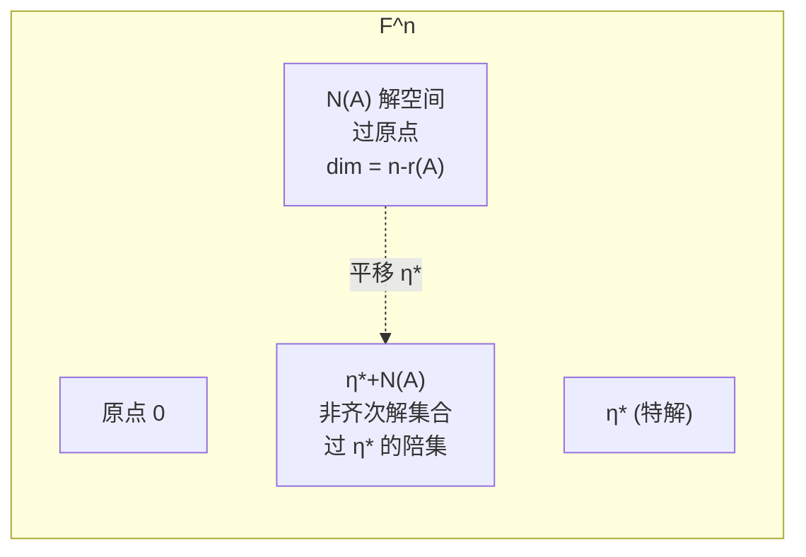

# 4.5 非齐次线性方程组通解结构

> [!info] 本节定位
> 本节是第 4 章的收束——把 [[4.4 齐次线性方程组解空间、基础解系|齐次方程组解空间]] 的结果应用到非齐次方程组 $A\boldsymbol x=\boldsymbol b$（$\boldsymbol b\ne\boldsymbol0$），给出其通解的**结构定理**。
>
> 它要解决的核心问题：非齐次方程组的解集合不是线性空间（不包含零向量、对加法不封闭），但它有清晰的结构——**一个特解 + 齐次方程组的通解**。这一"平移"观点揭示了非齐次解集合是解空间的一个"陪集"，几何上是过原点的子空间平移到过特解的位置。

## 一、非齐次方程组及其导出组

> [!definition] 非齐次线性方程组与导出组
> 设 $A=(a_{ij})_{m\times n}$，$\boldsymbol b\in\mathbb{F}^m$ 且 $\boldsymbol b\ne\boldsymbol0$，称
> $$A\boldsymbol x=\boldsymbol b$$
> 为 **$n$ 元非齐次线性方程组**。
>
> 称 $A\boldsymbol x=\boldsymbol0$ 为它的**导出组**（或对应的齐次方程组）。
>
> 由 [[3.3 线性方程组解的判定|解的判定定理]]，$A\boldsymbol x=\boldsymbol b$ 有解 $\iff r(A)=r(\bar A)$（$\bar A=(A,\boldsymbol b)$）。

## 二、非齐次方程组解的性质

> [!property] 非齐次方程组解的性质（核心）
> 设 $\boldsymbol\eta_1,\boldsymbol\eta_2$ 是 $A\boldsymbol x=\boldsymbol b$ 的解，$\boldsymbol\xi$ 是导出组 $A\boldsymbol x=\boldsymbol0$ 的解，$k\in\mathbb{F}$，则：
>
> 1. **差是齐次解**：$\boldsymbol\eta_1-\boldsymbol\eta_2$ 是 $A\boldsymbol x=\boldsymbol0$ 的解；
> 2. **特解加齐次解仍是非齐次解**：$\boldsymbol\eta_1+\boldsymbol\xi$ 是 $A\boldsymbol x=\boldsymbol b$ 的解；
> 3. **任意线性组合（系数和为 1）仍是非齐次解**：若 $\sum_{i=1}^s k_i=1$，则 $\sum_{i=1}^s k_i\boldsymbol\eta_i$ 是 $A\boldsymbol x=\boldsymbol b$ 的解；
> 4. **系数和为 0 的线性组合是齐次解**：若 $\sum_{i=1}^s k_i=0$，则 $\sum_{i=1}^s k_i\boldsymbol\eta_i$ 是 $A\boldsymbol x=\boldsymbol0$ 的解。

> [!proof] 证明
> 1. $A(\boldsymbol\eta_1-\boldsymbol\eta_2)=A\boldsymbol\eta_1-A\boldsymbol\eta_2=\boldsymbol b-\boldsymbol b=\boldsymbol0$；
> 2. $A(\boldsymbol\eta_1+\boldsymbol\xi)=A\boldsymbol\eta_1+A\boldsymbol\xi=\boldsymbol b+\boldsymbol0=\boldsymbol b$；
> 3. $A\left(\sum k_i\boldsymbol\eta_i\right)=\sum k_i(A\boldsymbol\eta_i)=\sum k_i\boldsymbol b=\left(\sum k_i\right)\boldsymbol b=\boldsymbol b$（用 $\sum k_i=1$）；
> 4. $A\left(\sum k_i\boldsymbol\eta_i\right)=\left(\sum k_i\right)\boldsymbol b=\boldsymbol0$（用 $\sum k_i=0$）。

> [!warning] 注意
> - 非齐次方程组的**两个解之和**不是解：$A(\boldsymbol\eta_1+\boldsymbol\eta_2)=2\boldsymbol b\ne\boldsymbol b$（除非 $\boldsymbol b=\boldsymbol0$）；
> - 非齐次解集合**不是线性空间**（不含零向量，对加法不封闭）；
> - 性质 1 是关键：它把"两个非齐次解的差"与"齐次解"挂钩，是通解结构定理的基础。

## 三、通解结构定理（核心）

> [!theorem] 非齐次方程组通解结构定理
> 设 $A\boldsymbol x=\boldsymbol b$ 有解（即 $r(A)=r(\bar A)$），$r(A)=r$。设 $\boldsymbol\eta^*$ 是它的一个**特解**，$\boldsymbol\xi_1,\dots,\boldsymbol\xi_{n-r}$ 是导出组 $A\boldsymbol x=\boldsymbol0$ 的一个**基础解系**。则 $A\boldsymbol x=\boldsymbol b$ 的通解为
> $$\boxed{\boldsymbol\eta=\boldsymbol\eta^*+k_1\boldsymbol\xi_1+k_2\boldsymbol\xi_2+\cdots+k_{n-r}\boldsymbol\xi_{n-r},\quad k_1,\dots,k_{n-r}\in\mathbb{F}}$$
> 即非齐次方程组的通解 = 一个特解 + 导出组的通解。

> [!proof] 证明
> **(1) 任一形如 $\boldsymbol\eta^*+\sum k_i\boldsymbol\xi_i$ 的向量都是解**：由性质 2，$\boldsymbol\eta^*+\boldsymbol\xi_i$ 是解；反复用线性性质（或直接验证）
> $$A\left(\boldsymbol\eta^*+\sum k_i\boldsymbol\xi_i\right)=A\boldsymbol\eta^*+\sum k_i(A\boldsymbol\xi_i)=\boldsymbol b+\boldsymbol0=\boldsymbol b$$
> 故确为 $A\boldsymbol x=\boldsymbol b$ 的解。
>
> **(2) 任一解 $\boldsymbol\eta$ 都可写成上述形式**：由性质 1，$\boldsymbol\eta-\boldsymbol\eta^*$ 是导出组的解，故可由基础解系表示：$\boldsymbol\eta-\boldsymbol\eta^*=k_1\boldsymbol\xi_1+\cdots+k_{n-r}\boldsymbol\xi_{n-r}$，移项即得 $\boldsymbol\eta=\boldsymbol\eta^*+\sum k_i\boldsymbol\xi_i$。
>
> 综合 (1)(2)，通解表达式成立。$\blacksquare$

> [!abstract] 几何解释（陪集观点）
> 设 $N(A)$ 是导出组的解空间（$\mathbb{F}^n$ 的子空间，过原点）。非齐次解集合
> $$\{\boldsymbol\eta\mid A\boldsymbol\eta=\boldsymbol b\}=\boldsymbol\eta^*+N(A)=\{\boldsymbol\eta^*+\boldsymbol\xi\mid\boldsymbol\xi\in N(A)\}$$
> 即把 $N(A)$ 整体平移向量 $\boldsymbol\eta^*$ 后得到的集合，称为 $N(A)$ 的一个**陪集**（coset）。
>
> 几何上：$N(A)$ 是过原点的子空间，$\boldsymbol\eta^*+N(A)$ 是过 $\boldsymbol\eta^*$ 的"平行"子空间（不再过原点）。

## 四、通解求法步骤

> [!algorithm] 求非齐次方程组通解的步骤
> **输入**：$A\boldsymbol x=\boldsymbol b$，$A$ 为 $m\times n$，已判定 $r(A)=r(\bar A)$（有解）。
> **步骤**：
> 1. 构造**增广矩阵** $\bar A=(A,\boldsymbol b)$，做初等行变换化为**行最简形** $\bar U$；
> 2. 读出 $r=r(A)$ 与 $n-r$ 个自由变量；
> 3. **求特解 $\boldsymbol\eta^*$**：令所有自由变量为 $0$，由行最简形读出主元变量的值，得到 $\boldsymbol\eta^*$；
> 4. **求导出组的基础解系**：抹去 $\bar U$ 的最后一列（常数列）即得系数矩阵 $A$ 的行最简形 $U$；按 [[4.4 齐次线性方程组解空间、基础解系|4.4 节方法]] 让自由变量取标准单位向量，得到基础解系 $\boldsymbol\xi_1,\dots,\boldsymbol\xi_{n-r}$；
> 5. **写出通解**：$\boldsymbol\eta=\boldsymbol\eta^*+k_1\boldsymbol\xi_1+\cdots+k_{n-r}\boldsymbol\xi_{n-r}$。
>
> **小技巧**：步骤 3、4 可合并——把行最简形 $\bar U$ 中常数列视为"额外一个非主元列"，让自由变量取标准单位向量时，对应的常数项取值就是特解的相应分量。

> [!tip] 特解的另一种取法
> 特解 $\boldsymbol\eta^*$ 的取法不唯一：可以令自由变量为任意值得到不同特解。最常用的是令自由变量全为 $0$（最简单）。例如令 $(x_{i_1},\dots,x_{i_{n-r}})=(0,\dots,0)$ 时读出的就是 $\boldsymbol\eta^*$。

## 五、典型例题

> [!example] 例 1  求非齐次方程组通解
> 求方程组 $\begin{cases}x_1+x_2+x_3+x_4=4\\x_1+2x_2-x_3+4x_4=5\\2x_1+3x_2+0x_3+5x_4=9\end{cases}$ 的通解。
>
> **解**：增广矩阵做行变换：
> $$\bar A=\begin{pmatrix}1&1&1&1&4\\1&2&-1&4&5\\2&3&0&5&9\end{pmatrix}\xrightarrow{\substack{r_2-r_1\\r_3-2r_1}}\begin{pmatrix}1&1&1&1&4\\0&1&-2&3&1\\0&1&-2&3&1\end{pmatrix}\xrightarrow{r_3-r_2}\begin{pmatrix}1&1&1&1&4\\0&1&-2&3&1\\0&0&0&0&0\end{pmatrix}\xrightarrow{r_1-r_2}\begin{pmatrix}1&0&3&-2&3\\0&1&-2&3&1\\0&0&0&0&0\end{pmatrix}$$
> $r(A)=r(\bar A)=2<4=n$，有无穷多解，$n-r=2$，自由变量 $x_3,x_4$。
>
> **求特解**：令 $x_3=x_4=0$，读出 $x_1=3,x_2=1$，故 $\boldsymbol\eta^*=(3,1,0,0)^\top$。
>
> **求导出组基础解系**：抹去常数列，行最简形为 $\begin{pmatrix}1&0&3&-2\\0&1&-2&3\\0&0&0&0\end{pmatrix}$。
> - 令 $(x_3,x_4)=(1,0)$：$x_1=-3,x_2=2$，$\boldsymbol\xi_1=(-3,2,1,0)^\top$；
> - 令 $(x_3,x_4)=(0,1)$：$x_1=2,x_2=-3$，$\boldsymbol\xi_2=(2,-3,0,1)^\top$。
>
> **通解**：$\boxed{\boldsymbol\eta=(3,1,0,0)^\top+k_1(-3,2,1,0)^\top+k_2(2,-3,0,1)^\top,\ k_1,k_2\in\mathbb{R}}$。

> [!example] 例 2  利用解的结构反推方程组
> 设 $A\boldsymbol x=\boldsymbol b$ 是 4 元非齐次线性方程组，$\boldsymbol\eta_1,\boldsymbol\eta_2,\boldsymbol\eta_3$ 是其三个解：$\boldsymbol\eta_1=(1,2,3,4)^\top,\boldsymbol\eta_2=(0,1,1,0)^\top,\boldsymbol\eta_3=(2,3,5,6)^\top$，且 $r(A)=2$。求 $A\boldsymbol x=\boldsymbol b$ 的通解。
>
> **解**：$r(A)=2,n=4$，故 $n-r=2$，导出组基础解系含 2 个向量。
>
> 由性质 1，$\boldsymbol\eta_1-\boldsymbol\eta_2$ 与 $\boldsymbol\eta_1-\boldsymbol\eta_3$ 都是导出组的解：
> $$\boldsymbol\eta_1-\boldsymbol\eta_2=(1,1,2,4)^\top,\quad \boldsymbol\eta_1-\boldsymbol\eta_3=(-1,-1,-2,-2)^\top$$
> 检查是否线性无关：$\boldsymbol\eta_1-\boldsymbol\eta_3$ 与 $\boldsymbol\eta_1-\boldsymbol\eta_2$ 的分量比 $\frac{-1}{1}=\frac{-1}{1}=\frac{-2}{2}\ne\frac{-2}{4}$，不成比例，故线性无关。可作为基础解系。
>
> 取特解 $\boldsymbol\eta^*=\boldsymbol\eta_1=(1,2,3,4)^\top$，通解：
> $$\boxed{\boldsymbol\eta=(1,2,3,4)^\top+k_1(1,1,2,4)^\top+k_2(-1,-1,-2,-2)^\top}$$

> [!example] 例 3  含参数讨论通解
> 讨论 $\lambda$ 取何值时方程组 $\begin{cases}x_1+x_2+x_3=1\\x_1+\lambda x_2+x_3=\lambda\\x_1+x_2+\lambda x_3=\lambda^2\end{cases}$ 有唯一解、无解、无穷多解；并求无穷多解时的通解。
>
> **解**：增广矩阵
> $$\bar A=\begin{pmatrix}1&1&1&1\\1&\lambda&1&\lambda\\1&1&\lambda&\lambda^2\end{pmatrix}\xrightarrow{\substack{r_2-r_1\\r_3-r_1}}\begin{pmatrix}1&1&1&1\\0&\lambda-1&0&\lambda-1\\0&0&\lambda-1&\lambda^2-1\end{pmatrix}$$
> - **$\lambda\ne 1$**：$r(A)=r(\bar A)=3=n$，**唯一解**。回代：$x_3=\dfrac{\lambda^2-1}{\lambda-1}=\lambda+1,\ x_2=\dfrac{\lambda-1}{\lambda-1}=1,\ x_1=1-x_2-x_3=-\lambda-1$；
> - **$\lambda=1$**：三方程都化为 $x_1+x_2+x_3=1$，$r(A)=r(\bar A)=1<3$，**无穷多解**。
>
> $\lambda=1$ 时行最简形 $\bar U=\begin{pmatrix}1&1&1&1\\0&0&0&0\\0&0&0&0\end{pmatrix}$，自由变量 $x_2,x_3$。
> - 特解：令 $x_2=x_3=0$，$x_1=1$，$\boldsymbol\eta^*=(1,0,0)^\top$；
> - 基础解系：令 $(x_2,x_3)=(1,0),(0,1)$，得 $\boldsymbol\xi_1=(-1,1,0)^\top,\boldsymbol\xi_2=(-1,0,1)^\top$。
> - 通解：$\boldsymbol\eta=(1,0,0)^\top+k_1(-1,1,0)^\top+k_2(-1,0,1)^\top$。

## 六、易错点

> [!warning] 常见错误
> 1. **忘记加特解**：非齐次通解必须含特解项 $\boldsymbol\eta^*$，不能只写齐次通解。
> 2. **混淆"非齐次解的和"与"齐次解的和"**：两个非齐次解之和不是非齐次解；两个齐次解之和仍是齐次解。
> 3. **特解取自由变量全 0 但漏读主元**：行最简形中主元变量 = 该行常数列的值（自由变量为 0 时），别把自由变量也算进特解。
> 4. **用 $r(\bar A)$ 计算 $n-r$**：$n-r(A)$ 才是基础解系个数，不是 $n-r(\bar A)$（虽然 $r(A)=r(\bar A)$，但概念上应基于系数矩阵秩）。
> 5. **判定无解后强行写通解**：先确认 $r(A)=r(\bar A)$ 有解，才能套用通解结构。

## 七、与后续知识的连接

- 通解结构是 [[3.4 高斯消元求解方程组|高斯消元]] 求出的具体通解的理论解释——消元法得到的"参数解"恰是"特解 + 齐次通解"形式；
- 陪集观点是 [[MOC - 第6章|线性空间]] 中商空间 $V/W$ 的具体原型；
- 解的结构定理在第 5 章用于 [[MOC - 第5章|相似矩阵]] 中特征方程的解讨论与线性微分方程组的通解。

## 章节导航

- 上一级：[[MOC - 第4章]]
- 上一节：[[4.4 齐次线性方程组解空间、基础解系]]
- 下一章：[[MOC - 第5章]]（待建）

## 相关标签

#线性代数 #非齐次方程组 #通解结构 #特解
