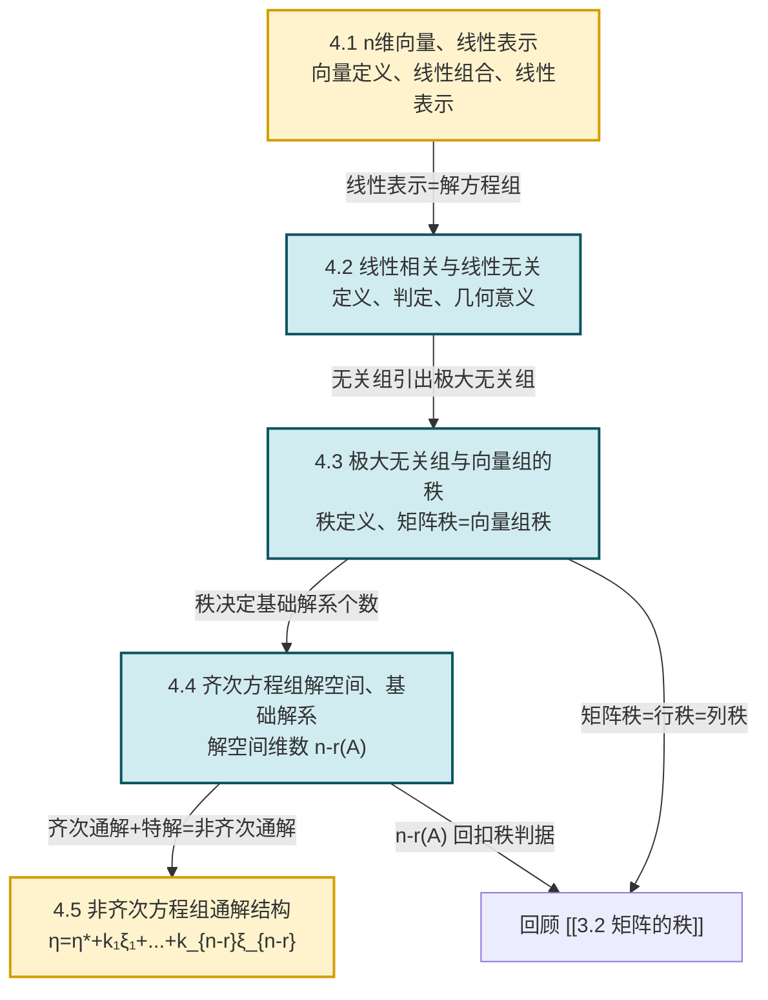

# MOC - 第4章 向量组的线性相关性

> [!info] 本章定位
> 本章把第 3 章的"矩阵—秩—方程组"语言**翻译为向量语言**：矩阵的列（行）被看作向量，秩被理解为向量组中"独立向量"的个数，方程组的解被组织为"解空间"。
>
> 它要解决的核心问题是：
> 1. 如何判断一组向量是否"多余"（线性相关）或"彼此独立"（线性无关）？如何用最少向量代表整组（极大无关组、秩）？
> 2. 齐次方程组 $A\boldsymbol x=\boldsymbol 0$ 的无穷多解如何用一个"基础解系"完整生成？解集合的几何形态是什么？
> 3. 非齐次方程组 $A\boldsymbol x=\boldsymbol b$ 的通解如何由"一个特解 + 齐次通解"两部分拼接？
>
> 本章是 [[MOC - 第3章|第3章]] 的深化，结论直接服务于 [[MOC - 第5章|第5章 相似矩阵及二次型]]（特征向量线性无关性）和 [[MOC - 第6章|第6章 线性空间]]（基、维数、坐标即本章抽象化）。

## 学习路线图

## 知识点导航

| 小节 | 主题 | 入口 | 核心内容 | 关键定理/方法 |
| ---- | ---- | ---- | -------- | ------------- |
| 4.1 | n维向量概念、线性表示 | [[4.1 n维向量概念、线性表示]] | $n$ 维向量定义、线性组合、线性表示 | 线性表示 $\iff$ 非齐次方程组有解 |
| 4.2 | 向量组线性相关与无关 | [[4.2 向量组线性相关与无关]] | 相关/无关定义、判定定理、几何意义 | $\sum k_i\boldsymbol\alpha_i=\boldsymbol0$ 是否有非零解 |
| 4.3 | 极大无关组、向量组的秩 | [[4.3 向量组极大无关组、向量组的秩]] | 极大无关组、秩、等价向量组、行秩=列秩 | 矩阵秩 = 行秩 = 列秩 |
| 4.4 | 齐次方程组解空间、基础解系 | [[4.4 齐次线性方程组解空间、基础解系]] | 解的性质、解空间、基础解系、维数 | 基础解系含 $n-r(A)$ 个向量 |
| 4.5 | 非齐次方程组通解结构 | [[4.5 非齐次线性方程组通解结构]] | 解的性质、通解结构定理、求法 | $\boldsymbol\eta=\boldsymbol\eta^*+\sum k_i\boldsymbol\xi_i$ |

## 核心考点

> [!warning] 高频考点（必考 6 项 + 拓展 2 项）
> 1. **线性表示判定**：$\boldsymbol\beta$ 能否由 $\boldsymbol\alpha_1,\dots,\boldsymbol\alpha_m$ 线性表示 $\iff$ 非齐次方程组 $x_1\boldsymbol\alpha_1+\cdots+x_m\boldsymbol\alpha_m=\boldsymbol\beta$ 是否有解（用 $r(A)$ 与 $r(A,\boldsymbol\beta)$ 判定）。见 [[4.1 n维向量概念、线性表示]]。
> 2. **线性相关/无关判定**：转化为齐次方程组 $\sum k_i\boldsymbol\alpha_i=\boldsymbol0$ 是否有非零解；向量个数 $=$ 向量维数时用行列式 $|\boldsymbol\alpha_1,\dots,\boldsymbol\alpha_n|=0$（相关）$\ne0$（无关）。见 [[4.2 向量组线性相关与无关]]。
> 3. **求极大无关组并表示其余向量**：把向量按列拼成矩阵，初等行变换化行最简形，主元列即极大无关组，其余列由主元列线性表示的系数在行最简形中直接读出。见 [[4.3 向量组极大无关组、向量组的秩]]。
> 4. **基础解系求解**：对 $A$ 做初等行变换化行最简形，自由变量依次取 $(1,0,\dots,0),(0,1,\dots,0),\dots$ 得 $n-r(A)$ 个线性无关解，即基础解系。见 [[4.4 齐次线性方程组解空间、基础解系]]。
> 5. **非齐次通解结构**：先求一个特解 $\boldsymbol\eta^*$（通常令自由变量全为 0），再求对应齐次方程组的基础解系 $\boldsymbol\xi_1,\dots,\boldsymbol\xi_{n-r}$，通解 $\boldsymbol\eta=\boldsymbol\eta^*+k_1\boldsymbol\xi_1+\cdots+k_{n-r}\boldsymbol\xi_{n-r}$。见 [[4.5 非齐次线性方程组通解结构]]。
> 6. **抽象向量组证明**（相关/无关、秩的不等式）：利用定义、初等变换保秩、$AB=O\Rightarrow r(A)+r(B)\le n$ 等工具。
> 7. （拓展）**等价向量组**与秩的关系：等价向量组秩相等，但秩相等的向量组未必等价；同一向量组的两个极大无关组必等价。
> 8. （拓展）**解空间维数定理** $n-r(A)$ 的应用：结合 $AB=O$ 证明秩不等式、结合 $r(A^\top A)=r(A)$ 证明实矩阵的秩性质。

## 核心概念速查

> [!definition] 线性相关与线性无关
> 设 $\boldsymbol\alpha_1,\dots,\boldsymbol\alpha_m\in\mathbb{F}^n$。若存在不全为零的 $k_1,\dots,k_m\in\mathbb{F}$ 使
> $$k_1\boldsymbol\alpha_1+k_2\boldsymbol\alpha_2+\cdots+k_m\boldsymbol\alpha_m=\boldsymbol0$$
> 则称该向量组**线性相关**；否则称其**线性无关**（即上式仅在 $k_1=\cdots=k_m=0$ 时成立）。详见 [[4.2 向量组线性相关与无关]]。

> [!theorem] 矩阵秩 = 行秩 = 列秩
> 设 $A=(a_{ij})_{m\times n}$，把 $A$ 的行向量组的秩称为**行秩**，列向量组的秩称为**列秩**，则
> $$\text{行秩}(A)=\text{列秩}(A)=r(A)$$
> 即矩阵的秩、行秩、列秩三者相等。详见 [[4.3 向量组极大无关组、向量组的秩]]。

> [!theorem] 基础解系存在性与维数定理
> 设 $A$ 为 $m\times n$ 矩阵，$r(A)=r<n$，则齐次方程组 $A\boldsymbol x=\boldsymbol0$ 必存在基础解系，且任一基础解系恰含 $n-r$ 个线性无关的解向量；解空间维数
> $$\dim N(A)=n-r(A)$$
> 当 $r=n$ 时只有零解，解空间维数为 $0$。详见 [[4.4 齐次线性方程组解空间、基础解系]]。

> [!theorem] 非齐次方程组通解结构
> 设 $A\boldsymbol x=\boldsymbol b$ 有解，$\boldsymbol\eta^*$ 为其一特解，$\boldsymbol\xi_1,\dots,\boldsymbol\xi_{n-r}$ 为对应齐次方程组 $A\boldsymbol x=\boldsymbol0$ 的基础解系，则 $A\boldsymbol x=\boldsymbol b$ 的通解为
> $$\boldsymbol\eta=\boldsymbol\eta^*+k_1\boldsymbol\xi_1+k_2\boldsymbol\xi_2+\cdots+k_{n-r}\boldsymbol\xi_{n-r},\quad k_i\in\mathbb{F}$$
> 详见 [[4.5 非齐次线性方程组通解结构]]。

## 自测题

> [!question] 自测题 1（线性表示判定）
> 设 $\boldsymbol\alpha_1=(1,1,1)^\top,\boldsymbol\alpha_2=(1,2,3)^\top,\boldsymbol\alpha_3=(1,3,6)^\top,\boldsymbol\beta=(2,3,4)^\top$，问 $\boldsymbol\beta$ 能否由 $\boldsymbol\alpha_1,\boldsymbol\alpha_2,\boldsymbol\alpha_3$ 线性表示？若能，写出表示式。
>
> > [!success]- 答案
> > 解非齐次方程组 $x_1\boldsymbol\alpha_1+x_2\boldsymbol\alpha_2+x_3\boldsymbol\alpha_3=\boldsymbol\beta$，即 $\begin{pmatrix}1&1&1\\1&2&3\\1&3&6\end{pmatrix}\begin{pmatrix}x_1\\x_2\\x_3\end{pmatrix}=\begin{pmatrix}2\\3\\4\end{pmatrix}$。
> > 增广矩阵 $\bar A=\begin{pmatrix}1&1&1&2\\1&2&3&3\\1&3&6&4\end{pmatrix}\xrightarrow{\substack{r_2-r_1\\r_3-r_1}}\begin{pmatrix}1&1&1&2\\0&1&2&1\\0&2&5&2\end{pmatrix}\xrightarrow{r_3-2r_2}\begin{pmatrix}1&1&1&2\\0&1&2&1\\0&0&1&0\end{pmatrix}$
> > 回代：$x_3=0,\ x_2=1,\ x_1=1$。能表示，$\boldsymbol\beta=\boldsymbol\alpha_1+\boldsymbol\alpha_2$。

> [!question] 自测题 2（线性相关性）
> 判断向量组 $\boldsymbol\alpha_1=(1,2,3)^\top,\boldsymbol\alpha_2=(2,3,1)^\top,\boldsymbol\alpha_3=(3,5,4)^\top$ 的线性相关性。
>
> > [!success]- 答案
> > 3 个 3 维向量，看行列式 $|A|=\begin{vmatrix}1&2&3\\2&3&1\\3&5&4\end{vmatrix}$。注意到 $\boldsymbol\alpha_3=\boldsymbol\alpha_1+\boldsymbol\alpha_2$，故行列式 $=0$，向量组**线性相关**。
> > 验算：$\begin{vmatrix}1&2&3\\2&3&1\\3&5&4\end{vmatrix}=1(12-5)-2(8-3)+3(10-9)=7-10+3=0$。

> [!question] 自测题 3（基础解系）
> 求齐次方程组 $\begin{cases}x_1+x_2-x_3-x_4=0\\x_1-2x_2+x_3-2x_4=0\end{cases}$ 的基础解系与通解。
>
> > [!success]- 答案
> > $A=\begin{pmatrix}1&1&-1&-1\\1&-2&1&-2\end{pmatrix}\xrightarrow{r_2-r_1}\begin{pmatrix}1&1&-1&-1\\0&-3&2&-1\end{pmatrix}\xrightarrow{r_2\div(-3)}\begin{pmatrix}1&1&-1&-1\\0&1&-2/3&1/3\end{pmatrix}\xrightarrow{r_1-r_2}\begin{pmatrix}1&0&-1/3&-4/3\\0&1&-2/3&1/3\end{pmatrix}$
> > $r(A)=2$，自由变量 $x_3,x_4$。令 $(x_3,x_4)=(1,0)$ 得 $\boldsymbol\xi_1=(1/3,2/3,1,0)^\top$，可取 $\boldsymbol\xi_1=(1,2,3,0)^\top$；令 $(x_3,x_4)=(0,1)$ 得 $\boldsymbol\xi_2=(4/3,-1/3,0,1)^\top$，可取 $\boldsymbol\xi_2=(4,-1,0,3)^\top$。
> > 通解 $\boldsymbol x=k_1(1,2,3,0)^\top+k_2(4,-1,0,3)^\top$。

> [!question] 自测题 4（通解结构）
> 设 $A\boldsymbol x=\boldsymbol b$ 的两个特解为 $\boldsymbol\eta_1=(1,0,2)^\top,\boldsymbol\eta_2=(0,1,1)^\top$，已知 $r(A)=2,n=3$，写出通解。
>
> > [!success]- 答案
> > $\boldsymbol\eta_1-\boldsymbol\eta_2=(1,-1,1)^\top$ 是齐次方程组的一个非零解。$n-r=1$，故基础解系只含 1 个向量，可取 $\boldsymbol\xi_1=(1,-1,1)^\top$。取特解 $\boldsymbol\eta^*=\boldsymbol\eta_1=(1,0,2)^\top$。
> > 通解 $\boldsymbol\eta=(1,0,2)^\top+k(1,-1,1)^\top,\ k\in\mathbb{F}$。

## 关键思想回顾

> [!abstract] 本章三大主线
> 1. **向量语言与矩阵语言的互译**：向量组 $\{\boldsymbol\alpha_1,\dots,\boldsymbol\alpha_m\}$ 按列拼成矩阵 $A=(\boldsymbol\alpha_1,\dots,\boldsymbol\alpha_m)$，于是"线性表示" $\iff$ 非齐次方程组有解；"线性相关" $\iff$ 齐次方程组有非零解；"极大无关组向量数" $=$ 矩阵秩。
> 2. **秩贯穿全章**：向量组秩、矩阵秩、解空间维数三者由 $n-r(A)$ 这一公式统一——秩决定"独立信息"的多少，也决定"自由度"的多少。
> 3. **解的结构定理**：齐次解空间是线性空间（对加法、数乘封闭），基础解系即其基；非齐次解集合不是线性空间，但等于"一个特解 + 齐次解空间"的平移。这是从"枚举解"到"刻画解集合结构"的关键跃迁。

## 章节导航

- 上一级：[[MOC - 线性代数A]]
- 上一章：[[MOC - 第3章]]
- 下一章：[[MOC - 第5章]]（待建）
- 本章习题：[[MOC - 第4章习题]]

## 相关标签

#线性代数 #向量组 #线性相关 #极大无关组 #基础解系 #解结构
