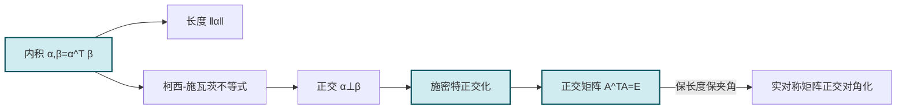

# 5.1 向量内积、正交向量组、正交矩阵

> [!info] 本节定位
> [[第4章 向量组的线性相关性|向量组]] 研究了向量的线性运算与线性相关性，但没有引入"长度""角度"等度量概念。本节在 $\mathbb{R}^n$ 上引入**内积**，从而定义向量长度、夹角与正交性，并构造一类理想的可逆矩阵——**正交矩阵**。本节要解决的核心问题：
> 1. 如何在 $n$ 维实向量空间上定义合理的"乘积"使其同时反映长度与角度？
> 2. 任一线性无关向量组能否改造为两两正交且单位化的向量组（[[#三、施密特正交化|施密特正交化]]）？
> 3. 满足 $A^TA=E$ 的方阵 $A$（正交矩阵）有哪些几何与代数性质？为何它是 [[5.4 实对称矩阵对角化|实对称矩阵正交对角化]] 与 [[5.6 正交变换化二次型为标准形|二次型化标准形]] 的关键工具？

## 一、向量内积

> [!definition] 内积
> 设 $\alpha=(a_1,a_2,\cdots,a_n)^T$，$\beta=(b_1,b_2,\cdots,b_n)^T\in\mathbb{R}^n$，称实数
>
> $$\boxed{(\alpha,\beta)=a_1b_1+a_2b_2+\cdots+a_nb_n=\alpha^T\beta}$$
>
> 为 $\alpha$ 与 $\beta$ 的**内积**（或数量积、点积）。
>
> **说明**：
> - 内积是一个 $\mathbb{R}^n\times\mathbb{R}^n\to\mathbb{R}$ 的二元函数，输出为标量。
> - 在矩阵形式下 $(\alpha,\beta)=\alpha^T\beta$（$\alpha,\beta$ 为列向量），也可写作 $\beta^T\alpha$，二者相等。
> - 本课程仅讨论实向量空间的内积；复向量空间的 Hermite 内积见后续课程。

> [!property] 内积的运算性质
> 对任意 $\alpha,\beta,\gamma\in\mathbb{R}^n$ 与 $k\in\mathbb{R}$：
>
> 1. **对称性**：$(\alpha,\beta)=(\beta,\alpha)$。
> 2. **线性性（第一因子）**：$(k\alpha,\beta)=k(\alpha,\beta)$；$(\alpha+\gamma,\beta)=(\alpha,\beta)+(\gamma,\beta)$。
> 3. **非负性**：$(\alpha,\alpha)=\sum a_i^2\ge0$，且 $(\alpha,\alpha)=0\Leftrightarrow\alpha=0$。
>
> 这三条是抽象内积空间的公理来源。

> [!definition] 向量长度与单位化
> 设 $\alpha=(a_1,\cdots,a_n)^T\in\mathbb{R}^n$，称
>
> $$\|\alpha\|=\sqrt{(\alpha,\alpha)}=\sqrt{a_1^2+a_2^2+\cdots+a_n^2}$$
>
> 为 $\alpha$ 的**长度**（或模、范数）。当 $\|\alpha\|=1$ 时称 $\alpha$ 为**单位向量**。
>
> 若 $\alpha\ne0$，则 $\alpha^0=\dfrac{\alpha}{\|\alpha\|}$ 是单位向量，称为 $\alpha$ 的**单位化**。

> [!property] 长度的性质
> 1. $\|\alpha\|\ge0$，且 $\|\alpha\|=0\Leftrightarrow\alpha=0$；
> 2. $\|k\alpha\|=|k|\cdot\|\alpha\|$（齐次性）；
> 3. $\|\alpha+\beta\|\le\|\alpha\|+\|\beta\|$（三角不等式）。

## 二、柯西-施瓦茨不等式

> [!theorem] 柯西-施瓦茨不等式
> 对任意 $\alpha,\beta\in\mathbb{R}^n$，
>
> $$\boxed{|(\alpha,\beta)|\le\|\alpha\|\cdot\|\beta\|,}$$
>
> 等号成立当且仅当 $\alpha,\beta$ 线性相关。

> [!proof]
> 若 $\beta=0$，两边均为 $0$，结论平凡。下设 $\beta\ne0$。对任意实数 $t$，由非负性：
> $$(\alpha-t\beta,\alpha-t\beta)=\|\alpha\|^2-2t(\alpha,\beta)+t^2\|\beta\|^2\ge0.$$
> 这是关于 $t$ 的二次式恒非负，故判别式 $\le0$：
> $$4(\alpha,\beta)^2-4\|\alpha\|^2\|\beta\|^2\le0\Rightarrow|(\alpha,\beta)|\le\|\alpha\|\|\beta\|.$$
> 等号成立当判别式 $=0$，即存在 $t$ 使 $\alpha-t\beta=0$，亦即 $\alpha,\beta$ 线性相关。

> [!corollary] 向量夹角
> 当 $\alpha,\beta\ne0$ 时，由柯西-施瓦茨不等式 $\left|\dfrac{(\alpha,\beta)}{\|\alpha\|\|\beta\|}\right|\le1$，故可定义 $\alpha,\beta$ 的夹角 $\theta\in[0,\pi]$：
>
> $$\cos\theta=\frac{(\alpha,\beta)}{\|\alpha\|\|\beta\|}.$$

## 三、正交向量组

> [!definition] 正交与正交向量组
> 设 $\alpha,\beta\in\mathbb{R}^n$，若 $(\alpha,\beta)=0$，称 $\alpha$ 与 $\beta$ **正交**，记 $\alpha\perp\beta$。
> 若向量组 $\alpha_1,\alpha_2,\cdots,\alpha_m$ 中任意两个向量正交（$i\ne j$ 时 $(\alpha_i,\alpha_j)=0$），且均为非零向量，称其为**正交向量组**。
> 若进一步每个 $\alpha_i$ 都是单位向量，称其为**标准正交向量组**。

> [!theorem] 正交向量组的线性无关性
> 若 $\alpha_1,\alpha_2,\cdots,\alpha_m$ 是正交向量组（均非零），则它线性无关。

> [!proof]
> 设 $k_1\alpha_1+k_2\alpha_2+\cdots+k_m\alpha_m=0$。两边与 $\alpha_i$ 做内积：
> $$(k_1\alpha_1+\cdots+k_m\alpha_m,\alpha_i)=k_1(\alpha_1,\alpha_i)+\cdots+k_m(\alpha_m,\alpha_i)=k_i\|\alpha_i\|^2=0.$$
> 因 $\alpha_i\ne0$，$\|\alpha_i\|^2\ne0$，故 $k_i=0$。对 $i=1,\cdots,m$ 均成立，故向量组线性无关。

> [!warning] 注意前提
> "正交向量组必线性无关"要求**每个向量非零**。若允许零向量，则零向量与任何向量正交，线性无关性失效。定义中已限定正交向量组各向量非零。

## 四、施密特正交化

> [!theorem] 施密特正交化方法
> 设 $\alpha_1,\alpha_2,\cdots,\alpha_m$ 是 $\mathbb{R}^n$ 中线性无关的向量组，则按下述递推公式得到的 $\beta_1,\cdots,\beta_m$ 是与原向量组等价的正交向量组：
>
> $$\beta_1=\alpha_1,$$
> $$\beta_k=\alpha_k-\sum_{i=1}^{k-1}\frac{(\alpha_k,\beta_i)}{(\beta_i,\beta_i)}\beta_i,\quad k=2,3,\cdots,m.$$
>
> 进一步单位化 $\eta_k=\dfrac{\beta_k}{\|\beta_k\|}$，则 $\eta_1,\cdots,\eta_m$ 是与原向量组等价的**标准正交向量组**。

> [!note] 几何直观
> $\beta_k$ 的构造是从 $\alpha_k$ 中**减去它在已生成的 $\beta_1,\cdots,\beta_{k-1}$ 方向上的投影**，剩下的就是与已有正交向量都垂直的分量。这一过程是"逐次剥除已确定方向上的投影"，保证正交性。

> [!proof]
> 对 $k$ 归纳。$\beta_1=\alpha_1\ne0$（线性无关组首向量非零）。
> 设 $\beta_1,\cdots,\beta_{k-1}$ 两两正交且非零，验证 $\beta_k$ 与每个 $\beta_j$（$j<k$）正交：
> $$(\beta_k,\beta_j)=\left(\alpha_k-\sum_{i=1}^{k-1}\frac{(\alpha_k,\beta_i)}{(\beta_i,\beta_i)}\beta_i,\ \beta_j\right)=(\alpha_k,\beta_j)-\frac{(\alpha_k,\beta_j)}{(\beta_j,\beta_j)}(\beta_j,\beta_j)=0.$$
> （其余项 $i\ne j$ 的项因 $(\beta_i,\beta_j)=0$ 贡献为零。）
> 由 $\alpha_1,\cdots,\alpha_k$ 线性无关，$\alpha_k$ 不能被 $\beta_1,\cdots,\beta_{k-1}$（由 $\alpha_1,\cdots,\alpha_{k-1}$ 线性表示）线性表示，故 $\beta_k\ne0$。

> [!example] 例题 1　施密特正交化
> 将 $\alpha_1=(1,1,0)^T$，$\alpha_2=(1,0,1)^T$，$\alpha_3=(0,1,1)^T$ 正交化并单位化。
>
> > [!check]- 解答
> > **第 1 步**：$\beta_1=\alpha_1=(1,1,0)^T$，$\|\beta_1\|^2=2$。
> >
> > **第 2 步**：
> > $$\beta_2=\alpha_2-\frac{(\alpha_2,\beta_1)}{(\beta_1,\beta_1)}\beta_1=(1,0,1)^T-\frac{1}{2}(1,1,0)^T=\left(\frac12,-\frac12,1\right)^T.$$
> > 为避免分数，取 $\beta_2=2\beta_2'=(1,-1,2)^T$（正交化允许数乘）。
> >
> > **第 3 步**：
> > $\begin{aligned}(\alpha_3,\beta_1)&=1,\quad(\alpha_3,\beta_2)=0+1+2=3,\\(\beta_1,\beta_1)&=2,\quad(\beta_2,\beta_2)=1+1+4=6.\end{aligned}$
> > $$\beta_3=\alpha_3-\frac{1}{2}\beta_1-\frac{3}{6}\beta_2=(0,1,1)^T-\frac12(1,1,0)^T-\frac12(1,-1,2)^T=\left(-1,1,0\right)^T.$$
> > 校验：$(\beta_1,\beta_3)=1-1+0=0$ ✓，$(\beta_2,\beta_3)=-1+1+0=0$ ✓。
> >
> > **第 4 步**：单位化。$\|\beta_1\|=\sqrt2$，$\|\beta_2\|=\sqrt6$，$\|\beta_3\|=\sqrt2$。
> > $$\eta_1=\frac{1}{\sqrt2}(1,1,0)^T,\quad\eta_2=\frac{1}{\sqrt6}(1,-1,2)^T,\quad\eta_3=\frac{1}{\sqrt2}(-1,1,0)^T.$$

## 五、正交矩阵

> [!definition] 正交矩阵
> 设 $A$ 为 $n$ 阶实方阵，若满足
>
> $$\boxed{A^TA=E_n\quad(\text{等价地 } A^{-1}=A^T),}$$
>
> 则称 $A$ 为**正交矩阵**。
>
> **等价刻画**：$A$ 的列向量组（行向量组）是 $\mathbb{R}^n$ 的一组标准正交基。

> [!property] 正交矩阵的性质
> 设 $A,B$ 为 $n$ 阶正交矩阵：
>
> 1. **$A$ 可逆**，且 $A^{-1}=A^T$（正交矩阵必可逆，逆即为转置）。
> 2. **行列式**：$|A|=\pm1$（由 $|A^TA|=|A|^2=1$）。
> 3. **保内积**：$(Ax,Ay)=(x,y)$，即正交变换不改变内积。
> 4. **保长度**：$\|Ax\|=\|x\|$。
> 5. **保夹角**：$Ax$ 与 $Ay$ 的夹角等于 $x$ 与 $y$ 的夹角。
> 6. **乘积仍正交**：$AB$ 为正交矩阵（$(AB)^T(AB)=B^TA^TAB=B^TB=E$）。
> 7. **逆仍正交**：$A^{-1}=A^T$ 为正交矩阵。
> 8. **特征值模为 1**：若 $\lambda$ 是 $A$ 的特征值，则 $|\lambda|=1$（实特征值为 $\pm1$，复特征值成对 $\cos\theta\pm i\sin\theta$）。

> [!proof] 行列式 $|A|=\pm1$
> 由 $A^TA=E$ 两边取行列式：$|A^T|\cdot|A|=|A|^2=|E|=1$，故 $|A|^2=1$，$|A|=\pm1$。

> [!proof] 保内积
> $(Ax,Ay)=(Ax)^T(Ay)=x^TA^TAy=x^TEy=x^Ty=(x,y)$。由此立得保长度（取 $y=x$）与保夹角。

> [!example] 例题 2　验证正交矩阵
> 验证 $A=\begin{pmatrix}\cos\theta&-\sin\theta\\\sin\theta&\cos\theta\end{pmatrix}$ 是正交矩阵，并解释其几何意义。
>
> > [!check]- 解答
> > $A^T=\begin{pmatrix}\cos\theta&\sin\theta\\-\sin\theta&\cos\theta\end{pmatrix}$，
> > $$A^TA=\begin{pmatrix}\cos\theta&\sin\theta\\-\sin\theta&\cos\theta\end{pmatrix}\begin{pmatrix}\cos\theta&-\sin\theta\\\sin\theta&\cos\theta\end{pmatrix}=\begin{pmatrix}\cos^2\theta+\sin^2\theta&0\\0&\sin^2\theta+\cos^2\theta\end{pmatrix}=E.$$
> > 故 $A$ 正交，$|A|=\cos^2\theta+\sin^2\theta=1$。
> >
> > **几何意义**：$A$ 是 $\mathbb{R}^2$ 上绕原点逆时针旋转 $\theta$ 的旋转变换，保持长度与夹角。

> [!example] 例题 3　用正交矩阵性质推导
> 设 $A$ 为 $n$ 阶正交矩阵，$|A|=-1$，证明 $|E+A|=0$（即 $-1$ 必为特征值）。
>
> > [!check]- 解答
> > 需证 $|E+A|=0$，等价于 $|-E-A|=0$，即 $\lambda=-1$ 是 $A$ 的特征值。
> > 利用 $|A|=-1$ 与正交性 $A^T=A^{-1}$：
> > $$|E+A|=|AA^T+A|=|A(A^T+E)|=|A|\cdot|A^T+E|=-|A^T+E|.$$
> > 又 $|A^T+E|=|(A+E)^T|=|A+E|=|E+A|$，代入：
> > $$|E+A|=-|E+A|\Rightarrow 2|E+A|=0\Rightarrow|E+A|=0.$$
> > 故 $\det(E+A)=0$，$-1$ 是 $A$ 的特征值。

## 六、易错点与说明

> [!warning] 常见误区
> 1. **正交矩阵要求 $A^TA=E$ 而非 $AA^T=E$**：对方阵二者等价（由 $A$ 可逆），但验证时习惯用 $A^TA=E$。
> 2. **正交向量组允许有零向量**：本课程定义中限定非零，否则"正交向量组线性无关"失效。
> 3. **施密特正交化的顺序固定**：必须按 $\alpha_1,\alpha_2,\cdots$ 的顺序，交换顺序会得到不同的正交化结果。
> 4. **正交矩阵的元素不一定是 $\pm1$**：只要列向量组标准正交即可，如旋转矩阵元素为 $\cos\theta,\sin\theta$。
> 5. **保长度不保"和"**：$\|Ax+Ay\|=\|A(x+y)\|=\|x+y\|$（整体保长度），但不能由 $\|Ax\|=\|x\|$、$\|Ay\|=\|y\|$ 推出 $\|Ax+Ay\|=\|Ax\|+\|Ay\|$。
> 6. **$|A|=\pm1$ 不是正交矩阵的充分条件**：仅是必要条件，例如 $\begin{pmatrix}2&0\\0&\frac12\end{pmatrix}$ 行列式为 $1$ 但列向量非单位，不正交。

## 本节小结

| 概念 | 公式 / 结论 |
| ---- | ---- |
| 内积 | $(\alpha,\beta)=\alpha^T\beta=\sum a_i b_i$ |
| 长度 | $\|\alpha\|=\sqrt{\alpha^T\alpha}$ |
| 柯西-施瓦茨 | $\|(\alpha,\beta)\|\le\|\alpha\|\|\beta\|$ |
| 正交 | $(\alpha,\beta)=0$ |
| 施密特正交化 | $\beta_k=\alpha_k-\sum_{i<k}\dfrac{(\alpha_k,\beta_i)}{(\beta_i,\beta_i)}\beta_i$ |
| 正交矩阵 | $A^TA=E$，$A^{-1}=A^T$，$\|A\|=\pm1$ |
| 正交变换保度量 | $(Ax,Ay)=(x,y)$，$\|Ax\|=\|x\|$ |

## 章节导航

- 返回：[[MOC - 第5章]]
- 下一节：[[5.2 方阵特征值与特征向量]]
- 关联：[[5.4 实对称矩阵对角化]]（施密特正交化的核心应用） · [[5.6 正交变换化二次型为标准形]]（正交矩阵作变换矩阵） · [[第4章 向量组的线性相关性]]（线性无关与基）

## 相关标签

#线性代数 #内积 #正交向量组 #施密特正交化 #正交矩阵
