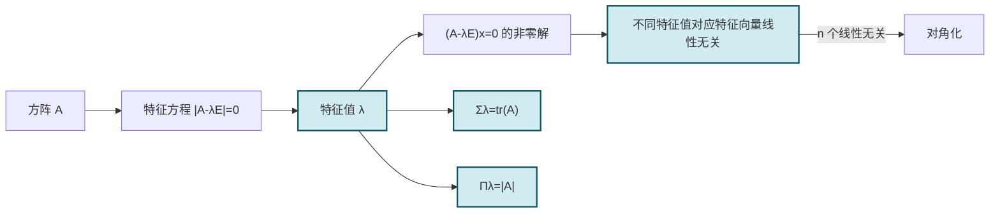

# 5.2 方阵特征值与特征向量

> [!info] 本节定位
> 方阵 $A$ 作用于向量 $x$ 一般会改变其方向与长度。但存在某些特殊方向，使 $A$ 作用后只发生伸缩（含反向），即 $Ax=\lambda x$。这种"方向不变"的向量刻画了 $A$ 的本质结构，称为**特征向量**，对应的伸缩比 $\lambda$ 称为**特征值**。本节要解决：
> 1. 如何系统求出 $n$ 阶方阵的全部特征值与特征向量？（特征方程 $|A-\lambda E|=0$）
> 2. 特征值之间有什么整体关系？（$\sum\lambda_i=\operatorname{tr}A$、$\prod\lambda_i=|A|$）
> 3. 不同特征值对应的特征向量有什么关系？（线性无关）
>
> 本节是 [[5.3 相似矩阵、矩阵可对角化条件|对角化]] 与 [[5.4 实对称矩阵对角化|实对称矩阵对角化]] 的原料准备，也是 [[5.6 正交变换化二次型为标准形|二次型化标准形]] 中标准形系数的来源。

## 一、特征值与特征向量的定义

> [!definition] 特征值与特征向量
> 设 $A$ 为 $n$ 阶方阵，若存在数 $\lambda$ 与非零向量 $x\in\mathbb{R}^n$（或 $\mathbb{C}^n$）使得
>
> $$\boxed{Ax=\lambda x,\quad x\ne0,}$$
>
> 则称 $\lambda$ 为 $A$ 的**特征值**（eigenvalue），$x$ 为 $A$ 的对应于 $\lambda$ 的**特征向量**（eigenvector）。
>
> **要点**：
> - 特征向量必须**非零**（零向量对任意 $\lambda$ 都满足 $A0=\lambda 0$，无信息）。
> - 若 $x$ 是对应 $\lambda$ 的特征向量，则 $kx$（$k\ne0$）也是，故特征向量不唯一；但特征向量集在数乘意义下可视为一条直线（一维特征子空间）。
> - $\lambda=0$ 时，$Ax=0$，即 $x\in N(A)$（$A$ 的零空间）；故 $A$ 有零特征值 $\Leftrightarrow$ $|A|=0$ $\Leftrightarrow$ $A$ 不可逆。

> [!note] 几何意义
> $Ax=\lambda x$ 表示 $x$ 在 $A$ 作用下方向不变（$\lambda>0$）或反向（$\lambda<0$），长度伸缩 $|\lambda|$ 倍。$\lambda=0$ 对应"被压缩为零"。

## 二、特征方程与特征多项式

> [!definition] 特征多项式与特征方程
> 方程 $Ax=\lambda x$ 等价于 $(A-\lambda E)x=0$。这是关于 $x$ 的齐次线性方程组，有非零解的充要条件是系数矩阵奇异，即
>
> $$\boxed{|A-\lambda E|=0.}$$
>
> 称 $f(\lambda)=|A-\lambda E|$ 为 $A$ 的**特征多项式**（$n$ 次多项式），方程 $|A-\lambda E|=0$ 为 $A$ 的**特征方程**。
>
> 特征方程的根即为 $A$ 的特征值。在复数域上 $n$ 次多项式恰有 $n$ 个根（计重数），故 $n$ 阶方阵在 $\mathbb{C}$ 上恰有 $n$ 个特征值（计代数重数）。

> [!definition] 代数重数与几何重数
> 设 $\lambda_0$ 是特征方程 $|A-\lambda E|=0$ 的 $k$ 重根，称 $k$ 为 $\lambda_0$ 的**代数重数**。
> 齐次方程组 $(A-\lambda_0 E)x=0$ 的基础解系所含向量数（即特征子空间 $V_{\lambda_0}=N(A-\lambda_0 E)$ 的维数）称为 $\lambda_0$ 的**几何重数**，记 $g(\lambda_0)=n-\operatorname{rank}(A-\lambda_0 E)$。
>
> 恒有 $1\le g(\lambda_0)\le a(\lambda_0)$（几何重数不超过代数重数），证明见 [[5.3 相似矩阵、矩阵可对角化条件]]。

## 三、特征值的整体性质

> [!theorem] 特征值的基本性质
> 设 $n$ 阶方阵 $A$ 的特征值为 $\lambda_1,\lambda_2,\cdots,\lambda_n$（计代数重数），则：
>
> 1. **迹等于特征值之和**：$\operatorname{tr}A=a_{11}+a_{22}+\cdots+a_{nn}=\sum_{i=1}^n\lambda_i$。
> 2. **行列式等于特征值之积**：$|A|=\prod_{i=1}^n\lambda_i$。
> 3. **$A^k$ 的特征值**：$A^k$ 的特征值为 $\lambda_1^k,\cdots,\lambda_n^k$（$k$ 为正整数）。
> 4. **$A$ 可逆 $\Leftrightarrow$ $0$ 不是特征值**：由 $|A|=\prod\lambda_i$。
> 5. **多项式矩阵特征值**：若 $\varphi(t)=c_mt^m+\cdots+c_0$，则 $\varphi(A)$ 的特征值为 $\varphi(\lambda_1),\cdots,\varphi(\lambda_n)$。
> 6. **$A^{-1}$ 的特征值**（$A$ 可逆时）：$A^{-1}$ 的特征值为 $\dfrac{1}{\lambda_1},\cdots,\dfrac{1}{\lambda_n}$。
> 7. **$A^*$ 的特征值**（$A$ 可逆时）：$A^*=|A|A^{-1}$，特征值为 $\dfrac{|A|}{\lambda_1},\cdots,\dfrac{|A|}{\lambda_n}$。

> [!proof] 迹与行列式公式
> 设 $f(\lambda)=|A-\lambda E|=(-\lambda)^n+c_1(-\lambda)^{n-1}+\cdots+c_{n-1}(-\lambda)+c_n$。
> - **常数项**：$f(0)=|A|=c_n=\prod\lambda_i$（韦达定理：根之积）。
> - **$\lambda^{n-1}$ 项系数**：按特征多项式的展开，$c_1=\operatorname{tr}A$；而韦达定理给出 $c_1=\sum\lambda_i$。故 $\sum\lambda_i=\operatorname{tr}A$。
>
> 更直接地：$|A-\lambda E|$ 中 $(-\lambda)^{n-1}$ 项只能来自主对角元的乘积 $(a_{11}-\lambda)(a_{22}-\lambda)\cdots(a_{nn}-\lambda)$ 展开，系数为 $-(a_{11}+a_{22}+\cdots+a_{nn})=-\operatorname{tr}A$；而由韦达定理，该系数为 $-\sum\lambda_i$。

> [!proof] $A^k$ 的特征值
> 设 $Ax=\lambda x$（$x\ne0$）。则 $A^2x=A(Ax)=A(\lambda x)=\lambda Ax=\lambda^2 x$。归纳得 $A^k x=\lambda^k x$，故 $\lambda^k$ 是 $A^k$ 的特征值。重数由多项式根的重数与 Jordan 形式保证（本课程只要求掌握此对应关系）。

## 四、不同特征值对应特征向量的线性无关性

> [!theorem] 不同特征值对应特征向量线性无关
> 设 $\lambda_1,\lambda_2,\cdots,\lambda_m$ 是方阵 $A$ 的 $m$ 个**互不相同**的特征值，$x_1,x_2,\cdots,x_m$ 是对应的特征向量，则 $x_1,x_2,\cdots,x_m$ 线性无关。

> [!proof]
> 对 $m$ 归纳。$m=1$ 时 $x_1\ne0$，线性无关。设 $m-1$ 个互异特征值对应特征向量线性无关。
> 设 $\sum_{i=1}^m k_i x_i=0$。两边左乘 $A$：$\sum k_i Ax_i=\sum k_i\lambda_i x_i=0$。
> 另一方面，用 $\lambda_m$ 乘原式：$\sum k_i\lambda_m x_i=0$。
> 两式相减：$\sum_{i=1}^{m-1} k_i(\lambda_i-\lambda_m)x_i=0$。由归纳假设 $x_1,\cdots,x_{m-1}$ 线性无关，故 $k_i(\lambda_i-\lambda_m)=0$。因 $\lambda_i\ne\lambda_m$，得 $k_i=0$（$i=1,\cdots,m-1$）。代回原式得 $k_m x_m=0$，$x_m\ne0$，故 $k_m=0$。
> 故 $x_1,\cdots,x_m$ 线性无关。

> [!corollary] 推论
> 若 $n$ 阶方阵 $A$ 有 $n$ 个互异特征值，则它有 $n$ 个线性无关的特征向量，故 $A$ 可对角化（见 [[5.3 相似矩阵、矩阵可对角化条件]]）。

## 五、求特征值与特征向量的步骤

> [!summary] 标准求解流程
> 给定 $n$ 阶方阵 $A$：
> 1. **写出特征方程** $|A-\lambda E|=0$。
> 2. **解特征方程**，得全部特征值 $\lambda_1,\cdots,\lambda_n$（计重数）。
> 3. **对每个特征值 $\lambda_i$**，解齐次方程组 $(A-\lambda_i E)x=0$：
>    - 化系数矩阵 $A-\lambda_i E$ 为行最简形；
>    - 求基础解系 $\xi_1,\cdots,\xi_{r_i}$，则 $V_{\lambda_i}=\operatorname{span}\{\xi_1,\cdots,\xi_{r_i}\}$。
> 4. **特征向量为** $k_1\xi_1+\cdots+k_{r_i}\xi_{r_i}$（$k$ 不全为零）。

> [!example] 例题 1　三阶矩阵特征值与特征向量
> 求 $A=\begin{pmatrix}1&-1&2\\0&2&0\\0&0&3\end{pmatrix}$ 的特征值与特征向量。
>
> > [!check]- 解答
> > 上三角矩阵的特征值即主对角元：$\lambda_1=1$，$\lambda_2=2$，$\lambda_3=3$。
> > （验证：$|A-\lambda E|=(1-\lambda)(2-\lambda)(3-\lambda)$。）
> >
> > - **$\lambda_1=1$**：$(A-E)x=0$，$A-E=\begin{pmatrix}0&-1&2\\0&1&0\\0&0&2\end{pmatrix}\to\begin{pmatrix}0&1&0\\0&0&1\\0&0&0\end{pmatrix}$，$\operatorname{rank}=2$，$r_1=3-2=1$。
> >   令 $x_1=t$，则 $x_2=0,x_3=0$，基础解系 $\xi_1=(1,0,0)^T$。
> > - **$\lambda_2=2$**：$(A-2E)x=0$，$A-2E=\begin{pmatrix}-1&-1&2\\0&0&0\\0&0&1\end{pmatrix}\to\begin{pmatrix}1&1&0\\0&0&1\\0&0&0\end{pmatrix}$，$r_2=1$。
> >   令 $x_2=t$，则 $x_1=-t,x_3=0$，基础解系 $\xi_2=(-1,1,0)^T$。
> > - **$\lambda_3=3$**：$(A-3E)x=0$，$A-3E=\begin{pmatrix}-2&-1&2\\0&-1&0\\0&0&0\end{pmatrix}\to\begin{pmatrix}1&0&-1\\0&1&0\\0&0&0\end{pmatrix}$，$r_3=1$。
> >   令 $x_3=t$，则 $x_1=t,x_2=0$，基础解系 $\xi_3=(1,0,1)^T$。
> >
> > 校验：$\sum\lambda_i=1+2+3=6=\operatorname{tr}A=1+2+3$ ✓，$\prod\lambda_i=6=|A|=1\cdot2\cdot3$ ✓。

> [!example] 例题 2　含重根的特征值计算
> 求 $A=\begin{pmatrix}3&-1\\1&1\end{pmatrix}$ 的特征值与特征向量，并指出其代数重数与几何重数。
>
> > [!check]- 解答
> > 特征方程：$|A-\lambda E|=\begin{vmatrix}3-\lambda&-1\\1&1-\lambda\end{vmatrix}=(3-\lambda)(1-\lambda)+1=\lambda^2-4\lambda+4=(\lambda-2)^2=0$。
> > $\lambda=2$（二重），代数重数 $a(2)=2$。
> >
> > $(A-2E)x=0$：$A-2E=\begin{pmatrix}1&-1\\1&-1\end{pmatrix}\to\begin{pmatrix}1&-1\\0&0\end{pmatrix}$，$\operatorname{rank}=1$，几何重数 $g(2)=2-1=1<a(2)=2$。
> > 基础解系 $\xi=(1,1)^T$。
> >
> > **关键结论**：代数重数 $2>$ 几何重数 $1$，特征向量个数不足 $2$ 个，$A$ 不可对角化。这是 [[5.3 相似矩阵、矩阵可对角化条件|对角化判定]] 的反例原型。

> [!example] 例题 3　利用整体性质反求元素
> 设 $A=\begin{pmatrix}1&2&3\\x&y&z\\0&0&2\end{pmatrix}$，已知 $A$ 的特征值为 $1,2,3$，求 $x,y,z$。
>
> > [!check]- 解答
> > 由迹：$\operatorname{tr}A=1+y+2=\sum\lambda_i=1+2+3=6$，故 $y=3$。
> > 由行列式：$|A|=2( y-2x)=2(3-2x)=\prod\lambda_i=6$，故 $3-2x=3$，$x=0$。
> > 再用第三个特征值 $3$：$A-3E=\begin{pmatrix}-2&2&3\\0&0&z\\0&0&-1\end{pmatrix}$，$|A-3E|=(-2)(0-0\cdot z)=0$ 自动满足，需用特征向量信息：$(A-3E)x=0$ 应有非零解，已满足。
> >
> > 实际上由 $|A-\lambda E|$ 展开得 $|A-\lambda E|=(2-\lambda)\big[(1-\lambda)(y-\lambda)-2x\big]$，根为 $2$ 与 $(1+y)\pm\sqrt{(1-y)^2+8x}$ 的两项；令根为 $1,3$ 解得 $y=3,x=0$。$z$ 可任取（仅影响特征向量，不影响特征值）。题目若要求唯一解需补充信息。

## 六、易错点与说明

> [!warning] 常见误区
> 1. **特征向量取零向量**：定义要求 $x\ne0$，零向量不是任何特征值的特征向量。
> 2. **混淆 $|A-\lambda E|$ 与 $|\lambda E-A|$**：二者差一个 $(-1)^n$ 因子，根相同；但按课本习惯多数用 $|A-\lambda E|$。
> 3. **认为重根只有一个特征向量**：重根对应的特征子空间维数 $\le$ 重数，但可以等于重数（如 $A=E$ 时 $n$ 重根 $1$，特征子空间维数 $n$）。
> 4. **忘记 $A$ 与 $A^T$ 有相同特征值**：$|A-\lambda E|=|A^T-\lambda E|$，但特征向量一般不同。
> 5. **实矩阵可能有复特征值**：如旋转矩阵 $\begin{pmatrix}0&-1\\1&0\end{pmatrix}$ 特征值为 $\pm i$。本课程若不涉及复数，此类矩阵视为不可对角化（实数范围内）。
> 6. **用 $\sum\lambda_i=\operatorname{tr}A$ 时漏算重数**：$\lambda=2$ 是二重根时，求和应写 $2+2+\cdots$，不是只加一次。

## 本节小结

| 命题 | 结论 |
| ---- | ---- |
| 定义 | $Ax=\lambda x$，$x\ne0$ |
| 特征方程 | $\|A-\lambda E\|=0$ |
| 特征多项式 | $f(\lambda)=\|A-\lambda E\|$，$n$ 次 |
| 迹公式 | $\sum\lambda_i=\operatorname{tr}A$ |
| 行列式公式 | $\|A\|=\prod\lambda_i$ |
| $A^k$ 特征值 | $\lambda_i^k$ |
| $A^{-1}$ 特征值 | $1/\lambda_i$（$A$ 可逆） |
| 几何重数 $\le$ 代数重数 | $1\le g\le a$ |
| 不同特征值 | 对应特征向量线性无关 |

## 章节导航

- 返回：[[MOC - 第5章]]
- 上一节：[[5.1 向量内积、正交向量组、正交矩阵]]
- 下一节：[[5.3 相似矩阵、矩阵可对角化条件]]
- 关联：[[5.4 实对称矩阵对角化]]（实对称矩阵特征值的实性） · [[5.6 正交变换化二次型为标准形]]（标准形系数即特征值） · [[2.6 伴随矩阵]]（$A^*$ 特征值）

## 相关标签

#线性代数 #特征值 #特征向量 #特征多项式 #特征方程
