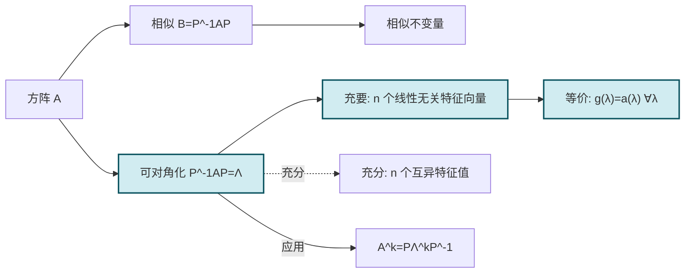

# 5.3 相似矩阵、矩阵可对角化条件

> [!info] 本节定位
> [[5.2 方阵特征值与特征向量|特征值与特征向量]] 给出了"方向不变"的特殊向量。当 $A$ 拥有足够多（$n$ 个线性无关）的特征向量时，可以用它们作为新基，使 $A$ 在新基下表现为对角矩阵——这就是**矩阵可对角化**。本节要解决：
> 1. **相似关系** $B=P^{-1}AP$ 的代数与几何含义是什么？哪些量在相似下不变？
> 2. **什么样的方阵可对角化**？充要条件是"$n$ 个线性无关特征向量"，等价于"每个特征值的几何重数等于代数重数"。
> 3. **如何具体构造对角化**？取 $P=(x_1,\cdots,x_n)$，使 $P^{-1}AP=\operatorname{diag}(\lambda_1,\cdots,\lambda_n)$。
>
> 本节是一般对角化理论，[[5.4 实对称矩阵对角化|实对称矩阵对角化]] 是其特例（实对称矩阵必可对角化，且可用正交矩阵）。

## 一、相似矩阵的定义

> [!definition] 相似矩阵
> 设 $A,B$ 为 $n$ 阶方阵，若存在**可逆**矩阵 $P$ 使得
>
> $$\boxed{B=P^{-1}AP,}$$
>
> 则称 $A$ 与 $B$ **相似**，记作 $A\sim B$（或 $A\backsimeq B$）。
>
> **说明**：
> - $P$ 必须可逆，否则 $P^{-1}$ 无定义。
> - 相似关系刻画"同一线性变换在不同基下的矩阵表示"——换基矩阵 $P$ 把 $A$ 变为 $B$。
> - $B=P^{-1}AP$ 等价于 $AP=PB$，便于记忆。

> [!property] 相似关系的基本性质
> 相似关系是 $n$ 阶方阵集合上的等价关系，即满足：
> 1. **反身性**：$A\sim A$（取 $P=E$）。
> 2. **对称性**：若 $A\sim B$ 则 $B\sim A$（$B=P^{-1}AP\Rightarrow A=PBP^{-1}$，$P^{-1}$ 可逆）。
> 3. **传递性**：若 $A\sim B$，$B\sim C$，则 $A\sim C$（$B=P^{-1}AP$，$C=Q^{-1}BQ\Rightarrow C=(PQ)^{-1}A(PQ)$）。

## 二、相似矩阵的不变量

> [!theorem] 相似矩阵的相似不变量
> 若 $A\sim B$（即 $B=P^{-1}AP$），则：
>
> 1. **特征多项式相同**：$|A-\lambda E|=|B-\lambda E|$。
> 2. **特征值相同**（含重数）：$\lambda_1,\cdots,\lambda_n$ 一致。
> 3. **迹相同**：$\operatorname{tr}A=\operatorname{tr}B$。
> 4. **行列式相同**：$|A|=|B|$。
> 5. **秩相同**：$\operatorname{rank}A=\operatorname{rank}B$。
> 6. **可逆性相同**：$A$ 可逆 $\Leftrightarrow$ $B$ 可逆。
> 7. **多项式保持相似**：$\varphi(A)\sim\varphi(B)$；特别 $A^k\sim B^k$，$A^{-1}\sim B^{-1}$（可逆时）。

> [!proof] 特征多项式相同
> $|B-\lambda E|=|P^{-1}AP-\lambda E|=|P^{-1}AP-P^{-1}\lambda E P|=|P^{-1}(A-\lambda E)P|=|P^{-1}|\cdot|A-\lambda E|\cdot|P|=|A-\lambda E|$。
> （最后用 $|P^{-1}||P|=1$。）

> [!proof] 行列式与迹相同
> 由特征多项式相同直接得到（行列式是常数项，迹是 $\lambda^{n-1}$ 项系数），见 [[5.2 方阵特征值与特征向量|特征值整体性质]]。

> [!warning] 逆命题不成立
> 以上各条均为必要条件，不是充分条件。例如 $A=\begin{pmatrix}1&1\\0&1\end{pmatrix}$ 与 $B=\begin{pmatrix}1&0\\0&1\end{pmatrix}=E$ 有相同的特征值、迹、行列式、秩，但二者不相似（$E$ 只与自己相似，因 $P^{-1}EP=E$）。

## 三、矩阵可对角化的定义

> [!definition] 可对角化
> 设 $A$ 为 $n$ 阶方阵，若存在可逆矩阵 $P$ 与对角矩阵 $\Lambda=\operatorname{diag}(\lambda_1,\cdots,\lambda_n)$ 使得
>
> $$\boxed{P^{-1}AP=\Lambda,}$$
>
> 则称 $A$ **可对角化**（或称 $A$ 相似于对角矩阵）。
>
> 等价地，$AP=P\Lambda$，即 $A$ 的列是 $P$ 的列，满足 $Ax_i=\lambda_i x_i$。

> [!note] 几何意义
> 可对角化意味着存在一组基（$P$ 的列向量），使线性变换 $A$ 在该基下的矩阵为对角形——这组基恰由 $A$ 的 $n$ 个线性无关特征向量构成。

## 四、可对角化的充要条件

> [!theorem] 可对角化的充要条件
> $n$ 阶方阵 $A$ 可对角化的充要条件是：$A$ 有 $n$ 个**线性无关**的特征向量。
>
> 此时 $P=(x_1,x_2,\cdots,x_n)$（由特征向量按列排成），$P^{-1}AP=\operatorname{diag}(\lambda_1,\lambda_2,\cdots,\lambda_n)$。

> [!proof]
> **必要性**：若 $P^{-1}AP=\Lambda=\operatorname{diag}(\lambda_1,\cdots,\lambda_n)$，则 $AP=P\Lambda$，按列分块 $P=(p_1,\cdots,p_n)$ 得 $Ap_i=\lambda_i p_i$。因 $P$ 可逆，$p_i$ 线性无关且非零，故 $p_1,\cdots,p_n$ 是 $A$ 的 $n$ 个线性无关特征向量。
>
> **充分性**：设 $x_1,\cdots,x_n$ 是 $A$ 的 $n$ 个线性无关特征向量，$Ax_i=\lambda_i x_i$。令 $P=(x_1,\cdots,x_n)$，$P$ 可逆。则 $AP=(Ax_1,\cdots,Ax_n)=(\lambda_1 x_1,\cdots,\lambda_n x_n)=P\Lambda$，故 $P^{-1}AP=\Lambda$。

> [!corollary] 等价条件：几何重数等于代数重数
> $A$ 可对角化的充要条件是：对每个特征值 $\lambda_i$，其**几何重数等于代数重数**，即
>
> $$g(\lambda_i)=a(\lambda_i),\quad\forall i.$$
>
> 等价地，每个特征子空间维数恰为对应特征值的重数。

> [!proof]
> 设 $A$ 的互异特征值为 $\mu_1,\cdots,\mu_s$，代数重数分别为 $a_1,\cdots,a_s$，$\sum a_i=n$。
> - 不同特征值对应的特征向量合并后仍线性无关（[[5.2 方阵特征值与特征向量|性质]]）。从每个特征子空间 $V_{\mu_i}$（维数 $g_i$）取一组基合并，得线性无关特征向量组，总数 $\sum g_i\le n$。
> - $A$ 有 $n$ 个线性无关特征向量 $\Leftrightarrow$ $\sum g_i=n$ $\Leftrightarrow$ $\sum g_i=\sum a_i=n$。
> - 因恒有 $g_i\le a_i$（几何重数不超过代数重数），故 $\sum g_i=\sum a_i$ $\Leftrightarrow$ 每个 $g_i=a_i$。

> [!note] 几何重数不超过代数重数
> $g\le a$ 的证明需要用到 Jordan 标准形或更深入的论证，本课程只要求掌握结论。直观上：$\lambda$ 是 $a$ 重根时，特征子空间至多 $a$ 维，可能因存在"广义特征向量"（次对角元）而严格小于 $a$。

## 五、可对角化的充分条件

> [!theorem] 充分条件：$n$ 个互异特征值
> 若 $n$ 阶方阵 $A$ 有 $n$ 个**互异**特征值，则 $A$ 可对角化。

> [!proof]
> 由 [[5.2 方阵特征值与特征向量|不同特征值对应特征向量线性无关]]，$n$ 个互异特征值对应 $n$ 个线性无关特征向量，故 $A$ 可对角化。

> [!warning] 这只是充分条件
> - 有重根也可能可对角化，例如 $A=E$（$n$ 重根 $1$，但 $n$ 个线性无关特征向量）。
> - 重根情况下需检查 $g=a$ 是否成立。

## 六、对角化的具体操作

> [!summary] 对角化步骤
> 给定 $n$ 阶方阵 $A$：
> 1. **求全部特征值**：解 $|A-\lambda E|=0$，得 $\lambda_1,\cdots,\lambda_n$（计重数）。
> 2. **求特征向量**：对每个 $\lambda_i$ 解 $(A-\lambda_i E)x=0$，取基础解系。
> 3. **检查线性无关**：合并各特征子空间的基，需得到 $n$ 个线性无关特征向量 $x_1,\cdots,x_n$。若不足 $n$ 个，则 $A$ 不可对角化。
> 4. **构造 $P$ 与 $\Lambda$**：$P=(x_1,\cdots,x_n)$，$\Lambda=\operatorname{diag}(\lambda_1,\cdots,\lambda_n)$。
> 5. **验证**：$P^{-1}AP=\Lambda$。

> [!example] 例题 1　可对角化矩阵
> 判断 $A=\begin{pmatrix}4&2\\-1&1\end{pmatrix}$ 是否可对角化，若可，求 $P$ 与 $\Lambda$。
>
> > [!check]- 解答
> > 特征方程：$|A-\lambda E|=(4-\lambda)(1-\lambda)+2=\lambda^2-5\lambda+6=(\lambda-2)(\lambda-3)=0$。
> > $\lambda_1=2$，$\lambda_2=3$（互异），故 $A$ 可对角化。
> >
> > - $\lambda_1=2$：$(A-2E)x=0$，$A-2E=\begin{pmatrix}2&2\\-1&-1\end{pmatrix}\to\begin{pmatrix}1&1\\0&0\end{pmatrix}$，$x_1=(1,-1)^T$。
> > - $\lambda_2=3$：$(A-3E)x=0$，$A-3E=\begin{pmatrix}1&2\\-1&-2\end{pmatrix}\to\begin{pmatrix}1&2\\0&0\end{pmatrix}$，$x_2=(-2,1)^T$。
> >
> > $P=(x_1,x_2)=\begin{pmatrix}1&-2\\-1&1\end{pmatrix}$，$\Lambda=\operatorname{diag}(2,3)$。
> > 校验：$|P|=1-2=-1\ne0$，可逆。$AP=\begin{pmatrix}4&2\\-1&1\end{pmatrix}\begin{pmatrix}1&-2\\-1&1\end{pmatrix}=\begin{pmatrix}2&-6\\-2&3\end{pmatrix}$，$P\Lambda=\begin{pmatrix}1&-2\\-1&1\end{pmatrix}\begin{pmatrix}2&0\\0&3\end{pmatrix}=\begin{pmatrix}2&-6\\-2&3\end{pmatrix}$ ✓。

> [!example] 例题 2　不可对角化矩阵
> 判断 $A=\begin{pmatrix}1&1\\0&1\end{pmatrix}$ 是否可对角化。
>
> > [!check]- 解答
> > $|A-\lambda E|=(1-\lambda)^2=0$，$\lambda=1$（二重），代数重数 $a(1)=2$。
> > $A-E=\begin{pmatrix}0&1\\0&0\end{pmatrix}$，$\operatorname{rank}=1$，几何重数 $g(1)=2-1=1<2=a(1)$。
> > 几何重数 $<$ 代数重数，$A$ 不可对角化。
> >
> > **本质原因**：$A=E+N$，其中 $N=\begin{pmatrix}0&1\\0&0\end{pmatrix}$ 是幂零部分，不可消除。

> [!example] 例题 3　含重根但可对角化
> 判断 $A=\begin{pmatrix}1&0&0\\0&2&0\\0&0&2\end{pmatrix}$ 的可对角化性。
>
> > [!check]- 解答
> > $A$ 已是对角矩阵，故 $P=E$ 即可使 $P^{-1}AP=A$，当然可对角化。
> >
> > 特征值 $\lambda_1=1$（单），$\lambda_2=2$（二重）。
> > - $\lambda_1=1$：$(A-E)x=0$，基础解系 $x_1=(1,0,0)^T$。
> > - $\lambda_2=2$：$(A-2E)x=0$，$A-2E=\operatorname{diag}(-1,0,0)$，基础解系 $x_2=(0,1,0)^T$、$x_3=(0,0,1)^T$（二维）。
> >
> > $g(2)=2=a(2)$，故可对角化。$P=(x_1,x_2,x_3)=E$，$\Lambda=A$。
> >
> > **对比** [[#例题 2]] 中 $g(1)=1<2=a(1)$，二者差异在于特征子空间维数。

## 七、对角化的应用

> [!property] 利用对角化计算矩阵的幂
> 若 $A$ 可对角化，$P^{-1}AP=\Lambda$，则 $A=P\Lambda P^{-1}$，从而
>
> $$A^k=P\Lambda^k P^{-1},\quad k\in\mathbb{Z}^+.$$
>
> 其中 $\Lambda^k=\operatorname{diag}(\lambda_1^k,\cdots,\lambda_n^k)$ 易于计算。这是对角化的主要计算应用。

> [!example] 例题 4　利用对角化求高次幂
> 设 $A=\begin{pmatrix}4&2\\-1&1\end{pmatrix}$，求 $A^{10}$。
>
> > [!check]- 解答
> > 由 [[#例题 1]]，$P=\begin{pmatrix}1&-2\\-1&1\end{pmatrix}$，$\Lambda=\operatorname{diag}(2,3)$，$P^{-1}=\dfrac{1}{-1}\begin{pmatrix}1&2\\1&1\end{pmatrix}=\begin{pmatrix}-1&-2\\-1&-1\end{pmatrix}$。
> > $$A^{10}=P\Lambda^{10}P^{-1}=\begin{pmatrix}1&-2\\-1&1\end{pmatrix}\begin{pmatrix}2^{10}&0\\0&3^{10}\end{pmatrix}\begin{pmatrix}-1&-2\\-1&-1\end{pmatrix}.$$
> > $\Lambda^{10}=\operatorname{diag}(1024,59049)$。
> > $$A^{10}=\begin{pmatrix}1024&-118098\\-1024&59049\end{pmatrix}\begin{pmatrix}-1&-2\\-1&-1\end{pmatrix}=\begin{pmatrix}-1024+118098&-2048+118098\\1024-59049&2048-59049\end{pmatrix}.$$
> > $=\begin{pmatrix}117074&116050\\-58025&-57001\end{pmatrix}$。

## 八、易错点与说明

> [!warning] 常见误区
> 1. **$P$ 的列顺序与 $\Lambda$ 的对角元顺序对应**：$P=(x_1,x_2)$ 对应 $\Lambda=\operatorname{diag}(\lambda_1,\lambda_2)$；调换列顺序需同步调换 $\Lambda$。
> 2. **特征值相同但矩阵不相似**：特征多项式、迹、行列式相同都是必要条件，不充分。需验证是否存在可逆 $P$。
> 3. **重根不一定不可对角化**：重根可对角化要求 $g=a$，重根可对角化的例子见 [[#例题 3]]。
> 4. **$P$ 不可逆时不能写 $P^{-1}AP$**：构造 $P$ 时必须确保列向量线性无关。
> 5. **实矩阵在实数域不可对角化不等于不可对角化**：允许复数域时可对角化（如旋转矩阵 $\begin{pmatrix}0&-1\\1&0\end{pmatrix}$ 在 $\mathbb{C}$ 上有特征值 $\pm i$）。本课程默认在 $\mathbb{R}$ 上讨论。

## 本节小结

| 命题 | 结论 |
| ---- | ---- |
| 相似定义 | $B=P^{-1}AP$，$P$ 可逆 |
| 相似不变量 | 特征多项式、特征值、迹、行列式、秩 |
| 可对角化定义 | $P^{-1}AP=\Lambda$（对角矩阵） |
| 充要条件 | $A$ 有 $n$ 个线性无关特征向量 |
| 等价充要 | $g(\lambda_i)=a(\lambda_i)$，$\forall i$ |
| 充分条件 | $n$ 个互异特征值 |
| 应用 | $A^k=P\Lambda^k P^{-1}$ |

## 章节导航

- 返回：[[MOC - 第5章]]
- 上一节：[[5.2 方阵特征值与特征向量]]
- 下一节：[[5.4 实对称矩阵对角化]]
- 关联：[[5.4 实对称矩阵对角化]]（实对称矩阵必然可对角化） · [[5.6 正交变换化二次型为标准形]]（对称矩阵正交对角化即二次型化标准形） · [[2.4 逆矩阵]]（构造 $P$ 需要逆矩阵）

## 相关标签

#线性代数 #相似矩阵 #对角化 #可对角化条件
