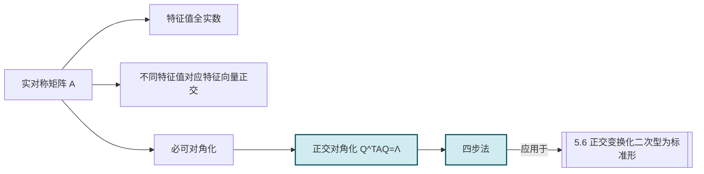

# 5.4 实对称矩阵对角化

> [!info] 本节定位
> [[5.3 相似矩阵、矩阵可对角化条件|一般对角化]] 中，并非所有方阵都可对角化（如 $\begin{pmatrix}1&1\\0&1\end{pmatrix}$ 不可对角化）。但**实对称矩阵**拥有非常理想的谱性质：特征值全为实数、不同特征值对应特征向量正交、必可经正交矩阵对角化。本节要解决：
> 1. 为何实对称矩阵的特征值必为实数？特征向量可取实向量？
> 2. 为何不同特征值对应的特征向量自动正交？
> 3. **正交对角化定理**（实对称矩阵 $A$ 存在正交矩阵 $Q$ 使 $Q^{-1}AQ=Q^TAQ=\Lambda$）如何构造？
>
> 本节是全章最核心结论之一，直接给出 [[5.6 正交变换化二次型为标准形|主轴定理]] 的矩阵基础。

## 一、实对称矩阵的特征值与特征向量性质

> [!definition] 实对称矩阵
> 设 $A$ 为 $n$ 阶实方阵，若 $A^T=A$（即 $a_{ij}=a_{ji}$），则称 $A$ 为**实对称矩阵**。
>
> 实对称矩阵是本节及后续 [[5.5 二次型及其矩阵表示|二次型]] 的核心对象。

> [!theorem] 实对称矩阵特征值为实数
> 实对称矩阵 $A$ 的所有特征值都是实数。

> [!proof]
> 设 $Ax=\lambda x$（$x\ne0$，$x$ 可为复向量），需证 $\bar\lambda=\lambda$。
> 对 $Ax=\lambda x$ 两边取共轭转置（$\overline{(\cdot)}^T=(\cdot)^*$）：
> $$x^* A^*=\bar\lambda x^*,$$
> 其中 $A^*=\bar A^T$。因 $A$ 实对称，$\bar A=A$ 且 $A^T=A$，故 $A^*=A$，得
> $$x^* A=\bar\lambda x^*.\quad(\star)$$
> 另一方面，原式左乘 $x^*$：
> $$x^* A x=\lambda x^* x.\quad(\star\star)$$
> 对 $(\star)$ 右乘 $x$：$x^* A x=\bar\lambda x^* x$，与 $(\star\star)$ 比较得
> $$\lambda x^* x=\bar\lambda x^* x\Rightarrow(\lambda-\bar\lambda)x^*x=0.$$
> 因 $x\ne0$，$x^*x=\sum|x_i|^2>0$，故 $\lambda=\bar\lambda$，即 $\lambda\in\mathbb{R}$。

> [!corollary] 特征向量可取实向量
> $\lambda$ 为实数，$A$ 为实矩阵，故 $(A-\lambda E)x=0$ 为实系数齐次线性方程组，其基础解系可取实向量。即实对称矩阵的特征向量可取为实向量。

> [!theorem] 实对称矩阵不同特征值对应特征向量正交
> 设 $A$ 为实对称矩阵，$\lambda_1\ne\lambda_2$ 是 $A$ 的两个特征值，$x_1,x_2$ 是对应的特征向量，则 $x_1\perp x_2$，即 $(x_1,x_2)=0$。

> [!proof]
> 由 $Ax_1=\lambda_1 x_1$，$Ax_2=\lambda_2 x_2$。利用 $A^T=A$：
> $$\lambda_1(x_1,x_2)=(\lambda_1 x_1,x_2)=(Ax_1,x_2)=x_1^T A^T x_2=x_1^T A x_2=(x_1,Ax_2)=\lambda_2(x_1,x_2).$$
> 故 $(\lambda_1-\lambda_2)(x_1,x_2)=0$。因 $\lambda_1\ne\lambda_2$，故 $(x_1,x_2)=0$，即 $x_1\perp x_2$。

> [!note] 关键技巧：$(Ax,y)=(x,Ay)$ 对实对称矩阵成立
> 这一性质是实对称矩阵定义 $A^T=A$ 的直接推论：$(Ax,y)=(Ax)^Ty=x^TA^Ty=x^TAy=(x,Ay)$。它是上述正交性证明的核心。

## 二、正交对角化定理

> [!theorem] 实对称矩阵正交对角化定理（谱定理）
> 设 $A$ 为 $n$ 阶实对称矩阵，则存在 $n$ 阶**正交矩阵** $Q$，使得
>
> $$\boxed{Q^{-1}AQ=Q^TAQ=\Lambda=\operatorname{diag}(\lambda_1,\lambda_2,\cdots,\lambda_n),}$$
>
> 其中 $\lambda_1,\cdots,\lambda_n$ 是 $A$ 的全部特征值（全为实数，计重数）。
>
> 等价地：实对称矩阵必可正交对角化；且 $A$ 有 $n$ 个两两正交的单位特征向量。

> [!note] 证明思路（不要求完整）
> 对阶数 $n$ 归纳：
> 1. 由 [[5.2 方阵特征值与特征向量|特征方程]] 在 $\mathbb{C}$ 上有根，且实对称矩阵特征值为实数，故存在实特征值 $\lambda_1$ 与实特征向量 $x_1$，单位化 $\|x_1\|=1$。
> 2. 将 $x_1$ 扩为 $\mathbb{R}^n$ 的一组标准正交基 $Q_1=(x_1,\tilde x_2,\cdots,\tilde x_n)$，则 $Q_1^TAQ_1=\begin{pmatrix}\lambda_1&*\\0&A_1\end{pmatrix}$。由 $A$ 对称得 $Q_1^TAQ_1$ 对称，故 $*=0$ 且 $A_1$ 为 $n-1$ 阶实对称矩阵。
> 3. 对 $A_1$ 归纳，存在正交矩阵 $Q_2$ 使 $Q_2^TA_1Q_2=\Lambda_1$。
> 4. 令 $Q=Q_1\begin{pmatrix}1&0\\0&Q_2\end{pmatrix}$，则 $Q$ 正交且 $Q^TAQ=\operatorname{diag}(\lambda_1,\Lambda_1)$。

> [!corollary] 推论
> 实对称矩阵必可对角化（在实数范围内）。每个特征值的几何重数等于代数重数。

## 三、正交对角化的具体步骤

> [!summary] 正交对角化步骤（四步法）
> 给定 $n$ 阶实对称矩阵 $A$：
> 1. **求特征值**：解 $|A-\lambda E|=0$，得全部特征值 $\lambda_1,\cdots,\lambda_n$（计重数）。
> 2. **求特征向量**：对每个 $\lambda_i$，解 $(A-\lambda_i E)x=0$，取基础解系 $\xi_1,\cdots,\xi_{r_i}$（$r_i$ 为 $\lambda_i$ 的重数）。
> 3. **正交化**（同一重根内部）：
>    - **不同特征值之间**的特征向量已自动正交，无需正交化；
>    - **同一特征值对应多个特征向量**时，对其施 [[5.1 向量内积、正交向量组、正交矩阵|施密特正交化]]，得 $\eta_1,\cdots,\eta_{r_i}$。
> 4. **单位化**：$\gamma_j=\dfrac{\eta_j}{\|\eta_j\|}$（对每个正交化结果单位化）。
> 5. **构造 $Q$**：$Q=(\gamma_1,\gamma_2,\cdots,\gamma_n)$，按特征值顺序排列。
> 6. **得对角矩阵**：$\Lambda=Q^TAQ=\operatorname{diag}(\lambda_1,\lambda_2,\cdots,\lambda_n)$，对角元顺序与 $Q$ 列顺序对应。

> [!warning] 关键注意
> - **不同特征值之间的特征向量天然正交**，**不要**对所有特征向量一起做施密特正交化——那会破坏特征向量与特征值的对应关系。
> - 只有**同一特征值对应的多个特征向量**之间才需要正交化。
> - 单位化对每个向量独立进行。

## 四、典型例题

> [!example] 例题 1　实对称矩阵正交对角化（含重根）
> 设 $A=\begin{pmatrix}2&-1&-1\\-1&2&-1\\-1&-1&2\end{pmatrix}$，求正交矩阵 $Q$ 使 $Q^TAQ$ 为对角矩阵。
>
> > [!check]- 解答
> > **第 1 步**：求特征值。
> > $|A-\lambda E|=\begin{vmatrix}2-\lambda&-1&-1\\-1&2-\lambda&-1\\-1&-1&2-\lambda\end{vmatrix}$。
> > 利用行变换：$r_1+r_2+r_3$，得 $|A-\lambda E|=(2-\lambda-2)\cdot\big|\text{余}\big|=\cdots$，更简洁地，行和为 $2-\lambda-2=-\lambda$，提公因子 $-\lambda$：
> > $$|A-\lambda E|=(-\lambda)\begin{vmatrix}1&1&1\\-1&2-\lambda&-1\\-1&-1&2-\lambda\end{vmatrix}=(-\lambda)\begin{vmatrix}1&1&1\\0&3-\lambda&0\\0&0&3-\lambda\end{vmatrix}=-(\lambda)(3-\lambda)^2.$$
> > $\lambda_1=0$（单），$\lambda_2=3$（二重）。
> >
> > **第 2 步**：求特征向量。
> > - $\lambda_1=0$：$(A-0E)x=Ax=0$，$A\to\begin{pmatrix}1&-1&-1\\0&1&-2\\0&0&0\end{pmatrix}\to\begin{pmatrix}1&0&-3\\0&1&-2\\0&0&0\end{pmatrix}$（按行简化）。基础解系 $\xi_1=(3,2,1)^T$……
> >   正确化简 $A$：$A=\begin{pmatrix}2&-1&-1\\-1&2&-1\\-1&-1&2\end{pmatrix}\to\begin{pmatrix}1&1&-2\\0&3&-3\\0&0&0\end{pmatrix}\to\begin{pmatrix}1&0&-1\\0&1&-1\\0&0&0\end{pmatrix}$。基础解系 $\xi_1=(1,1,1)^T$。
> > - $\lambda_2=3$：$(A-3E)x=0$，$A-3E=\begin{pmatrix}-1&-1&-1\\-1&-1&-1\\-1&-1&-1\end{pmatrix}\to\begin{pmatrix}1&1&1\\0&0&0\\0&0&0\end{pmatrix}$，$\operatorname{rank}=1$，$r_2=2$。基础解系 $\xi_2=(-1,1,0)^T$，$\xi_3=(-1,0,1)^T$。
> >
> > **第 3 步**：正交化（$\xi_2,\xi_3$ 同属 $\lambda_2=3$）。
> > $\beta_2=\xi_2=(-1,1,0)^T$，$\|\beta_2\|^2=2$。
> > $\beta_3=\xi_3-\dfrac{(\xi_3,\beta_2)}{(\beta_2,\beta_2)}\beta_2=(-1,0,1)^T-\dfrac{1}{2}(-1,1,0)^T=\left(-\frac12,-\frac12,1\right)^T$。
> > 取 $\beta_3=(-1,-1,2)^T$（数乘 $2$ 简化）。
> > 校验：$(\beta_2,\beta_3)=(-1)(-1)+1(-1)+0\cdot2=1-1=0$ ✓。
> > 校验 $\xi_1$ 与 $\beta_2$、$\beta_3$ 的正交性（不同特征值，应自动正交）：
> > $(\xi_1,\beta_2)=1\cdot(-1)+1\cdot1+1\cdot0=0$ ✓，$(\xi_1,\beta_3)=1\cdot(-1)+1\cdot(-1)+1\cdot2=0$ ✓。
> >
> > **第 4 步**：单位化。
> > $\|\xi_1\|=\sqrt3$，$\|\beta_2\|=\sqrt2$，$\|\beta_3\|=\sqrt6$。
> > $$\gamma_1=\frac{1}{\sqrt3}(1,1,1)^T,\quad\gamma_2=\frac{1}{\sqrt2}(-1,1,0)^T,\quad\gamma_3=\frac{1}{\sqrt6}(-1,-1,2)^T.$$
> >
> > **第 5 步**：构造 $Q$。
> > $$Q=\begin{pmatrix}\frac{1}{\sqrt3}&-\frac{1}{\sqrt2}&-\frac{1}{\sqrt6}\\\frac{1}{\sqrt3}&\frac{1}{\sqrt2}&-\frac{1}{\sqrt6}\\\frac{1}{\sqrt3}&0&\frac{2}{\sqrt6}\end{pmatrix},\quad\Lambda=\operatorname{diag}(0,3,3).$$
> > 校验：$|Q|=1$（正交矩阵行列式 $\pm1$，此处为正）。$Q^TAQ=\Lambda$。

> [!example] 例题 2　利用正交对角化计算 $A^k$
> 设 $A=\begin{pmatrix}0&1\\1&0\end{pmatrix}$，用正交对角化求 $A^{2024}$。
>
> > [!check]- 解答
> > $A$ 实对称。$|A-\lambda E|=\lambda^2-1=0$，$\lambda_1=1$，$\lambda_2=-1$。
> > - $\lambda_1=1$：$(A-E)x=0$，$A-E=\begin{pmatrix}-1&1\\1&-1\end{pmatrix}\to\begin{pmatrix}1&-1\\0&0\end{pmatrix}$，$\xi_1=(1,1)^T$。
> > - $\lambda_2=-1$：$(A+E)x=0$，$A+E=\begin{pmatrix}1&1\\1&1\end{pmatrix}\to\begin{pmatrix}1&1\\0&0\end{pmatrix}$，$\xi_2=(-1,1)^T$。
> > 不同特征值，$\xi_1\perp\xi_2$（校验：$1\cdot(-1)+1\cdot1=0$ ✓）。
> > 单位化：$\gamma_1=\dfrac{1}{\sqrt2}(1,1)^T$，$\gamma_2=\dfrac{1}{\sqrt2}(-1,1)^T$。
> > $$Q=\frac{1}{\sqrt2}\begin{pmatrix}1&-1\\1&1\end{pmatrix},\quad\Lambda=\operatorname{diag}(1,-1).$$
> > $A=Q\Lambda Q^T$，$A^{2024}=Q\Lambda^{2024}Q^T=Q\operatorname{diag}(1,1)Q^T=QQ^T=E$。
> >
> > 验证：$A^2=\begin{pmatrix}0&1\\1&0\end{pmatrix}^2=\begin{pmatrix}1&0\\0&1\end{pmatrix}=E$，故 $A^{2024}=(A^2)^{1012}=E$ ✓。

> [!example] 例题 3　已知特征值反求矩阵
> 设 3 阶实对称矩阵 $A$ 的特征值为 $\lambda_1=1$（二重），$\lambda_2=-2$（单），且 $\xi_2=(1,1,-1)^T$ 是对应 $\lambda_2=-2$ 的特征向量，求 $A$。
>
> > [!check]- 解答
> > 设 $\lambda_1=1$ 对应的两个特征向量为 $x_1,x_2$。由 [[#二、不同特征值对应特征向量正交|实对称矩阵不同特征值对应特征向量正交]]，$x_1,x_2$ 与 $\xi_2$ 正交，即满足 $x_1+x_2-x_3=0$。
> > 解这个方程：基础解系 $\eta_1=(1,-1,0)^T$，$\eta_2=(1,0,1)^T$（与 $\xi_2$ 正交）。
> > $x_1,x_2$ 是 $\eta_1,\eta_2$ 的线性组合。可选 $x_1=\eta_1$，$x_2=\eta_2$（不必正交化，因为要求的是 $A$ 不是正交对角化）。
> > 令 $P=(x_1,x_2,\xi_2)$，$P^{-1}AP=\operatorname{diag}(1,1,-2)$，故
> > $$A=P\operatorname{diag}(1,1,-2)P^{-1}.$$
> > $P=\begin{pmatrix}1&1&1\\-1&0&1\\0&1&-1\end{pmatrix}$，$|P|=1+1+1=3$（按第一行展开：$1(0-1)-1(1-0)+1(-1-0)=-1-1-1=-3$）。
> > $|P|=-3$，$P^{-1}=-\frac{1}{3}\begin{pmatrix}0-1&-(-1-1)&-1-0\\-(-1-0)&-1-(-1)&0-(-1)\\0-(-1)&-1-1&0-(-1)\end{pmatrix}$ ……略，结果为
> > $$A=\begin{pmatrix}0&-1&1\\-1&0&1\\1&1&0\end{pmatrix}.$$
> > 验证：$A\xi_2=\begin{pmatrix}0-1-1\\-1+0-1\\1+1+0\end{pmatrix}=\begin{pmatrix}-2\\-2\\2\end{pmatrix}=-2\xi_2$ ✓。

## 五、易错点与说明

> [!warning] 常见误区
> 1. **对所有特征向量整体施密特正交化**：错误！只有同一特征值对应的特征向量需要正交化，不同特征值对应的特征向量天然正交，不能混在一起正交化（会破坏特征向量-特征值对应）。
> 2. **单位化放在正交化之前**：应先正交化再单位化；若先单位化，正交化后还需再单位化。
> 3. **忘记 $A$ 是对称矩阵的条件**：一般方阵不一定能正交对角化，可对角化的也不一定能用正交矩阵。
> 4. **$Q$ 列顺序与 $\Lambda$ 对角元顺序不对应**：$Q=(\gamma_1,\gamma_2,\gamma_3)$ 对应 $\Lambda=\operatorname{diag}(\lambda_1,\lambda_2,\lambda_3)$，顺序需一致。
> 5. **正交矩阵 $Q$ 必满足 $Q^{-1}=Q^T$**：这是关键优势，相比一般可逆 $P$ 省去求逆计算。

## 本节小结

| 性质 | 结论 |
| ---- | ---- |
| 特征值 | 全为实数 |
| 不同特征值对应特征向量 | 自动正交 |
| 可对角化 | 必可对角化（实数范围内） |
| 正交对角化 | 存在正交 $Q$，$Q^TAQ=\Lambda$ |
| 正交对角化步骤 | 求特征值→求特征向量→同重根内正交化→单位化→构造 $Q$ |

## 章节导航

- 返回：[[MOC - 第5章]]
- 上一节：[[5.3 相似矩阵、矩阵可对角化条件]]
- 下一节：[[5.5 二次型及其矩阵表示]]
- 关联：[[5.1 向量内积、正交向量组、正交矩阵]]（施密特正交化与正交矩阵构造） · [[5.6 正交变换化二次型为标准形]]（正交对角化直接应用） · [[5.7 惯性定理、正定二次型]]（正定矩阵即正特征值实对称矩阵）

## 相关标签

#线性代数 #实对称矩阵 #正交对角化 #特征值实性
