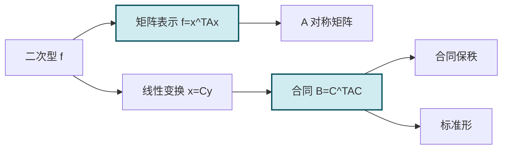

# 5.5 二次型及其矩阵表示

> [!info] 本节定位
> 前面建立了[[5.4 实对称矩阵对角化|实对称矩阵正交对角化]]理论。本节把这一理论应用于一个几何与代数交织的对象——**二次型**：一个 $n$ 元二次齐次多项式 $f(x_1,\cdots,x_n)$。本节要解决：
> 1. 如何把一个二次齐次多项式写成紧凑的矩阵形式 $f=x^TAx$？为何 $A$ 取**对称矩阵**？
> 2. 当作变量替换 $x=Cy$ 时，二次型的矩阵如何变化？引入**合同关系** $B=C^TAC$。
> 3. 合同关系与相似关系有何区别？合同下哪些量不变（秩）？
>
> 本节是二次型理论的入口，为 [[5.6 正交变换化二次型为标准形|化标准形]] 与 [[5.7 惯性定理、正定二次型|正定判定]] 奠定对象与语言。

## 一、二次型的定义

> [!definition] 二次型
> 含 $n$ 个变量 $x_1,x_2,\cdots,x_n$ 的二次齐次多项式
>
> $$\begin{aligned}f(x_1,x_2,\cdots,x_n)=&\ a_{11}x_1^2+2a_{12}x_1x_2+\cdots+2a_{1n}x_1x_n\\&+a_{22}x_2^2+2a_{23}x_2x_3+\cdots+2a_{2n}x_2x_n\\&\cdots\cdots\\&+a_{nn}x_n^2\end{aligned}$$
>
> 称为 $n$ 元**二次型**。其特点是每项次数都是 $2$（平方项或交叉项）。
>
> **说明**：
> - 交叉项系数写成 $2a_{ij}$（$i<j$），是为了使矩阵表示对称。
> - 只含平方项 $f=a_1x_1^2+\cdots+a_nx_n^2$ 的二次型称为**标准形**。
> - 当 $a_{ij}\in\mathbb{R}$ 时称为实二次型，本课程只讨论实二次型。

## 二、二次型的矩阵表示

> [!theorem] 二次型的矩阵表示
> 任一 $n$ 元二次型 $f$ 可唯一表示为
>
> $$\boxed{f(x_1,\cdots,x_n)=x^TAx,}$$
>
> 其中 $x=(x_1,\cdots,x_n)^T$，$A$ 为 $n$ 阶**对称矩阵**（$A^T=A$），称为 $f$ 的**矩阵**。具体地：
>
> $$A=\begin{pmatrix}a_{11}&a_{12}&\cdots&a_{1n}\\a_{12}&a_{22}&\cdots&a_{2n}\\\vdots&\vdots&\ddots&\vdots\\a_{1n}&a_{2n}&\cdots&a_{nn}\end{pmatrix},$$
>
> 即对角元 $a_{ii}$ 为平方项系数，非对角元 $a_{ij}=a_{ji}$ 为交叉项系数的一半。

> [!proof] 展开 $x^TAx$
> $x^TAx=\sum_{i=1}^n\sum_{j=1}^n a_{ij}x_ix_j=\sum_i a_{ii}x_i^2+\sum_{i<j}(a_{ij}+a_{ji})x_ix_j$。
> 若 $A$ 对称（$a_{ij}=a_{ji}$），交叉项系数为 $2a_{ij}$，正好对应二次型中 $2a_{ij}x_ix_j$。
> 故对每个二次型，存在唯一对称矩阵 $A$ 使 $f=x^TAx$。

> [!note] 为何要求 $A$ 对称
> - **唯一性**：若不要求对称，则 $A$ 不唯一（如 $\begin{pmatrix}1&1\\0&0\end{pmatrix}$ 与 $\begin{pmatrix}1&0\\1&0\end{pmatrix}$ 给出相同的 $f=x_1^2+2x_1x_2$ 中前者不对），但对称化后唯一。
> - **理论便利**：对称矩阵可应用 [[5.4 实对称矩阵对角化|正交对角化]]、[[5.7 惯性定理、正定二次型|惯性定理]] 等整套理论。

> [!definition] 二次型的秩
> 二次型 $f=x^TAx$ 的矩阵 $A$ 的秩 $\operatorname{rank}A$ 称为二次型的**秩**。

> [!example] 例题 1　写出二次型的矩阵
> 写出 $f=2x_1^2+3x_2^2-x_3^2+4x_1x_2-6x_2x_3$ 的矩阵 $A$。
>
> > [!check]- 解答
> > 平方项系数：$a_{11}=2$，$a_{22}=3$，$a_{33}=-1$。
> > 交叉项系数的一半：$4x_1x_2\Rightarrow a_{12}=a_{21}=2$；$-6x_2x_3\Rightarrow a_{23}=a_{32}=-3$；无 $x_1x_3$ 项 $\Rightarrow a_{13}=a_{31}=0$。
> > $$A=\begin{pmatrix}2&2&0\\2&3&-3\\0&-3&-1\end{pmatrix}.$$
> > 校验：$x^TAx=2x_1^2+(2+2)x_1x_2+(0+0)x_1x_3+3x_2^2+(-3-3)x_2x_3+(-1)x_3^2=2x_1^2+3x_2^2-x_3^2+4x_1x_2-6x_2x_3$ ✓。

## 三、线性变换与合同关系

> [!definition] 线性变换
> 设 $x=(x_1,\cdots,x_n)^T$，$y=(y_1,\cdots,y_n)^T$，$C$ 为 $n$ 阶方阵，称
>
> $$x=Cy$$
>
> 为变量 $x$ 到变量 $y$ 的**线性变换**。若 $|C|\ne0$（$C$ 可逆），称为**可逆线性变换**（或非退化线性变换）。

> [!theorem] 线性变换下二次型的矩阵变化
> 设 $f=x^TAx$，作可逆线性变换 $x=Cy$，则
>
> $$f=(Cy)^TA(Cy)=y^T(C^TAC)y=y^TBy,$$
>
> 其中 $B=C^TAC$。即变换后的二次型矩阵为 $B=C^TAC$。

> [!definition] 矩阵合同
> 设 $A,B$ 为 $n$ 阶方阵，若存在**可逆**矩阵 $C$ 使得
>
> $$\boxed{B=C^TAC,}$$
>
> 则称 $A$ 与 $B$ **合同**（contractible / congruent），记 $A\simeq B$。

> [!property] 合同关系的基本性质
> 合同关系是 $n$ 阶对称矩阵集合上的等价关系：
> 1. **反身性**：$A\simeq A$（取 $C=E$）。
> 2. **对称性**：$A\simeq B\Rightarrow B\simeq A$（$B=C^TAC\Rightarrow A=(C^{-1})^TBC^{-1}=(C^{-1})^T B (C^{-1})$，$C^{-1}$ 可逆）。
> 3. **传递性**：$A\simeq B$，$B\simeq D\Rightarrow A\simeq D$（$B=C_1^TAC_1$，$D=C_2^TBC_2=C_2^TC_1^TAC_1C_2=(C_1C_2)^TA(C_1C_2)$）。
>
> 此外，若 $A$ 对称且 $A\simeq B$，则 $B$ 也对称（$B^T=(C^TAC)^T=C^TA^TC=C^TAC=B$）。

> [!theorem] 合同不变量
> 若 $A\simeq B$（$B=C^TAC$，$C$ 可逆），则：
> 1. **秩相同**：$\operatorname{rank}A=\operatorname{rank}B$（因 $C,C^T$ 可逆，乘可逆矩阵不改变秩）。
> 2. **对称性相同**：$A$ 对称 $\Leftrightarrow$ $B$ 对称。
> 3. **正定性相同**：$A$ 正定 $\Leftrightarrow$ $B$ 正定（见 [[5.7 惯性定理、正定二次型]]）。
>
> 但 **特征值不一定相同**（这与相似关系不同！）。

> [!warning] 合同与相似的区别
> - 相似：$B=P^{-1}AP$（要求 $P^{-1}$ 左乘 $P$ 右乘）→ 特征值相同。
> - 合同：$B=C^TAC$（要求 $C^T$ 左乘 $C$ 右乘）→ 特征值不一定相同，但秩相同、惯性相同。
> - 当 $C$ 是正交矩阵（$C^T=C^{-1}$）时，合同与相似重合：$B=C^TAC=C^{-1}AC$。这是 [[5.6 正交变换化二次型为标准形|正交变换化标准形]] 的关键。

> [!example] 例题 2　合同但特征值不同
> 取 $A=\begin{pmatrix}1&0\\0&1\end{pmatrix}=E$，$C=\begin{pmatrix}2&0\\0&1\end{pmatrix}$（可逆），则 $B=C^TAC=\begin{pmatrix}4&0\\0&1\end{pmatrix}$。
> $A$ 特征值 $1,1$；$B$ 特征值 $4,1$。二者合同但特征值不同。
> 秩相同（均为 $2$），$A\simeq B$ 但 $A\not\sim B$。

## 四、化二次型为标准形的总思路

> [!summary] 化标准形的三条路径
> 给定二次型 $f=x^TAx$（$A$ 对称）：
>
> | 方法 | 变换 $x=?y$ | 结果矩阵 | 结果标准形 | 详见 |
> | ---- | ---- | ---- | ---- | ---- |
> | **正交变换法** | $x=Qy$，$Q$ 正交 | $Q^TAQ=\Lambda$（对角） | $\lambda_1y_1^2+\cdots+\lambda_ny_n^2$，$\lambda_i$ 为 $A$ 特征值 | [[5.6 正交变换化二次型为标准形]] |
> | **配方法** | $x=Cy$，$C$ 可逆 | $C^TAC=\Lambda$（对角） | $d_1y_1^2+\cdots+d_ny_n^2$，系数不唯一 | [[5.8 配方法、初等变换化标准形]] |
> | **初等变换法** | $x=Cy$，$C$ 可逆 | $C^TAC=\Lambda$（对角） | 同配方法，但 $C$ 通过初等变换构造 | [[5.8 配方法、初等变换化标准形]] |
>
> 三种方法所得标准形系数可能不同，但由 [[5.7 惯性定理、正定二次型|惯性定理]]，正惯性指数与负惯性指数相同。

## 五、典型例题

> [!example] 例题 3　化二次型为标准形（合同观点）
> 设 $f=2x_1x_2+2x_1x_3-2x_2x_3$，用配方法找一可逆线性变换 $x=Cy$ 将其化为标准形。
>
> > [!check]- 解答
> > 矩阵 $A=\begin{pmatrix}0&1&1\\1&0&-1\\1&-1&0\end{pmatrix}$。
> > $f$ 无平方项，先用线性变换产生平方项：令 $\begin{cases}x_1=y_1+y_2\\x_2=y_1-y_2\\x_3=y_3\end{cases}$，即 $x=C_1y$，$C_1=\begin{pmatrix}1&1&0\\1&-1&0\\0&0&1\end{pmatrix}$，$|C_1|=-2\ne0$。
> > 代入：$f=2(y_1+y_2)(y_1-y_2)+2(y_1+y_2)y_3-2(y_1-y_2)y_3=2(y_1^2-y_2^2)+2y_1y_3+2y_2y_3-2y_1y_3+2y_2y_3=2y_1^2-2y_2^2+4y_2y_3$。
> > 配方 $y_2$ 部分：$-2y_2^2+4y_2y_3=-2(y_2^2-2y_2y_3)=-2\big[(y_2-y_3)^2-y_3^2\big]=-2(y_2-y_3)^2+2y_3^2$。
> > 故 $f=2y_1^2-2(y_2-y_3)^2+2y_3^2$。
> > 再令 $\begin{cases}z_1=y_1\\z_2=y_2-y_3\\z_3=y_3\end{cases}$，即 $y=C_2z$，$C_2=\begin{pmatrix}1&0&0\\0&1&1\\0&0&1\end{pmatrix}$（$y_2=z_2+z_3$，$y_3=z_3$），$|C_2|=1$。
> > 标准形：$f=2z_1^2-2z_2^2+2z_3^2$。
> > 总变换 $x=C_1C_2z$，$C=C_1C_2=\begin{pmatrix}1&1&1\\1&-1&-1\\0&0&1\end{pmatrix}$（计算略）。
> > 正惯性指数 $2$、负惯性指数 $1$、秩 $3$。

## 六、易错点与说明

> [!warning] 常见误区
> 1. **交叉项系数未对半分配**：$2a_{ij}x_ix_j$ 对应 $A$ 的 $a_{ij}=a_{ji}=$ 系数的一半；不是把交叉项系数直接放入。
> 2. **二次型矩阵不对称**：本课程约定 $A$ 对称；若题目给出的矩阵不对称，应先对称化（取 $\frac{A+A^T}{2}$）。
> 3. **混淆合同与相似**：合同保秩与惯性，相似保特征值。仅当变换矩阵 $C$ 为正交矩阵时二者重合。
> 4. **可逆线性变换的 $C$ 必须可逆**：若 $|C|=0$，合同关系不成立，可能导致二次型退化。
> 5. **二次型的秩即矩阵的秩**：若 $A$ 可逆，二次型秩 $=n$；若 $A$ 奇异，秩 $<n$。

## 本节小结

| 概念 | 公式 / 结论 |
| ---- | ---- |
| 二次型 | $n$ 元二次齐次多项式 |
| 矩阵表示 | $f=x^TAx$，$A$ 对称 |
| 矩阵元素 | $a_{ii}=$ 平方项系数，$a_{ij}=\frac12$ 交叉项系数（$i\ne j$） |
| 二次型的秩 | $\operatorname{rank}A$ |
| 线性变换 | $x=Cy$，$C$ 可逆时为可逆线性变换 |
| 合同定义 | $B=C^TAC$，$C$ 可逆 |
| 合同不变量 | 秩、对称性、正定性 |
| 合同不保 | 特征值（正交变换例外） |

## 章节导航

- 返回：[[MOC - 第5章]]
- 上一节：[[5.4 实对称矩阵对角化]]
- 下一节：[[5.6 正交变换化二次型为标准形]]
- 关联：[[5.6 正交变换化二次型为标准形]]（用正交变换化标准形） · [[5.7 惯性定理、正定二次型]]（合同不变量与正定判定） · [[5.8 配方法、初等变换化标准形]]（合同变换的其他实现） · [[2.3 矩阵转置、方阵行列式]]（合同公式涉及的转置）

## 相关标签

#线性代数 #二次型 #对称矩阵 #合同 #矩阵合同
