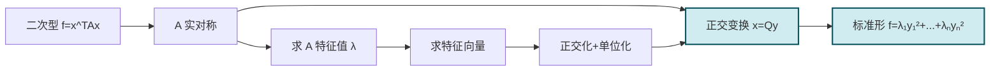

# 5.6 正交变换化二次型为标准形

> [!info] 本节定位
> [[5.4 实对称矩阵对角化|实对称矩阵正交对角化]] 与 [[5.5 二次型及其矩阵表示|二次型矩阵化]] 的合流。本节核心定理（**主轴定理**）指出：任一实二次型可经**正交变换**化为标准形，且标准形系数恰为对称矩阵的特征值。这一变换的几何意义是"将二次曲面主轴化"——在主轴坐标系下，二次曲面方程化为标准形。本节要解决：
> 1. **正交变换** $x=Qy$（$Q$ 正交）下二次型的矩阵如何变化？为何与正交对角化一致？
> 2. **主轴定理**保证任一实二次型可经正交变换化为 $\lambda_1y_1^2+\cdots+\lambda_ny_n^2$，其中 $\lambda_i$ 是 $A$ 的特征值。
> 3. **化标准形的完整步骤**：从二次型到标准形的可执行流程。

## 一、正交变换的定义

> [!definition] 正交变换
> 设 $Q$ 为 $n$ 阶正交矩阵（即 $Q^TQ=E$，$Q^{-1}=Q^T$），称线性变换
>
> $$\boxed{x=Qy}$$
>
> 为**正交变换**。
>
> **性质**（见 [[5.1 向量内积、正交向量组、正交矩阵]]）：
> - 正交变换保内积：$(Qy_1,Qy_2)=(y_1,y_2)$。
> - 保长度：$\|Qy\|=\|y\|$。
> - 保夹角：$Qy_1,Qy_2$ 的夹角等于 $y_1,y_2$ 的夹角。
> - 几何上，正交变换是 $\mathbb{R}^n$ 上的旋转与反射的复合，不改变几何形状。

> [!note] 正交变换与可逆线性变换的区别
> - 可逆线性变换 $x=Cy$ 只要求 $|C|\ne0$，可能改变长度与角度（如伸缩）。
> - 正交变换是特殊的可逆线性变换，要求 $Q^TQ=E$，保长度与角度。
> - 二次型化标准形可用任意可逆线性变换（[[5.8 配方法、初等变换化标准形|配方法]]），但正交变换所得标准形系数唯一（特征值），且有几何意义。

## 二、正交变换下二次型的变化

> [!theorem] 正交变换下二次型的矩阵变化
> 设 $f=x^TAx$，$A$ 对称，作正交变换 $x=Qy$，则
>
> $$f=(Qy)^TA(Qy)=y^T(Q^TAQ)y=y^T(Q^{-1}AQ)y.$$
>
> 由于 $Q$ 正交（$Q^T=Q^{-1}$），**合同与相似重合**：$Q^TAQ=Q^{-1}AQ$。若 $Q$ 使 $A$ 正交对角化为 $\Lambda$，则变换后二次型为
>
> $$f=y^T\Lambda y=\lambda_1y_1^2+\lambda_2y_2^2+\cdots+\lambda_ny_n^2.$$

> [!note] 为何正交变换特殊
> 一般合同变换 $B=C^TAC$ 不保特征值；但当 $C=Q$ 正交时 $C^T=C^{-1}$，于是 $B=Q^{-1}AQ$，**合同与相似重合**。这是正交变换化标准形标准形系数唯一（为特征值）的根本原因。

## 三、主轴定理

> [!theorem] 主轴定理（实二次型经正交变换化标准形）
> 任一 $n$ 元实二次型 $f=x^TAx$（$A$ 实对称）必可经**正交变换** $x=Qy$ 化为**标准形**
>
> $$\boxed{f=\lambda_1y_1^2+\lambda_2y_2^2+\cdots+\lambda_ny_n^2,}$$
>
> 其中 $\lambda_1,\lambda_2,\cdots,\lambda_n$ 是 $A$ 的全部特征值（计重数，全为实数）。
>
> 等价地：实对称矩阵 $A$ 存在正交矩阵 $Q$ 使 $Q^TAQ=Q^{-1}AQ=\operatorname{diag}(\lambda_1,\cdots,\lambda_n)$。

> [!proof]
> 这是 [[5.4 实对称矩阵对角化|实对称矩阵正交对角化定理]] 的直接应用。$A$ 实对称 $\Rightarrow$ 存在正交矩阵 $Q$ 使 $Q^TAQ=\Lambda=\operatorname{diag}(\lambda_1,\cdots,\lambda_n)$。
> 令 $x=Qy$，则 $f=x^TAx=(Qy)^TA(Qy)=y^T(Q^TAQ)y=y^T\Lambda y=\lambda_1y_1^2+\cdots+\lambda_ny_n^2$。

> [!note] 几何意义
> 实二次型 $f=c$ 的等值面是 $\mathbb{R}^n$ 中的二次曲面（$n=2$ 椭圆/双曲线，$n=3$ 椭球/单叶双曲面等）。正交变换 $x=Qy$ 相当于选择一组新的正交坐标轴（**主轴**），在主轴坐标系下，曲面方程化为标准形——这就是主轴定理的几何内容。

## 四、化标准形的步骤

> [!summary] 正交变换化二次型为标准形的步骤
> 给定二次型 $f=x^TAx$（$A$ 对称）：
> 1. **写出对称矩阵 $A$**：交叉项系数对半分配（见 [[5.5 二次型及其矩阵表示]]）。
> 2. **求 $A$ 的特征值**：解 $|A-\lambda E|=0$，得 $\lambda_1,\cdots,\lambda_n$（计重数）。
> 3. **求特征向量**：对每个 $\lambda_i$ 解 $(A-\lambda_i E)x=0$，取基础解系。
> 4. **正交化**：对同一特征值对应的多个特征向量做施密特正交化（不同特征值之间天然正交，无需处理）。
> 5. **单位化**：每个正交化后的向量除以其长度。
> 6. **构造正交矩阵 $Q$**：$Q=(\gamma_1,\cdots,\gamma_n)$，按特征值顺序排列。
> 7. **写出标准形**：$f=\lambda_1y_1^2+\lambda_2y_2^2+\cdots+\lambda_ny_n^2$。
>
> 步骤 2-6 实际上就是 [[5.4 实对称矩阵对角化|正交对角化]] 的步骤，本节只是把结果用于二次型。

## 五、典型例题

> [!example] 例题 1　化二次型为标准形
> 用正交变换化二次型 $f=x_1^2+2x_2^2+2x_3^2+4x_2x_3$ 为标准形，并写出所用的正交变换。
>
> > [!check]- 解答
> > **第 1 步**：对称矩阵 $A=\begin{pmatrix}1&0&0\\0&2&2\\0&2&2\end{pmatrix}$。
> >
> > **第 2 步**：特征方程。
> > $|A-\lambda E|=(1-\lambda)\begin{vmatrix}2-\lambda&2\\2&2-\lambda\end{vmatrix}=(1-\lambda)\big[(2-\lambda)^2-4\big]=(1-\lambda)(\lambda^2-4\lambda)=-(1-\lambda)\lambda(\lambda-4)$。
> > $\lambda_1=0$，$\lambda_2=1$，$\lambda_3=4$。
> >
> > **第 3 步**：求特征向量。
> > - $\lambda_1=0$：$Ax=0$，$A\to\begin{pmatrix}1&0&0\\0&1&1\\0&0&0\end{pmatrix}$，$\xi_1=(0,1,-1)^T$。
> > - $\lambda_2=1$：$(A-E)x=0$，$A-E=\begin{pmatrix}0&0&0\\0&1&2\\0&2&1\end{pmatrix}\to\begin{pmatrix}0&1&0\\0&0&1\\0&0&0\end{pmatrix}$（交换行后化简），$\xi_2=(1,0,0)^T$。
> > - $\lambda_3=4$：$(A-4E)x=0$，$A-4E=\begin{pmatrix}-3&0&0\\0&-2&2\\0&2&-2\end{pmatrix}\to\begin{pmatrix}1&0&0\\0&1&-1\\0&0&0\end{pmatrix}$，$\xi_3=(0,1,1)^T$。
> >
> > **第 4 步**：特征值互异，特征向量自动正交（校验：$\xi_1\cdot\xi_2=0$，$\xi_1\cdot\xi_3=0$，$\xi_2\cdot\xi_3=0$ ✓）。
> >
> > **第 5 步**：单位化。
> > $\|\xi_1\|=\sqrt2$，$\|\xi_2\|=1$，$\|\xi_3\|=\sqrt2$。
> > $\gamma_1=\dfrac{1}{\sqrt2}(0,1,-1)^T$，$\gamma_2=(1,0,0)^T$，$\gamma_3=\dfrac{1}{\sqrt2}(0,1,1)^T$。
> >
> > **第 6 步**：构造 $Q$。
> > $$Q=\begin{pmatrix}0&1&0\\\frac{1}{\sqrt2}&0&\frac{1}{\sqrt2}\\-\frac{1}{\sqrt2}&0&\frac{1}{\sqrt2}\end{pmatrix}.$$
> >
> > **第 7 步**：标准形 $f=0\cdot y_1^2+1\cdot y_2^2+4\cdot y_3^2=y_2^2+4y_3^2$。
> >
> > 校验：$\operatorname{tr}A=1+2+2=5=\sum\lambda_i=0+1+4=5$ ✓，$|A|=0=\prod\lambda_i=0\cdot1\cdot4=0$ ✓。

> [!example] 例题 2　含重根的正交变换化标准形
> 用正交变换化 $f=2x_1^2+5x_2^2+5x_3^2+4x_1x_2-4x_1x_3-8x_2x_3$ 为标准形。
>
> > [!check]- 解答
> > $A=\begin{pmatrix}2&2&-2\\2&5&-4\\-2&-4&5\end{pmatrix}$。
> > 特征方程：$|A-\lambda E|=\begin{vmatrix}2-\lambda&2&-2\\2&5-\lambda&-4\\-2&-4&5-\lambda\end{vmatrix}$。
> > 用初等行变换：$r_2+r_1$、$r_3+r_1$ 后化简，得 $|A-\lambda E|=(10-\lambda)(\lambda-1)^2$（验证 $\operatorname{tr}A=12$，$\sum\lambda=10+1+1=12$ ✓）。
> > $\lambda_1=1$（二重），$\lambda_2=10$（单）。
> >
> > - $\lambda_1=1$：$(A-E)x=0$，$A-E=\begin{pmatrix}1&2&-2\\2&4&-4\\-2&-4&4\end{pmatrix}\to\begin{pmatrix}1&2&-2\\0&0&0\\0&0&0\end{pmatrix}$，$\operatorname{rank}=1$，$r_1=2$。基础解系 $\xi_1=(-2,1,0)^T$，$\xi_2=(2,0,1)^T$。
> > - $\lambda_2=10$：$(A-10E)x=0$，$A-10E=\begin{pmatrix}-8&2&-2\\2&-5&-4\\-2&-4&-5\end{pmatrix}\to\begin{pmatrix}1&0&1\\0&1&1\\0&0&0\end{pmatrix}$（化简后），$\xi_3=(1,1,-1)^T$。
> >
> > **正交化**（$\lambda_1$ 对应的两个向量）：
> > $\beta_1=\xi_1=(-2,1,0)^T$。
> > $\beta_2=\xi_2-\dfrac{(\xi_2,\beta_1)}{(\beta_1,\beta_1)}\beta_1=(2,0,1)^T-\dfrac{-4}{5}(-2,1,0)^T=(2,0,1)^T+\frac45(-2,1,0)^T=\left(\frac25,\frac45,1\right)^T$，取 $\beta_2=(2,4,5)^T$（数乘 $5$）。
> > 校验：$(\beta_1,\beta_2)=-4+4+0=0$ ✓。$(\xi_3,\beta_1)=-2+1+0=-1\ne0$？应正交！
> > 检查：实对称矩阵不同特征值对应特征向量应正交。$(\xi_3,\xi_1)=(1)(-2)+(1)(1)+(-1)(0)=-1\ne0$，说明 $\xi_3$ 计算有误。
> > 重算 $\lambda_2=10$：$(A-10E)x=0$，$A-10E=\begin{pmatrix}-8&2&-2\\2&-5&-4\\-2&-4&-5\end{pmatrix}\to\begin{pmatrix}2&-5&-4\\-8&2&-2\\-2&-4&-5\end{pmatrix}\to\begin{pmatrix}2&-5&-4\\0&-18&-18\\0&-9&-9\end{pmatrix}\to\begin{pmatrix}2&-5&-4\\0&1&1\\0&0&0\end{pmatrix}\to\begin{pmatrix}2&0&1\\0&1&1\\0&0&0\end{pmatrix}$。
> > 故 $x_2=-x_3$，$2x_1=-x_3$，令 $x_3=-2$：$x_1=1$，$x_2=2$，$\xi_3=(1,2,-2)^T$。
> > 校验正交性：$(\xi_3,\xi_1)=-2+2+0=0$ ✓，$(\xi_3,\xi_2)=4+0-2=2\ne0$——$\xi_2$ 已正交化为 $\beta_2$，应校验 $(\xi_3,\beta_2)$：$(1)(2)+(2)(4)+(-2)(5)=2+8-10=0$ ✓。
> >
> > **单位化**：$\|\beta_1\|=\sqrt5$，$\|\beta_2\|=\sqrt{45}=3\sqrt5$，$\|\xi_3\|=\sqrt9=3$。
> > $$\gamma_1=\frac{1}{\sqrt5}(-2,1,0)^T,\quad\gamma_2=\frac{1}{3\sqrt5}(2,4,5)^T,\quad\gamma_3=\frac{1}{3}(1,2,-2)^T.$$
> > $$Q=\begin{pmatrix}-\frac{2}{\sqrt5}&\frac{2}{3\sqrt5}&\frac13\\\frac{1}{\sqrt5}&\frac{4}{3\sqrt5}&\frac23\\0&\frac{5}{3\sqrt5}&-\frac23\end{pmatrix}.$$
> > 标准形 $f=y_1^2+y_2^2+10y_3^2$。

> [!example] 例题 3　由标准形反推二次型
> 设二次型 $f=x^TAx$ 经正交变换 $x=Qy$ 化为 $f=3y_1^2+3y_2^2-y_3^2$，且 $A$ 的对应于 $\lambda_3=-1$ 的特征向量为 $\alpha_3=(1,1,1)^T$，求 $A$。
>
> > [!check]- 解答
> > 由标准形：$A$ 的特征值为 $\lambda_1=3$（二重），$\lambda_2=-1$。
> > $\lambda_1=3$ 对应的特征向量与 $\alpha_3$ 正交，即满足 $x_1+x_2+x_3=0$。基础解系 $\eta_1=(1,-1,0)^T$，$\eta_2=(1,0,-1)^T$。
> > 正交化：$\beta_1=\eta_1=(1,-1,0)^T$，$\beta_2=\eta_2-\dfrac{(\eta_2,\beta_1)}{(\beta_1,\beta_1)}\beta_1=(1,0,-1)^T-\dfrac{1}{2}(1,-1,0)^T=\left(\frac12,\frac12,-1\right)^T$，取 $\beta_2=(1,1,-2)^T$。
> > 单位化：$\gamma_1=\dfrac{1}{\sqrt2}(1,-1,0)^T$，$\gamma_2=\dfrac{1}{\sqrt6}(1,1,-2)^T$，$\gamma_3=\dfrac{1}{\sqrt3}(1,1,1)^T$。
> > $$Q=(\gamma_1,\gamma_2,\gamma_3),\quad\Lambda=\operatorname{diag}(3,3,-1).$$
> > $A=Q\Lambda Q^T=3\gamma_1\gamma_1^T+3\gamma_2\gamma_2^T-\gamma_3\gamma_3^T$。
> > $\gamma_1\gamma_1^T=\frac12\begin{pmatrix}1&-1&0\\-1&1&0\\0&0&0\end{pmatrix}$，$\gamma_2\gamma_2^T=\frac16\begin{pmatrix}1&1&-2\\1&1&-2\\-2&-2&4\end{pmatrix}$，$\gamma_3\gamma_3^T=\frac13\begin{pmatrix}1&1&1\\1&1&1\\1&1&1\end{pmatrix}$。
> > $A=3\cdot\frac12\begin{pmatrix}1&-1&0\\-1&1&0\\0&0&0\end{pmatrix}+3\cdot\frac16\begin{pmatrix}1&1&-2\\1&1&-2\\-2&-2&4\end{pmatrix}-\frac13\begin{pmatrix}1&1&1\\1&1&1\\1&1&1\end{pmatrix}$
> > $=\begin{pmatrix}\frac32&-\frac32&0\\-\frac32&\frac32&0\\0&0&0\end{pmatrix}+\begin{pmatrix}\frac12&\frac12&-1\\\frac12&\frac12&-1\\-1&-1&2\end{pmatrix}-\begin{pmatrix}\frac13&\frac13&\frac13\\\frac13&\frac13&\frac13\\\frac13&\frac13&\frac13\end{pmatrix}$
> > $=\begin{pmatrix}\frac{5}{3}&-\frac{4}{3}&-\frac{4}{3}\\-\frac{4}{3}&\frac{5}{3}&-\frac{4}{3}\\-\frac{4}{3}&-\frac{4}{3}&\frac{5}{3}\end{pmatrix}$。

## 六、易错点与说明

> [!warning] 常见误区
> 1. **交叉项系数未对半分**：$4x_2x_3$ 对应 $a_{23}=a_{32}=2$，不是 $4$。
> 2. **同一特征值特征向量忘记正交化**：不同特征值对应特征向量天然正交，但同一特征值对应多个特征向量不一定正交，必须施密特正交化。
> 3. **正交化后未单位化**：正交化得到的是正交向量组但非单位向量，必须再单位化才能构成正交矩阵。
> 4. **标准形系数顺序与 $Q$ 列顺序不一致**：$Q=(\gamma_1,\gamma_2,\gamma_3)$ 对应 $f=\lambda_1y_1^2+\lambda_2y_2^2+\lambda_3y_3^2$，顺序需对应。
> 5. **混淆正交变换与一般可逆线性变换**：正交变换所得标准形系数唯一（特征值），[[5.8 配方法、初等变换化标准形|配方法]] 所得系数不唯一。

## 本节小结

| 步骤 | 结果 |
| ---- | ---- |
| 写出对称矩阵 $A$ | $a_{ij}=$ 平方项系数；$a_{ij}=\frac12$ 交叉项系数 |
| 求特征值 | 解 $|A-\lambda E|=0$ |
| 求特征向量 | 对每个 $\lambda$ 解 $(A-\lambda E)x=0$ |
| 正交化 | 同一特征值对应多向量施密特正交化 |
| 单位化 | $\gamma_i=\beta_i/\|\beta_i\|$ |
| 构造 $Q$ | $Q=(\gamma_1,\cdots,\gamma_n)$ |
| 标准形 | $f=\lambda_1y_1^2+\cdots+\lambda_ny_n^2$ |

## 章节导航

- 返回：[[MOC - 第5章]]
- 上一节：[[5.5 二次型及其矩阵表示]]
- 下一节：[[5.7 惯性定理、正定二次型]]
- 关联：[[5.4 实对称矩阵对角化]]（本节是其直接应用） · [[5.1 向量内积、正交向量组、正交矩阵]]（正交矩阵构造） · [[5.8 配方法、初等变换化标准形]]（其他化标准形方法对照） · [[5.7 惯性定理、正定二次型]]（标准形的不变量）

## 相关标签

#线性代数 #正交变换 #二次型标准形 #主轴定理
