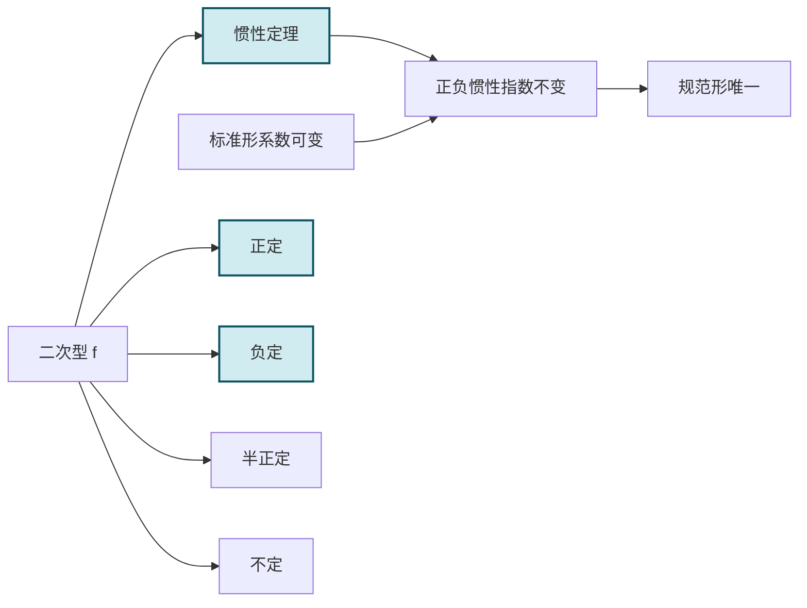

# 5.7 惯性定理、正定二次型

> [!info] 本节定位
> [[5.6 正交变换化二次型为标准形|正交变换化标准形]] 的标准形系数是矩阵的特征值（唯一），但 [[5.8 配方法、初等变换化标准形|配方法、初等变换]] 所得标准形系数随变换不同而改变。一个自然问题：**不同可逆线性变换下，二次型的哪些性质不变？** 惯性定理回答：正负惯性指数不变。基于此，本节引入**正定、负定**等概念，并给出多种等价判定方法。本节要解决：
> 1. 惯性定理的内容与意义；
> 2. 规范形的唯一性；
> 3. 正定/负定/半正定/半负定/不定的定义与判据（顺序主子式、特征值、规范形、定义）。

## 一、惯性定理

> [!theorem] 惯性定理（Sylvester 惯性定律）
> 设 $n$ 元实二次型 $f=x^TAx$ 经过两个**可逆**线性变换 $x=Cy$ 与 $x=Dz$ 分别化为标准形：
>
> $$f=\lambda_1y_1^2+\cdots+\lambda_ny_n^2=\mu_1z_1^2+\cdots+\mu_nz_n^2,$$
>
> 则两个标准形中**正系数个数**、**负系数个数**、**零系数个数**分别相等。
>
> 即：在可逆线性变换下，正惯性指数 $p$、负惯性指数 $q$、零的个数 $n-p-q$ 都是不变量。

> [!note] 定理意义
> 惯性定理指出：虽然不同可逆线性变换得到的标准形系数可能不同，但系数的正负号分布（正、负、零的个数）是合同不变量。这给出了二次型在合同意义下的**完全分类**。

> [!definition] 惯性指数与符号差
> 设二次型 $f$ 经可逆线性变换化为标准形 $d_1y_1^2+\cdots+d_ny_n^2$，其中：
> - 正系数个数 $p$ 称为**正惯性指数**；
> - 负系数个数 $q$ 称为**负惯性指数**；
> - $p-q$ 称为**符号差**；
> - $p+q$ 等于二次型的秩 $r$。

> [!corollary] 二次型合同分类
> 两个 $n$ 元实二次型合同的充要条件是它们有相同的正惯性指数 $p$ 与负惯性指数 $q$（即相同的秩 $r=p+q$ 与符号差 $p-q$）。

## 二、规范形

> [!definition] 规范形
> 二次型 $f=x^TAx$ 经可逆线性变换可化为只含系数 $\pm1$ 与 $0$ 的形式：
>
> $$\boxed{f=y_1^2+\cdots+y_p^2-y_{p+1}^2-\cdots-y_{p+q}^2,}$$
>
> 称为 $f$ 的**规范形**，其中 $p$ 为正惯性指数，$q$ 为负惯性指数。
>
> 规范形由 $p,q$ 唯一确定（惯性定理）。

> [!note] 标准形与规范形的区别
> - **标准形**：只含平方项 $d_i y_i^2$，系数 $d_i$ 可任意（随变换不同而变）。
> - **规范形**：进一步令 $z_i=\sqrt{|d_i|}y_i$，将系数归一为 $\pm1$，唯一。

## 三、正定二次型的定义

> [!definition] 正定与各类有定性
> 设 $f=x^TAx$ 为 $n$ 元实二次型：
>
> | 名称 | 条件 | 矩阵 $A$ |
> | ---- | ---- | ---- |
> | **正定** | 对任意 $x\ne0$，$f(x)>0$ | 正定矩阵 |
> | **负定** | 对任意 $x\ne0$，$f(x)<0$ | 负定矩阵 |
> | **半正定** | 对任意 $x$，$f(x)\ge0$（存在 $x\ne0$ 使 $f(x)=0$） | 半正定矩阵 |
> | **半负定** | 对任意 $x$，$f(x)\le0$（存在 $x\ne0$ 使 $f(x)=0$） | 半负定矩阵 |
> | **不定** | 存在 $x_1,x_2$ 使 $f(x_1)>0$，$f(x_2)<0$ | 不定矩阵 |
>
> **要点**：
> - 正定要求**严格大于零**（对 $x\ne0$），半正定允许等于零。
> - $f(0)=0$ 总成立，故 $x=0$ 不参与判定。
> - 负定 $\Leftrightarrow$ $-f$ 正定；半负定 $\Leftrightarrow$ $-f$ 半正定。

## 四、正定二次型的判定

> [!theorem] 正定的等价判据
> 设 $A$ 为 $n$ 阶实对称矩阵，则以下命题等价：
>
> 1. **定义**：对任意 $x\ne0$，$x^TAx>0$。
> 2. **规范形**：$A$ 的正惯性指数 $p=n$（规范形为 $y_1^2+\cdots+y_n^2$）。
> 3. **标准形**：$A$ 的标准形系数全为正（$d_i>0$，$i=1,\cdots,n$）。
> 4. **特征值**：$A$ 的特征值全为正（$\lambda_i>0$，$i=1,\cdots,n$）。
> 5. **合同于单位矩阵**：存在可逆 $C$ 使 $C^TAC=E$。
> 6. **顺序主子式全正**：$A$ 的所有顺序主子式 $\Delta_k>0$（$k=1,\cdots,n$）。

> [!definition] 顺序主子式
> 设 $A=(a_{ij})_{n\times n}$，$A$ 的 $k$ 阶**顺序主子式**为左上角 $k\times k$ 子块的行列式：
>
> $$\Delta_k=\begin{vmatrix}a_{11}&\cdots&a_{1k}\\\vdots&\ddots&\vdots\\a_{k1}&\cdots&a_{kk}\end{vmatrix},\quad k=1,2,\cdots,n.$$

> [!proof] 顺序主子式判据思路
> （仅给出直观，完整证明见高阶教材）
> - **必要性**（正定 $\Rightarrow$ 顺序主子式全正）：取 $x=(x_1,\cdots,x_k,0,\cdots,0)^T\ne0$，则 $f=x_k^T A_k x_k>0$，其中 $A_k$ 是 $A$ 的 $k$ 阶顺序主子块。故 $A_k$ 正定，$|A_k|=\Delta_k>0$。
> - **充分性**（顺序主子式全正 $\Rightarrow$ 正定）：对阶数 $n$ 归纳。$n=1$ 显然。设 $n-1$ 成立，$A_{n-1}$ 正定。用配方法将 $f$ 写成 $f=\sum_{i,j<n}a_{ij}x_ix_j+2\sum a_{in}x_ix_n+a_{nn}x_n^2$，配方 $x_n$ 得 $f=g(x_1,\cdots,x_{n-1})+\left(a_{nn}-\sum\frac{a_{in}a_{jn}}{a_{ij}}\cdots\right)x_n^2$。利用 $\Delta_n=\Delta_{n-1}\cdot(\text{最后一项系数})$ 与 $\Delta_n>0,\Delta_{n-1}>0$ 推出最后一项系数为正。归纳得证。

> [!example] 例题 1　用顺序主子式判定正定
> 判定 $f=2x_1^2+2x_2^2+2x_3^2+2x_1x_2+2x_1x_3+2x_2x_3$ 是否正定。
>
> > [!check]- 解答
> > $A=\begin{pmatrix}2&1&1\\1&2&1\\1&1&2\end{pmatrix}$。
> > 顺序主子式：
> > - $\Delta_1=2>0$。
> > - $\Delta_2=\begin{vmatrix}2&1\\1&2\end{vmatrix}=4-1=3>0$。
> > - $\Delta_3=|A|=2(4-1)-1(2-1)+1(1-2)=6-1-1=4>0$。
> >
> > 全部顺序主子式为正，故 $f$ 正定。
> >
> > **对照特征值判据**：$|A-\lambda E|=(2-\lambda)^3+1+1-3(2-\lambda)=-(\lambda-1)^2(\lambda-4)$，$\lambda_1=1$（二重），$\lambda_2=4$，全为正，与正定判据一致。

> [!example] 例题 2　参数取值使二次型正定
> 当 $t$ 取何值时，$f=x_1^2+x_2^2+5x_3^2+2tx_1x_2-2x_1x_3+4x_2x_3$ 为正定？
>
> > [!check]- 解答
> > $A=\begin{pmatrix}1&t&-1\\t&1&2\\-1&2&5\end{pmatrix}$。
> > 顺序主子式：
> > - $\Delta_1=1>0$（恒成立）。
> > - $\Delta_2=\begin{vmatrix}1&t\\t&1\end{vmatrix}=1-t^2>0\Rightarrow|t|<1$。
> > - $\Delta_3=|A|=1(5-4)-t(5t+2)-1(2t+1)=1-5t^2-2t-2t-1=-5t^2-4t>0$。
> >   即 $5t^2+4t<0\Rightarrow t(5t+4)<0\Rightarrow -\frac45<t<0$。
> >
> > 取交集：$|t|<1$ 与 $-\frac45<t<0$ 的交集为 $-\frac45<t<0$。
> > 当 $-\frac45<t<0$ 时 $f$ 正定。

## 五、负定与其他有定性判定

> [!theorem] 负定的等价判据
> $A$ 负定的充要条件（任一即可）：
> 1. **定义**：对任意 $x\ne0$，$x^TAx<0$。
> 2. **$-A$ 正定**：$-A$ 的顺序主子式全正，或特征值全为正。
> 3. **特征值**：$A$ 的特征值全为负。
> 4. **顺序主子式符号交错**：$\Delta_k$ 符号为 $(-1)^k$，即 $\Delta_1<0$，$\Delta_2>0$，$\Delta_3<0$，$\cdots$。
> 5. **规范形**：负惯性指数 $q=n$。

> [!theorem] 半正定、半负定、不定的判定
> 设 $A$ 为 $n$ 阶实对称矩阵：
>
> | 类型 | 特征值判据 | 顺序主子式判据 |
> | ---- | ---- | ---- |
> | 半正定 | $\lambda_i\ge0$（允许零） | 所有主子式（不只顺序）$\ge0$ |
> | 半负定 | $\lambda_i\le0$ | 所有主子式 $\le0$（或符号 $(-1)^k$ 或 $0$） |
> | 不定 | 有正有负特征值 | 存在正主子式与负主子式 |

> [!warning] 半正定的顺序主子式判据不充分
> 顺序主子式全 $\ge0$ **不能**保证半正定。例如 $A=\begin{pmatrix}0&0\\0&-1\end{pmatrix}$，$\Delta_1=0\ge0$，$\Delta_2=0\ge0$，但 $A$ 不半正定（有负特征值 $-1$）。半正定需检查**所有主子式**（不仅是顺序的）。

## 六、典型例题

> [!example] 例题 3　用特征值判定正定
> 设 $A$ 为 $n$ 阶正定矩阵，$E$ 为 $n$ 阶单位矩阵，证明 $A+E$ 正定。
>
> > [!check]- 解答
> > $A$ 正定 $\Rightarrow$ $A$ 的特征值 $\lambda_i>0$（$i=1,\cdots,n$）。
> > $A+E$ 的特征值为 $\lambda_i+1>0+1=1>0$（[[5.2 方阵特征值与特征向量|性质]]：$\varphi(A)$ 特征值为 $\varphi(\lambda_i)$）。
> > $A+E$ 实对称（$A$ 对称，$E$ 对称），且特征值全正，故 $A+E$ 正定。

> [!example] 例题 4　判定二次型的类型
> 判定 $f=-2x_1^2-6x_2^2-4x_3^2+2x_1x_2+2x_1x_3$ 的类型。
>
> > [!check]- 解答
> > $A=\begin{pmatrix}-2&1&1\\1&-6&0\\1&0&-4\end{pmatrix}$。
> > 顺序主子式：
> > - $\Delta_1=-2<0$。
> > - $\Delta_2=\begin{vmatrix}-2&1\\1&-6\end{vmatrix}=12-1=11>0$。
> > - $\Delta_3=|A|=-2(24-0)-1(-4-0)+1(0+6)=-48+4+6=-38<0$。
> >
> > 符号：$-,+,-$，即 $(-1)^k$（$k=1,2,3$）。由负定判据，$A$ 负定，$f$ 负定。
> >
> > 验证：$-A=\begin{pmatrix}2&-1&-1\\-1&6&0\\-1&0&4\end{pmatrix}$，顺序主子式 $2>0$，$12-1=11>0$，$|{-A}|=38>0$，$-A$ 正定 ✓。

> [!example] 例题 5　抽象矩阵正定
> 设 $A$ 为 $m\times n$ 矩阵（$m<n$），证明 $AA^T$ 半正定但不正定。
>
> > [!check]- 解答
> > $AA^T$ 为 $m\times m$ 实对称矩阵。
> > 对任意 $x\in\mathbb{R}^m$：$x^T(AA^T)x=(A^Tx)^T(A^Tx)=\|A^Tx\|^2\ge0$。
> > 故 $AA^T$ 半正定。
> >
> > 因 $m<n$，$\operatorname{rank}(A^T)\le m$，且 $A^T$ 的列空间维数 $\le m<n$，但更精确地：$A^T$ 为 $n\times m$，$\operatorname{rank}(A^T)\le\min(n,m)=m$。若 $\operatorname{rank}(A^T)=m$，则 $A^Tx=0\Leftrightarrow x=0$；但 $\operatorname{rank}(AA^T)=\operatorname{rank}(A)\le m$。若 $A$ 列满秩（$\operatorname{rank}A=m$），$AA^T$ 正定；若不满秩，则半正定不正定。
> >
> > 本题 $m<n$ 不能保证 $\operatorname{rank}A=m$（仅 $\operatorname{rank}A\le m$）。若 $\operatorname{rank}A<m$，$AA^T$ 不正定。
> >
> > 更准确的表述：$AA^T$ 半正定；$AA^T$ 正定当且仅当 $A$ 行满秩（$\operatorname{rank}A=m$）。

## 七、易错点与说明

> [!warning] 常见误区
> 1. **正定要求 $A$ 对称**：实数范围内，讨论正定要求 $A$ 对称；不对称矩阵的"正定"定义需用 $\frac{A+A^T}{2}$。
> 2. **顺序主子式判半正定不充分**：半正定需所有主子式（$C_n^k$ 个）非负，不仅顺序主子式。
> 3. **负定判据顺序主子式符号**：负定要求 $(-1)^k\Delta_k>0$，即 $\Delta_1<0,\Delta_2>0,\Delta_3<0,\cdots$，不是全负。
> 4. **$f>0$ 仅对 $x\ne0$**：$f(0)=0$ 必然，正定定义是"非零向量严格大于零"。
> 5. **正定矩阵的行列式为正**：$|A|=\prod\lambda_i>0$，故正定矩阵必可逆。
> 6. **正定矩阵的主元全正**：高斯消元的主元全为正也是正定的等价判据。

## 本节小结

| 判据 | 正定 | 负定 | 半正定 | 半负定 | 不定 |
| ---- | ---- | ---- | ---- | ---- | ---- |
| 定义 | $f>0$ ($x\ne0$) | $f<0$ ($x\ne0$) | $f\ge0$ | $f\le0$ | 有正有负 |
| 特征值 | 全正 | 全负 | $\ge0$ | $\le0$ | 有正有负 |
| 顺序主子式 | 全正 | $(-1)^k$ | — | — | — |
| 规范形 | $p=n,q=0$ | $q=n,p=0$ | $p+q<n,p\ge0$ | $p+q<n,q\ge0$ | $p,q>0$ |

## 章节导航

- 返回：[[MOC - 第5章]]
- 上一节：[[5.6 正交变换化二次型为标准形]]
- 下一节：[[5.8 配方法、初等变换化标准形]]
- 关联：[[5.5 二次型及其矩阵表示]]（合同关系不变量） · [[5.2 方阵特征值与特征向量]]（特征值判据） · [[2.3 矩阵转置、方阵行列式]]（顺序主子式计算）

## 相关标签

#线性代数 #惯性定理 #正定二次型 #负定 #惯性指数
