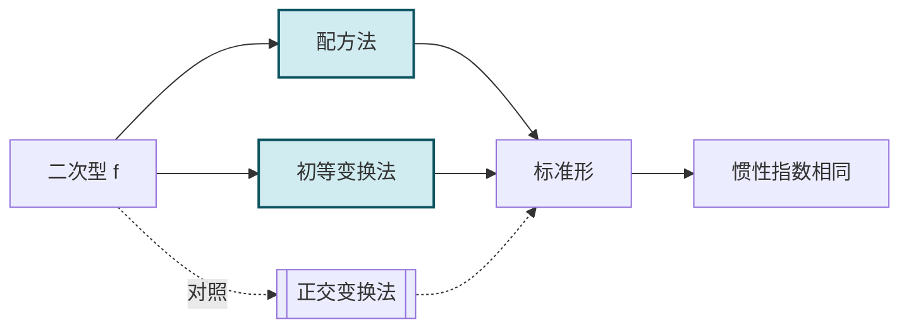

# 5.8 配方法、初等变换化标准形

> [!info] 本节定位
> [[5.6 正交变换化二次型为标准形|正交变换法]] 化二次型为标准形需要解特征方程，计算量大且可能涉及无理数。本节介绍两种**代数方法**——**配方法**（拉格朗日法）与**初等变换法**，它们不需要解特征方程，只需配方或初等行列变换即可。本节要解决：
> 1. 配方法如何系统地化二次型为标准形？何时需要先做"造平方项"的预备变换？
> 2. 初等变换法为何对 $(A\mid E)$ 施行**成对**的行列初等变换？如何同时得到标准形与变换矩阵 $C$？
> 3. 三种方法（正交变换、配方法、初等变换）的对比与适用场景。

## 一、配方法（拉格朗日配方法）

> [!summary] 配方法的基本思路
> 对二次型 $f(x_1,\cdots,x_n)$ 逐步配方：
> - 若存在平方项 $a_{ii}x_i^2\ne0$，集中含 $x_i$ 的项配方，消去所有含 $x_i$ 的交叉项；
> - 若所有平方项系数为零（$f$ 只含交叉项），先用线性变换制造平方项（如 $x_1=y_1+y_2$，$x_2=y_1-y_2$ 使 $x_1x_2=y_1^2-y_2^2$）；
> - 重复上述过程，直至化为标准形。

### 1.1 含平方项情形

> [!example] 例题 1　含平方项的配方
> 用配方法化 $f=x_1^2+2x_2^2+3x_3^2+2x_1x_2+2x_1x_3+4x_2x_3$ 为标准形，并写出变换矩阵。
>
> > [!check]- 解答
> > $f$ 含 $x_1^2$，集中含 $x_1$ 的项：
> > $$f=x_1^2+2x_1(x_2+x_3)+2x_2^2+3x_3^2+4x_2x_3$$
> > 配方：$x_1^2+2x_1(x_2+x_3)=(x_1+x_2+x_3)^2-(x_2+x_3)^2=(x_1+x_2+x_3)^2-x_2^2-2x_2x_3-x_3^2$。
> > $$f=(x_1+x_2+x_3)^2-x_2^2-2x_2x_3-x_3^2+2x_2^2+3x_3^2+4x_2x_3$$
> > $$=(x_1+x_2+x_3)^2+x_2^2+2x_2x_3+2x_3^2.$$
> > 再配方含 $x_2$ 的项：$x_2^2+2x_2x_3=(x_2+x_3)^2-x_3^2$。
> > $$f=(x_1+x_2+x_3)^2+(x_2+x_3)^2+x_3^2.$$
> > 令 $\begin{cases}y_1=x_1+x_2+x_3\\y_2=x_2+x_3\\y_3=x_3\end{cases}$，即 $y=C^{-1}x$，$x=Cy$，其中 $C^{-1}=\begin{pmatrix}1&1&1\\0&1&1\\0&0&1\end{pmatrix}$，$C=\begin{pmatrix}1&-1&0\\0&1&-1\\0&0&1\end{pmatrix}$（$|C|=1\ne0$）。
> > 标准形：$f=y_1^2+y_2^2+y_3^2$。
> >
> > **正惯性指数** $p=3$，负惯性指数 $q=0$，秩 $r=3$，$f$ 正定。

### 1.2 不含平方项情形

> [!example] 例题 2　不含平方项的配方
> 用配方法化 $f=2x_1x_2+2x_1x_3-2x_2x_3$ 为标准形。
>
> > [!check]- 解答
> > $f$ 无平方项，先做变换制造平方项。令 $\begin{cases}x_1=y_1+y_2\\x_2=y_1-y_2\\x_3=y_3\end{cases}$，即 $x=C_1y$，$C_1=\begin{pmatrix}1&1&0\\1&-1&0\\0&0&1\end{pmatrix}$，$|C_1|=-2\ne0$。
> > 代入：
> > $\begin{aligned}f&=2(y_1+y_2)(y_1-y_2)+2(y_1+y_2)y_3-2(y_1-y_2)y_3\\&=2(y_1^2-y_2^2)+2y_1y_3+2y_2y_3-2y_1y_3+2y_2y_3\\&=2y_1^2-2y_2^2+4y_2y_3.\end{aligned}$
> > 配方 $y_2$：$-2y_2^2+4y_2y_3=-2(y_2^2-2y_2y_3)=-2\big[(y_2-y_3)^2-y_3^2\big]=-2(y_2-y_3)^2+2y_3^2$。
> > $$f=2y_1^2-2(y_2-y_3)^2+2y_3^2.$$
> > 再令 $\begin{cases}z_1=y_1\\z_2=y_2-y_3\\z_3=y_3\end{cases}$，即 $y=C_2z$，$C_2=\begin{pmatrix}1&0&0\\0&1&1\\0&0&1\end{pmatrix}$，$|C_2|=1$。
> > 标准形：$f=2z_1^2-2z_2^2+2z_3^2$。
> > 总变换 $x=C_1C_2z$，$C=C_1C_2=\begin{pmatrix}1&1&1\\1&-1&-1\\0&0&1\end{pmatrix}$。
> > **正惯性指数** $p=2$，负惯性指数 $q=1$，秩 $r=3$。
> >
> > **对照** [[5.6 正交变换化二次型为标准形|正交变换法]]：$A=\begin{pmatrix}0&1&1\\1&0&-1\\1&-1&0\end{pmatrix}$，特征值为 $1,1,-2$，故 $p=2,q=1$，与配方法一致 ✓（惯性定理）。

## 二、初等变换法

> [!summary] 初等变换法原理
> 二次型 $f=x^TAx$ 化标准形等价于找可逆 $C$ 使 $C^TAC=\Lambda$（对角）。可逆矩阵 $C$ 可分解为初等矩阵之积 $C=E_1E_2\cdots E_k$，故
>
> $$C^TAC=E_k^T\cdots E_2^T E_1^T A E_1 E_2\cdots E_k.$$
>
> 即对 $A$ 施行一次**列初等变换**（右乘 $E_i$）必须同时施行对应的**行初等变换**（左乘 $E_i^T$），这种"成对"的行列变换称为**合同初等变换**。
>
> 同时对 $E$ 施行**仅列**初等变换（右乘 $E_i$），最终得到 $C$：
>
> $$\begin{pmatrix}A\\E\end{pmatrix}\xrightarrow{\text{对 }A\text{ 成对行列变换；对 }E\text{ 仅列变换}}\begin{pmatrix}\Lambda\\C\end{pmatrix}.$$

> [!note] 为何"成对"
> - 行变换对应左乘 $E_i^T$，列变换对应右乘 $E_i$。
> - 行列同型变换保证 $E_i^T A E_i$，这是合同变换的形式 $C^TAC$。
> - 三种初等变换的"成对"对应：
>   - 列 $c_i\leftrightarrow c_j$ 对应行 $r_i\leftrightarrow r_j$；
>   - 列 $c_i\times k$ 对应行 $r_i\times k$；
>   - 列 $c_i+k c_j$ 对应行 $r_i+k r_j$（注意：列变换是 $i$ 列加 $k$ 倍 $j$ 列，行变换是 $i$ 行加 $k$ 倍 $j$ 行，方向一致）。

> [!example] 例题 3　初等变换法化标准形
> 用初等变换法化 $f=x_1^2+2x_2^2+x_3^2+2x_1x_2+2x_2x_3$ 为标准形。
>
> > [!check]- 解答
> > $A=\begin{pmatrix}1&1&0\\1&2&1\\0&1&1\end{pmatrix}$，构造 $\begin{pmatrix}A\\E\end{pmatrix}=\begin{pmatrix}1&1&0\\1&2&1\\0&1&1\\1&0&0\\0&1&0\\0&0&1\end{pmatrix}$。
> >
> > **第 1 步**：消去 $A$ 的第一行第一列的非对角元 $a_{12}=a_{21}=1$。
> > - 列变换：$c_2-c_1$（第 2 列减第 1 列）；行变换：$r_2-r_1$（第 2 行减第 1 行）。
> > - 对 $A$ 部分：$\begin{pmatrix}1&0&0\\1&1&1\\0&1&1\end{pmatrix}$ → 行 $r_2-r_1$ → $\begin{pmatrix}1&0&0\\0&1&1\\0&1&1\end{pmatrix}$。
> > - 对 $E$ 部分（仅列变换 $c_2-c_1$）：$\begin{pmatrix}1&-1&0\\0&1&0\\0&0&1\end{pmatrix}$。
> >
> > **第 2 步**：消去 $A$ 的第二行第二列的非对角元 $a_{23}=a_{32}=1$。
> > - 列变换：$c_3-c_2$；行变换：$r_3-r_2$。
> > - 对 $A$：$\begin{pmatrix}1&0&0\\0&1&0\\0&1&0\end{pmatrix}$ → 行 $r_3-r_2$ → $\begin{pmatrix}1&0&0\\0&1&0\\0&0&0\end{pmatrix}=\Lambda$。
> > - 对 $E$：列 $c_3-c_2$：$\begin{pmatrix}1&-1&1\\0&1&-1\\0&0&1\end{pmatrix}=C$。
> >
> > 标准形：$f=y_1^2+y_2^2+0\cdot y_3^2=y_1^2+y_2^2$。
> > 变换矩阵 $C=\begin{pmatrix}1&-1&1\\0&1&-1\\0&0&1\end{pmatrix}$，$|C|=1\ne0$。
> >
> > 校验：$C^TAC=\Lambda$。
> > **正惯性指数** $p=2$，负惯性指数 $q=0$，秩 $r=2<3$（退化）。

## 三、三种方法对比

> [!summary] 化标准形三种方法对照
>
> | 方法 | 变换 $x=?y$ | 标准形系数 | 系数是否唯一 | 几何意义 | 计算量 | 适用场景 |
> | ---- | ---- | ---- | ---- | ---- | ---- | ---- |
> | **正交变换法** | $x=Qy$，$Q$ 正交 | $\lambda_i$（特征值） | 唯一 | 主轴坐标，保长度 | 大（解特征方程） | 需唯一标准形、几何应用 |
> | **配方法** | $x=Cy$，$C$ 可逆 | $d_i$（配方结果） | 不唯一 | 一般可逆变换 | 小（仅配方） | 求惯性指数、规范形 |
> | **初等变换法** | $x=Cy$，$C$ 可逆 | $d_i$（变换结果） | 不唯一 | 一般可逆变换 | 中（成对变换） | 同时求 $C$ 与 $\Lambda$ |
>
> **关键结论**：三种方法所得标准形系数可能不同，但**正负惯性指数相同**（惯性定理），故对判定正定性等价。

> [!note] 各方法的优势
> - **正交变换法**：唯一确定标准形系数，适用于需要精确系数（如判定曲面类型）的场景；但需解特征方程。
> - **配方法**：代数操作简单，适用于求惯性指数与规范形；不需解高次方程。
> - **初等变换法**：可同时得到标准形 $\Lambda$ 与变换矩阵 $C$；适合需要 $C$ 的场景（如合同对角化）。

## 四、综合例题

> [!example] 例题 4　判定二次型类型
> 判定 $f=-2x_1^2-6x_2^2-4x_3^2+2x_1x_2+2x_1x_3$ 的类型（用配方法）。
>
> > [!check]- 解答
> > 集中含 $x_1$ 的项：$f=-2x_1^2+2x_1(x_2+x_3)-6x_2^2-4x_3^2$。
> > 配方：$-2\big[x_1^2-x_1(x_2+x_3)\big]=-2\big[(x_1-\frac{x_2+x_3}{2})^2-\frac{(x_2+x_3)^2}{4}\big]=-2(x_1-\frac{x_2+x_3}{2})^2+\frac{(x_2+x_3)^2}{2}$。
> > $$f=-2\left(x_1-\frac{x_2+x_3}{2}\right)^2+\frac12(x_2+x_3)^2-6x_2^2-4x_3^2$$
> > 展开 $\frac12(x_2+x_3)^2=\frac12 x_2^2+x_2x_3+\frac12 x_3^2$，故
> > $$f=-2\left(x_1-\frac{x_2+x_3}{2}\right)^2-\frac{11}{2}x_2^2+x_2x_3-\frac{7}{2}x_3^2.$$
> > 继续配方 $x_2$（或 $x_3$）：$-\frac{11}{2}x_2^2+x_2x_3-\frac{7}{2}x_3^2=-\frac{11}{2}\big[x_2^2-\frac{2}{11}x_2x_3\big]-\frac{7}{2}x_3^2=-\frac{11}{2}(x_2-\frac{x_3}{11})^2+\frac{1}{22}x_3^2-\frac{7}{2}x_3^2=-\frac{11}{2}(x_2-\frac{x_3}{11})^2-\frac{38}{11}x_3^2$。
> > 故 $f=-2y_1^2-\frac{11}{2}y_2^2-\frac{38}{11}y_3^2$（$y_1=x_1-\frac{x_2+x_3}{2}$，$y_2=x_2-\frac{x_3}{11}$，$y_3=x_3$）。
> > 系数全负，$p=0$，$q=3$，$f$ 负定。
> >
> > 与 [[5.7 惯性定理、正定二次型|例题 4]] 用顺序主子式判据结果一致 ✓。

## 五、易错点与说明

> [!warning] 常见误区
> 1. **配方法中混淆变量与常数**：每次配方后，新变量 $y_i$ 是 $x$ 的线性组合，必须写出变换关系以便求 $C$。
> 2. **初等变换忘记"成对"**：对 $A$ 做一次列变换必须同时做对应行变换；对 $E$ 只做列变换。
> 3. **不含平方项时不做预备变换**：若所有 $a_{ii}=0$，必须先用 $x_1=y_1+y_2$、$x_2=y_1-y_2$ 制造平方项。
> 4. **误认为配方法标准形系数与正交变换相同**：一般不同，但正负惯性指数相同（惯性定理）。
> 5. **初等变换法的 $C$ 构造顺序**：$C$ 是对 $E$ 做**列**变换得到的，不是行变换。
> 6. **配方法配方顺序影响结果**：配方顺序不同得到的标准形系数可能不同，但惯性指数不变。

## 本节小结

| 方法 | 关键操作 | 优势 | 劣势 |
| ---- | ---- | ---- | ---- |
| 配方法 | 逐步配方消交叉项 | 简单直观 | 变换矩阵 $C$ 需反推 |
| 初等变换法 | $(A\mid E)$ 成对行列变换 | 同时得 $\Lambda$ 与 $C$ | 操作步骤多易错 |
| 正交变换法 | 求特征值特征向量 | 系数唯一（特征值） | 需解特征方程 |

## 章节导航

- 返回：[[MOC - 第5章]]
- 上一节：[[5.7 惯性定理、正定二次型]]
- 下一节：（本章末节）
- 关联：[[5.6 正交变换化二次型为标准形]]（正交变换法对照） · [[5.5 二次型及其矩阵表示]]（合同变换的初等矩阵观点） · [[5.7 惯性定理、正定二次型]]（配方法用于判定正定） · [[第3章 矩阵初等变换与线性方程组]]（初等变换基础）

## 相关标签

#线性代数 #配方法 #初等变换 #拉格朗日配方法 #二次型标准形
