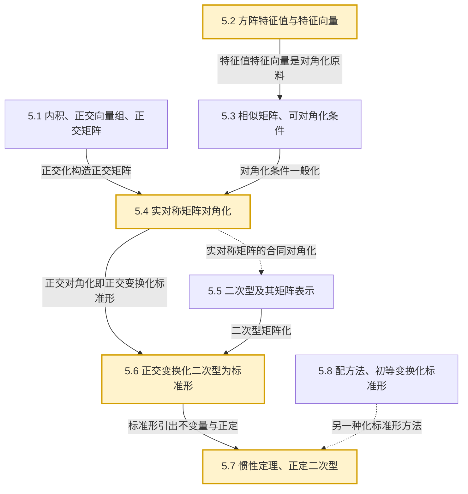
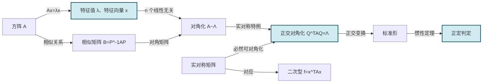

# MOC - 第5章 相似矩阵及二次型

> [!info] 本章定位
> 前四章建立了矩阵与向量组的代数运算框架，但一直把矩阵看作"数表"。本章要回答一个更深的问题：**能否找到一组基底，使线性变换（或方阵）在该基下具有最简形式**？这引出三个相互关联的核心对象：
> 1. **方阵的谱结构**——[[5.2 方阵特征值与特征向量|特征值与特征向量]] 刻画"方向不变"的特殊向量，是 [[5.3 相似矩阵、矩阵可对角化条件|相似对角化]] 的基石；
> 2. **几何上最优的基底**——[[5.1 向量内积、正交向量组、正交矩阵|正交向量组与正交矩阵]] 提供保长度、保角度的可逆变换，使 [[5.4 实对称矩阵对角化|实对称矩阵必可正交对角化]]；
> 3. **二次齐次函数的分类**——[[5.5 二次型及其矩阵表示|二次型]] 把几何曲面、惯性、正定性等几何问题转化为对称矩阵的代数问题，并通过 [[5.6 正交变换化二次型为标准形|正交变换]]、[[5.8 配方法、初等变换化标准形|配方法与初等变换]] 化简，最终由 [[5.7 惯性定理、正定二次型|惯性定理与正定判定]] 给出不变量与判定准则。
>
> 本章是 [[MOC - 第2章|矩阵运算]]、[[MOC - 第4章|向量组]] 的综合应用，也是后续 [[MOC - 第6章 线性空间与线性变换（选学）|线性空间与线性变换]] 中"线性变换在基下的矩阵可对角化"的特例化准备。

## 学习路线图

> [!tip] 学习顺序提示
> 本章存在两条交织的主线：**代数主线** 5.1 → 5.2 → 5.3 → 5.4，从内积空间到对角化理论；**应用主线** 5.5 → 5.6 → 5.7，把对角化应用于二次型。建议先通读代数主线建立完整画面，再进入二次型应用；[[5.8 配方法、初等变换化标准形]] 是正交变换之外的补充方法，可与 5.6 对照学习。

## 知识点导航

| 小节 | 主题 | 入口 | 核心内容 | 重要度 |
| ---- | ---- | ---- | -------- | ------ |
| 5.1 | 向量内积、正交向量组、正交矩阵 | [[5.1 向量内积、正交向量组、正交矩阵]] | 内积定义与性质、向量长度与单位化、柯西-施瓦茨不等式、施密特正交化、正交矩阵定义与性质 | ★★★★ |
| 5.2 | 方阵特征值与特征向量 | [[5.2 方阵特征值与特征向量]] | $Ax=\lambda x$、特征方程与特征多项式、$\sum\lambda_i=\operatorname{tr}A$、$\prod\lambda_i=|A|$、不同特征值对应特征向量线性无关 | ★★★★★ |
| 5.3 | 相似矩阵、矩阵可对角化条件 | [[5.3 相似矩阵、矩阵可对角化条件]] | 相似定义 $B=P^{-1}AP$、相似不变量、可对角化充要条件（$n$ 个线性无关特征向量） | ★★★★★ |
| 5.4 | 实对称矩阵对角化 | [[5.4 实对称矩阵对角化]] | 特征值全实、不同特征值对应特征向量正交、正交对角化定理与步骤 | ★★★★★ |
| 5.5 | 二次型及其矩阵表示 | [[5.5 二次型及其矩阵表示]] | 二次齐次多项式、$f=x^T Ax$、矩阵合同 $B=C^T AC$、合同变换保秩 | ★★★★ |
| 5.6 | 正交变换化二次型为标准形 | [[5.6 正交变换化二次型为标准形]] | 正交变换 $x=Qy$、标准形 $\lambda_1y_1^2+\cdots+\lambda_n y_n^2$、化标准形步骤 | ★★★★★ |
| 5.7 | 惯性定理、正定二次型 | [[5.7 惯性定理、正定二次型]] | 正负惯性指数不变、规范形、正定/负定/半正定/半负定/不定定义、正定判定（顺序主子式/特征值/规范形） | ★★★★★ |
| 5.8 | 配方法、初等变换化标准形 | [[5.8 配方法、初等变换化标准形]] | 拉格朗日配方法、成对初等变换 $(A\mid E)\to(\Lambda\mid C^T)$、与正交变换法对比 | ★★★ |

## 核心考点

> [!summary] 本章高频考点
> 1. **特征值与特征向量计算**：对具体 3 阶矩阵，正确写出特征方程 $|A-\lambda E|=0$，解出 $\lambda_i$，再由 $(A-\lambda_i E)x=0$ 求基础解系（见 [[5.2 方阵特征值与特征向量]]）。
> 2. **特征值的整体性质**：$\sum\lambda_i=\operatorname{tr}A$、$\prod\lambda_i=|A|$，用于反求未知元素或验证计算结果。
> 3. **相似矩阵的性质链**：相似矩阵有相同的特征多项式、特征值、迹、行列式、秩，可用于判定两矩阵不相似。
> 4. **对角化的判定与实现**：$A$ 可对角化 $\Leftrightarrow$ $A$ 有 $n$ 个线性无关特征向量；充分条件为 $n$ 个互异特征值；含重根时检查特征子空间维数。
> 5. **实对称矩阵正交对角化**（全章最核心）：四步法——求特征值、求特征向量、施密特正交化、单位化、构造 $Q$，使 $Q^{-1}AQ=Q^TAQ=\Lambda$。
> 6. **正交矩阵的性质**：$A^TA=E$、$|A|=\pm1$、行/列向量组为标准正交基、$A^{-1}=A^T$。
> 7. **二次型矩阵化**：把 $f$ 写成 $x^T Ax$（$A$ 为对称矩阵），注意交叉项系数对半分入 $a_{ij}$ 与 $a_{ji}$。
> 8. **正交变换化二次型为标准形**：标准形系数恰为对称矩阵的特征值，主轴定理的直接应用。
> 9. **正定判定**：顺序主子式全正、特征值全正、规范形系数全正、$f>0$ 对一切 $x\ne0$，四种判据等价；负定通过 $-f$ 正定或顺序主子式交错符号判定。

## 关键概念关系

## 自测题

> [!question] 自测 1（特征值计算）
> 求 $A=\begin{pmatrix}2&-1&0\\-1&2&-1\\0&-1&2\end{pmatrix}$ 的特征值与特征向量。
>
> > [!check]- 答案
> > 特征方程 $|A-\lambda E|=(2-\lambda)\big[(2-\lambda)^2-1\big]-(-1)\big[-(2-\lambda)\big]=(2-\lambda)\big[(2-\lambda)^2-2\big]=0$。
> > 令 $2-\lambda=t$：$t(t^2-2)=0$，$t=0,\pm\sqrt2$，故 $\lambda_1=2$，$\lambda_2=2-\sqrt2$，$\lambda_3=2+\sqrt2$。
> > - $\lambda_1=2$：$(A-2E)x=0$，基础解系 $x_1=(1,0,-1)^T$（舍入检查：$A(1,0,-1)^T=(2,0,-2)^T=2(1,0,-1)^T$ ✓）。
> > - $\lambda_2=2-\sqrt2$：基础解系 $x_2=(1,\sqrt2,1)^T$。
> > - $\lambda_3=2+\sqrt2$：基础解系 $x_3=(1,-\sqrt2,1)^T$。
> > 三个特征向量两两正交（实对称矩阵性质，见 [[5.4 实对称矩阵对角化]]）。

> [!question] 自测 2（对角化判定）
> 判断 $A=\begin{pmatrix}1&1\\0&1\end{pmatrix}$ 是否可对角化。
>
> > [!check]- 答案
> > $|A-\lambda E|=(1-\lambda)^2=0$，$\lambda=1$（二重）。
> > $(A-E)=\begin{pmatrix}0&1\\0&0\end{pmatrix}$，$\operatorname{rank}(A-E)=1$，特征子空间维数 $=2-1=1<2$。
> > 特征向量个数不足，$A$ 不可对角化。详见 [[5.3 相似矩阵、矩阵可对角化条件]]。

> [!question] 自测 3（正定判定）
> 判定二次型 $f=2x_1^2+2x_2^2+2x_3^2+2x_1x_2+2x_1x_3+2x_2x_3$ 是否正定。
>
> > [!check]- 答案
> > 对称矩阵 $A=\begin{pmatrix}2&1&1\\1&2&1\\1&1&2\end{pmatrix}$。
> > 顺序主子式：$\Delta_1=2>0$，$\Delta_2=\begin{vmatrix}2&1\\1&2\end{vmatrix}=3>0$，$\Delta_3=|A|=2(4-1)-1(2-1)+1(1-2)=6-1-1=4>0$。
> > 全部顺序主子式为正，故 $f$ 正定。详见 [[5.7 惯性定理、正定二次型]]。

> [!question] 自测 4（正交矩阵性质）
> 设 $A$ 为 $n$ 阶正交矩阵，证明 $|A|=\pm1$，并说明何时取正、何时取负。
>
> > [!check]- 答案
> > $A^TA=E$，两边取行列式：$|A^T||A|=|A|^2=1$，故 $|A|=\pm1$。
> > $|A|=+1$ 时 $A$ 为旋转矩阵（保持定向）；$|A|=-1$ 时 $A$ 含反射（翻转定向）。详见 [[5.1 向量内积、正交向量组、正交矩阵]]。

## 重点思想

> [!abstract] 贯穿本章的三个观点
> 1. **特征值是"方向不变"的代数刻画**：$Ax=\lambda x$ 意味着 $x$ 在 $A$ 作用下只伸缩不转向；寻找足够多的这样的方向，就能把 $A$ 化为对角形，这是线性代数的核心化简思想。
> 2. **实对称矩阵拥有最好的谱性质**：特征值全实、特征向量可正交、必可正交对角化——这一系列"好性质"使实对称矩阵成为二次型、最小二乘、主成分分析等应用的基础。
> 3. **合同关系是二次型的等价关系**：与相似关系刻画"同一变换在不同基下"不同，合同关系 $B=C^T AC$ 刻画"同一二次型在不同坐标下"；惯性定理指出，在所有合同标准形中，正负惯性指数是不变量，从而给出二次型的完整分类。

## 章节导航

- 上一级：[[MOC - 线性代数A]]
- 上一章：[[MOC - 第4章 向量组的线性相关性]]（待建）
- 下一章：[[MOC - 第6章 线性空间与线性变换（选学）]]（待建）
- 本章习题：[[MOC - 第5章习题]]
- 本章小节：[[5.1 向量内积、正交向量组、正交矩阵]] · [[5.2 方阵特征值与特征向量]] · [[5.3 相似矩阵、矩阵可对角化条件]] · [[5.4 实对称矩阵对角化]] · [[5.5 二次型及其矩阵表示]] · [[5.6 正交变换化二次型为标准形]] · [[5.7 惯性定理、正定二次型]] · [[5.8 配方法、初等变换化标准形]]

## 相关标签

#线性代数 #特征值 #特征向量 #相似矩阵 #对角化 #正交矩阵 #二次型 #正定
