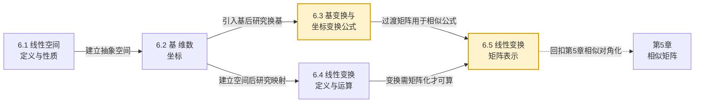
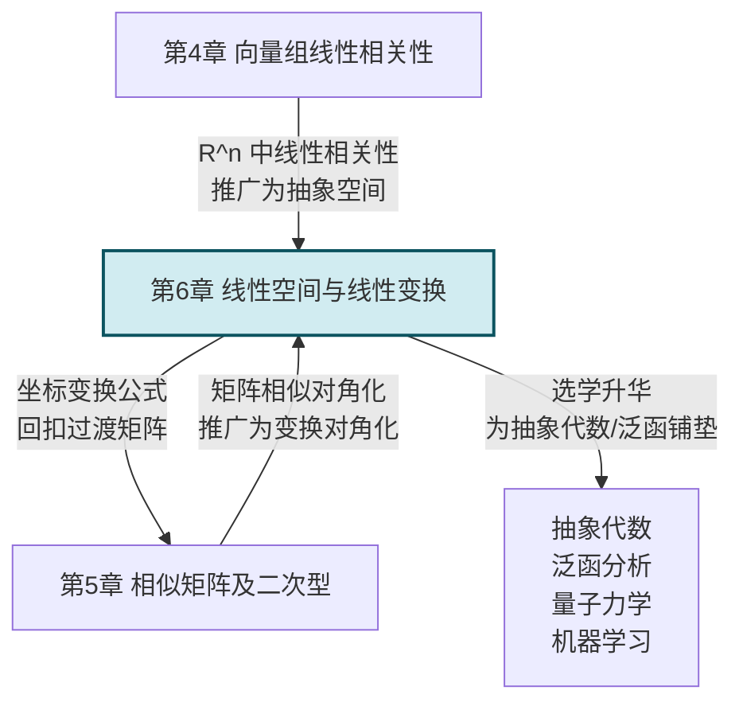

# MOC - 第6章 线性空间与线性变换（选学）

> [!info] 本章定位
> 本章是线性代数的**抽象升华**，也是**选学章节**。前五章在 $\mathbb{R}^n$ 这一具体空间中讨论行列式、矩阵、向量组、特征值与二次型；本章把"向量"推广为任意满足八条公理的对象（多项式、矩阵、函数等），建立**抽象线性空间**理论。它要解决的核心问题是：
> 1. 什么样的对象集合能像 $\mathbb{R}^n$ 一样做加法与数乘？（[[6.1 线性空间定义与性质]] 的公理化定义）
> 2. 抽象空间如何建立"坐标系"使向量可被数值刻画？（[[6.2 基、维数、坐标]] 的基与维数）
> 3. 换一组"坐标系"后，坐标如何变化？（[[6.3 基变换与坐标变换公式]] 的过渡矩阵与坐标变换）
> 4. 什么样的映射能保持线性结构？（[[6.4 线性变换定义与运算]] 的线性变换）
> 5. 抽象变换如何用矩阵刻画，使第5章工具可用？（[[6.5 线性变换矩阵表示]] 的相似关系）
>
> 本章是 [[第4章 向量组的线性相关性|第4章]] 线性相关性理论与 [[第5章 相似矩阵及二次型|第5章]] 特征值理论在抽象空间的统一，也为后续抽象代数、泛函分析、量子力学、机器学习的特征空间方法提供基础。

> [!note] 选学说明
> 本章在多数工科教学大纲中为选学或简讲内容。核心在于理解"公理化抽象"思想与坐标变换公式，对前五章形成俯瞰视角。若学时紧张，建议优先掌握 [[6.1 线性空间定义与性质|6.1]]、[[6.3 基变换与坐标变换公式|6.3]]、[[6.5 线性变换矩阵表示|6.5]] 三节。

## 学习路线图

## 知识点导航

| 节 | 主题 | 核心要点 | 入口 |
| -- | ---- | -------- | ---- |
| 6.1 | 线性空间定义与性质 | 数域、八条公理（加法四条+数乘四条）、典型实例（$\mathbb{R}^n$、$P_n[x]$、$M_{m\times n}$、$C[a,b]$）、零元负元唯一、$0\alpha=\theta$、$(-1)\alpha=-\alpha$、子空间判定 | [[6.1 线性空间定义与性质]] |
| 6.2 | 基、维数、坐标 | 线性组合与线性表示（推广）、基定义（线性无关+生成）、维数 $\dim V$、坐标唯一性、常见空间维数（$\dim\mathbb{R}^n=n$、$\dim P_n[x]=n+1$、$\dim M_{m\times n}=mn$、$\dim C[a,b]=\infty$） | [[6.2 基、维数、坐标]] |
| 6.3 | 基变换与坐标变换公式 | 过渡矩阵 $C$（列=新基在旧基下坐标）、基变换 $(e'_1,\dots,e'_n)=(e_1,\dots,e_n)C$、坐标变换 $x=Cx'$、$C$ 可逆、链式法则 $C=C_1C_2$ | [[6.3 基变换与坐标变换公式]] |
| 6.4 | 线性变换定义与运算 | 线性变换定义（保加法+保数乘）、等价定义 $T(k\alpha+l\beta)=kT\alpha+lT\beta$、性质（$T\theta=\theta$、保线性相关、由基像决定）、运算（加、数乘、乘法、逆） | [[6.4 线性变换定义与运算]] |
| 6.5 | 线性变换矩阵表示 | $T$ 在基下的矩阵 $A$（列=$T(e_j)$ 坐标）、像坐标 $y=Ax$、相似关系 $B=C^{-1}AC$、$\mathcal{L}(V)\cong M_n(F)$、特征值与基无关、可对角化 | [[6.5 线性变换矩阵表示]] |

## 核心考点

> [!warning] 重点掌握
> 1. **线性空间判定**：用八条公理或子空间判定（加法+数乘封闭）判定集合是否构成线性空间；注意非例（平移、次数恰为 $n$ 的多项式等）。
> 2. **基与维数的求法**：对子空间（如齐次方程解空间）求基础解系作为基，维数 $=n-r$；对多项式、矩阵空间识别标准基。
> 3. **坐标变换公式（核心）**：记牢 $x=Cx'$（旧坐标 = $C$ × 新坐标）、$C$ 的列是新基在旧基下坐标；能熟练求过渡矩阵（$(A\mid B)\to(E\mid A^{-1}B)$）。
> 4. **线性变换的矩阵表示**：$A$ 的第 $j$ 列是 $T(e_j)$ 在基下坐标；能从 $T$ 定义求 $A$，反之能从 $A$ 求 $T(\alpha)$。
> 5. **相似关系 $B=C^{-1}AC$**：理解几何意义（同一线性变换在不同基下的矩阵），与 [[第5章 相似矩阵及二次型|第5章]] 相似对角化衔接。
> 6. **线性变换特征值**：$T(\alpha)=\lambda\alpha\Leftrightarrow Ax=\lambda x$，特征值是相似不变量（与基无关）。
> 7. **线性变换判定**：用 $T(\theta)=\theta$ 快速否定，或用等价定义一次验证保加法+保数乘。

## 自测题

> [!question] 自测题 1
> 判定 $V=\{(x_1,x_2,x_3)\in\mathbb{R}^3\mid x_1=2x_2\}$ 配 usual 运算是否构成 $\mathbb{R}$ 上的线性空间。

> > [!check]- 参考答案
> > $V\subseteq\mathbb{R}^3$ 非空（$(0,0,0)\in V$）。
> > 任取 $\alpha=(2a,a,b),\beta=(2c,c,d)\in V$（满足第一分量 = 2×第二分量），$k\in\mathbb{R}$：
> > - $\alpha+\beta=(2a+2c,\ a+c,\ b+d)=(2(a+c),\ a+c,\ b+d)\in V$；
> > - $k\alpha=(2ka,\ ka,\ kb)=(2(ka),\ ka,\ kb)\in V$。
> > 加法与数乘均封闭，故 $V$ 是 $\mathbb{R}^3$ 的子空间，从而是 $\mathbb{R}$ 上的线性空间。

> [!question] 自测题 2
> 在 $P_2[x]$ 中，求 $f(x)=2x^2-x+3$ 在基 $1,\ x-1,\ (x-1)^2$ 下的坐标。

> > [!check]- 参考答案
> > 设 $2x^2-x+3=c_1\cdot1+c_2(x-1)+c_3(x-1)^2$。
> > 右边展开：$c_1+c_2x-c_2+c_3(x^2-2x+1)=(c_1-c_2+c_3)+(c_2-2c_3)x+c_3x^2$。
> > 比较系数：$c_3=2$，$c_2-2c_3=-1\Rightarrow c_2=3$，$c_1-c_2+c_3=3\Rightarrow c_1=4$。
> > 故坐标为 $(4,3,2)^T$。
> > **检验**：$4+3(x-1)+2(x-1)^2=4+3x-3+2x^2-4x+2=2x^2-x+3$ ✓。

> [!question] 自测题 3
> 在 $\mathbb{R}^2$ 中，旧基 $e_1=(1,0),e_2=(0,1)$，新基 $e'_1=(1,1),e'_2=(1,2)$。求过渡矩阵 $C$；并求 $\alpha=(3,5)$ 在新基下的坐标。

> > [!check]- 参考答案
> > 旧基为自然基，$C$ 的列就是新基坐标：
> > $$C=\begin{pmatrix}1&1\\ 1&2\end{pmatrix},\quad |C|=2-1=1,\quad C^{-1}=\begin{pmatrix}2&-1\\ -1&1\end{pmatrix}.$$
> > $\alpha$ 在旧基下坐标 $x=(3,5)^T$，新基下坐标 $x'=C^{-1}x=\begin{pmatrix}2&-1\\ -1&1\end{pmatrix}\begin{pmatrix}3\\5\end{pmatrix}=\begin{pmatrix}6-5\\ -3+5\end{pmatrix}=\begin{pmatrix}1\\2\end{pmatrix}$。
> > 即 $\alpha=e'_1+2e'_2=(1,1)+2(1,2)=(3,5)$ ✓。

> [!question] 自测题 4
> 在 $\mathbb{R}^2$ 中，$T(x,y)=(x+2y,\ 3x-2y)$。求 $T$ 在自然基下的矩阵 $A$，并求 $T$ 的特征值。

> > [!check]- 参考答案
> > $T(e_1)=T(1,0)=(1,3)$，第 1 列 $(1,3)^T$；$T(e_2)=T(0,1)=(2,-2)$，第 2 列 $(2,-2)^T$。
> > $$A=\begin{pmatrix}1&2\\ 3&-2\end{pmatrix}.$$
> > 特征方程 $|\lambda E-A|=\begin{vmatrix}\lambda-1&-2\\ -3&\lambda+2\end{vmatrix}=(\lambda-1)(\lambda+2)-6=\lambda^2+\lambda-8$。
> > $\lambda=\dfrac{-1\pm\sqrt{1+32}}{2}=\dfrac{-1\pm\sqrt{33}}{2}$，特征值 $\lambda_1=\dfrac{-1+\sqrt{33}}{2}$，$\lambda_2=\dfrac{-1-\sqrt{33}}{2}$。

## 本章核心公式速查

| 公式 | 含义 | 出处 |
| ---- | ---- | ---- |
| $0\alpha=\theta$、$(-1)\alpha=-\alpha$ | 零数与负数乘向量 | [[6.1 线性空间定义与性质]] |
| $\alpha=x_1e_1+\cdots+x_ne_n$ | 坐标表示（唯一） | [[6.2 基、维数、坐标]] |
| $(e'_1,\dots,e'_n)=(e_1,\dots,e_n)C$ | 基变换公式 | [[6.3 基变换与坐标变换公式]] |
| $x=Cx'$ | 坐标变换公式 | [[6.3 基变换与坐标变换公式]] |
| $T(k\alpha+l\beta)=kT\alpha+lT\beta$ | 线性变换等价定义 | [[6.4 线性变换定义与运算]] |
| $T(e_1,\dots,e_n)=(e_1,\dots,e_n)A$ | 变换的矩阵表示 | [[6.5 线性变换矩阵表示]] |
| $y=Ax$ | 像的坐标 = 矩阵 × 原坐标 | [[6.5 线性变换矩阵表示]] |
| $B=C^{-1}AC$ | 相似关系（换基后矩阵） | [[6.5 线性变换矩阵表示]] |
| $T(\alpha)=\lambda\alpha\Leftrightarrow Ax=\lambda x$ | 特征值对应 | [[6.5 线性变换矩阵表示]] |

## 与前后章节的衔接

## 章节导航

- 上一级：[[MOC - 线性代数A]]
- 上一章：[[MOC - 第5章]]
- 本章习题：[[MOC - 第6章习题]]
- 关联课程：[[MOC - 高等数学A(2)]]（微商变换、积分变换）、[[MOC - 概率论与数理统计B]]（协方差矩阵的特征分解即线性变换对角化）

## 相关标签

#线性代数 #线性空间 #基与维数 #坐标变换 #线性变换 #选学
