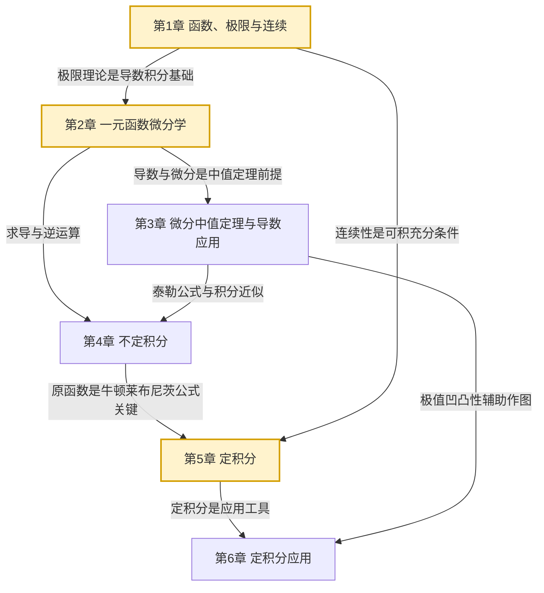

# MOC - 高等数学A(1)

> [!info] 课程定位
> 高等数学A(1) 是理工科本科生的一年级数学基础课（上册），研究**一元函数的微积分**。它要解决的核心问题是：如何用极限语言严格描述函数的变化趋势（极限与连续）、如何刻画函数的瞬时变化率（导数与微分）、如何由已知导数还原原函数（不定积分）、如何精确计算累积量（定积分）以及如何将定积分应用于几何与物理问题（面积、体积、弧长、功等）。
>
> 本课程是 [[MOC - 概率论与数理统计B]]（连续型随机变量、概率密度积分）、[[MOC - 线性代数A]]（函数空间的前置直觉）与后续工程数学的**数学基础**。掌握本章后，"以直代曲""分割—求和—取极限""局部线性化"这三条微积分核心思想才有了严格的数学表达。

## 课程摘要

本课程围绕"**极限—连续—导数—微分—中值定理—积分—应用**"七条主线展开。学生需要掌握：

1. 集合与函数的基本概念、数列极限与函数极限、无穷小量与无穷大量、极限运算法则、两个重要极限、无穷小的比较、函数连续性与间断点分类；
2. 导数概念与几何意义、求导法则（四则、复合、反函数）、高阶导数、隐函数与参数方程求导、函数微分与微分近似计算；
3. 罗尔定理、拉格朗日中值定理、柯西中值定理、洛必达法则、泰勒公式、函数单调性与极值、曲线凹凸性与拐点、函数作图与曲率；
4. 不定积分概念与性质、换元积分法（第一类、第二类）、分部积分法、有理函数积分、三角函数有理式积分；
5. 定积分定义与性质、微积分基本公式（牛顿—莱布尼茨公式）、定积分换元与分部积分、反常积分（无穷限、无界函数）、定积分近似计算；
6. 定积分的几何应用（平面图形面积、旋转体体积、平面曲线弧长）与物理应用（变力做功、液体压力、引力）。

## 章节结构与依赖关系

> [!tip] 学习顺序建议
> 严格按 **第1章→第2章→第3章→第4章→第5章→第6章** 顺序学习。第1章极限理论是全课程基石；第2章导数是极限的应用；第3章中值定理连接导数与函数整体性态；第4章不定积分是求导的逆运算；第5章定积分是全课程高潮，牛顿—莱布尼茨公式将微分与积分统一；第6章是定积分的工程化应用。

## 章节导航

| 章节 | 主题 | 入口 | 小节数 | 核心考点 |
| ---- | ---- | ---- | ------ | -------- |
| 第1章 | 函数、极限与连续 | [[MOC - 第1章]] | 8 | 极限计算、两个重要极限、间断点分类 |
| 第2章 | 一元函数微分学 | [[MOC - 第2章]] | 6 | 复合函数求导、隐函数求导、微分 |
| 第3章 | 微分中值定理与导数应用 | [[MOC - 第3章]] | 6 | 中值定理证明、洛必达法则、泰勒公式、极值凹凸性 |
| 第4章 | 不定积分 | [[MOC - 第4章]] | 5 | 换元法、分部积分、有理函数积分 |
| 第5章 | 定积分 | [[MOC - 第5章]] | 5 | 牛顿—莱布尼茨公式、反常积分敛散性 |
| 第6章 | 定积分应用 | [[MOC - 第6章]] | 4 | 面积、体积、弧长、物理应用 |

## 三大核心思想

> [!abstract] 微积分的核心思想
> 1. **极限思想**：用"任意接近"代替"达到"，是处理无穷过程的严格语言。数列极限 $\lim_{n\to\infty}a_n=a$、函数极限 $\lim_{x\to x_0}f(x)=A$、定积分 $\int_a^b f(x)\mathrm dx=\lim_{\lambda\to 0}\sum f(\xi_i)\Delta x_i$ 都建立在极限之上。
>
> 2. **以直代曲**（局部线性化）：在一点附近用切线（直线）代替曲线，用微分 $\mathrm dy=f'(x)\mathrm dx$ 近似函数增量 $\Delta y$。这是导数应用与近似计算的核心。
>
> 3. **分割—求和—取极限**：定积分的构造方法。将区间 $[a,b]$ 分割为 $n$ 份，每份取近似值求和，令分割细度趋于零取极限，得到精确的累积量。

## 学习方法建议

> [!tip] 高效学习路径
> 1. **极限计算**是第1章重点：掌握代入法、约分法、有理化、等价无穷小替换、两个重要极限、洛必达法则（第3章）的适用场景。
> 2. **求导运算**必须熟练：复合函数求导链式法则、隐函数求导、参数方程求导是后续物理、工程计算的基石。
> 3. **中值定理证明题**是难点：理解罗尔、拉格朗日、柯西三个定理的几何意义与构造辅助函数的技巧。
> 4. **积分计算**重在识别类型：判断被积函数属于换元型、分部型还是有理函数型，是快速求解的关键。
> 5. **定积分应用**重在"微元法"：掌握 $\mathrm dA=f(x)\mathrm dx$（面积微元）、$\mathrm dV=\pi f^2(x)\mathrm dx$（体积微元）的构造方法。

## 与下游课程的衔接

- **概率论与数理统计B**：连续型随机变量的概率密度 $f(x)$ 需要积分 $\int_a^b f(x)\mathrm dx$ 计算概率；期望 $E(X)=\int x f(x)\mathrm dx$、方差 $D(X)=\int (x-\mu)^2 f(x)\mathrm dx$ 都是定积分应用。
- **线性代数A**：多元微积分（下册）需要矩阵与向量空间知识；本课程建立的一维直觉是理解高维的基础。
- **数值分析**：定积分近似计算（梯形法、辛普森法）是数值积分的入门。
- **物理与工程**：变力做功、转动惯量、电磁场积分公式都依赖定积分。

## 章节导航

- 上一级：[[MOC - 数学基础]]
- 配套习题：见各章节 MOC 中的"本章习题"链接
- 关联课程：[[MOC - 概率论与数理统计B]]、[[MOC - 线性代数A]]、[[MOC - 高等数学A(2)]]

## 相关标签

#高等数学 #一元微积分 #极限 #连续 #导数 #微分 #中值定理 #不定积分 #定积分 #积分应用
