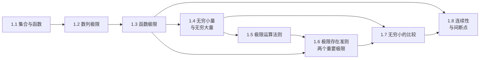

# MOC - 第1章 函数、极限与连续

> [!info] 本章定位
> 本章是高等数学 A(1) 的起点，也是整个微积分的逻辑基石。它要解决的核心问题是：如何用**严格的数学语言**描述函数值在自变量无限趋近某点（或无穷远）时的变化趋势，从而为"瞬时变化率"（导数）与"无穷分割求和"（定积分）提供合法化工具。具体而言，本章先回顾集合与函数的预备概念，再用 $\varepsilon$-$N$、$\varepsilon$-$\delta$ 语言严格定义数列极限与函数极限，建立无穷小理论、极限运算法则与两个重要极限，最后以连续性与间断点分类收束，给出闭区间上连续函数的整体性质。掌握本章后，后续导数、积分、级数等所有"无穷过程"才有了严格意义。

## 学习路线图

> [!tip] 学习顺序建议
> 1.1 是预备知识，重点理解函数四特性与复合、反函数结构；1.2 引入极限的严格语言，是全章难点，务必吃透 $\varepsilon$-$N$ 论证；1.3 把极限推广到函数，引入左右极限与充要条件；1.4 用无穷小重新表述极限，是后续计算的钥匙；1.5–1.7 是极限计算的工具箱；1.8 把极限概念用于连续性，是导数定义的直接前提。

## 知识点导航

| 节 | 主题 | 核心要点 | 入口 |
| -- | ---- | -------- | ---- |
| 1.1 | 集合与函数 | 映射三要素、函数定义域与值域、有界/单调/奇偶/周期、反函数与复合函数、初等函数与双曲函数 | [[1.1 集合与函数]] |
| 1.2 | 数列极限 | $\varepsilon$-$N$ 定义、几何意义、收敛数列唯一性/有界性/保号性/子列收敛、夹逼与单调有界准则 | [[1.2 数列极限]] |
| 1.3 | 函数极限 | $\varepsilon$-$\delta$ 定义、$x\to\infty$ 极限、左右极限、极限存在充要条件、函数极限性质 | [[1.3 函数极限]] |
| 1.4 | 无穷小量与无穷大量 | 无穷小定义与性质、无穷大定义、无穷小与无穷大互倒关系、极限与无穷小的等价转化 | [[1.4 无穷小量与无穷大量]] |
| 1.5 | 极限运算法则 | 四则运算法则、复合函数极限法则、幂指函数极限、多项式与有理函数极限 | [[1.5 极限运算法则]] |
| 1.6 | 极限存在准则、两个重要极限 | 夹逼准则、单调有界准则、$\lim_{x\to0}\frac{\sin x}{x}=1$、$\lim_{x\to\infty}(1+\frac1x)^x=e$ | [[1.6 极限存在准则、两个重要极限]] |
| 1.7 | 无穷小的比较 | 阶的概念、同阶/高阶/低阶/等价无穷小、等价无穷小替换定理、常见等价无穷小表 | [[1.7 无穷小的比较]] |
| 1.8 | 函数连续性与间断点 | 连续性三种定义、间断点分类（第一类/第二类）、连续函数运算性质、闭区间连续函数四大定理 | [[1.8 函数连续性与间断点]] |

## 核心考点

> [!warning] 重点掌握
> 1. 用 $\varepsilon$-$N$、$\varepsilon$-$\delta$ 语言证明简单极限，理解"任意给定 $\varepsilon$"中 $\varepsilon$ 的主动性与 $N$（或 $\delta$）的依赖性。
> 2. 极限计算的综合能力：代入法、约分、有理化、等价无穷小替换、两个重要极限、洛必达法则（[[MOC - 第3章]]预告）的适用条件与陷阱。
> 3. 左右极限用于分段函数分界点、含绝对值、$\operatorname{sgn}$、$\mathrm e^{\frac1x}$ 类极限的判定。
> 4. 两个重要极限的变形识别：$\frac{\sin \square}{\square}\to1$ 与 $(1+\square)^{1/\square}\to e$（$\square\to0$）。
> 5. 等价无穷小替换定理的适用范围：**只能对乘除因子替换，不能对加减项整体替换**。
> 6. 间断点分类：第一类（可去、跳跃）与第二类（无穷、振荡）的判别，关键是求左右极限。
> 7. 闭区间上连续函数的四大定理（最值、有界、零点、介值）及其在方程根存在性证明中的应用。

## 自测题

> [!question] 自测题 1
> 用 $\varepsilon$-$N$ 语言证明 $\displaystyle\lim_{n\to\infty}\frac{2n+1}{3n-2}=\frac23$。

> > [!check]- 参考答案
> > 对任意 $\varepsilon>0$，要使
> > $$\left|\frac{2n+1}{3n-2}-\frac23\right|=\left|\frac{3(2n+1)-2(3n-2)}{3(3n-2)}\right|=\frac{7}{3(3n-2)}<\varepsilon.$$
> > 解 $\frac{7}{3(3n-2)}<\varepsilon$ 得 $n>\frac{1}{3}\left(\frac{7}{3\varepsilon}+2\right)$。取 $N=\left\lceil\frac{1}{3}\left(\frac{7}{3\varepsilon}+2\right)\right\rceil$，则当 $n>N$ 时上式成立。故极限为 $\frac23$。

> [!question] 自测题 2
> 求极限 $\displaystyle\lim_{x\to0}\frac{\sqrt{1+x\sin x}-1}{x^2}$。

> > [!check]- 参考答案
> > 分子有理化：
> > $$\frac{\sqrt{1+x\sin x}-1}{x^2}=\frac{x\sin x}{x^2(\sqrt{1+x\sin x}+1)}=\frac{\sin x/x}{\sqrt{1+x\sin x}+1}.$$
> > 当 $x\to0$ 时 $\frac{\sin x}{x}\to1$，$\sqrt{1+x\sin x}\to1$，故原式 $=\dfrac{1}{2}$。

> [!question] 自测题 3
> 讨论函数 $f(x)=\dfrac{x^2-1}{x^2-x}$ 在 $x=0$、$x=1$ 处间断点的类型。

> > [!check]- 参考答案
> > $f(x)=\frac{(x-1)(x+1)}{x(x-1)}$。在 $x=0$：$\lim_{x\to0}f(x)=\lim_{x\to0}\frac{x+1}{x}=\infty$，为第二类（无穷）间断点。在 $x=1$：$\lim_{x\to1}\frac{x+1}{x}=2$ 存在但函数无定义，为第一类（可去）间断点。

> [!question] 自测题 4
> 证明方程 $x^3-4x^2+1=0$ 在 $(0,1)$ 内至少有一个实根。

> > [!check]- 参考答案
> > 令 $f(x)=x^3-4x^2+1$，$f$ 在 $[0,1]$ 上连续。$f(0)=1>0$，$f(1)=-2<0$，由零点定理，存在 $\xi\in(0,1)$ 使 $f(\xi)=0$，即方程在 $(0,1)$ 内有实根。

## 章节导航

- 上一级：[[MOC - 高等数学A(1)]]
- 下一章：[[MOC - 第2章]]
- 本章习题：[[MOC - 第1章习题]]

## 相关标签

#高等数学 #一元微积分 #极限 #连续 #函数 #间断点
