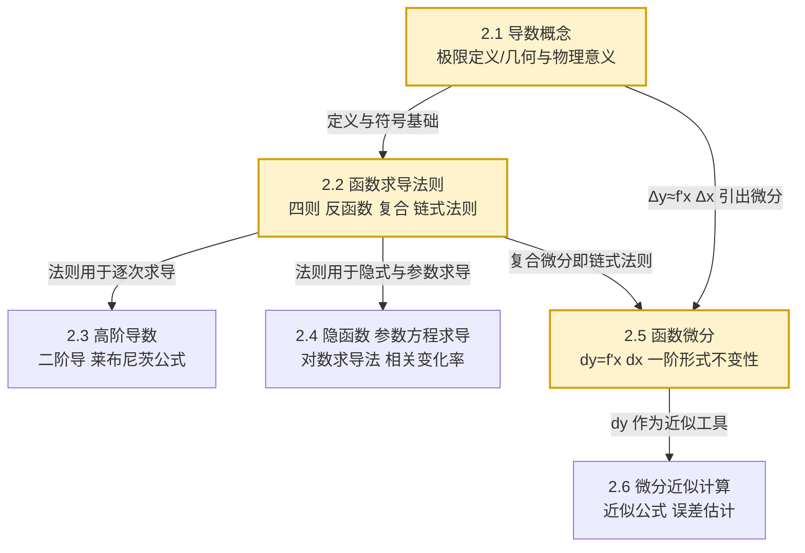

# MOC - 第2章 一元函数微分学

> [!info] 本章定位
> 本章承接 [[MOC - 第1章]] 的极限理论，把"瞬时变化率"用极限严格化，得到**导数**；再由"局部线性化"引出**微分**。导数回答"函数在某点变化得多快"，微分回答"自变量微小变化时函数值大约改变多少"。
>
> 本章是后续 [[MOC - 第3章]]（中值定理、泰勒公式、极值凹凸性）和 [[MOC - 第4章]]（不定积分作为求导逆运算）的运算基础。掌握本章后，"以直代曲"这一微积分核心思想才有了可计算的形式 $f(x+\Delta x)\approx f(x)+f'(x)\Delta x$。

## 学习路线图

## 知识点导航

| 小节 | 主题 | 入口 | 核心内容 | 关键考点 |
| ---- | ---- | ---- | -------- | -------- |
| 2.1 | 导数概念 | [[2.1 导数概念]] | 极限定义、单侧导数、切线斜率、可导与连续 | 用定义求导、可导性判定 |
| 2.2 | 函数求导法则 | [[2.2 函数求导法则]] | 四则、反函数、复合链式法则、基本公式表 | 复合函数链式求导 |
| 2.3 | 高阶导数 | [[2.3 高阶导数]] | $n$ 阶导数定义、莱布尼茨公式、常见高阶导数 | 莱布尼茨公式应用 |
| 2.4 | 隐函数、参数方程求导 | [[2.4 隐函数、参数方程求导]] | 隐函数求导、对数求导法、参数方程一二阶导、相关变化率 | 参数方程二阶导 |
| 2.5 | 函数微分 | [[2.5 函数微分]] | $\mathrm dy=f'(x)\mathrm dx$、几何意义、一阶微分形式不变性 | 一阶形式不变性 |
| 2.6 | 微分近似计算 | [[2.6 微分近似计算]] | $\Delta y\approx\mathrm dy$、常用近似公式、误差估计 | 近似值与误差估计 |

## 核心考点

> [!important] 本章高频考点
> 1. **导数定义计算**：用增量比极限 $\lim\limits_{\Delta x\to0}\dfrac{f(x_0+\Delta x)-f(x_0)}{\Delta x}$ 求特定点的导数，识别 $\frac{0}{0}$ 型极限与导数定义的联系。
> 2. **可导与连续关系**：可导必连续，连续不一定可导（如 $y=|x|$ 在 $x=0$）；分段函数在分界点用左右导数判定可导性。
> 3. **复合函数链式法则**：设 $y=f(u),u=\varphi(x)$，则 $\dfrac{\mathrm dy}{\mathrm dx}=f'(u)\varphi'(x)$，逐层求导不漏层。
> 4. **隐函数与参数方程求导**：对方程两边关于 $x$ 求导解出 $y'$；参数方程二阶导 $\dfrac{\mathrm d^2y}{\mathrm dx^2}=\dfrac{\mathrm d}{\mathrm dx}\!\left(\dfrac{y'(t)}{x'(t)}\right)\neq\dfrac{y''(t)}{x''(t)}$。
> 5. **对数求导法**：适用于幂指函数 $u(x)^{v(x)}$ 与多因子乘除乘开式，先取对数再求导。
> 6. **高阶导数**：莱布尼茨公式 $(uv)^{(n)}=\sum\limits_{k=0}^{n}\binom{n}{k}u^{(n-k)}v^{(k)}$，常见 $\sin x$、$\cos x$、$\ln(1+x)$、$(1+x)^\alpha$ 的 $n$ 阶导。
> 7. **微分与近似计算**：$\Delta y\approx\mathrm dy=f'(x_0)\Delta x$，$(1+x)^\alpha\approx1+\alpha x$，绝对误差 $\delta y\approx|f'(x_0)|\delta x$。

## 本章自测题

> [!question]- 自测 1：用导数定义求值
> 设 $f(x)=x^2+3x$，用增量比极限求 $f'(2)$。
>
> **答**：$f'(2)=\lim\limits_{\Delta x\to0}\dfrac{(2+\Delta x)^2+3(2+\Delta x)-(4+6)}{\Delta x}=\lim\limits_{\Delta x\to0}\dfrac{7\Delta x+(\Delta x)^2}{\Delta x}=7$。

> [!question]- 自测 2：分段函数可导性
> 讨论 $f(x)=|x|$ 在 $x=0$ 处的连续性与可导性。
>
> **答**：$\lim\limits_{x\to0}|x|=0=f(0)$，故连续。左导数 $f'_-(0)=\lim\limits_{x\to0^-}\dfrac{-x-0}{x}=-1$，右导数 $f'_+(0)=\lim\limits_{x\to0^+}\dfrac{x-0}{x}=1$，二者不等，故 $f(x)$ 在 $x=0$ 不可导。

> [!question]- 自测 3：链式法则
> 求 $y=\ln(\sin x)$ 的导数。
>
> **答**：$y'=\dfrac{1}{\sin x}\cdot(\sin x)'=\dfrac{\cos x}{\sin x}=\cot x$。

> [!question]- 自测 4：参数方程二阶导
> 设 $x=t-\sin t,\ y=1-\cos t$，求 $\dfrac{\mathrm d^2y}{\mathrm dx^2}$。
>
> **答**：$\dfrac{\mathrm dy}{\mathrm dx}=\dfrac{y'(t)}{x'(t)}=\dfrac{\sin t}{1-\cos t}$；$\dfrac{\mathrm d^2y}{\mathrm dx^2}=\dfrac{1}{1-\cos t}\dfrac{\mathrm d}{\mathrm dt}\!\left(\dfrac{\sin t}{1-\cos t}\right)=-\dfrac{1}{(1-\cos t)^2}$（化简后）。

## 与前后章的关系

- **前置**：[[MOC - 第1章]] 提供极限、连续、无穷小等概念，导数本质是 $\frac{0}{0}$ 型极限，必须先掌握极限计算。
- **后续**：[[MOC - 第3章]] 用导数研究中值定理与函数性态；[[MOC - 第4章]] 把求导反过来求原函数；[[MOC - 第5章]] 微积分基本公式把微分与积分统一。
- **课程总览**：[[MOC - 高等数学A(1)]]。

## 章节导航

- 上一章：[[MOC - 第1章]] ｜ 下一章：[[MOC - 第3章]]
- 配套习题：[[MOC - 第2章习题]]
- 上级：[[MOC - 高等数学A(1)]]

## 相关标签

#高等数学 #一元微积分 #导数 #微分 #求导法则
