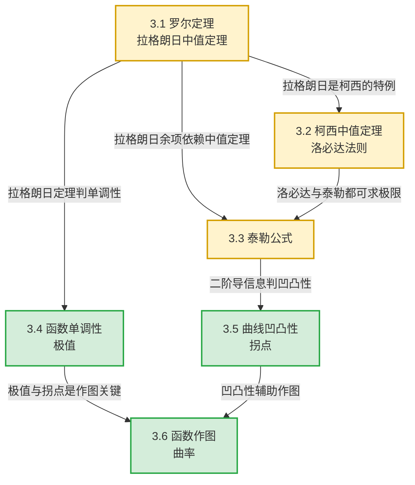
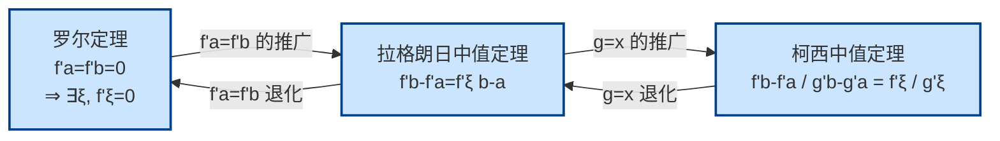

# MOC - 第3章 微分中值定理与导数应用

> [!info] 本章定位
> 第3章是连接**导数（局部性质）**与**函数整体性态**的桥梁。第2章解决了"如何求导"，本章解决"导数能告诉我们什么"。其核心问题有三：
> 1. **桥梁问题**：如何用导数信息（局部）推断函数增量、单调性、极值、凹凸性等整体性态？答案是三大微分中值定理（罗尔、拉格朗日、柯西）。
> 2. **极限计算问题**：第1章中等价无穷小替换失效的复杂极限（如 $\frac{f(x)}{g(x)}$ 的 $\frac{0}{0}$、$\frac{\infty}{\infty}$ 型）如何系统求解？答案是洛必达法则，其理论基础正是柯西中值定理。
> 3. **高精度逼近问题**：微分 $\mathrm dy=f'(x)\mathrm dx$ 只是线性逼近，误差为 $o(\Delta x)$。如何得到二阶、三阶乃至 $n$ 阶的高精度逼近？答案是泰勒公式，它用多项式逼近一般函数并给出可控的余项。
>
> 本章是上册的**理论核心**与**考研重点**，掌握后才可进入第4章不定积分（积分法需用泰勒展开处理某些被积函数）与第6章定积分应用（极值凹凸性辅助作图、弧长与曲率）。

## 学习路线图

> [!tip] 学习建议
> - **3.1—3.3** 是**理论篇**：必须严格记忆每个定理的条件与结论，理解几何意义，掌握构造辅助函数的常用模式。
> - **3.4—3.6** 是**应用篇**：在掌握中值定理与泰勒公式后，用导数信息系统地研究函数性态。重点是一阶导判单调极值、二阶导判凹凸拐点。
> - **证明题**是本章难点：罗尔定理证等式（含 $\xi$ 的等式）、拉格朗日证不等式、柯西处理双函数情形是三大模板。

## 知识点导航

| 小节 | 主题 | 核心定理/方法 | 难度 | 链接 |
| ---- | ---- | ------------- | ---- | ---- |
| 3.1 | 罗尔定理、拉格朗日中值定理 | 罗尔定理、拉格朗日中值定理、有限增量公式 | ★★★★ | [[3.1 罗尔定理、拉格朗日中值定理]] |
| 3.2 | 柯西中值定理、洛必达法则 | 柯西中值定理、洛必达法则（0/0、∞/∞） | ★★★★ | [[3.2 柯西中值定理、洛必达法则]] |
| 3.3 | 泰勒公式 | 泰勒中值定理、拉格朗日余项、佩亚诺余项、麦克劳林公式 | ★★★★★ | [[3.3 泰勒公式]] |
| 3.4 | 函数单调性、极值 | 单调性判别法、费马引理、极值第一/第二充分条件 | ★★★ | [[3.4 函数单调性、极值]] |
| 3.5 | 曲线凹凸性、拐点 | 凹凸性判别法、拐点必要条件与充分条件 | ★★★ | [[3.5 曲线凹凸性、拐点]] |
| 3.6 | 函数作图、曲率 | 渐近线、弧微分、曲率公式、曲率圆 | ★★★ | [[3.6 函数作图、曲率]] |

## 核心考点

> [!important] 本章六大核心考点
> 1. **中值定理证明题**：含中值 $\xi$ 的等式证明，构造辅助函数 $F(x)$ 后用罗尔定理（最常考）。
> 2. **不等式证明**：用拉格朗日中值定理 $f(b)-f(a)=f'(\xi)(b-a)$，配合 $f'(\xi)$ 的范围放缩；或用泰勒展开比较。
> 3. **洛必达法则求极限**：识别 $\frac{0}{0}$、$\frac{\infty}{\infty}$ 型，注意与其他方法（等价无穷小、泰勒展开）配合使用；警惕洛必达失效情形。
> 4. **泰勒展开与应用**：熟记 $e^x$、$\sin x$、$\cos x$、$\ln(1+x)$、$(1+x)^\alpha$ 的麦克劳林公式；用泰勒公式求极限、证明不等式、近似计算。
> 5. **极值与最值**：求极值点（一阶导为零或不存在的点），用第一或第二充分条件判定；实际问题求最值注意边界与不可导点。
> 6. **凹凸性与拐点判定**：二阶导符号判凹凸，二阶导变号判拐点；综合单调性、极值、凹凸性、渐近线作函数图像。

## 三大中值定理关系图

> [!note] 三定理的统一性
> 三个定理本质上描述同一几何事实：**光滑曲线上存在一点，其切线与割线平行**。当 $g(x)=x$ 时柯西退化为拉格朗日；当 $f(a)=f(b)$ 时拉格朗日退化为罗尔。理解这种"特例—推广"关系有助于记忆。

## 自测题

> [!question]- 自测1（罗尔定理构造）
> 设 $f(x)$ 在 $[0,1]$ 上连续，在 $(0,1)$ 内可导，且 $f(0)=0$，$f(1)=1$。证明：存在 $\xi\in(0,1)$，使 $f'(\xi)=2\xi$。
>
> > [!check]- 答案
> > 构造辅助函数 $F(x)=f(x)-x^2$。则 $F(0)=f(0)-0=0$，$F(1)=f(1)-1=0$。由罗尔定理，$\exists\xi\in(0,1)$，使 $F'(\xi)=0$，即 $f'(\xi)-2\xi=0$，故 $f'(\xi)=2\xi$。

> [!question]- 自测2（洛必达求极限）
> 求 $\displaystyle\lim_{x\to 0}\dfrac{x-\sin x}{x^3}$。
>
> > [!check]- 答案
> > 这是 $\frac{0}{0}$ 型，连续用洛必达三次：
> > $$\lim_{x\to 0}\frac{x-\sin x}{x^3}=\lim_{x\to 0}\frac{1-\cos x}{3x^2}=\lim_{x\to 0}\frac{\sin x}{6x}=\lim_{x\to 0}\frac{\cos x}{6}=\frac{1}{6}$$
> > 也可用泰勒公式 $\sin x=x-\dfrac{x^3}{6}+o(x^3)$ 直接得 $\dfrac{1}{6}$。

> [!question]- 自测3（泰勒展开应用）
> 求 $\displaystyle\lim_{x\to 0}\dfrac{e^x-1-x-\frac{x^2}{2}}{x^3}$。
>
> > [!check]- 答案
> > 用 $e^x=1+x+\dfrac{x^2}{2}+\dfrac{x^3}{6}+o(x^3)$ 代入：
> > $$\lim_{x\to 0}\frac{\frac{x^3}{6}+o(x^3)}{x^3}=\frac{1}{6}$$

> [!question]- 自测4（极值与凹凸性综合）
> 设 $f(x)=x^3-3x^2+1$，求其极值、拐点，并简述凹凸区间。
>
> > [!check]- 答案
> > $f'(x)=3x^2-6x=3x(x-2)$，令 $f'(x)=0$ 得 $x=0,2$。
> > $f''(x)=6x-6=6(x-1)$，令 $f''(x)=0$ 得 $x=1$。
> > - $x=0$：$f''(0)=-6<0$，故 $x=0$ 为极大值点，$f(0)=1$；
> > - $x=2$：$f''(2)=6>0$，故 $x=2$ 为极小值点，$f(2)=-3$；
> > - $x=1$：$f''$ 变号（由负变正），故 $(1,f(1))=(1,-1)$ 为拐点；
> > - $(-\infty,1)$ 上 $f''<0$，曲线凸；$(1,+\infty)$ 上 $f''>0$，曲线凹。

## 章节导航

- 上一级：[[MOC - 高等数学A(1)]]
- 上一章：[[MOC - 第2章]]（待建）
- 下一章：[[MOC - 第4章]]（待建）
- 配套习题：[[MOC - 第3章习题]]

## 相关标签

#高等数学 #一元微积分 #中值定理 #洛必达法则 #泰勒公式 #极值 #凹凸性
