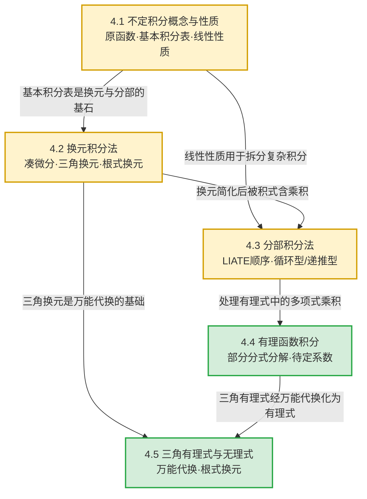
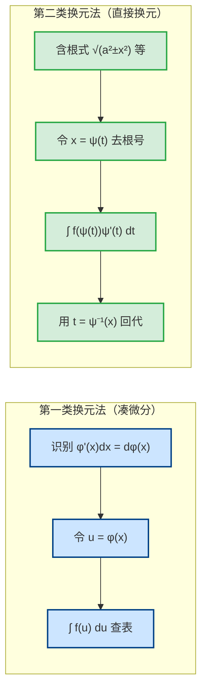

# MOC - 第4章 不定积分

> [!info] 本章定位
> 第4章是微分学的**逆问题**：第2章解决"已知函数求导数"，本章解决"已知导数 $F'(x)=f(x)$，求原函数 $F(x)$"。这种"求反导数"的运算称为**不定积分**。
>
> 本章核心问题有三个：
> 1. **原函数存在性问题**：什么样的函数 $f(x)$ 必有原函数？答案是连续函数必有原函数（原函数存在定理，其严格证明依赖第5章定积分与变上限积分）。
> 2. **积分法体系问题**：即便知道原函数存在，如何把它"求出来"？本章建立两套核心方法——**换元积分法**（凑微分与三角/根式换元）与**分部积分法**，并以此处理有理函数、三角有理式、简单无理式的积分。
> 3. **可积性与初等表达问题**：并非所有初等函数的原函数仍是初等函数（如 $e^{-x^2}$、$\sin x/x$），需区分"原函数存在"与"可初等表示"。
>
> 本章是上册的**计算核心**，是第5章定积分与第6章定积分应用（面积、体积、弧长、功）的直接工具，也是考研计算题的高频考点。

## 学习路线图

> [!tip] 学习建议
> - **4.1** 是地基：基本积分公式表必须**熟记**，它是所有后续方法的"目标库"——换元与分部的最终目的都是把被积式变成表中的形式。
> - **4.2—4.3** 是两大基本方法：凑微分法是使用频率最高的技巧，分部积分法处理乘积型积分。两者常联合使用。
> - **4.4—4.5** 是特殊类型积分的标准化流程：有理函数一定能积（部分分式分解），三角有理式经万能代换化为有理式，根式积分经换元去根号。掌握"识别类型→套流程"即可。

## 知识点导航

| 小节 | 主题 | 核心方法/定理 | 难度 | 链接 |
| ---- | ---- | ------------- | ---- | ---- |
| 4.1 | 不定积分概念与性质 | 原函数定义、原函数存在定理、基本积分公式表、线性性质 | ★★ | [[4.1 不定积分概念与性质]] |
| 4.2 | 换元积分法 | 第一类换元（凑微分）、第二类换元（三角换元、根式换元、倒代换） | ★★★★ | [[4.2 换元积分法]] |
| 4.3 | 分部积分法 | 分部积分公式、LIATE顺序、循环型/递推型/化简型 | ★★★★ | [[4.3 分部积分法]] |
| 4.4 | 有理函数积分 | 真分式/假分式、四类部分分式、待定系数法 | ★★★ | [[4.4 有理函数积分]] |
| 4.5 | 三角函数有理式积分 | 万能代换 $t=\tan(x/2)$、三角恒等变形、简单无理函数换元 | ★★★ | [[4.5 三角函数有理式积分]] |

## 核心考点

> [!important] 本章七大核心考点
> 1. **凑微分法**（[[4.2 换元积分法]]）：识别 $\int f(\varphi(x))\varphi'(x)\,\mathrm dx$ 的结构，熟记十二类常见凑微分模式（如 $\mathrm dx/x \to \mathrm d\ln x$、$x\,\mathrm dx \to \mathrm d(x^2/2)$、$\cos x\,\mathrm dx \to \mathrm d\sin x$）。
> 2. **第二类换元法**（[[4.2 换元积分法]]）：含 $\sqrt{a^2-x^2}$ 用 $x=a\sin t$；含 $\sqrt{a^2+x^2}$ 用 $x=a\tan t$；含 $\sqrt{x^2-a^2}$ 用 $x=a\sec t$；含 $\sqrt[n]{ax+b}$ 直接令 $t=\sqrt[n]{ax+b}$。
> 3. **分部积分法**（[[4.3 分部积分法]]）：$\int u\,\mathrm dv=uv-\int v\,\mathrm du$，按 LIATE（对数→反三角→代数→三角→指数）顺序选 $u$；识别循环型（$\int e^x\sin x\,\mathrm dx$）与递推型（$\int \sin^n x\,\mathrm dx$、$\int x^n e^x\,\mathrm dx$）。
> 4. **有理函数积分**（[[4.4 有理函数积分]]）：假分式先除化为真分式，真分式分解为四类部分分式（$\dfrac{A}{x-a}$、$\dfrac{A}{(x-a)^k}$、$\dfrac{Ax+B}{x^2+px+q}$、$\dfrac{Ax+B}{(x^2+px+q)^k}$，其中判别式 $p^2-4q<0$）。
> 5. **三角有理式积分**（[[4.5 三角函数有理式积分]]）：万能代换 $t=\tan(x/2)$ 把 $\int R(\sin x,\cos x)\,\mathrm dx$ 化为有理函数积分；优先尝试三角恒等变形降次。
> 6. **简单无理函数积分**（[[4.5 三角函数有理式积分]]）：含 $\sqrt{ax+b}$ 令 $t=\sqrt{ax+b}$；含 $\sqrt{\dfrac{ax+b}{cx+d}}$ 令 $t=\sqrt{\dfrac{ax+b}{cx+d}}$。
> 7. **原函数与不定积分概念辨析**（[[4.1 不定积分概念与性质]]）：原函数若存在则有无穷多个且相差常数；不定积分是原函数全体，记号 $\int f(x)\,\mathrm dx=F(x)+C$；$\dfrac{\mathrm d}{\mathrm dx}\int f(x)\,\mathrm dx=f(x)$ 与 $\int F'(x)\,\mathrm dx=F(x)+C$ 表明积分与微分互逆。

## 两类换元法对比

> [!note] 两类换元法的方向
> 第一类换元法是"**由内向外**"——把被积式中的某一部分 $\varphi'(x)\mathrm dx$ 凑成 $\mathrm d\varphi(x)$，再令 $u=\varphi(x)$；第二类换元法是"**由外向内**"——直接令 $x=\psi(t)$ 引入新变量去掉根式或化简结构。两者本质都是复合函数求导的逆运算。

## 自测题

> [!question]- 自测1（凑微分识别）
> 计算 $\displaystyle\int \dfrac{\sin(\ln x)}{x}\,\mathrm dx$。
>
> > [!check]- 答案
> > 注意到 $\dfrac{1}{x}\mathrm dx=\mathrm d(\ln x)$，令 $u=\ln x$，则 $\mathrm du=\dfrac{1}{x}\mathrm dx$：
> > $$\int \frac{\sin(\ln x)}{x}\,\mathrm dx=\int \sin u\,\mathrm du=-\cos u+C=-\cos(\ln x)+C$$

> [!question]- 自测2（第二类换元——三角换元）
> 计算 $\displaystyle\int \dfrac{\mathrm dx}{\sqrt{x^2+a^2}}$（$a>0$）。
>
> > [!check]- 答案
> > 令 $x=a\tan t$，$t\in(-\pi/2,\pi/2)$，则 $\mathrm dx=a\sec^2 t\,\mathrm dt$，$\sqrt{x^2+a^2}=a\sec t$：
> > $$\int \frac{\mathrm dx}{\sqrt{x^2+a^2}}=\int \frac{a\sec^2 t}{a\sec t}\,\mathrm dt=\int \sec t\,\mathrm dt=\ln|\sec t+\tan t|+C$$
> > 回代：$\tan t=\dfrac{x}{a}$，$\sec t=\dfrac{\sqrt{x^2+a^2}}{a}$，故
> > $$\int \frac{\mathrm dx}{\sqrt{x^2+a^2}}=\ln\left(x+\sqrt{x^2+a^2}\right)+C'$$
> > （$C'=C-\ln a$ 仍为任意常数）。

> [!question]- 自测3（分部积分——循环型）
> 计算 $\displaystyle\int e^x\sin x\,\mathrm dx$。
>
> > [!check]- 答案
> > 取 $u=\sin x$，$\mathrm dv=e^x\mathrm dx$，则 $v=e^x$，$\mathrm du=\cos x\mathrm dx$：
> > $$I=\int e^x\sin x\,\mathrm dx=e^x\sin x-\int e^x\cos x\,\mathrm dx$$
> > 对 $\int e^x\cos x\,\mathrm dx$ 再分部，取 $u=\cos x$，$\mathrm dv=e^x\mathrm dx$：
> > $$\int e^x\cos x\,\mathrm dx=e^x\cos x+\int e^x\sin x\,\mathrm dx=e^x\cos x+I$$
> > 故 $I=e^x\sin x-(e^x\cos x+I)$，即 $2I=e^x(\sin x-\cos x)$，$I=\dfrac{e^x(\sin x-\cos x)}{2}+C$。

> [!question]- 自测4（有理函数部分分式）
> 计算 $\displaystyle\int \dfrac{\mathrm dx}{x^2-1}$。
>
> > [!check]- 答案
> > $\dfrac{1}{x^2-1}=\dfrac{1}{(x-1)(x+1)}=\dfrac{1}{2}\left(\dfrac{1}{x-1}-\dfrac{1}{x+1}\right)$，故
> > $$\int \frac{\mathrm dx}{x^2-1}=\frac{1}{2}\left(\ln|x-1|-\ln|x+1|\right)+C=\frac{1}{2}\ln\left|\frac{x-1}{x+1}\right|+C$$

## 章节导航

- 上一级：[[MOC - 高等数学A(1)]]
- 上一章：[[MOC - 第3章]]（微分中值定理与导数应用）
- 下一章：[[MOC - 第5章]]（待建）
- 配套习题：[[MOC - 第4章习题]]

## 相关标签

#高等数学 #一元微积分 #不定积分 #换元法 #分部积分 #有理函数积分
