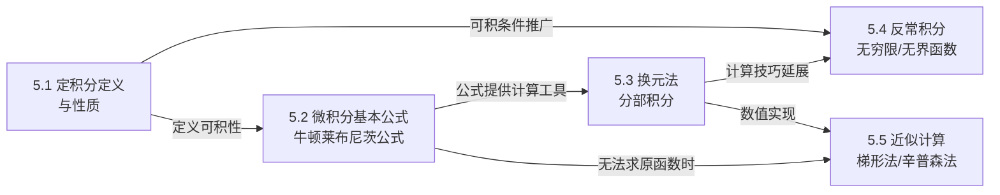

# MOC - 第5章 定积分

> [!info] 本章定位
> 本章是高等数学 A(1) 的**全课程高潮**，也是微积分思想的集大成者。它要解决的核心问题是：如何**精确地计算连续变化的累积量**——曲边梯形面积、变力做功、路程总量等。解决路径是"**分割—求和—取极限**"三步法，把无穷多个无穷小量的累积提升为严格的极限运算，得到定积分 $\displaystyle\int_a^b f(x)\,\mathrm dx$。
>
> 本章的真正灵魂是 [[5.2 微积分基本公式]] 中的**牛顿—莱布尼茨公式**：
> $$\int_a^b f(x)\,\mathrm dx=F(b)-F(a),\quad F'(x)=f(x)$$
> 它把"求累积量"这一看似复杂的极限过程，转化为"求原函数再代入端点"的代数运算，揭示了**微分与积分互为逆运算**这一深刻统一性。从此，第4章的不定积分方法与第3章的微分中值定理在本章汇流。本章末尾的反常积分把积分区间推广到无穷或被积函数推广到无界，为概率论（密度积分）与数学分析（$\Gamma$ 函数）打开门户。

## 学习路线图

> [!tip] 学习顺序建议
> 5.1 是概念奠基，必须吃透"分割—求和—取极限"三步法与可积充分条件，理解定积分是一个**由函数与区间共同决定的数**（不是函数，也不是反导数）；5.2 是全章核心，牛顿—莱布尼茨公式把定积分计算化为原函数端点差，必须掌握变上限积分求导定理的证明思路；5.3 是计算工具箱，重点是"换元必换限"与对称区间上奇偶函数的简化；5.4 把积分推广到无穷区间与无界函数，关键是敛散性判别；5.5 是当原函数不可求时的数值方法，为数值分析课程铺垫。

## 知识点导航

| 节 | 主题 | 核心要点 | 入口 |
| -- | ---- | -------- | ---- |
| 5.1 | 定积分定义与性质 | 分割—求和—取极限、Riemann 和、可积充分条件（连续/有限第一类间断/单调）、定积分几何意义、线性性/区间可加/单调性/积分中值定理 | [[5.1 定积分定义与性质]] |
| 5.2 | 微积分基本公式 | 变上限积分 $\Phi(x)=\int_a^x f(t)\,\mathrm dt$、变上限积分求导定理、牛顿—莱布尼茨公式及证明 | [[5.2 微积分基本公式]] |
| 5.3 | 定积分换元、分部积分 | 换元法（换元必换限）、分部积分法、奇偶函数对称区间积分、周期函数积分、Wallis 公式 | [[5.3 定积分换元、分部积分]] |
| 5.4 | 反常积分（无穷限、无界函数） | 三类无穷限反常积分、瑕积分、比较判别法与极限判别法、$\Gamma$ 函数与 $B$ 函数 | [[5.4 反常积分（无穷限、无界函数）]] |
| 5.5 | 定积分近似计算 | 矩形法（左/右/中点）、梯形法、抛物线法（辛普森法）、误差阶估计 | [[5.5 定积分近似计算]] |

## 核心考点

> [!warning] 重点掌握
> 1. **定积分定义**：用"分割—求和—取极限"写出 $\displaystyle\int_a^b f(x)\,\mathrm dx=\lim_{\lambda\to 0}\sum_{i=1}^n f(\xi_i)\Delta x_i$，理解 $\lambda=\max\Delta x_i\to 0$ 与 $n\to\infty$ 的区别；会利用定积分定义求**特殊结构和式**的极限（如 $\lim\limits_{n\to\infty}\frac1n\sum_{i=1}^n\sin\frac{i\pi}{n}$）。
> 2. **可积性判定**：闭区间连续 $\Rightarrow$ 可积；有限个第一类间断点 $\Rightarrow$ 可积；单调 $\Rightarrow$ 可积。注意"可积"与"存在原函数"是两个不同概念。
> 3. **定积分性质**：积分中值定理 $\int_a^b f=\,f(\xi)(b-a)$ 的几何意义（矩形面积等于曲边梯形面积）与 $\xi$ 的存在性；单调性、线性性、区间可加性的灵活运用。
> 4. **变上限积分求导**：$f$ 连续时 $\dfrac{\mathrm d}{\mathrm dx}\int_a^x f(t)\,\mathrm dt=f(x)$；变限积分是构造"非初等原函数"的通用工具，常与洛必达法则、极值问题结合。
> 5. **牛顿—莱布尼茨公式**：$\int_a^b f=F(b)-F(a)$，是定积分计算的根本工具；要求 $f$ 在 $[a,b]$ 上可积且存在原函数 $F$（$f$ 连续时二者皆满足）。
> 6. **换元法与分部积分**：换元三步——选替换 $x=\varphi(t)$、换限 $a\to\varphi^{-1}(a)$、换微分；分部积分的"反对幂指三"口诀；对称区间优先考虑奇偶性。
> 7. **反常积分敛散性判别**：比较判别法（与已知敛散的 $1/x^p$ 比较）、极限判别法（$\lim\limits_{x\to+\infty}x^p f(x)$）；$\int_1^{+\infty}\frac{\mathrm dx}{x^p}$ 在 $p>1$ 收敛、$\int_0^1\frac{\mathrm dx}{x^p}$ 在 $p<1$ 收敛是两大基准。
> 8. **$\Gamma$ 函数**：$\Gamma(s)=\int_0^{+\infty}x^{s-1}e^{-x}\,\mathrm dx$（$s>0$），递推 $\Gamma(s+1)=s\Gamma(s)$，$\Gamma(n+1)=n!$，与概率统计的指数分布、正态分布直接相关。

## 自测题

> [!question] 自测题 1
> 用定积分定义计算极限 $\displaystyle\lim_{n\to\infty}\frac{1}{n}\sum_{i=1}^{n}\sin\frac{i\pi}{n}$。

> > [!check]- 参考答案
> > 把和式改写为 $\displaystyle\sum_{i=1}^{n}\sin\!\left(\frac{i}{n}\pi\right)\cdot\frac{1}{n}$。视 $f(x)=\sin(\pi x)$，区间 $[0,1]$，分割 $\Delta x_i=\frac1n$，取点 $\xi_i=\frac{i}{n}$，则和式即 Riemann 和 $\sum f(\xi_i)\Delta x_i$。因 $\sin(\pi x)$ 在 $[0,1]$ 连续从而可积，故
> > $$\lim_{n\to\infty}\frac{1}{n}\sum_{i=1}^{n}\sin\frac{i\pi}{n}=\int_0^1\sin(\pi x)\,\mathrm dx=\left[-\frac{1}{\pi}\cos(\pi x)\right]_0^1=\frac{1}{\pi}(1-(-1))=\frac{2}{\pi}$$

> [!question] 自测题 2
> 设 $f(x)=\displaystyle\int_0^{x^2}\sin(1+t)\,\mathrm dt$，求 $f'(x)$。

> > [!check]- 参考答案
> > 这是变上限积分的复合形式。令 $u=x^2$，则 $f(x)=\Phi(u)$，$\Phi(u)=\int_0^u\sin(1+t)\,\mathrm dt$。由复合求导与 [[5.2 微积分基本公式|变上限积分求导定理]]：
> > $$f'(x)=\Phi'(u)\cdot\frac{\mathrm du}{\mathrm dx}=\sin(1+u)\cdot 2x=2x\sin(1+x^2)$$

> [!question] 自测题 3
> 判别反常积分 $\displaystyle\int_1^{+\infty}\frac{\ln x}{x^2}\,\mathrm dx$ 的敛散性，并在收敛时求其值。

> > [!check]- 参考答案
> > 用极限判别法：取 $p=2>1$，$\displaystyle\lim_{x\to+\infty}x^2\cdot\frac{\ln x}{x^2}=\lim_{x\to+\infty}\ln x=+\infty$，此法不能直接判定。改用比较：$x$ 充分大时 $\ln x<\sqrt{x}$，故 $\dfrac{\ln x}{x^2}<\dfrac{1}{x^{3/2}}$，而 $\int_1^{+\infty}\dfrac{\mathrm dx}{x^{3/2}}$ 收敛（$p=\frac32>1$），故原积分收敛。
> >
> > 用 [[5.3 定积分换元、分部积分|分部积分]] 求值：取 $u=\ln x$，$\mathrm dv=\dfrac{\mathrm dx}{x^2}$，则 $\mathrm du=\dfrac{\mathrm dx}{x}$，$v=-\dfrac1x$。
> > $$\int_1^{+\infty}\frac{\ln x}{x^2}\,\mathrm dx=\left[-\frac{\ln x}{x}\right]_1^{+\infty}+\int_1^{+\infty}\frac{1}{x^2}\,\mathrm dx=0+\left[-\frac1x\right]_1^{+\infty}=1$$
> > 其中 $\left.\dfrac{\ln x}{x}\right|_{x\to+\infty}=0$（洛必达），$\left.\ln x\right|_{x=1}=0$。

> [!question] 自测题 4
> 计算 $\displaystyle\int_{-\pi}^{\pi}\frac{x\sin x}{1+\cos^2 x}\,\mathrm dx$。

> > [!check]- 参考答案
> > 被积函数 $f(x)=\dfrac{x\sin x}{1+\cos^2 x}$：因 $f(-x)=\dfrac{-x\sin(-x)}{1+\cos^2(-x)}=\dfrac{x\sin x}{1+\cos^2 x}=f(x)$，$f$ 为**偶函数**（注意 $x\sin x$ 中 $x$ 奇 $\sin x$ 奇得偶）。故
> > $$I=2\int_0^{\pi}\frac{x\sin x}{1+\cos^2 x}\,\mathrm dx$$
> > 用 [[5.3 定积分换元、分部积分|对称区间技巧]] $\int_0^{\pi}xf(\sin x)\,\mathrm dx=\frac{\pi}{2}\int_0^{\pi}f(\sin x)\,\mathrm dx$（令 $x\to\pi-t$ 可证）。这里 $f(\sin x)=\dfrac{\sin x}{1+\cos^2 x}$，故
> > $$I=2\cdot\frac{\pi}{2}\int_0^{\pi}\frac{\sin x}{1+\cos^2 x}\,\mathrm dx=\pi\int_0^{\pi}\frac{-\mathrm d(\cos x)}{1+\cos^2 x}$$
> > 令 $u=\cos x$，$x:0\to\pi$ 时 $u:1\to-1$：
> > $$I=\pi\int_{1}^{-1}\frac{-\mathrm du}{1+u^2}=\pi\int_{-1}^{1}\frac{\mathrm du}{1+u^2}=\pi\cdot\frac{\pi}{2}=\frac{\pi^2}{2}$$

## 章节导航

- 上一级：[[MOC - 高等数学A(1)]]
- 上一章：[[MOC - 第4章]]（待建）
- 下一章：[[MOC - 第6章]]（待建）
- 本章习题：[[MOC - 第5章习题]]
- 本章小节：[[5.1 定积分定义与性质]]、[[5.2 微积分基本公式]]、[[5.3 定积分换元、分部积分]]、[[5.4 反常积分（无穷限、无界函数）]]、[[5.5 定积分近似计算]]

## 相关标签

#高等数学 #一元微积分 #定积分 #牛顿莱布尼茨公式 #反常积分
