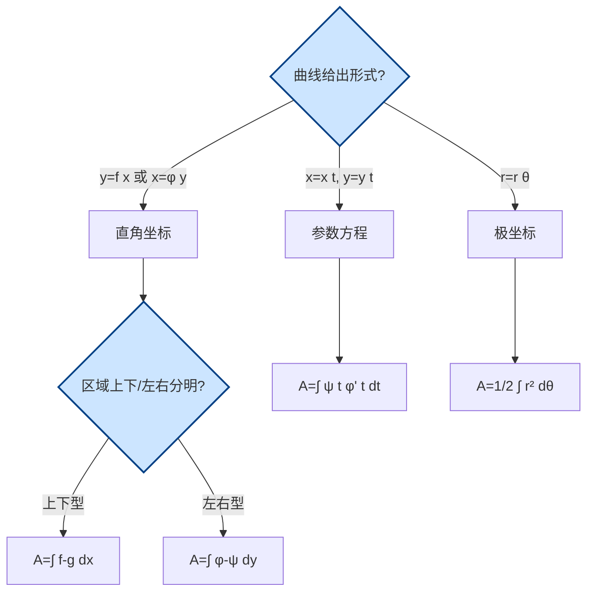

# 6.1 平面图形面积

> [!info] 本节定位
> 本节是第6章的**入门与基础**。它解决的核心问题是：**如何用定积分计算平面区域 $D$ 的面积 $A$？**
>
> 面积是本章所有几何应用的起点：[[6.2 旋转体体积]] 中的圆盘法可视为"面积微元 $\mathrm dA=\pi f^2\mathrm dx$"的累积；本节建立的"分割—取微元—积分"流程是全章**微元法**的模板。掌握本节后，体积、弧长、物理应用只是"换一个微元"。
>
> 本节按坐标系分三种情形：**直角坐标系**（上下型、左右型）、**参数方程**、**极坐标系**。选择哪种坐标系取决于曲线的给出方式与对称性。

## 一、微元法思想

> [!definition] 微元法（元素法）
> 设所求量 $U$ 关于区间 $[a,b]$ 具有可加性，且在代表性小区间 $[x,x+\mathrm dx]$ 上的部分量 $\Delta U$ 可近似为
> $$\Delta U\approx f(x)\,\mathrm dx$$
> 其中近似误差为 $o(\mathrm dx)$（即 $f(x)\mathrm dx$ 是 $\Delta U$ 的线性主部）。则称 $f(x)\mathrm dx$ 为所求量 $U$ 的**微元**，记作 $\mathrm dU=f(x)\mathrm dx$，所求量为
> $$U=\int_a^b f(x)\,\mathrm dx$$

> [!note] 微元法四步
> 1. **分割**：把区间 $[a,b]$ 分成若干小区间，取代表性小区间 $[x,x+\mathrm dx]$。
> 2. **近似**（关键）：在该微段上"以直代曲""以不变代变"，求出 $\Delta U$ 的近似值 $f(x)\mathrm dx$。
> 3. **求和**：$U\approx\sum f(x_i)\Delta x_i$。
> 4. **取极限**：令 $\|\Delta x_i\|\to 0$，得 $U=\int_a^b f(x)\mathrm dx$。
>
> 实际书写时常省略第3、4步，直接由"微元 $\mathrm dU=f(x)\mathrm dx$"写出积分。

## 二、直角坐标系下面积

### 2.1 上下型（对 $x$ 积分）

> [!theorem] 上下型面积公式
> **条件**：曲线 $y=f(x)$、$y=g(x)$ 在 $[a,b]$ 上连续，且 $f(x)\ge g(x)$。区域 $D=\{(x,y):a\le x\le b,\,g(x)\le y\le f(x)\}$。
>
> **结论**：
> $$\boxed{A=\int_a^b\bigl[f(x)-g(x)\bigr]\,\mathrm dx}$$

> [!proof] 微元法推导
> 取 $x\in[a,b]$，微段 $[x,x+\mathrm dx]$。在该微段上，区域近似为一个矩形：宽 $\mathrm dx$、高 $f(x)-g(x)$（上曲线减下曲线，因 $f\ge g$ 保证高非负）。故面积微元
> $$\mathrm dA=\bigl[f(x)-g(x)\bigr]\,\mathrm dx$$
> 累积即得 $A=\int_a^b[f(x)-g(x)]\mathrm dx$。

> [!warning] 易错点
> - 必须保证 $f(x)\ge g(x)$。若两曲线在 $[a,b]$ 内交叉，需**分区间**使每段内"上减下"非负，再分别积分相加。
> - 当 $g(x)\equiv 0$ 时退化为曲边梯形面积 $A=\int_a^b f(x)\mathrm dx$（要求 $f\ge 0$）。
> - 积分下限、上限由两曲线**交点**（或给定边界）确定，不是任取。

### 2.2 左右型（对 $y$ 积分）

> [!theorem] 左右型面积公式
> **条件**：曲线 $x=\varphi(y)$、$x=\psi(y)$ 在 $[c,d]$ 上连续，且 $\varphi(y)\ge\psi(y)$。区域 $D=\{(x,y):c\le y\le d,\,\psi(y)\le x\le\varphi(y)\}$。
>
> **结论**：
> $$A=\int_c^d\bigl[\varphi(y)-\psi(y)\bigr]\,\mathrm dy$$

> [!proof] 微元法推导
> 取 $y\in[c,d]$，微段 $[y,y+\mathrm dy]$。在该微段上，区域近似为矩形：高 $\mathrm dy$、宽 $\varphi(y)-\psi(y)$（右曲线减左曲线）。面积微元 $\mathrm dA=[\varphi(y)-\psi(y)]\mathrm dy$，积分即得。

> [!tip] 上下型 vs 左右型的选择
> - 若边界曲线表为 $y=f(x)$（函数对 $x$ 单值），且区域"上下分明"，选**上下型**（对 $x$ 积分）。
> - 若边界曲线表为 $x=\varphi(y)$（函数对 $y$ 单值），且区域"左右分明"，选**左右型**（对 $y$ 积分）。
> - 同一区域两种方式均可时，选**被积函数简单、不需分段**的那种。

> [!example] 例1：抛物线与直线围成面积
> 求由 $y=x^2$ 与 $y=x$ 所围区域的面积。
>
> **解**：先求交点：$x^2=x\Rightarrow x=0,1$，对应 $(0,0),(1,1)$。
> 在 $[0,1]$ 上，$y=x\ge y=x^2$（上为 $x$，下为 $x^2$），用上下型：
> $$A=\int_0^1(x-x^2)\,\mathrm dx=\left[\frac{x^2}{2}-\frac{x^3}{3}\right]_0^1=\frac12-\frac13=\frac16$$

> [!example] 例2：需分段的面积
> 求由 $y=\sin x$、$y=\cos x$、$x=0$、$x=\dfrac{\pi}{2}$ 所围区域面积。
>
> **解**：在 $[0,\pi/2]$ 上 $\sin x$ 与 $\cos x$ 在 $x=\pi/4$ 处相交（$\sin\dfrac{\pi}{4}=\cos\dfrac{\pi}{4}$）。
> - $[0,\pi/4]$：$\cos x\ge\sin x$，上减下 $=\cos x-\sin x$；
> - $[\pi/4,\pi/2]$：$\sin x\ge\cos x$，上减下 $=\sin x-\cos x$。
>
> $$A=\int_0^{\pi/4}(\cos x-\sin x)\,\mathrm dx+\int_{\pi/4}^{\pi/2}(\sin x-\cos x)\,\mathrm dx$$
> $$=\bigl[\sin x+\cos x\bigr]_0^{\pi/4}+\bigl[-\cos x-\sin x\bigr]_{\pi/4}^{\pi/2}$$
> $$=\left(\frac{\sqrt2}{2}+\frac{\sqrt2}{2}-0-1\right)+\left(-0-1+\frac{\sqrt2}{2}+\frac{\sqrt2}{2}\right)=2\sqrt2-2$$

## 三、参数方程下面积

> [!theorem] 参数方程面积公式
> **条件**：曲线 $L$ 由参数方程 $x=\varphi(t)$，$y=\psi(t)$（$t\in[\alpha,\beta]$）给出，$\varphi,\psi$ 在 $[\alpha,\beta]$ 上有连续导数，且 $\varphi$ 单调（保证 $x$ 与 $t$ 一一对应）。设 $x(\alpha)=a$，$x(\beta)=b$。曲线 $L$、$x$ 轴、$x=a$、$x=b$ 所围曲边梯形（$y\ge 0$）的面积为
> $$\boxed{A=\int_\alpha^\beta\psi(t)\,\varphi'(t)\,\mathrm dt\quad(\text{当 }a<b\text{，约定 }\varphi'\ge 0)}$$
> 一般形式为 $A=\left|\displaystyle\int_\alpha^\beta\psi(t)\varphi'(t)\,\mathrm dt\right|$，绝对值保证面积非负。

> [!proof] 微元法推导
> 直角坐标下 $A=\int_a^b y\,\mathrm dx$。参数化下 $\mathrm dx=\varphi'(t)\mathrm dt$，$y=\psi(t)$。当 $t$ 从 $\alpha$ 到 $\beta$ 对应 $x$ 从 $a$ 到 $b$ 时，直接换元：
> $$A=\int_a^b y\,\mathrm dx=\int_\alpha^\beta\psi(t)\varphi'(t)\,\mathrm dt$$
> 若 $\varphi$ 单调递减（$a>b$），积分结果为负，取绝对值。

> [!example] 例3：椭圆面积
> 求椭圆 $\dfrac{x^2}{a^2}+\dfrac{y^2}{b^2}=1$（$a,b>0$）的面积。
>
> **解**：参数方程 $x=a\cos t$，$y=b\sin t$，$t\in[0,2\pi]$。由对称性取第一象限 $t\in[0,\pi/2]$（对应 $x$ 从 $a$ 到 $0$，即 $a>b=0$）：
> $$A=4\cdot\left|\int_0^{\pi/2}b\sin t\cdot(-a\sin t)\,\mathrm dt\right|=4ab\int_0^{\pi/2}\sin^2 t\,\mathrm dt=4ab\cdot\frac{\pi}{4}=\pi ab$$
> 当 $a=b=R$ 时退化为圆面积 $\pi R^2$。

## 四、极坐标系下面积

> [!theorem] 极坐标面积公式
> **条件**：曲线 $r=r(\theta)$ 在 $[\alpha,\beta]$ 上连续非负，$0\le\beta-\alpha\le 2\pi$。由曲线 $r=r(\theta)$ 与射线 $\theta=\alpha$、$\theta=\beta$ 所围扇形区域的面积为
> $$\boxed{A=\frac12\int_\alpha^\beta r^2(\theta)\,\mathrm d\theta}$$

> [!proof] 微元法推导
> 取 $\theta\in[\alpha,\beta]$，微角 $[\theta,\theta+\mathrm d\theta]$。在该微小角内，曲线扫过的区域近似为一个**扇形**：半径 $r(\theta)$、圆心角 $\mathrm d\theta$。扇形面积 $\dfrac12 r^2\,\mathrm d\theta$（来自圆面积 $\pi r^2$ 中占比 $\dfrac{\mathrm d\theta}{2\pi}$）。故面积微元
> $$\mathrm dA=\frac12 r^2(\theta)\,\mathrm d\theta$$
> 积分即得 $A=\dfrac12\int_\alpha^\beta r^2(\theta)\mathrm d\theta$。

> [!note] 极坐标两曲线间面积
> 若区域由外曲线 $r=R(\theta)$ 与内曲线 $r=r(\theta)$（$R\ge r$）及射线 $\theta=\alpha,\beta$ 围成，则
> $$A=\frac12\int_\alpha^\beta\bigl[R^2(\theta)-r^2(\theta)\bigr]\,\mathrm d\theta$$

> [!example] 例4：心形线面积
> 求心形线 $r=a(1+\cos\theta)$（$a>0$）所围区域的面积。
>
> **解**：心形线关于极轴对称，取 $\theta\in[0,\pi]$ 然后加倍：
> $$A=2\cdot\frac12\int_0^\pi a^2(1+\cos\theta)^2\,\mathrm d\theta=a^2\int_0^\pi(1+2\cos\theta+\cos^2\theta)\,\mathrm d\theta$$
> 利用 $\cos^2\theta=\dfrac{1+\cos 2\theta}{2}$：
> $$\int_0^\pi\cos^2\theta\,\mathrm d\theta=\frac12\int_0^\pi(1+\cos 2\theta)\,\mathrm d\theta=\frac{\pi}{2}$$
> 又 $\int_0^\pi\cos\theta\,\mathrm d\theta=0$，故
> $$A=a^2\left(\pi+0+\frac{\pi}{2}\right)=\frac{3\pi a^2}{2}$$

> [!example] 例5：双纽线面积
> 求双纽线 $r^2=a^2\cos 2\theta$（$a>0$）所围区域的面积。
>
> **解**：要求 $\cos 2\theta\ge 0$，故 $\theta\in[-\pi/4,\pi/4]\cup[3\pi/4,5\pi/4]$。由对称性（两个叶，每叶关于极轴对称）：
> $$A=4\cdot\frac12\int_0^{\pi/4}a^2\cos 2\theta\,\mathrm d\theta=2a^2\cdot\frac{\sin 2\theta}{2}\bigg|_0^{\pi/4}=a^2\cdot 1=a^2$$

## 五、坐标系选择策略

> [!tip] 何时用极坐标
> 当曲线方程含 $x^2+y^2$、$\arctan(y/x)$ 或天然具有中心对称/轴对称（如圆、心形线、双纽线、玫瑰线）时，极坐标往往最简。

## 本节小结

> [!summary] 关键结论
> - **微元法**：取微段 → 近似 $\mathrm dU=f(x)\mathrm dx$ → 积分 $U=\int_a^b f(x)\mathrm dx$。
> - **上下型**：$A=\int_a^b[f(x)-g(x)]\mathrm dx$（$f\ge g$，对 $x$ 积分）。
> - **左右型**：$A=\int_c^d[\varphi(y)-\psi(y)]\mathrm dy$（$\varphi\ge\psi$，对 $y$ 积分）。
> - **参数方程**：$A=\int_\alpha^\beta\psi(t)\varphi'(t)\mathrm dt$（必要时取绝对值）。
> - **极坐标**：$A=\dfrac12\int_\alpha^\beta r^2(\theta)\mathrm d\theta$；两曲线间用 $R^2-r^2$。

## 章节导航

- 章节入口：[[MOC - 第6章]]
- 下一节：[[6.2 旋转体体积]]
- 上一章：[[MOC - 第5章]]（待建）
- 配套习题：[[MOC - 第6章习题]]

## 相关标签

#高等数学 #一元微积分 #定积分应用 #面积 #微元法 #极坐标
