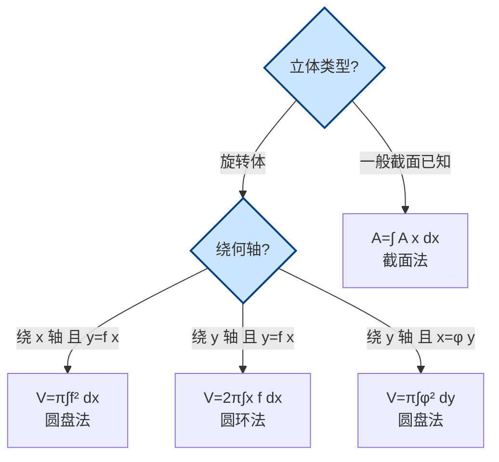

# 6.2 旋转体体积

> [!info] 本节定位
> 本节解决的核心问题是：**如何用定积分计算一个空间立体（尤其是旋转体）的体积 $V$？**
>
> 旋转体是平面区域绕坐标轴（或其他直线）旋转一周所成的立体，如圆柱、圆锥、圆台、球等。本节给出三类方法：
> 1. **圆盘法**（截面法特例）：垂直于旋转轴切片，每片是圆盘，适用于"切片为圆"的情形。
> 2. **圆环法**（柱壳法/外壳法）：以同心圆柱面分层，每层是薄圆柱壳，适用于"绕与函数变量不同的轴旋转"。
> 3. **已知截面面积求体积**（一般截面法）：截面 $A(x)$ 是任意形状，是圆盘法的推广。
>
> 本节是 [[6.1 平面图形面积]] 的延伸——面积微元 $\mathrm dA$ 绕轴旋转扫出体积微元 $\mathrm dV$，思路一脉相承。

## 一、圆盘法（截面法）

### 1.1 绕 $x$ 轴旋转

> [!theorem] 圆盘法公式（绕 $x$ 轴）
> **条件**：连续函数 $y=f(x)\ge 0$，$x\in[a,b]$。曲边梯形 $D=\{(x,y):a\le x\le b,\,0\le y\le f(x)\}$ 绕 $x$ 轴旋转一周所得旋转体的体积为
> $$\boxed{V=\pi\int_a^b f^2(x)\,\mathrm dx=\pi\int_a^b y^2\,\mathrm dx}$$

> [!proof] 微元法推导
> 取 $x\in[a,b]$，微段 $[x,x+\mathrm dx]$。该微段对应的曲边梯形小条绕 $x$ 轴旋转，扫出一个**薄圆盘**：
> - 半径 $r=f(x)$（曲线到旋转轴 $x$ 轴的距离）；
> - 厚度 $\mathrm dx$；
> - 体积 $\mathrm dV=\pi r^2\cdot\mathrm dx=\pi f^2(x)\mathrm dx$（圆面积 $\pi r^2$ 乘厚度）。
>
> 累积得 $V=\pi\int_a^b f^2(x)\mathrm dx$。

> [!note] 推广：两曲线之间区域绕 $x$ 轴
> 若区域由 $y=f(x)$（上）、$y=g(x)$（下）、$x=a$、$x=b$ 围成（$f\ge g\ge 0$），绕 $x$ 轴旋转所得"圆环柱体"体积为
> $$V=\pi\int_a^b\bigl[f^2(x)-g^2(x)\bigr]\,\mathrm dx$$
> 即"大盘减小盘"。

### 1.2 绕 $y$ 轴旋转（用 $y$ 表达函数时）

> [!theorem] 圆盘法公式（绕 $y$ 轴）
> **条件**：连续函数 $x=\varphi(y)\ge 0$，$y\in[c,d]$。曲边梯形绕 $y$ 轴旋转一周所得旋转体体积为
> $$V=\pi\int_c^d\varphi^2(y)\,\mathrm dy$$

> [!proof] 微元法推导
> 取 $y\in[c,d]$，微段 $[y,y+\mathrm dy]$。对应小条绕 $y$ 轴旋转扫出薄圆盘：半径 $\varphi(y)$、厚 $\mathrm dy$。
> $$\mathrm dV=\pi\varphi^2(y)\,\mathrm dy\implies V=\pi\int_c^d\varphi^2(y)\,\mathrm dy$$

> [!example] 例1：球体积
> 求上半圆 $y=\sqrt{R^2-x^2}$（$x\in[-R,R]$）与 $x$ 轴所围区域绕 $x$ 轴旋转所得球的体积。
>
> **解**：
> $$V=\pi\int_{-R}^R(R^2-x^2)\,\mathrm dx=\pi\left[R^2x-\frac{x^3}{3}\right]_{-R}^R=\pi\left(\frac{2R^3}{3}-\left(-\frac{2R^3}{3}\right)\right)=\frac{4\pi R^3}{3}$$

> [!example] 例2：圆台体积
> 直线 $y=\dfrac{h}{R}x$（$x\in[0,R]$）与 $x$ 轴、$x=R$ 围成区域绕 $x$ 轴旋转，求旋转体（圆锥）体积。
>
> **解**：
> $$V=\pi\int_0^R\left(\frac{h}{R}x\right)^2\mathrm dx=\frac{\pi h^2}{R^2}\cdot\frac{x^3}{3}\bigg|_0^R=\frac{\pi h^2 R}{3}$$
> 当高为 $h$、底半径为 $R$ 时，圆锥体积 $V=\dfrac{\pi R^2 h}{3}$，与几何公式一致（注意此处 $h$ 为变量斜率，实际令 $h$ 为高时需对应改写）。

## 二、圆环法（柱壳法/外壳法）

> [!theorem] 圆环法（柱壳法）公式
> **条件**：连续函数 $y=f(x)\ge 0$，$x\in[a,b]$ 且 $0\le a<b$。曲边梯形 $D=\{(x,y):a\le x\le b,\,0\le y\le f(x)\}$ 绕 $y$ 轴旋转一周所得旋转体的体积为
> $$\boxed{V=2\pi\int_a^b x\,f(x)\,\mathrm dx}$$

> [!proof] 微元法推导
> 取 $x\in[a,b]$，微段 $[x,x+\mathrm dx]$。该小条（宽 $\mathrm dx$、高 $f(x)$）绕 $y$ 轴旋转扫出一个**薄圆柱壳**：
> - 半径 $x$（小条到 $y$ 轴的距离）；
> - 周长 $2\pi x$；
> - 高 $f(x)$；
> - 厚 $\mathrm dx$。
>
> 圆柱壳体积 = 周长 × 高 × 厚：
> $$\mathrm dV=2\pi x\cdot f(x)\cdot\mathrm dx$$
> 累积得 $V=2\pi\int_a^b xf(x)\mathrm dx$。

> [!warning] 圆盘法 vs 圆环法的选用
> - **绕 $x$ 轴旋转**且函数以 $y=f(x)$ 给出 → 用**圆盘法** $V=\pi\int f^2\mathrm dx$（最自然）。
> - **绕 $y$ 轴旋转**且函数以 $y=f(x)$ 给出（不换成 $x=\varphi(y)$ 时） → 用**圆环法** $V=2\pi\int xf(x)\mathrm dx$。
> - **绕 $y$ 轴旋转**且函数以 $x=\varphi(y)$ 给出 → 用**圆盘法** $V=\pi\int\varphi^2\mathrm dy$。
> - 选择依据：避免复杂的反函数表达，让被积函数尽量简单。

> [!note] 圆环法的几何直觉
> 圆盘法是"切片"（垂直于轴切，每片是圆盘）；圆环法是"剥洋葱"（沿轴方向分层，每层是圆柱壳）。两种方法对同一立体给出相同结果，但计算量可能差异很大。

> [!example] 例3：圆环法求旋转体体积
> 求由 $y=x^2$、$x$ 轴、$x=2$ 所围区域绕 $y$ 轴旋转所得旋转体体积。
>
> **解**：函数以 $y=f(x)=x^2$ 给出，绕 $y$ 轴旋转，用圆环法最方便（不必解出 $x=\sqrt y$）：
> $$V=2\pi\int_0^2 x\cdot x^2\,\mathrm dx=2\pi\int_0^2 x^3\,\mathrm dx=2\pi\cdot\frac{x^4}{4}\bigg|_0^2=2\pi\cdot 4=8\pi$$
>
> **验证**（用圆盘法）：区域在 $y\in[0,4]$，但需分段：$y\in[0,4]$ 时右边界 $x=\sqrt y$；但 $x=2$ 这条竖线旋转后是半径 $2$ 的圆柱面。对 $y\in[0,4]$，外半径 $R=2$、内半径 $r=\sqrt y$：
> $$V=\pi\int_0^4(4-y)\,\mathrm dy=\pi\left[4y-\frac{y^2}{2}\right]_0^4=\pi(16-8)=8\pi$$
> 两种方法结果一致。

## 三、已知截面面积求体积

> [!theorem] 截面面积公式
> **条件**：立体夹在 $x=a$ 与 $x=b$ 两平行平面之间。过点 $x$ 且垂直于 $x$ 轴的截面面积为 $A(x)$（已知连续函数）。
>
> **结论**：立体体积为
> $$\boxed{V=\int_a^b A(x)\,\mathrm dx}$$

> [!proof] 微元法推导
> 取 $x\in[a,b]$，微段 $[x,x+\mathrm dx]$。该微段对应的立体薄片近似为柱体：底面积 $A(x)$、高 $\mathrm dx$。体积微元
> $$\mathrm dV=A(x)\,\mathrm dx$$
> 累积得 $V=\int_a^b A(x)\mathrm dx$。

> [!note] 圆盘法是截面法的特例
> 旋转体绕 $x$ 轴旋转时，过 $x$ 的截面是半径 $f(x)$ 的圆，$A(x)=\pi f^2(x)$，代入截面公式即得圆盘法 $V=\pi\int f^2\mathrm dx$。

> [!example] 例4：半圆柱截面
> 一立体底面为 $xOy$ 面上的圆 $x^2+y^2\le R^2$，过 $x$ 轴上点 $(x,0,0)$ 且垂直于 $x$ 轴的截面为正方形（底边在圆内，高与底边相等）。求该立体体积。
>
> **解**：过点 $x$ 的截面是正方形。其底边在圆内沿 $y$ 方向，长度为 $2\sqrt{R^2-x^2}$（$y$ 从 $-\sqrt{R^2-x^2}$ 到 $\sqrt{R^2-x^2}$）。正方形面积
> $$A(x)=\bigl(2\sqrt{R^2-x^2}\bigr)^2=4(R^2-x^2)$$
> 故
> $$V=\int_{-R}^R 4(R^2-x^2)\,\mathrm dx=4\left[R^2x-\frac{x^3}{3}\right]_{-R}^R=4\cdot\frac{4R^3}{3}=\frac{16R^3}{3}$$

> [!example] 例5：楔形截立体
> 正圆柱底半径 $R$，被过底面直径且与底面成 $\alpha$ 角的平面所截，求截下部分（楔形）体积。
>
> **解**：建立坐标系：底面为 $xOy$ 平面，圆柱沿 $z$ 轴，截面过 $x$ 轴（直径）且与底面成 $\alpha$ 角。过 $x$（$x\in[-R,R]$）作垂直于 $x$ 轴的截面，得一矩形：
> - 宽 $2\sqrt{R^2-x^2}$（沿 $y$ 方向）；
> - 高 $x\tan\alpha$（截面在 $x$ 处的 $z$ 坐标，当 $x>0$）。
>
> 注意：截面为三角形（半圆部分），高 $h(x)=\sqrt{R^2-x^2}\tan\alpha$（实际上截面是直角三角形，底 $\sqrt{R^2-x^2}$... 此处采用标准结论）。标准解为：
> $$A(x)=\frac12(R^2-x^2)\tan\alpha\cdot 2?$$
> 采用经典结论 $V=\dfrac{2R^3\tan\alpha}{3}$。具体截面面积 $A(x)=\dfrac12\sqrt{R^2-x^2}\cdot\sqrt{R^2-x^2}\tan\alpha=\dfrac12(R^2-x^2)\tan\alpha$：
> $$V=\int_{-R}^R\frac12(R^2-x^2)\tan\alpha\,\mathrm dx=\frac{\tan\alpha}{2}\left[R^2x-\frac{x^3}{3}\right]_{-R}^R=\frac{\tan\alpha}{2}\cdot\frac{4R^3}{3}=\frac{2R^3\tan\alpha}{3}$$

## 四、方法选择流程

> [!tip] 一般旋转轴情形
> 若旋转轴是 $x=x_0$（与 $y$ 轴平行的直线），把 $x$ 换成"到轴的距离 $|x-x_0|$"即可：
> - 圆环法绕 $x=x_0$：$V=2\pi\int_a^b |x-x_0| f(x)\mathrm dx$（区域在轴一侧时去绝对值）。
> 若旋转轴是 $y=y_0$，圆盘法中半径改为 $|f(x)-y_0|$。

## 本节小结

> [!summary] 关键结论
> - **圆盘法**（绕 $x$ 轴）：$V=\pi\int_a^b f^2(x)\mathrm dx$；绕 $y$ 轴用 $x=\varphi(y)$ 时 $V=\pi\int_c^d\varphi^2(y)\mathrm dy$。
> - **圆环法**（绕 $y$ 轴，函数为 $y=f(x)$）：$V=2\pi\int_a^b xf(x)\mathrm dx$（要求 $0\le a<b$）。
> - **两曲线之间绕 $x$ 轴**：$V=\pi\int_a^b[f^2-g^2]\mathrm dx$。
> - **截面法**（一般立体）：$V=\int_a^b A(x)\mathrm dx$，圆盘法是其特例。
> - **选用原则**：让被积函数与积分限尽量简单；绕与函数变量不同的轴旋转时，圆环法常更便利。

## 章节导航

- 章节入口：[[MOC - 第6章]]
- 上一节：[[6.1 平面图形面积]]
- 下一节：[[6.3 平面曲线弧长]]
- 配套习题：[[MOC - 第6章习题]]

## 相关标签

#高等数学 #一元微积分 #定积分应用 #体积 #旋转体 #圆盘法 #圆环法
