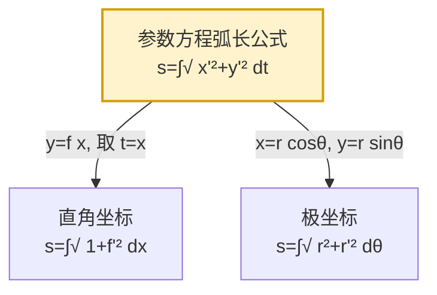

# 6.3 平面曲线弧长

> [!info] 本节定位
> 本节解决的核心问题是：**如何用定积分计算平面曲线 $L$ 的长度 $s$？**
>
> 弧长问题与 [[6.1 平面图形面积]]、[[6.2 旋转体体积]] 思路一致——把"连续分布的总量"通过微元法转化为定积分。但弧长的微元构造更精细：在微段上"以直（弦）代曲（弧）"，弦长 $\sqrt{\mathrm dx^2+\mathrm dy^2}$ 即弧微分 $\mathrm ds$。
>
> 本节也回应了 [[3.6 函数作图、曲率]] 中引入的**弧微分** $\mathrm ds$——那里它服务于曲率定义 $\kappa=\left|\dfrac{\mathrm d\alpha}{\mathrm ds}\right|$，这里它直接用于计算弧长。本节按坐标系给出三种弧长公式，并强调弧微分 $\mathrm ds$ 的统一性。

## 一、弧微分公式

> [!definition] 弧长与弧微分
> 设曲线 $L$ 在 $[a,b]$ 上有连续导数（光滑曲线）。在 $L$ 上取定点 $A$ 为弧长起点，对 $L$ 上任一点 $M$，记弧 $\widehat{AM}$ 的长度为 $s(x)$（约定 $s$ 随 $x$ 增大而增大）。**弧微分**是弧长函数 $s(x)$ 的微分：
> $$\mathrm ds=\sqrt{\mathrm dx^2+\mathrm dy^2}$$
> 即"微分三角形"的斜边（勾股形式）。

> [!note] 弧微分的几何意义
> $\mathrm ds$ 是曲线上动点微小位移的弧长元素。它可视为"以直代曲"的产物：当 $\Delta x$ 很小时，弧增量 $\Delta s\approx$ 弦长 $\sqrt{(\Delta x)^2+(\Delta y)^2}$，取极限得 $\mathrm ds=\sqrt{\mathrm dx^2+\mathrm dy^2}$。

按坐标给出形式：

| 坐标系 | 曲线方程 | 弧微分 $\mathrm ds$ |
| ------ | -------- | ------------------- |
| 直角坐标 | $y=f(x)$ | $\sqrt{1+[f'(x)]^2}\,\mathrm dx$ |
| 参数方程 | $x=x(t),y=y(t)$ | $\sqrt{[x'(t)]^2+[y'(t)]^2}\,\mathrm dt$ |
| 极坐标 | $r=r(\theta)$ | $\sqrt{r^2(\theta)+[r'(\theta)]^2}\,\mathrm d\theta$ |

## 二、直角坐标系下弧长

> [!theorem] 直角坐标弧长公式
> **条件**：曲线 $L: y=f(x)$ 在 $[a,b]$ 上有连续导数（$f\in C^1[a,b]$）。
>
> **结论**：曲线在 $x=a$ 到 $x=b$ 之间的弧长为
> $$\boxed{s=\int_a^b\sqrt{1+[f'(x)]^2}\,\mathrm dx=\int_a^b\sqrt{1+(y')^2}\,\mathrm dx}$$

> [!proof] 微元法推导
> 取 $x\in[a,b]$，微段 $[x,x+\mathrm dx]$。对应弧段 $\Delta s$ 近似为弦长：
> $$\Delta s\approx\sqrt{(\mathrm dx)^2+(\mathrm dy)^2}=\sqrt{1+\left(\frac{\mathrm dy}{\mathrm dx}\right)^2}\,\mathrm dx=\sqrt{1+[f'(x)]^2}\,\mathrm dx=\mathrm ds$$
> 累积并取极限得 $s=\int_a^b\sqrt{1+[f'(x)]^2}\,\mathrm dx$。

> [!warning] 适用条件
> - 公式要求 $f$ 在 $[a,b]$ 上**连续可导**（光滑）。若曲线分段光滑，需分段积分。
> - 必须 $\mathrm dx>0$（即 $a<b$）；若曲线对 $y$ 单值而对 $x$ 多值，应改用参数方程或分段。

> [!example] 例1：悬链线弧长
> 求悬链线 $y=\dfrac{a}{2}(e^{x/a}+e^{-x/a})=\cosh\dfrac{x}{a}$（$a>0$）在 $x\in[-a,a]$ 上的弧长。
>
> **解**：$y'=\sinh\dfrac{x}{a}$，利用恒等式 $\cosh^2 u-\sinh^2 u=1$：
> $$1+(y')^2=1+\sinh^2\frac{x}{a}=\cosh^2\frac{x}{a}$$
> $$\sqrt{1+(y')^2}=\cosh\frac{x}{a}=\frac{1}{2}(e^{x/a}+e^{-x/a})$$
> $$s=\int_{-a}^a\cosh\frac{x}{a}\,\mathrm dx=a\sinh\frac{x}{a}\bigg|_{-a}^a=a\left[\sinh 1-\sinh(-1)\right]=2a\sinh 1=a(e-e^{-1})$$

## 三、参数方程下弧长

> [!theorem] 参数方程弧长公式
> **条件**：曲线 $L$ 由参数方程 $x=x(t)$，$y=y(t)$（$t\in[\alpha,\beta]$）给出，$x(t),y(t)$ 在 $[\alpha,\beta]$ 上有连续导数，且 $x'^2(t)+y'^2(t)\ne 0$（曲线光滑，无奇点）。
>
> **结论**：曲线在 $t=\alpha$ 到 $t=\beta$ 之间的弧长为
> $$\boxed{s=\int_\alpha^\beta\sqrt{[x'(t)]^2+[y'(t)]^2}\,\mathrm dt}$$

> [!proof] 微元法推导
> 取 $t\in[\alpha,\beta]$，微段 $[t,t+\mathrm dt]$。对应弧段近似为弦长：
> $$\Delta s\approx\sqrt{(\mathrm dx)^2+(\mathrm dy)^2}=\sqrt{[x'(t)\mathrm dt]^2+[y'(t)\mathrm dt]^2}=\sqrt{[x'(t)]^2+[y'(t)]^2}\,\mathrm dt=\mathrm ds$$
> 积分即得。

> [!note] 参数方程的优势
> 参数方程弧长公式是最一般的形式。当曲线对 $x$ 或 $y$ 多值时（如闭曲线、自交曲线），用参数方程最方便。直角坐标与极坐标弧长公式都可视为参数形式的特例。

> [!example] 例2：星形线全长
> 求星形线 $x=a\cos^3 t$，$y=a\sin^3 t$（$a>0$，$t\in[0,2\pi]$）的全长。
>
> **解**：
> $$x'(t)=-3a\cos^2 t\sin t,\quad y'(t)=3a\sin^2 t\cos t$$
> $$[x']^2+[y']^2=9a^2\cos^2 t\sin^2 t(\cos^2 t+\sin^2 t)=9a^2\cos^2 t\sin^2 t$$
> $$\sqrt{x'^2+y'^2}=3a|\sin t\cos t|$$
> 由四象限对称性（每象限弧长相等），在第一象限 $t\in[0,\pi/2]$ 时 $\sin t\cos t\ge 0$：
> $$s=4\int_0^{\pi/2}3a\sin t\cos t\,\mathrm dt=12a\cdot\frac{\sin^2 t}{2}\bigg|_0^{\pi/2}=12a\cdot\frac12=6a$$

> [!example] 例3：摆线一拱弧长
> 求摆线 $x=a(t-\sin t)$，$y=a(1-\cos t)$（$a>0$）一拱（$t\in[0,2\pi]$）的弧长。
>
> **解**：
> $$x'(t)=a(1-\cos t),\quad y'(t)=a\sin t$$
> $$[x']^2+[y']^2=a^2[(1-\cos t)^2+\sin^2 t]=a^2[1-2\cos t+\cos^2 t+\sin^2 t]=2a^2(1-\cos t)$$
> 利用半角公式 $1-\cos t=2\sin^2\dfrac{t}{2}$：
> $$\sqrt{x'^2+y'^2}=2a\sqrt{2\sin^2\frac{t}{2}}=2\sqrt2\,a\left|\sin\frac{t}{2}\right|=2\sqrt2\,a\sin\frac{t}{2}\quad(t\in[0,2\pi])$$
> $$s=\int_0^{2\pi}2\sqrt2\,a\sin\frac{t}{2}\,\mathrm dt=2\sqrt2\,a\cdot\left[-2\cos\frac{t}{2}\right]_0^{2\pi}=2\sqrt2\,a\cdot[-2\cdot(-1)+2\cdot 1]=8a$$
> 注：摆线一拱弧长 $8a$ 与对应圆周长 $2\pi a$ 之比为 $\dfrac{4}{\pi}$。

## 四、极坐标系下弧长

> [!theorem] 极坐标弧长公式
> **条件**：曲线 $L: r=r(\theta)$ 在 $[\alpha,\beta]$ 上有连续导数（$r\in C^1[\alpha,\beta]$）。
>
> **结论**：曲线在 $\theta=\alpha$ 到 $\theta=\beta$ 之间的弧长为
> $$\boxed{s=\int_\alpha^\beta\sqrt{r^2(\theta)+[r'(\theta)]^2}\,\mathrm d\theta}$$

> [!proof] 微元法推导
> 极坐标与直角坐标关系 $x=r\cos\theta$，$y=r\sin\theta$，把 $\theta$ 视为参数：
> $$\frac{\mathrm dx}{\mathrm d\theta}=r'\cos\theta-r\sin\theta,\quad\frac{\mathrm dy}{\mathrm d\theta}=r'\sin\theta+r\cos\theta$$
> $$\left(\frac{\mathrm dx}{\mathrm d\theta}\right)^2+\left(\frac{\mathrm dy}{\mathrm d\theta}\right)^2=(r')^2(\cos^2\theta+\sin^2\theta)+r^2(\sin^2\theta+\cos^2\theta)-2rr'\sin\theta\cos\theta+2rr'\sin\theta\cos\theta$$
> $$=(r')^2+r^2$$
> 故 $\mathrm ds=\sqrt{r^2+(r')^2}\,\mathrm d\theta$，积分即得。

> [!example] 例4：阿基米德螺线弧长
> 求阿基米德螺线 $r=a\theta$（$a>0$，$\theta\in[0,2\pi]$）第一圈的弧长。
>
> **解**：$r'=a$，$r^2+(r')^2=a^2\theta^2+a^2=a^2(1+\theta^2)$。
> $$s=\int_0^{2\pi}a\sqrt{1+\theta^2}\,\mathrm d\theta$$
> 用公式 $\displaystyle\int\sqrt{1+\theta^2}\,\mathrm d\theta=\frac{\theta}{2}\sqrt{1+\theta^2}+\frac12\ln(\theta+\sqrt{1+\theta^2})+C$：
> $$s=a\left[\frac{\theta}{2}\sqrt{1+\theta^2}+\frac12\ln(\theta+\sqrt{1+\theta^2})\right]_0^{2\pi}$$
> $$=a\left[\pi\sqrt{1+4\pi^2}+\frac12\ln(2\pi+\sqrt{1+4\pi^2})\right]$$

> [!example] 例5：心形线弧长
> 求心形线 $r=a(1+\cos\theta)$（$a>0$）的全长。
>
> **解**：$r'=-a\sin\theta$，$r^2+(r')^2=a^2(1+\cos\theta)^2+a^2\sin^2\theta=a^2[1+2\cos\theta+\cos^2\theta+\sin^2\theta]=2a^2(1+\cos\theta)$。
> 利用半角公式 $1+\cos\theta=2\cos^2\dfrac{\theta}{2}$：
> $$\sqrt{r^2+(r')^2}=\sqrt{2a^2\cdot 2\cos^2\frac{\theta}{2}}=2a\left|\cos\frac{\theta}{2}\right|$$
> 由对称性（关于极轴对称），取 $\theta\in[0,\pi]$ 加倍（此时 $\cos\dfrac{\theta}{2}\ge 0$）：
> $$s=2\int_0^\pi 2a\cos\frac{\theta}{2}\,\mathrm d\theta=4a\cdot 2\sin\frac{\theta}{2}\bigg|_0^\pi=8a$$

## 五、三套公式的统一性

> [!note] 统一性
> 三套弧长公式的本质都是 $\mathrm ds=\sqrt{\mathrm dx^2+\mathrm dy^2}$，只是参数化方式不同：
> - 直角坐标：参数 $t=x$，$y=f(t)$。
> - 极坐标：参数 $t=\theta$，$x=r(\theta)\cos\theta$，$y=r(\theta)\sin\theta$。
> - 一般参数：$x=x(t)$，$y=y(t)$。
>
> 因此**弧长与参数化方式无关**（曲线长度是几何不变量）。

## 本节小结

> [!summary] 关键结论
> - **弧微分**：$\mathrm ds=\sqrt{\mathrm dx^2+\mathrm dy^2}$（统一形式）。
> - **直角坐标**：$s=\int_a^b\sqrt{1+(y')^2}\,\mathrm dx$。
> - **参数方程**：$s=\int_\alpha^\beta\sqrt{[x'(t)]^2+[y'(t)]^2}\,\mathrm dt$（最一般）。
> - **极坐标**：$s=\int_\alpha^\beta\sqrt{r^2+(r')^2}\,\mathrm d\theta$。
> - **适用条件**：曲线光滑（连续可导）；分段光滑则分段积分。利用对称性可减半计算量。

## 章节导航

- 章节入口：[[MOC - 第6章]]
- 上一节：[[6.2 旋转体体积]]
- 下一节：[[6.4 物理应用（功、压力、引力）]]
- 关联：[[3.6 函数作图、曲率]]（弧微分与曲率）
- 配套习题：[[MOC - 第6章习题]]

## 相关标签

#高等数学 #一元微积分 #定积分应用 #弧长 #弧微分 #参数方程 #极坐标
