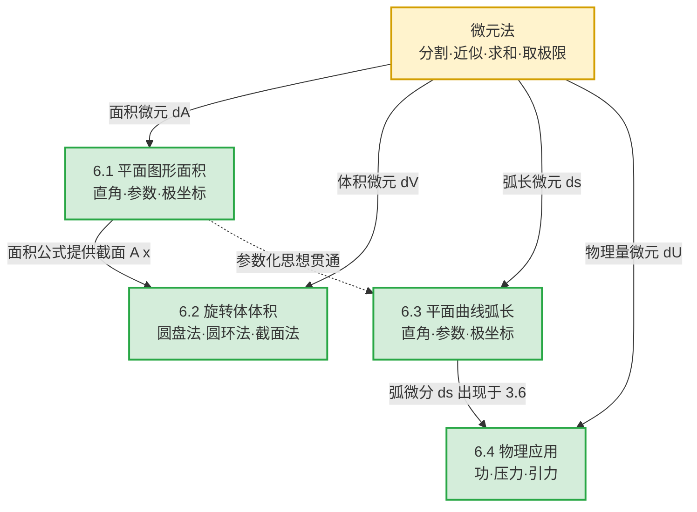
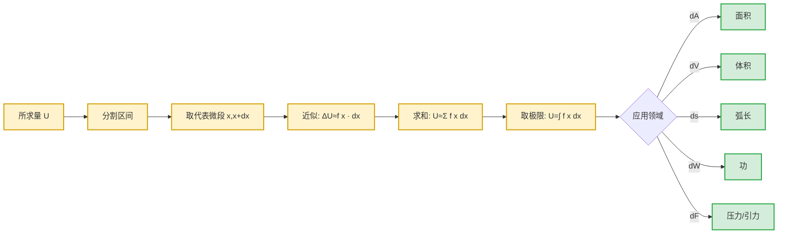

# MOC - 第6章 定积分应用

> [!info] 本章定位
> 第6章是高等数学A(1)的**应用篇**与**收尾章**。第5章解决了"定积分是什么、怎么算"（定义、性质、牛顿—莱布尼茨公式、换元与分部积分、反常积分），本章解决"**定积分能做什么**"——把几何与物理中常见的**连续分布的累积量**（面积、体积、弧长、功、压力、引力等）统一转化为定积分。
>
> 本章的核心问题有三个：
> 1. **方法问题**：面对一个具体的几何量或物理量，如何把它"翻译"成一个定积分？答案是**微元法**（元素法）——分割、取微元、求和、取极限四步，提炼出"所求量 $U$ 的微元 $\mathrm dU=f(x)\mathrm dx$"后直接写出积分。
> 2. **几何应用问题**：如何计算平面图形面积、旋转体体积、平面曲线弧长？需根据坐标系（直角、参数、极坐标）与几何特征（上下型/左右型、绕轴方式）选择合适的积分变量与公式。
> 3. **物理应用问题**：如何处理变力做功、液体静压力、引力等非均匀分布的物理量？关键是建立恰当坐标系、写出微元并注意单位与方向。
>
> 本章是上册的**工程化出口**：它把前五章的极限、连续、导数、积分理论转化为可计算的工具，也是后续多元微积分（重积分、曲线曲面积分）中"微元法"思想的预演。

## 学习路线图

> [!tip] 学习建议
> - **微元法是全章灵魂**：不要死记各公式，而要掌握"取一个代表小区间 $[x,x+\mathrm dx]$，在该微段上把所求量近似为 $f(x)\mathrm dx$"这一统一方法。公式都是微元法的产物。
> - **坐标系与积分变量的选择**是解题关键：上下型图形选 $x$ 作积分变量、左右型选 $y$；绕 $x$ 轴旋转用圆盘法、绕 $y$ 轴用圆环法（或反之，视函数表达形式）。
> - **物理应用先建坐标系**：明确坐标原点、正方向、变量含义，再写微元；注意单位制（SI）与常数（$\rho$、$g$、$G$）。

## 知识点导航

| 小节 | 主题 | 核心方法/公式 | 难度 | 链接 |
| ---- | ---- | ------------- | ---- | ---- |
| 6.1 | 平面图形面积 | 微元法、直角坐标（上下型/左右型）、参数方程、极坐标 $A=\dfrac12\int r^2\,\mathrm d\theta$ | ★★★ | [[6.1 平面图形面积]] |
| 6.2 | 旋转体体积 | 圆盘法 $V=\pi\int f^2\mathrm dx$、圆环法 $V=2\pi\int x f(x)\mathrm dx$、已知截面 $V=\int A(x)\mathrm dx$ | ★★★ | [[6.2 旋转体体积]] |
| 6.3 | 平面曲线弧长 | 直角 $s=\int\sqrt{1+y'^2}\mathrm dx$、参数 $s=\int\sqrt{x'^2+y'^2}\mathrm dt$、极坐标 $s=\int\sqrt{r^2+r'^2}\mathrm d\theta$ | ★★★ | [[6.3 平面曲线弧长]] |
| 6.4 | 物理应用 | 变力做功 $W=\int F\mathrm dx$、液体压力 $P=\rho g\int x f(x)\mathrm dx$、引力 $F=\int\dfrac{G\,\mathrm dm}{r^2}$ | ★★★★ | [[6.4 物理应用（功、压力、引力）]] |

## 核心考点

> [!important] 本章七大核心考点
> 1. **微元法构造**（全章基础）：对给定几何/物理量，正确写出微元 $\mathrm dU=f(x)\mathrm dx$ 并确定积分上下限。注意"以直代曲""以不变代变"的近似方向。
> 2. **直角坐标系下面积**：上下型 $A=\int_a^b[f(x)-g(x)]\mathrm dx$（$f\ge g$）；左右型 $A=\int_c^d[\varphi(y)-\psi(y)]\mathrm dy$。需先求交点确定积分限。
> 3. **极坐标系下面积**：$A=\dfrac12\int_\alpha^\beta r^2(\theta)\mathrm d\theta$；两曲线之间面积 $A=\dfrac12\int_\alpha^\beta[R^2-r^2]\mathrm d\theta$。注意 $\theta$ 范围的确定。
> 4. **旋转体体积——圆盘法与圆环法**：绕 $x$ 轴 $V=\pi\int_a^b f^2(x)\mathrm dx$；绕 $y$ 轴 $V=2\pi\int_a^b x f(x)\mathrm dx$（$0\le a<b$，圆环法/柱壳法）。选择依据是被积函数形式与计算便利。
> 5. **已知截面面积求体积**：$V=\int_a^b A(x)\mathrm dx$，$A(x)$ 为过点 $x$ 且垂直于 $x$ 轴的截面面积。立体几何中截面为圆、三角形等。
> 6. **弧长公式（三种坐标）**：直角、参数、极坐标三套公式，参数方程情形最常见（如摆线、星形线）。注意弧微分 $\mathrm ds$ 的统一性。
> 7. **物理应用（变力做功、液体压力）**：建立坐标系、写微元、定积分限，注意单位与常数。液体压力问题中深度 $h$ 与微元面积 $f(h)\mathrm dh$ 的搭配是难点。

## 微元法的统一框架

> [!note] 微元法的可加性前提
> 微元法要求所求量 $U$ 关于区间具有**可加性**：把 $[a,b]$ 分成若干子区间时，$U$ 等于各子区间上部分量之和。面积、体积、弧长、功、压力等都满足此条件，故可用微元法。微元 $f(x)\mathrm dx$ 必须是 $\Delta U$ 的**线性主部**，即 $\Delta U=f(x)\Delta x+o(\Delta x)$。

## 自测题

> [!question]- 自测1（极坐标面积）
> 求心形线 $r=a(1+\cos\theta)$（$a>0$）所围图形的面积。
>
> > [!check]- 答案
> > 由对称性（关于极轴对称），取 $\theta\in[0,\pi]$：
> > $$A=2\cdot\frac12\int_0^\pi a^2(1+\cos\theta)^2\,\mathrm d\theta=a^2\int_0^\pi(1+2\cos\theta+\cos^2\theta)\,\mathrm d\theta$$
> > 其中 $\int_0^\pi\cos^2\theta\,\mathrm d\theta=\dfrac{\pi}{2}$，$\int_0^\pi\cos\theta\,\mathrm d\theta=0$，故
> > $$A=a^2\left(\pi+0+\frac{\pi}{2}\right)=\frac{3\pi a^2}{2}$$

> [!question]- 自测2（旋转体体积——圆环法）
> 求由 $y=x^2$、$x$ 轴、$x=2$ 所围区域绕 $y$ 轴旋转所得旋转体体积。
>
> > [!check]- 答案
> > 取 $x\in[0,2]$，用圆环法（柱壳法）。微元：高 $f(x)=x^2$、半径 $x$、厚 $\mathrm dx$ 的柱壳，体积微元
> > $$\mathrm dV=2\pi x\cdot x^2\,\mathrm dx=2\pi x^3\,\mathrm dx$$
> > $$V=2\pi\int_0^2 x^3\,\mathrm dx=2\pi\cdot\frac{x^4}{4}\bigg|_0^2=2\pi\cdot 4=8\pi$$

> [!question]- 自测3（参数方程弧长）
> 求星形线 $x=a\cos^3 t$，$y=a\sin^3 t$（$a>0$）的全长。
>
> > [!check]- 答案
> > 由对称性（四象限对称），取 $t\in[0,\pi/2]$：
> > $$x'(t)=-3a\cos^2 t\sin t,\quad y'(t)=3a\sin^2 t\cos t$$
> > $$\sqrt{x'^2+y'^2}=3a|\sin t\cos t|\sqrt{\cos^2 t+\sin^2 t}=3a\sin t\cos t\quad(t\in[0,\pi/2])$$
> > $$s=4\int_0^{\pi/2}3a\sin t\cos t\,\mathrm dt=12a\cdot\frac{\sin^2 t}{2}\bigg|_0^{\pi/2}=6a$$

> [!question]- 自测4（变力做功）
> 一弹簧自然长度为 $0.1\,\mathrm m$，用力 $F(x)=kx$（$x$ 为拉伸量）拉伸至 $0.15\,\mathrm m$ 时做功 $0.05\,\mathrm J$。求将弹簧从自然长度拉伸到 $0.2\,\mathrm m$ 所做的功。
>
> > [!check]- 答案
> > 先定 $k$：拉到 $0.15\,\mathrm m$ 即拉伸量 $x=0.05\,\mathrm m$，
> > $$W_1=\int_0^{0.05}kx\,\mathrm dx=\frac{k}{2}(0.05)^2=0.00125k=0.05\implies k=40\,\mathrm{N/m}$$
> > 拉到 $0.2\,\mathrm m$ 即 $x=0.1\,\mathrm m$：
> > $$W_2=\int_0^{0.1}40x\,\mathrm dx=20x^2\bigg|_0^{0.1}=20\times 0.01=0.2\,\mathrm J$$

## 章节导航

- 上一级：[[MOC - 高等数学A(1)]]
- 上一章：[[MOC - 第5章]]（待建）
- 配套习题：[[MOC - 第6章习题]]
- 知识点小节：[[6.1 平面图形面积]]、[[6.2 旋转体体积]]、[[6.3 平面曲线弧长]]、[[6.4 物理应用（功、压力、引力）]]

## 相关标签

#高等数学 #一元微积分 #定积分应用 #面积 #体积 #弧长 #微元法
