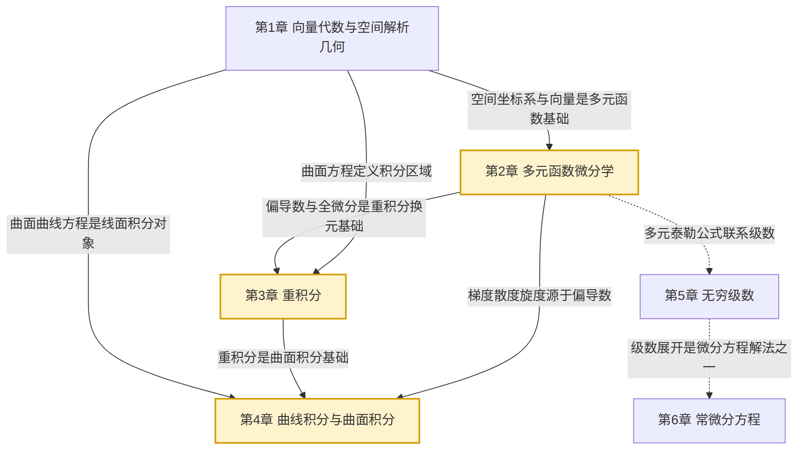

# MOC - 高等数学A(2)

> [!info] 课程定位
> 高等数学A(2) 是理工科本科生一年级数学基础课（下册），研究**多元微积分、无穷级数与常微分方程**。它在 [[MOC - 高等数学A(1)]] 建立的一元微积分基础上，将极限、导数、积分推广到多元函数与空间曲线曲面，并引入级数与微分方程两大应用工具。课程要解决的核心问题是：如何描述三维空间中的几何对象（向量、平面、直线、曲面）、如何刻画多元函数的变化率（偏导数、全微分、梯度）、如何计算多维区域上的累积量（重积分、曲线曲面积分）、如何将函数展开为级数（幂级数、傅里叶级数）、如何求解描述变化规律的微分方程。

## 课程摘要

本课程围绕"**空间几何—多元微分—重积分—线面积分—级数—微分方程**"六条主线展开：

1. 向量代数（数量积、向量积、混合积）、平面与直线方程、曲面与空间曲线方程；
2. 多元函数极限与连续、偏导数、全微分、复合函数与隐函数求导、方向导数与梯度、多元极值与拉格朗日乘数法；
3. 二重积分（直角坐标、极坐标）、三重积分（直角、柱、球坐标）、重积分的几何与物理应用；
4. 第一类/第二类曲线积分、格林公式、第一类/第二类曲面积分、高斯公式、斯托克斯公式、散度与旋度；
5. 常数项级数审敛法、幂级数收敛半径与和函数、函数的幂级数展开、傅里叶级数；
6. 微分方程基本概念、一阶微分方程、可降阶高阶方程、二阶线性微分方程解的结构、二阶常系数齐次/非齐次方程。

## 章节结构与依赖关系

## 章节导航

| 章节 | 主题 | 入口 | 小节数 | 核心考点 |
| ---- | ---- | ---- | ------ | -------- |
| 第1章 | 向量代数与空间解析几何 | [[MOC - 第1章]] | 6 | 数量积/向量积、平面直线方程、曲面方程 |
| 第2章 | 多元函数微分学 | [[MOC - 第2章]] | 8 | 偏导数、全微分、复合求导、梯度、拉格朗日乘数法 |
| 第3章 | 重积分 | [[MOC - 第3章]] | 6 | 二重/三重积分计算、极坐标/柱坐标/球坐标 |
| 第4章 | 曲线积分与曲面积分 | [[MOC - 第4章]] | 7 | 格林公式、高斯公式、斯托克斯公式 |
| 第5章 | 无穷级数 | [[MOC - 第5章]] | 7 | 审敛法、幂级数收敛半径、和函数、泰勒展开、傅里叶级数 |
| 第6章 | 常微分方程 | [[MOC - 第6章]] | 6 | 一阶方程、二阶常系数线性方程 |

## 三大核心思想

> [!abstract] 多元微积分的核心思想
> 1. **降维与升维**：多元问题通过"固定其他变量"转化为一元问题（偏导数）；通过"累加一维结果"得到高维量（重积分 = 定积分的嵌套）。
>
> 2. **场的观点**：梯度（标量场→向量场）、散度（通量密度）、旋度（环量密度）是三大场算子，高斯公式与斯托克斯公式将体积分与面积分、面积分与线积分联系起来，是电磁学与流体力学的数学基础。
>
> 3. **逼近与展开**：幂级数将函数表示为无穷多项式和，傅里叶级数将周期函数表示为三角函数和；微分方程的幂级数解法将两者结合。

## 与上下游课程的衔接

- **先修**：[[MOC - 高等数学A(1)]]（一元极限、导数、积分是多元推广的基础）
- **后续**：数学物理方法（偏微分方程）、复变函数、数值分析、流体力学、电磁学
- **关联**：[[MOC - 线性代数A]]（向量空间、矩阵是多元微积分的代数工具）、[[MOC - 概率论与数理统计B]]（多元随机变量需重积分）

## 章节导航

- 上一级：[[MOC - 数学基础]]
- 先修课程：[[MOC - 高等数学A(1)]]
- 关联课程：[[MOC - 线性代数A]]、[[MOC - 概率论与数理统计B]]

## 相关标签

#高等数学 #多元微积分 #空间解析几何 #重积分 #曲线曲面积分 #无穷级数 #微分方程
