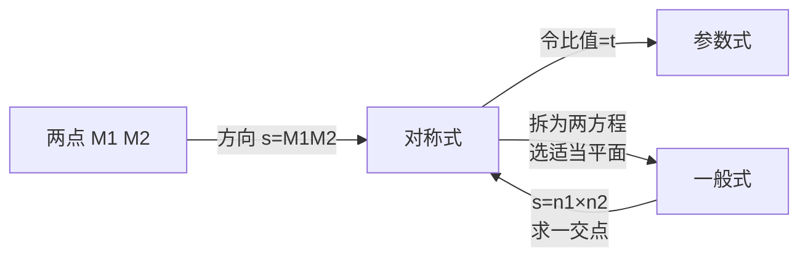

# 1.4 空间直线及其方程

> [!info] 本节定位
> 本节用向量工具建立空间直线的解析表示。与平面抓住"一点 + 法向量"对应，直线抓住**一点 + 方向向量** $\vec s=(m,n,p)$。本节给出直线的四种形式（对称式、参数式、两点式、一般式）及其互化方法，并度量两直线、直线与平面、点到直线的距离与夹角。直线方程与 [[1.3 平面及其方程]] 互为表里：直线的一般式即两平面交线，方向向量由两平面法向量叉乘得到；线面关系是 [[1.6 空间曲线及其方程]] 中曲线作为曲面交线的直接推广。

## 直线的对称式方程

> [!definition] 定义 1（方向向量）
> 若非零向量 $\vec s$ 平行于直线 $L$，则称 $\vec s$ 为 $L$ 的**方向向量**。方向向量不唯一，凡与 $\vec s$ 平行的非零向量都可作为该直线的方向向量。其坐标 $(m,n,p)$ 称为直线的**方向数**。

> [!theorem] 定理 1（对称式方程）
> 过点 $M_0(x_0,y_0,z_0)$ 且以 $\vec s=(m,n,p)$ 为方向向量的直线方程为
> $$\boxed{\,\frac{x-x_0}{m}=\frac{y-y_0}{n}=\frac{z-z_0}{p}\,}.$$
> 这一形式称为**对称式**（或标准式、点向式）。

> [!proof]
> 设 $M(x,y,z)$ 为直线上任一点，则 $\vec{M_0M}=(x-x_0,y-y_0,z-z_0)$。$M$ 在直线上 $\Leftrightarrow\vec{M_0M}\parallel\vec s\Leftrightarrow$ 两向量坐标成比例，即上式成立。

> [!warning] 分母为零的约定
> 若某方向数 $m=0$，对称式 $\dfrac{x-x_0}{0}=\dfrac{y-y_0}{n}=\dfrac{z-z_0}{p}$ 中的 $\dfrac{x-x_0}{0}$ **不表示除法**，而应理解为对应分子 $x-x_0=0$，即直线垂直于 $x$ 轴方向（$x$ 恒为 $x_0$）。同理处理 $n=0$、$p=0$。

## 直线的参数式方程

> [!theorem] 定理 2（参数式）
> 在对称式中令比值为参数 $t$，得直线的**参数方程**
> $$\boxed{\,\begin{cases}x=x_0+mt,\\y=y_0+nt,\\z=z_0+pt,\end{cases}\ t\in\mathbb{R}\,}.$$
> 参数 $t$ 的几何意义：当 $\vec s$ 为单位向量时 $t$ 表示沿直线方向的有向距离。

## 直线的两点式方程

> [!theorem] 定理 3（两点式）
> 过相异两点 $M_1(x_1,y_1,z_1)$、$M_2(x_2,y_2,z_2)$ 的直线，方向向量取 $\vec s=\vec{M_1M_2}=(x_2-x_1,y_2-y_1,z_2-z_1)$，方程为
> $$\frac{x-x_1}{x_2-x_1}=\frac{y-y_1}{y_2-y_1}=\frac{z-z_1}{z_2-z_1}.$$

## 直线的一般式方程

> [!theorem] 定理 4（一般式）
> 空间直线可表示为两相交平面的交线：
> $$\boxed{\,\begin{cases}A_1x+B_1y+C_1z+D_1=0,\\A_2x+B_2y+C_2z+D_2=0,\end{cases}\,}$$
> 其中两平面的法向量 $\vec n_1=(A_1,B_1,C_1)$、$\vec n_2=(A_2,B_2,C_2)$ 不平行（即对应系数不成比例）。

> [!theorem] 定理 5（一般式求方向向量）
> 一般式直线的方向向量可取为两平面法向量的向量积：
> $$\vec s=\vec n_1\times\vec n_2=\begin{vmatrix}\vec i&\vec j&\vec k\\A_1&B_1&C_1\\A_2&B_2&C_2\end{vmatrix}.$$
> 配合直线上任一点（如令 $z=0$ 解出 $x,y$）即可化为对称式。

> [!note] 四种形式的互化路径

## 两直线的位置关系

> [!theorem] 定理 6（两直线位置关系）
> 设 $L_i$ 过 $M_i$、方向向量 $\vec s_i$（$i=1,2$）：
> 1. **重合**：$\vec s_1\parallel\vec s_2$ 且 $M_1$ 在 $L_2$ 上；
> 2. **平行不重合**：$\vec s_1\parallel\vec s_2$ 且 $M_1$ 不在 $L_2$ 上；
> 3. **相交**：$\vec s_1,\vec s_2$ 不平行且 $\vec{M_1M_2},\vec s_1,\vec s_2$ 共面（即 $[\vec{M_1M_2}\,\vec s_1\,\vec s_2]=0$）；
> 4. **垂直**：$\vec s_1\perp\vec s_2$（$\vec s_1\cdot\vec s_2=0$）；
> 5. **异面**：$\vec s_1,\vec s_2$ 不平行且 $[\vec{M_1M_2}\,\vec s_1\,\vec s_2]\ne0$（三向量不共面）。

> [!definition] 定义 2（两直线夹角）
> 两直线 $L_1,L_2$ 的方向向量 $\vec s_1,\vec s_2$ 的夹角（取锐角 $\varphi\in[0,\pi/2]$）称为两直线的**夹角**：
> $$\cos\varphi=\frac{\lvert\vec s_1\cdot\vec s_2\rvert}{\lvert\vec s_1\rvert\,\lvert\vec s_2\rvert}=\frac{\lvert m_1m_2+n_1n_2+p_1p_2\rvert}{\sqrt{m_1^2+n_1^2+p_1^2}\,\sqrt{m_2^2+n_2^2+p_2^2}}.$$

## 直线与平面的位置关系

> [!theorem] 定理 7（线面位置关系）
> 设直线 $L$ 方向向量 $\vec s=(m,n,p)$，平面 $\Pi$ 法向量 $\vec n=(A,B,C)$：
> 1. **平行**（$L\parallel\Pi$）：$\vec s\perp\vec n$（$\vec s\cdot\vec n=0$），且 $L$ 上任一点不在 $\Pi$ 上；
> 2. **在平面上**：$\vec s\cdot\vec n=0$ 且 $L$ 上一点在 $\Pi$ 上；
> 3. **垂直**（$L\perp\Pi$）：$\vec s\parallel\vec n$（即 $\dfrac{m}{A}=\dfrac{n}{B}=\dfrac{p}{C}$）；
> 4. **相交**：$\vec s\cdot\vec n\ne0$。

> [!definition] 定义 3（直线与平面夹角）
> 直线 $L$ 与它在平面 $\Pi$ 上的投影直线的夹角 $\varphi\in[0,\pi/2]$ 称为直线与平面的**夹角**。它与方向向量、法向量的夹角互为余角，故
> $$\sin\varphi=\frac{\lvert\vec s\cdot\vec n\rvert}{\lvert\vec s\rvert\,\lvert\vec n\rvert}=\frac{\lvert Am+Bn+Cp\rvert}{\sqrt{A^2+B^2+C^2}\,\sqrt{m^2+n^2+p^2}}.$$

> [!note] 线面夹角用正弦的原因
> 直线与平面夹角是直线与其投影的夹角。直线方向向量与法向量的夹角 $\theta$ 满足 $\theta+\varphi=\dfrac\pi2$（当 $\varphi\le\dfrac\pi2$），故 $\sin\varphi=\cos\theta=\dfrac{\lvert\vec s\cdot\vec n\rvert}{\lvert\vec s\rvert\lvert\vec n\rvert}$。取绝对值保证夹角为锐角。

## 点到直线的距离

> [!theorem] 定理 8（点到直线的距离）
> 点 $M_1$ 到直线 $L$（过 $M_0$、方向向量 $\vec s$）的距离为
> $$d=\frac{\lvert\vec{M_0M_1}\times\vec s\rvert}{\lvert\vec s\rvert}.$$

> [!proof]
> $\lvert\vec{M_0M_1}\times\vec s\rvert=\lvert\vec{M_0M_1}\rvert\,\lvert\vec s\rvert\sin\theta$，其中 $\theta$ 为 $\vec{M_0M_1}$ 与 $\vec s$ 的夹角。几何上 $\lvert\vec{M_0M_1}\rvert\sin\theta$ 即以 $\vec{M_0M_1},\vec s$ 为邻边的平行四边形中沿 $\vec s$ 方向的"高"，正是点 $M_1$ 到直线 $L$ 的距离。除以 $\lvert\vec s\rvert$ 即得。

## 典型例题

> [!example] 例 1（一般式化对称式）
> 将直线 $\begin{cases}x+y+z+1=0\\2x-y+3z+4=0\end{cases}$ 化为对称式与参数式。

**解**

法向量 $\vec n_1=(1,1,1)$、$\vec n_2=(2,-1,3)$，方向向量
$$\vec s=\vec n_1\times\vec n_2=\begin{vmatrix}\vec i&\vec j&\vec k\\1&1&1\\2&-1&3\end{vmatrix}=(1\cdot3-1(-1),\,1\cdot2-1\cdot3,\,1(-1)-1\cdot2)=(4,-1,-3).$$
求直线上一点：令 $z=0$，解 $\begin{cases}x+y=-1\\2x-y=-4\end{cases}$，相加 $3x=-5$，$x=-\dfrac53$，$y=\dfrac23$。取 $M_0\left(-\dfrac53,\dfrac23,0\right)$。
- 对称式：$\dfrac{x+\frac53}{4}=\dfrac{y-\frac23}{-1}=\dfrac{z}{-3}$；
- 参数式：$\begin{cases}x=-\frac53+4t\\y=\frac23-t\\z=-3t\end{cases}$。

> [!example] 例 2（点到直线距离）
> 求点 $P(1,-1,2)$ 到直线 $L:\dfrac{x-1}{2}=\dfrac{y}{1}=\dfrac{z+1}{-2}$ 的距离。

**解**

$M_0=(1,0,-1)$，$\vec s=(2,1,-2)$。$\vec{M_0P}=(0,-1,3)$。
$$\vec{M_0P}\times\vec s=\begin{vmatrix}\vec i&\vec j&\vec k\\0&-1&3\\2&1&-2\end{vmatrix}=((-1)(-2)-3\cdot1,\,3\cdot2-0(-2),\,0\cdot1-(-1)\cdot2)=(-1,6,2).$$
$\lvert\vec{M_0P}\times\vec s\rvert=\sqrt{1+36+4}=\sqrt{41}$，$\lvert\vec s\rvert=\sqrt{4+1+4}=3$。$d=\dfrac{\sqrt{41}}{3}$。

> [!example] 例 3（线面夹角）
> 求直线 $L:\dfrac{x-1}{1}=\dfrac{y+2}{-1}=\dfrac{z}{2}$ 与平面 $\Pi:2x-y+z-3=0$ 的夹角。

**解**

$\vec s=(1,-1,2)$，$\vec n=(2,-1,1)$。$\vec s\cdot\vec n=2+1+2=5$；$\lvert\vec s\rvert=\sqrt6$，$\lvert\vec n\rvert=\sqrt6$。
$$\sin\varphi=\frac{\lvert 5\rvert}{\sqrt6\cdot\sqrt6}=\frac{5}{6},\quad\varphi=\arcsin\frac56.$$

> [!example] 例 4（求直线与平面交点）
> 求 $L:\dfrac{x-1}{2}=\dfrac{y}{1}=\dfrac{z-3}{-1}$ 与 $\Pi:x+y+z-6=0$ 的交点。

**解**

化参数式 $x=1+2t,\,y=t,\,z=3-t$，代入平面方程 $1+2t+t+3-t-6=0$，$2t-2=0$，$t=1$。交点 $(3,1,2)$。

## 小结

- 直线方程核心是**一点 + 方向向量**，对称式为出发点，参数式便于求交点，一般式即两平面交线。
- 一般式直线的方向向量由两法向量叉乘得到，再配直线上一点化为对称式。
- 两直线夹角、线面夹角都用方向向量与法向量的数量积计算，前者取锐角的余弦，后者取正弦。
- 点到直线距离 $d=\dfrac{\lvert\vec{M_0M_1}\times\vec s\rvert}{\lvert\vec s\rvert}$，本质是平行四边形的"高"。

## 关联

- 上级：[[MOC - 第1章]]
- 上节：[[1.3 平面及其方程]]（直线一般式由两平面交线表示，方向向量由法向量叉乘得到）
- 下节：[[1.5 曲面及其方程]]（直线可作为旋转曲面的旋转轴）、[[1.6 空间曲线及其方程]]（直线是空间曲线的特例，参数方程形式一致）
- 应用：[[MOC - 第2章]]（曲线切向量是方向向量的推广，法平面用到本节方法）

## 章节导航

- 上一节：[[1.3 平面及其方程]]
- 下一节：[[1.5 曲面及其方程]]
- 本章目录：[[MOC - 第1章]]

## 相关标签

#高等数学 #空间解析几何 #直线 #方向向量 #对称式 #参数式 #夹角 #距离
