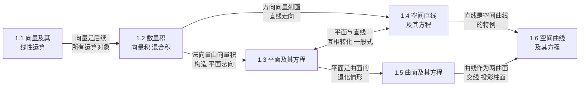

# MOC - 第1章 向量代数与空间解析几何

> [!info] 本章定位
> 本章是高等数学 A(2)（下册）的起点，也是从**一元微积分**通往**多元微积分**的几何桥梁。它要解决的核心问题是：如何在三维欧氏空间中用代数方法精确描述几何对象——点、向量、平面、直线、曲面与空间曲线，并为后续多元函数的极限、偏导数、重积分与曲线曲面积分提供**坐标系、向量与曲面方程**三大工具。具体而言，先建立向量及其线性运算，再引入数量积、向量积、混合积三种乘法（解决长度、夹角、面积、体积的度量问题），然后借助法向量与方向向量将平面与直线方程化，最后讨论旋转曲面、柱面与二次曲面的标准方程，以及空间曲线在坐标面上的投影。掌握本章后，[[MOC - 第2章]] 中的偏导数与全微分、[[MOC - 第3章]] 中的重积分区域、[[MOC - 第4章]] 中的曲线曲面积分才有了描述对象。

## 学习路线图

> [!tip] 学习顺序建议
> 1.1 建立**向量语言**（坐标、模、方向余弦），是全章的基础工具，务必熟练；1.2 三种乘法是度量工具，向量积的行列式形式与混合积的几何意义是高频考点；1.3、1.4 利用向量统一处理平面与直线，关键在于识别"法向量"与"方向向量"这两个核心量；1.5 二次曲面的标准方程需对照记忆并通过"截痕法"想象形状；1.6 投影柱面是后续重积分与曲面积分定积分区域的常用工具。

## 知识点导航

| 节 | 主题 | 核心要点 | 入口 |
| -- | ---- | -------- | ---- |
| 1.1 | 向量及其线性运算 | 向量定义与表示、坐标/模/方向角/方向余弦、加减与数乘、共线共面条件、单位向量与向径 | [[1.1 向量及其线性运算]] |
| 1.2 | 数量积、向量积、混合积 | $a\cdot b=\lvert a\rvert\lvert b\rvert\cos\theta$、$a\times b$ 行列式表示与面积意义、$[abc]$ 体积意义与共面条件 | [[1.2 数量积、向量积、混合积]] |
| 1.3 | 平面及其方程 | 点法式 $A(x-x_0)+B(y-y_0)+C(z-z_0)=0$、一般式、截距式、两平面夹角、点到平面距离 | [[1.3 平面及其方程]] |
| 1.4 | 空间直线及其方程 | 对称式、参数式、两点式、一般式（两平面交线）、两直线夹角、线面夹角、点到直线距离 | [[1.4 空间直线及其方程]] |
| 1.5 | 曲面及其方程 | 旋转曲面（母线/旋转轴）、柱面（母线/准线）、六大二次曲面标准方程与截痕 | [[1.5 曲面及其方程]] |
| 1.6 | 空间曲线及其方程 | 一般方程（两曲面交线）、参数方程、投影柱面与坐标面投影曲线 | [[1.6 空间曲线及其方程]] |

## 核心考点

> [!warning] 重点掌握
> 1. **方向余弦与单位向量**：已知 $\vec a=(a_x,a_y,a_z)$，模 $\lvert\vec a\rvert=\sqrt{a_x^2+a_y^2+a_z^2}$，方向余弦 $\cos\alpha=\dfrac{a_x}{\lvert\vec a\rvert}$（$\beta,\gamma$ 同理），满足 $\cos^2\alpha+\cos^2\beta+\cos^2\gamma=1$；单位向量 $\vec a^{\,0}=\dfrac{\vec a}{\lvert\vec a\rvert}=(\cos\alpha,\cos\beta,\cos\gamma)$。
> 2. **向量积的坐标行列式**：$\vec a\times\vec b=\begin{vmatrix}\vec i&\vec j&\vec k\\a_x&a_y&a_z\\b_x&b_y&b_z\end{vmatrix}$，方向由右手定则确定；$\lvert\vec a\times\vec b\rvert=\lvert\vec a\rvert\lvert\vec b\rvert\sin\theta$ 是以 $\vec a,\vec b$ 为邻边的平行四边形面积。
> 3. **混合积的几何意义**：$[\vec a\,\vec b\,\vec c]=(\vec a\times\vec b)\cdot\vec c$ 的绝对值表示以三向量为棱的平行六面体体积；三向量共面 $\Leftrightarrow[\vec a\,\vec b\,\vec c]=0$。
> 4. **平面方程的建立**：抓住**点**与**法向量** $\vec n=(A,B,C)$，点法式为出发点；一般式 $Ax+By+Cz+D=0$ 中系数即为法向量坐标；截距式 $\dfrac{x}{a}+\dfrac{y}{b}+\dfrac{z}{c}=1$ 要求 $abc\ne0$。
> 5. **直线方程的建立与互化**：抓住**点**与**方向向量** $\vec s=(m,n,p)$；对称式 $\dfrac{x-x_0}{m}=\dfrac{y-y_0}{n}=\dfrac{z-z_0}{p}$ 与参数式 $x=x_0+mt$ 的互化；一般式须由两平面法向量叉乘得到方向向量 $\vec s=\vec n_1\times\vec n_2$。
> 6. **距离与夹角计算**：点到平面距离 $d=\dfrac{\lvert Ax_0+By_0+Cz_0+D\rvert}{\sqrt{A^2+B^2+C^2}}$；两平面夹角 $\cos\varphi=\dfrac{\lvert\vec n_1\cdot\vec n_2\rvert}{\lvert\vec n_1\rvert\lvert\vec n_2\rvert}$；线面夹角 $\sin\varphi=\dfrac{\lvert\vec s\cdot\vec n\rvert}{\lvert\vec s\rvert\lvert\vec n\rvert}$。
> 7. **二次曲面识别**：能由标准方程判断椭球面、单/双叶双曲面、椭圆/双曲抛物面、二次锥面，并使用截痕法作图；旋转曲面方程的"留轴变垂面"构造法。

## 自测题

> [!question] 自测题 1
> 设 $\vec a=(2,1,-2)$，$\vec b=(1,1,1)$，求 $\vec a\cdot\vec b$、$\vec a\times\vec b$、$\vec a$ 的方向余弦及 $\text{Prj}_{\vec b}\vec a$。

> > [!check]- 参考答案
> > $\vec a\cdot\vec b=2\cdot1+1\cdot1+(-2)\cdot1=1$；$\lvert\vec a\rvert=\sqrt{4+1+4}=3$，$\lvert\vec b\rvert=\sqrt3$。
> > $$\vec a\times\vec b=\begin{vmatrix}\vec i&\vec j&\vec k\\2&1&-2\\1&1&1\end{vmatrix}=(1\cdot1-(-2)\cdot1,\,-(2\cdot1-(-2)\cdot1),\,2\cdot1-1\cdot1)=(3,-3,1).$$
> > 方向余弦 $\cos\alpha=\dfrac23$，$\cos\beta=\dfrac13$，$\cos\gamma=-\dfrac23$；$\text{Prj}_{\vec b}\vec a=\dfrac{\vec a\cdot\vec b}{\lvert\vec b\rvert}=\dfrac{1}{\sqrt3}=\dfrac{\sqrt3}{3}$。

> [!question] 自测题 2
> 求过点 $M_0(2,-1,3)$ 且与平面 $\Pi_1:x+y-z=0$ 和 $\Pi_2:2x-y+z-1=0$ 都平行的直线方程。

> > [!check]- 参考答案
> > 两平面平行于直线，则直线方向向量 $\vec s$ 同时垂直于两平面法向量 $\vec n_1=(1,1,-1)$、$\vec n_2=(2,-1,1)$，可取
> > $$\vec s=\vec n_1\times\vec n_2=\begin{vmatrix}\vec i&\vec j&\vec k\\1&1&-1\\2&-1&1\end{vmatrix}=(1\cdot1-(-1)(-1),\,2(-1)-1\cdot1,\,1(-1)-1\cdot2)=(0,-3,-3).$$
> > 约去公因子得 $\vec s=(0,1,1)$。直线对称式方程为 $\dfrac{x-2}{0}=\dfrac{y+1}{1}=\dfrac{z-3}{1}$（分母为 0 表示 $x$ 恒为 2）。

> [!question] 自测题 3
> 求点 $P(1,2,3)$ 到平面 $\Pi:2x-2y+z-5=0$ 的距离，并指出 $P$ 相对 $\Pi$ 的位置。

> > [!check]- 参考答案
> > $d=\dfrac{\lvert 2\cdot1-2\cdot2+1\cdot3-5\rvert}{\sqrt{4+4+1}}=\dfrac{\lvert 2-4+3-5\rvert}{3}=\dfrac{4}{3}$。代入值 $2(1)-2(2)+3-5=-4<0$，故 $P$ 位于平面法向量 $\vec n=(2,-2,1)$ 指向的**负侧**。

> [!question] 自测题 4
> 指出曲面 $\dfrac{x^2}{4}+\dfrac{y^2}{9}-\dfrac{z^2}{16}=1$ 的类型，并写出它与 $z=0$、$y=3$ 两平面的截痕曲线方程与类型。

> > [!check]- 参考答案
> > 方程中 $x^2,y^2$ 项系数为正、$z^2$ 项为负，缺常数非零，为**单叶双曲面**。
> > - 截 $z=0$：$\dfrac{x^2}{4}+\dfrac{y^2}{9}=1$，是 $Oxy$ 面上的**椭圆**（半轴 $2,3$）。
> > - 截 $y=3$：$\dfrac{x^2}{4}+1-\dfrac{z^2}{16}=1$，即 $\dfrac{x^2}{4}-\dfrac{z^2}{16}=0$，即 $\left(\dfrac{x}{2}-\dfrac{z}{4}\right)\left(\dfrac{x}{2}+\dfrac{z}{4}\right)=0$，退化为**一对相交直线**。

## 章节导航

- 上一级：[[MOC - 高等数学A(2)]]
- 先修课程：[[MOC - 高等数学A(1)]]
- 下一章：[[MOC - 第2章]]
- 本章习题：[[MOC - 第1章习题]]

## 相关标签

#高等数学 #空间解析几何 #向量 #数量积 #向量积 #平面 #直线 #曲面
