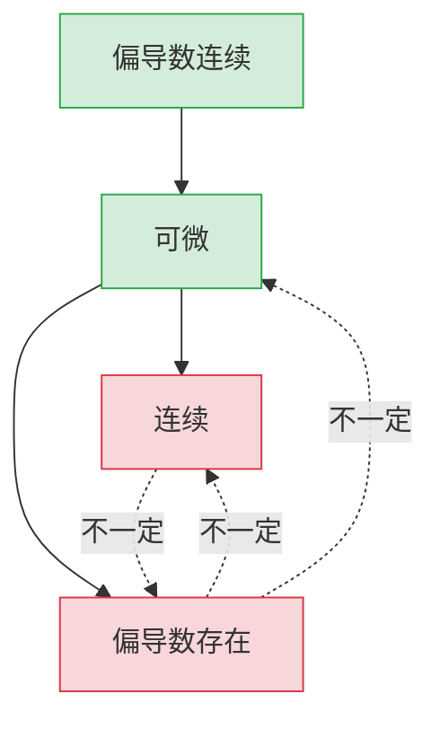

# 2.3 全微分

> [!info] 本节定位
> 偏导数只描述沿坐标轴方向的变化率，无法刻画函数在某点任意方向增量的整体近似。**全微分**是多元函数增量的"线性主部"，对应一元函数中的 $\mathrm{d}y=y'\mathrm{d}x$。本节要解决的核心问题是：函数增量如何分解为线性部分与高阶小量？可微的充要/充分/必要条件是什么？可微、连续、偏导数存在三者关系如何？

## 一、全增量

> [!definition] 全增量
> 设函数 $z=f(x,y)$ 在 $(x,y)$ 的某邻域有定义，给 $x,y$ 以增量 $\Delta x,\Delta y$，则
> $$\Delta z=f(x+\Delta x,y+\Delta y)-f(x,y)$$
> 称为 $f$ 在 $(x,y)$ 处对应于 $\Delta x,\Delta y$ 的**全增量**。

**说明**：全增量是 $\Delta x,\Delta y$ 的二元函数，依赖路径（即 $\Delta y$ 与 $\Delta x$ 的相对关系）。

## 二、全微分定义

> [!definition] 可微与全微分
> 若全增量可表为
> $$\Delta z=A\Delta x+B\Delta y+o(\rho),\quad \rho=\sqrt{(\Delta x)^2+(\Delta y)^2}\to 0$$
> 其中 $A,B$ 仅与 $(x,y)$ 有关、与 $\Delta x,\Delta y$ 无关，则称 $f$ 在 $(x,y)$ 处**可微**。线性主部 $A\Delta x+B\Delta y$ 称为 $f$ 在该点的**全微分**，记为
> $$\mathrm{d}z=A\Delta x+B\Delta y$$
> 习惯上记 $\Delta x=\mathrm{d}x,\Delta y=\mathrm{d}y$，故 $\mathrm{d}z=A\,\mathrm{d}x+B\,\mathrm{d}y$。

> [!theorem] 可微的必要条件
> 若 $f$ 在 $(x,y)$ 处可微，则 $f$ 在该点偏导数存在，且 $A=f_x(x,y),B=f_y(x,y)$，即
> $$\boxed{\mathrm{d}z=f_x\,\mathrm{d}x+f_y\,\mathrm{d}y}$$

> [!proof] 必要性证明
> 可微 ⟹ $\Delta z=A\Delta x+B\Delta y+o(\rho)$。令 $\Delta y=0$，则 $\rho=|\Delta x|$，得到
> $$f(x+\Delta x,y)-f(x,y)=A\Delta x+o(|\Delta x|)$$
> 两边除以 $\Delta x$ 取极限：$f_x(x,y)=\lim_{\Delta x\to 0}\dfrac{f(x+\Delta x,y)-f(x,y)}{\Delta x}=A$。同理 $B=f_y$。$\square$

## 三、可微的充分条件

> [!theorem] 可微充分条件
> 若 $f(x,y)$ 的偏导数 $f_x, f_y$ 在 $(x,y)$ 的某邻域内存在，且在 $(x,y)$ 处**连续**，则 $f$ 在 $(x,y)$ 处可微。

> [!proof] 证明思路
> 将 $\Delta z$ 拆为两段：先沿 $x$ 再沿 $y$：
> $$\Delta z=[f(x+\Delta x,y+\Delta y)-f(x,y+\Delta y)]+[f(x,y+\Delta y)-f(x,y)]$$
> - 第二段：对 $x$ 不变，对 $y$ 用一元微分中值定理，$=f_y(x,y)\Delta y+\varepsilon_1\Delta y$；
> - 第一段：在 $y+\Delta y$ 处对 $x$ 用中值定理，$=f_x(x,y)\Delta x+\varepsilon_2\Delta x$，其中 $\varepsilon_1,\varepsilon_2\to 0$（由 $f_x,f_y$ 连续）。
>
> 故 $\Delta z=f_x\Delta x+f_y\Delta y+\varepsilon_1\Delta y+\varepsilon_2\Delta x$。又 $|\varepsilon_1\Delta y+\varepsilon_2\Delta x|\leq (|\varepsilon_1|+|\varepsilon_2|)\rho=o(\rho)$，由定义可微。$\square$

> [!warning] 充分条件不能放宽
> 偏导数存在但**不连续**时函数可能可微、可能不可微，需用定义判定。

## 四、可微性直接判定法

> [!important] 用定义判定可微的步骤
> 1. 计算 $f_x, f_y$；
> 2. 写出近似量 $\Delta z-(f_x\Delta x+f_y\Delta y)$；
> 3. 验证 $\lim_{\rho\to 0}\dfrac{\Delta z-(f_x\Delta x+f_y\Delta y)}{\rho}\stackrel{?}{=}0$。若等于 0 则可微，否则不可微。

## 五、可微、连续、偏导数存在关系

> [!warning] 关系总览
> - 可微 ⟹ 连续（不能用偏导存在代替）；
> - 可微 ⟹ 偏导数存在；
> - 偏导数存在 ⟹ 既不连续也不可微；
> - 偏导数连续 ⟹ 可微（充分非必要）；
> - 函数连续 ⟹ 既不偏导存在也不可微。

## 六、典型例题

> [!example]- 例题 1：用定义判定可微
> 讨论 $f(x,y)=\begin{cases}\dfrac{xy}{\sqrt{x^2+y^2}},&(x,y)\neq(0,0)\\ 0,&(x,y)=(0,0)\end{cases}$ 在 $(0,0)$ 处的可微性。
>
> **解**：先用定义求偏导：
> $$f_x(0,0)=\lim_{\Delta x\to 0}\dfrac{f(\Delta x,0)-0}{\Delta x}=\lim_{\Delta x\to 0}\dfrac{0}{\Delta x}=0,\quad f_y(0,0)=0$$
> 再求增量与线性主部之差：
> $$\Delta z-(f_x\Delta x+f_y\Delta y)=\dfrac{\Delta x\Delta y}{\sqrt{(\Delta x)^2+(\Delta y)^2}}-0$$
> 取路径 $\Delta y=\Delta x$，则
> $$\dfrac{\Delta z-(f_x\Delta x+f_y\Delta y)}{\rho}=\dfrac{\Delta x^2/\sqrt{2\Delta x^2}}{\sqrt{2\Delta x^2}}=\dfrac{\Delta x^2/\sqrt{2}|\Delta x|}{\sqrt{2}|\Delta x|}=\dfrac{\Delta x^2}{2\Delta x^2}=\dfrac{1}{2}\neq 0$$
> 故 $f$ 在 $(0,0)$ 不可微（虽然偏导数存在）。$\square$

> [!example]- 例题 2：用充分条件判定可微
> 求 $f(x,y)=x^2+y^2+\sin(xy)$ 的全微分。
>
> **解**：偏导数 $f_x=2x+y\cos(xy)$，$f_y=2y+x\cos(xy)$ 在 $\mathbb{R}^2$ 上连续（初等函数），由充分条件 $f$ 处处可微。故
> $$\mathrm{d}z=(2x+y\cos xy)\,\mathrm{d}x+(2y+x\cos xy)\,\mathrm{d}y$$

> [!example]- 例题 3：近似计算
> 求 $\sqrt{1.02^3+1.97^3}$ 的近似值。
>
> **思路**：取 $f(x,y)=\sqrt{x^3+y^3}$，$(x_0,y_0)=(1,2)$，$\Delta x=0.02,\Delta y=-0.03$。
>
> **解**：
> $$f_x=\dfrac{3x^2}{2\sqrt{x^3+y^3}}\bigg|_{(1,2)}=\dfrac{3}{2\cdot 3}=\dfrac{1}{2},\quad f_y=\dfrac{3y^2}{2\sqrt{x^3+y^3}}\bigg|_{(1,2)}=\dfrac{12}{6}=2$$
> $f(1,2)=3$，由 $\Delta z\approx \mathrm{d}z$ 得
> $$f(1.02,1.97)\approx 3+\dfrac{1}{2}\times 0.02+2\times(-0.03)=3+0.01-0.06=2.95$$

## 七、与其他章节的联系

- 全微分是 [[2.4 复合函数求导法则]] 中**全微分形式不变性**的对象；
- 可微是 [[2.6 方向导数与梯度]] 中"方向导数 = 梯度投影"成立的前提；
- 全微分概念在 [[2.5 隐函数求导公式]] 中通过全微分法求隐函数导数；
- 本章后续 [[MOC - 第3章]] 中重积分换元公式依赖于可微变换。

## 章节导航

- 上一节：[[2.2 偏导数]]
- 下一节：[[2.4 复合函数求导法则]]
- 返回：[[MOC - 第2章]]
