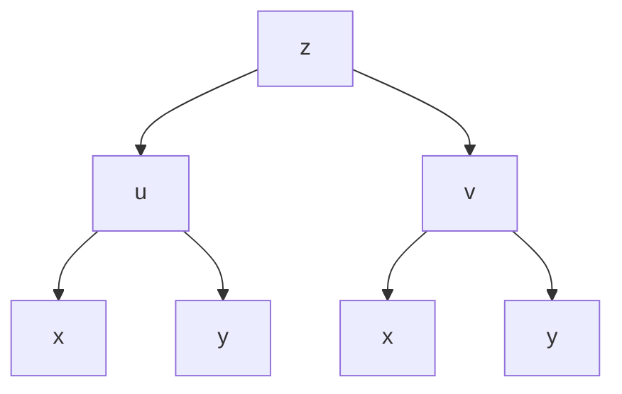

# 2.4 复合函数求导法则

> [!info] 本节定位
> 多元函数常以复合形式出现（如 $z=f(u,v)$，$u=\varphi(x,y)$，$v=\psi(x,y)$）。**链式法则**给出了从外层到内层逐层求偏导的方法。本节解决的核心问题是：在不同复合结构下，偏导公式如何书写？全微分形式不变性意味着什么？

## 一、链式法则的几种基本结构

```mermaid
flowchart TD
    A[情形1: z=f(u), u=φ(x,y)]
    B[情形2: z=f(u,v), u=φ(t), v=ψ(t)]
    C[情形3: z=f(u,v), u=φ(x,y), v=ψ(x,y)]
    D[情形4: z=f(x,y,u,v), u=φ(x,y), v=ψ(x,y)]
```

### 1.1 情形 1：一元中间变量

> [!theorem] 链式法则（情形 1）
> 设 $z=f(u)$ 可导，$u=\varphi(x,y)$ 可偏导，则复合函数 $z=f(\varphi(x,y))$ 的偏导为
> $$\dfrac{\partial z}{\partial x}=f'(u)\cdot\dfrac{\partial u}{\partial x},\quad \dfrac{\partial z}{\partial y}=f'(u)\cdot\dfrac{\partial u}{\partial y}$$

### 1.2 情形 2：多元外层 + 一元内层

> [!theorem] 链式法则（情形 2，全导数）
> 设 $z=f(u,v)$ 有连续偏导，$u=\varphi(t),v=\psi(t)$ 可导，则 $z$ 是 $t$ 的一元函数，**全导数**
> $$\dfrac{\mathrm{d}z}{\mathrm{d}t}=\dfrac{\partial f}{\partial u}\cdot\dfrac{\mathrm{d}u}{\mathrm{d}t}+\dfrac{\partial f}{\partial v}\cdot\dfrac{\mathrm{d}v}{\mathrm{d}t}$$

### 1.3 情形 3：多元复合（核心公式）

> [!theorem] 链式法则（情形 3，多元复合）
> 设 $z=f(u,v)$ 有连续偏导，$u=\varphi(x,y),v=\psi(x,y)$ 可偏导，则
> $$\boxed{\dfrac{\partial z}{\partial x}=\dfrac{\partial z}{\partial u}\cdot\dfrac{\partial u}{\partial x}+\dfrac{\partial z}{\partial v}\cdot\dfrac{\partial v}{\partial x}}$$
> $$\boxed{\dfrac{\partial z}{\partial y}=\dfrac{\partial z}{\partial u}\cdot\dfrac{\partial u}{\partial y}+\dfrac{\partial z}{\partial v}\cdot\dfrac{\partial v}{\partial y}}$$

**记忆方法**：树状图——以 $z$ 为根，下接中间变量 $u,v$，再接自变量 $x,y$。对某自变量的偏导 = "从根到该自变量的所有路径" 上偏导数乘积之和。



> [!proof] 证明思路
> 固定 $y$ 给 $x$ 以增量 $\Delta x$，引起 $u,v$ 增量 $\Delta u,\Delta v$，进而 $z$ 增量 $\Delta z$。由 $f$ 可微（[[2.3 全微分]]）：
> $$\Delta z=f_u\Delta u+f_v\Delta v+\varepsilon_1\Delta u+\varepsilon_2\Delta v$$
> 两边除以 $\Delta x$ 取极限，由 $u,v$ 可偏导且 $\Delta u,\Delta v\to 0$ 得公式。$\square$

### 1.4 情形 4：变量同时出现

若 $z=f(x,y,u)$，$u=\varphi(x,y)$，则 $z$ 仍是 $x,y$ 的复合函数。注意符号区别：

> [!warning] $\dfrac{\partial z}{\partial x}$ 与 $\dfrac{\partial f}{\partial x}$ 不同
> - $\dfrac{\partial z}{\partial x}$：将 $z$ 视作 $x,y$ 的复合函数对 $x$ 求偏导（**全偏导**）；
> - $\dfrac{\partial f}{\partial x}$：在 $f$ 中将 $x$ 作为独立变量（$u$ 固定）对 $x$ 求偏导。
>
> 公式：$\dfrac{\partial z}{\partial x}=\dfrac{\partial f}{\partial x}+\dfrac{\partial f}{\partial u}\cdot\dfrac{\partial u}{\partial x}$。

## 二、全微分形式不变性

> [!theorem] 全微分形式不变性
> 无论 $u,v$ 是自变量还是中间变量，只要 $z=f(u,v)$ 可微，其全微分形式恒为
> $$\mathrm{d}z=\dfrac{\partial z}{\partial u}\mathrm{d}u+\dfrac{\partial z}{\partial v}\mathrm{d}v$$

> [!proof] 证明（多元复合情形）
> 设 $u=\varphi(x,y),v=\psi(x,y)$ 可微，由链式法则
> $$\mathrm{d}z=z_x\mathrm{d}x+z_y\mathrm{d}y=(z_u u_x+z_v v_x)\mathrm{d}x+(z_u u_y+z_v v_y)\mathrm{d}y$$
> $$=z_u(u_x\mathrm{d}x+u_y\mathrm{d}y)+z_v(v_x\mathrm{d}x+v_y\mathrm{d}y)=z_u\mathrm{d}u+z_v\mathrm{d}v$$
> 形式与 $u,v$ 为自变量时一致。$\square$

**应用价值**：用全微分法求复合偏导，可"一次性求出多个偏导"且不易遗漏项。

## 三、典型例题

> [!example]- 例题 1：基本链式法则
> 设 $z=\mathrm{e}^{u}\sin v$，$u=xy$，$v=x+y$，求 $z_x, z_y$。
>
> **解**：
> $$z_u=\mathrm{e}^{u}\sin v,\quad z_v=\mathrm{e}^{u}\cos v$$
> $$u_x=y,\quad v_x=1,\quad u_y=x,\quad v_y=1$$
> 故
> $$z_x=\mathrm{e}^{u}\sin v\cdot y+\mathrm{e}^{u}\cos v\cdot 1=\mathrm{e}^{xy}[y\sin(x+y)+\cos(x+y)]$$
> $$z_y=\mathrm{e}^{u}\sin v\cdot x+\mathrm{e}^{u}\cos v\cdot 1=\mathrm{e}^{xy}[x\sin(x+y)+\cos(x+y)]$$

> [!example]- 例题 2：抽象函数求偏导
> 设 $z=f(x^2-y^2,xy)$，$f$ 有二阶连续偏导数，求 $z_{xy}$。
>
> **解**：令 $u=x^2-y^2, v=xy$，则
> $$z_x=f_1\cdot 2x+f_2\cdot y$$
> （$f_1$ 表示 $f$ 对第一中间变量偏导，$f_2$ 对第二中间变量偏导）
> $$z_{xy}=\dfrac{\partial}{\partial y}(2x f_1+y f_2)=2x\cdot f_{12}\cdot(-2y)+2x\cdot f_{22}\cdot x+f_2+y\cdot f_{12}\cdot(-2y)+y\cdot f_{22}\cdot x$$
> 整理得：
> $$z_{xy}=-4xy\,f_{12}+2x^2 f_{22}+f_2-2y^2 f_{12}+xy\,f_{22}=f_2+(2x^2-2y^2)f_{12}+xy\,f_{22}\cdot 2$$
> 由 Clairaut 定理 $f_{12}=f_{21}$ 合并同类项即可。$\square$

> [!example]- 例题 3：全微分形式不变性应用
> 设 $z=\arctan\dfrac{y}{x}$，求 $\mathrm{d}z$ 并由此求 $z_x, z_y$。
>
> **解**：令 $u=y/x$，由全微分形式不变性
> $$\mathrm{d}z=\dfrac{1}{1+u^2}\mathrm{d}u=\dfrac{1}{1+(y/x)^2}\cdot\dfrac{x\mathrm{d}y-y\mathrm{d}x}{x^2}=\dfrac{-y\,\mathrm{d}x+x\,\mathrm{d}y}{x^2+y^2}$$
> 比较 $\mathrm{d}z=z_x\mathrm{d}x+z_y\mathrm{d}y$ 得
> $$z_x=-\dfrac{y}{x^2+y^2},\quad z_y=\dfrac{x}{x^2+y^2}$$

## 四、与其他章节的联系

- 链式法则是 [[2.5 隐函数求导公式]] 中推导隐函数偏导公式的工具；
- 全微分形式不变性是 [[2.5 隐函数求导公式]] 中"全微分法"求隐函数导数的依据；
- 复合求导是 [[2.6 方向导数与梯度]] 中"梯度复合"（如梯度沿曲线变化）的基础；
- 链式法则在 [[2.7 多元函数极值与最值]] 中求目标函数偏导时大量使用。

## 章节导航

- 上一节：[[2.3 全微分]]
- 下一节：[[2.5 隐函数求导公式]]
- 返回：[[MOC - 第2章]]
