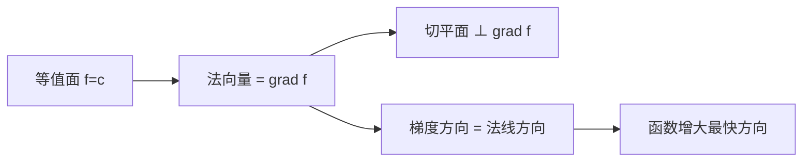

# 2.6 方向导数与梯度

> [!info] 本节定位
> 偏导数仅刻画沿坐标轴方向的变化率，但物理与工程问题需要任意方向的变化率（如温度场沿热流方向、电势沿电力线方向）。**方向导数**回答"沿方向 $\ell$ 函数变化多快"；**梯度**回答"哪个方向变化最快、变化率多大"。本节核心问题：方向导数如何定义与计算？梯度有何代数与几何意义？两者通过什么公式联系？

## 一、方向导数

> [!definition] 方向导数
> 设函数 $u=f(x,y,z)$ 在 $P_0(x_0,y_0,z_0)$ 的某邻域有定义，$\vec{\ell}$ 为非零向量，$\vec{e}_\ell=(\cos\alpha,\cos\beta,\cos\gamma)$ 为其单位向量。若极限
> $$\lim_{t\to 0^+}\dfrac{f(P_0+t\vec{e}_\ell)-f(P_0)}{t}$$
> 存在，则称此极限为 $f$ 在 $P_0$ 处**沿方向 $\vec{\ell}$ 的方向导数**，记为
> $$\dfrac{\partial f}{\partial \ell}\bigg|_{P_0}$$

**几何意义**：方向导数是函数沿射线 $P_0+t\vec{e}_\ell$ 的变化率（一元极限）。

> [!warning] 方向导数与偏导数的区别
> - 偏导数是沿坐标轴正负两个方向的方向导数之和的必要前提；
> - 方向导数是单向的（$t\to 0^+$），偏导数是双向的（$\Delta x\to 0$ 可正可负）；
> - 偏导数存在 ≠ 任意方向导数存在。

## 二、方向导数的计算公式

> [!theorem] 方向导数与梯度公式
> 若 $f$ 在 $P_0$ 处**可微**，则 $f$ 在该点沿任意方向 $\vec{e}_\ell=(\cos\alpha,\cos\beta,\cos\gamma)$ 的方向导数存在，且
> $$\boxed{\dfrac{\partial f}{\partial \ell}=f_x\cos\alpha+f_y\cos\beta+f_z\cos\gamma}$$

> [!proof] 证明
> 由可微定义 $f(P_0+t\vec{e}_\ell)-f(P_0)=f_x\cdot t\cos\alpha+f_y\cdot t\cos\beta+f_z\cdot t\cos\gamma+o(t)$。
> 两边除以 $t$ 取极限 $t\to 0^+$，得方向导数 = $f_x\cos\alpha+f_y\cos\beta+f_z\cos\gamma$。$\square$

> [!warning] 可微是充分条件
> 若函数不可微但偏导数存在，方向导数可能存在也可能不存在，需用定义判定。**不能用公式直接代入偏导数。**

## 三、梯度

> [!definition] 梯度
> 设 $f$ 在 $P_0$ 处可偏导，称向量
> $$\mathrm{grad}\,f\bigg|_{P_0}=(f_x,f_y,f_z)\bigg|_{P_0}$$
> 为 $f$ 在 $P_0$ 处的**梯度**。也记为 $\nabla f$（$\nabla$ 为 Nabla 算子）。

**形式记忆**：$\nabla=\left(\dfrac{\partial}{\partial x},\dfrac{\partial}{\partial y},\dfrac{\partial}{\partial z}\right)$。

### 梯度的几何意义

> [!theorem] 梯度的方向意义
> 1. **方向**：梯度方向是函数在 $P_0$ 处**增长最快**的方向；负梯度方向是**下降最快**的方向（梯度下降法基础）。
> 2. **模**：$|\mathrm{grad}\,f|$ 等于函数在该方向的最大变化率。
> 3. **方向导数 = 梯度投影**：
> $$\dfrac{\partial f}{\partial \ell}=\mathrm{grad}\,f\cdot\vec{e}_\ell=|\mathrm{grad}\,f|\cdot\cos\theta$$
> 其中 $\theta$ 是 $\vec{\ell}$ 与 $\mathrm{grad}\,f$ 的夹角。
>
> 推论：当 $\theta=0$ 时方向导数最大为 $|\mathrm{grad}\,f|$；当 $\theta=\pi$ 时最小为 $-|\mathrm{grad}\,f|$；当 $\theta=\pi/2$ 时方向导数为 0。

## 四、等值面（线）与梯度的关系

> [!definition] 等值面与等值线
> - **等值面**：曲面 $f(x,y,z)=c$（$c$ 为常数）；
> - **等值线**：平面曲线 $f(x,y)=c$。

> [!theorem] 梯度垂直于等值面
> 函数 $f$ 在等值面 $f=c$ 上一点 $P_0$ 处的梯度 $\mathrm{grad}\,f\big|_{P_0}$ 与该等值面在 $P_0$ 的**切平面垂直**，即梯度是等值面在该点的法向量。

> [!proof] 证明
> 设等值面参数方程 $\vec{r}(t)\in\{f=c\}$，则 $f(\vec{r}(t))\equiv c$。两边对 $t$ 求导：
> $$\mathrm{grad}\,f\cdot\vec{r}'(t)=0$$
> 即梯度与曲面上任意切向量 $\vec{r}'(t)$ 都垂直，故梯度是法向量。$\square$

## 五、梯度的运算法则

> [!property] 梯度运算法则
> 设 $u,v$ 可微，$c$ 为常数，则：
> 1. **线性**：$\nabla(c_1 u+c_2 v)=c_1\nabla u+c_2\nabla v$
> 2. **乘积**：$\nabla(uv)=v\nabla u+u\nabla v$
> 3. **商**：$\nabla(u/v)=\dfrac{v\nabla u-u\nabla v}{v^2}$（$v\neq 0$）
> 4. **复合**：$\nabla f(u)=f'(u)\nabla u$

## 六、典型例题

> [!example]- 例题 1：方向导数计算
> 求 $u=x^2+y^2+z^2$ 在点 $M(1,2,3)$ 处沿方向 $\vec{\ell}=(2,1,2)$ 的方向导数。
>
> **解**：单位化 $\vec{e}_\ell=\dfrac{1}{3}(2,1,2)$，故 $\cos\alpha=\dfrac{2}{3},\cos\beta=\dfrac{1}{3},\cos\gamma=\dfrac{2}{3}$。
> $$u_x=2x=2,\quad u_y=2y=4,\quad u_z=2z=6$$
> $$\dfrac{\partial u}{\partial \ell}=2\cdot\dfrac{2}{3}+4\cdot\dfrac{1}{3}+6\cdot\dfrac{2}{3}=\dfrac{4+4+12}{3}=\dfrac{20}{3}$$

> [!example]- 例题 2：梯度与最大方向导数
> 求 $f(x,y)=x\mathrm{e}^y$ 在 $(1,0)$ 处的最大方向导数与对应方向。
>
> **解**：
> $$f_x=\mathrm{e}^y,\quad f_y=x\mathrm{e}^y\implies \mathrm{grad}\,f\big|_{(1,0)}=(1,1)$$
> 最大方向导数 = $|\mathrm{grad}\,f|=\sqrt{2}$，方向沿 $(1,1)/\sqrt{2}$。$\square$

> [!example]- 例题 3：等值线与梯度垂直
> 验证函数 $f(x,y)=x^2+y^2$ 的等值线为同心圆，梯度指向圆心外法向。
>
> **解**：等值线 $x^2+y^2=c$（$c\geq 0$）是同心圆。梯度 $\mathrm{grad}\,f=(2x,2y)$，方向沿径向指向外，与圆的法向一致（圆的法向量即径向）。$\square$

## 七、与其他章节的联系

- 梯度是 [[2.7 多元函数极值与最值]] 中"梯度 = 0 是驻点条件"的依据；
- 拉格朗日乘数法（[[2.8 条件极值、拉格朗日乘数法]]）本质上是"目标函数梯度与约束等值面法向量共线"；
- 梯度、散度、旋度是 [[MOC - 第4章]] 三大场算子，梯度是其中之一；
- 物理上电势 $\varphi$ 的梯度负值是电场强度：$\vec{E}=-\nabla\varphi$。

## 章节导航

- 上一节：[[2.5 隐函数求导公式]]
- 下一节：[[2.7 多元函数极值与最值]]
- 返回：[[MOC - 第2章]]
