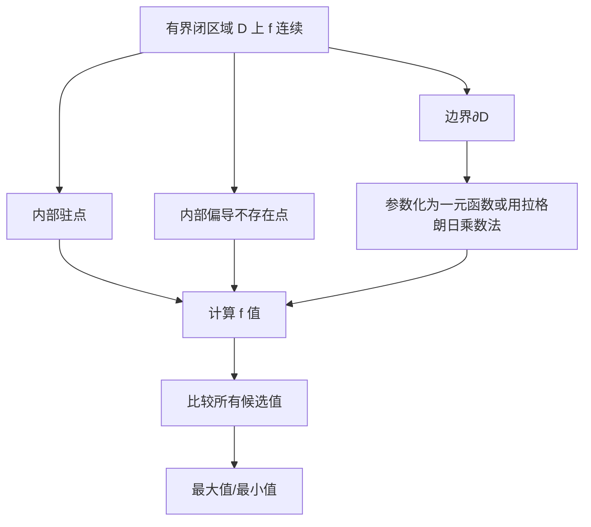

# 2.7 多元函数极值与最值

> [!info] 本节定位
> 极值是函数在某点附近局部最大或最小的性质；最值是在整个定义域（通常为有界闭区域）上的全局极值。本节解决的核心问题：如何用偏导数找极值候选点（驻点）？如何用二阶偏导数判别驻点是极大、极小还是鞍点？如何求有界闭区域上的最值？

## 一、极值定义

> [!definition] 极值
> 设 $f(x,y)$ 在 $P_0(x_0,y_0)$ 的某邻域 $U(P_0)$ 内有定义：
> - 若对任意 $P\in U(P_0)$ 都有 $f(P)\leq f(P_0)$，称 $f(P_0)$ 为**极大值**，$P_0$ 为**极大值点**；
> - 若对任意 $P\in U(P_0)$ 都有 $f(P)\geq f(P_0)$，称 $f(P_0)$ 为**极小值**，$P_0$ 为**极小值点**。
>
> 极大值与极小值统称**极值**。极值是局部概念。

## 二、极值的必要条件

> [!theorem] 极值必要条件（Fermat 推广）
> 若 $f$ 在 $P_0(x_0,y_0)$ 处有极值，且在 $P_0$ 处偏导数存在，则
> $$\boxed{f_x(x_0,y_0)=0,\quad f_y(x_0,y_0)=0}$$

> [!proof] 证明
> 固定 $y=y_0$，则 $g(x)=f(x,y_0)$ 在 $x_0$ 处有极值且可导，由一元 Fermat 定理 $g'(x_0)=f_x(x_0,y_0)=0$。同理 $f_y=0$。$\square$

> [!definition] 驻点
> 满足 $f_x=f_y=0$ 的点称为 $f$ 的**驻点**。偏导数不存在的点也可能是极值点（与一元相同）。

> [!warning] 必要非充分
> 驻点不一定是极值点（如 $f(x,y)=xy$ 在 $(0,0)$ 是鞍点）。需用充分条件判别。

## 三、极值的充分条件

> [!theorem] 极值充分条件（判别式法）
> 设 $f$ 在 $P_0$ 的某邻域内具有二阶连续偏导数，且 $P_0$ 是驻点（$f_x=f_y=0$）。记
> $$A=f_{xx}(P_0),\quad B=f_{xy}(P_0),\quad C=f_{yy}(P_0),\quad \Delta=AC-B^2$$
> 则：
>
> | 条件 | 结论 |
> | ---- | ---- |
> | $\Delta>0$ 且 $A>0$ | $P_0$ 为极小值点 |
> | $\Delta>0$ 且 $A<0$ | $P_0$ 为极大值点 |
> | $\Delta<0$ | $P_0$ 不是极值点（鞍点） |
> | $\Delta=0$ | 不能判定，需用其他方法 |

> [!proof] 证明思路（多元 Taylor 二阶展开）
> 在驻点处 $f$ 的一阶 Taylor 项为零，二阶项主导：
> $$f(x_0+h,y_0+k)-f(P_0)\approx \dfrac{1}{2}(Ah^2+2Bhk+Ck^2)$$
> 该二次型的正定性由判别式 $\Delta=AC-B^2$ 与 $A$ 决定，对应正定 ⟺ 极小；负定 ⟺ 极大；不定 ⟺ 鞍点。$\square$

## 四、求无条件极值的步骤

> [!important] 标准步骤
> 1. 求偏导 $f_x, f_y$；
> 2. 解方程组 $\begin{cases}f_x=0\\ f_y=0\end{cases}$ 得全部驻点；
> 3. 对每个驻点计算 $A=f_{xx}, B=f_{xy}, C=f_{yy}$，判别式 $\Delta=AC-B^2$；
> 4. 按[[2.7 多元函数极值与最值#三、极值的充分条件|判别表]]判定；
> 5. 不能判定的情形考虑用定义（取不同路径比较函数值）。

## 五、最值问题

> [!theorem] 闭区域上连续函数的最值
> 若 $f$ 在有界闭区域 $D$ 上连续（[[2.1 多元函数、极限与连续]] 最值定理），则 $f$ 在 $D$ 上取得最大值与最小值。最值点必在以下位置之一：
> 1. **内部驻点**：$D$ 内满足 $f_x=f_y=0$ 的点；
> 2. **内部偏导不存在点**；
> 3. **边界点**：在 $\partial D$ 上将 $f$ 化为条件极值或参数一元函数求极值。

> [!important] 最值求解流程
> 1. 在 $D$ 内部求所有驻点与偏导不存在点，计算 $f$ 值；
> 2. 在边界 $\partial D$ 上求 $f$ 的条件极值（详见 [[2.8 条件极值、拉格朗日乘数法]]）；
> 3. 比较所有候选点函数值，最大者为最大值，最小者为最小值。

## 六、典型例题

> [!example]- 例题 1：求二元函数极值
> 求 $f(x,y)=x^3-3x+y^2-3y$ 的极值。
>
> **解**：
> 1. 解方程组 $\begin{cases}f_x=3x^2-3=0\\ f_y=2y-3=0\end{cases}\Rightarrow x=\pm 1, y=\dfrac{3}{2}$。
>    驻点为 $\left(1,\dfrac{3}{2}\right)$ 与 $\left(-1,\dfrac{3}{2}\right)$。
> 2. 二阶偏导：$A=f_{xx}=6x$，$B=f_{xy}=0$，$C=f_{yy}=2$，$\Delta=AC-B^2=12x$。
> 3. 在 $\left(1,\dfrac{3}{2}\right)$：$\Delta=12>0$，$A=6>0$，故为**极小值点**，极小值 $f=1-3+\dfrac{9}{4}-\dfrac{9}{2}=-\dfrac{17}{4}$；
> 4. 在 $\left(-1,\dfrac{3}{2}\right)$：$\Delta=-12<0$，故**非极值点**（鞍点）。$\square$

> [!example]- 例题 2：闭区域最值
> 求 $f(x,y)=x^2+y^2-2x-2y+2$ 在 $D=\{(x,y)\mid x^2+y^2\leq 4\}$ 上的最值。
>
> **解**：
> 1. 内部驻点：$\begin{cases}f_x=2x-2=0\\ f_y=2y-2=0\end{cases}\Rightarrow (1,1)$。$f(1,1)=0$。
> 2. 边界 $x^2+y^2=4$ 上用拉格朗日乘数法（[[2.8 条件极值、拉格朗日乘数法]]）或参数化：令 $x=2\cos t,y=2\sin t$，则 $f=4-4\cos t-4\sin t+2=6-4(\cos t+\sin t)$。$\cos t+\sin t\in[-\sqrt{2},\sqrt{2}]$，故 $f\in[6-4\sqrt{2}, 6+4\sqrt{2}]$。
> 3. 比较：最大值 $6+4\sqrt{2}$（边界），最小值 $0$（内部 $(1,1)$）。$\square$

> [!example]- 例题 3：判别式失效情形
> 讨论 $f(x,y)=x^4+y^4$ 在 $(0,0)$ 处的极值。
>
> **解**：$f_x=4x^3$，$f_y=4y^3$，$(0,0)$ 是驻点。$A=f_{xx}=12x^2=0$，$B=0$，$C=12y^2=0$，$\Delta=0$，判别式失效。
>
> 但 $f(x,y)=x^4+y^4\geq 0=f(0,0)$，由定义 $(0,0)$ 为极小值点。$\square$

## 七、与其他章节的联系

- 极值必要条件是 [[2.6 方向导数与梯度]] 中"梯度为零"的应用；
- 边界最值需用 [[2.8 条件极值、拉格朗日乘数法]]；
- 最值问题在优化、机器学习（梯度下降）中有广泛应用；
- 与 [[MOC - 第5章]] 中级数极值判定方法形成对比。

## 章节导航

- 上一节：[[2.6 方向导数与梯度]]
- 下一节：[[2.8 条件极值、拉格朗日乘数法]]
- 返回：[[MOC - 第2章]]
