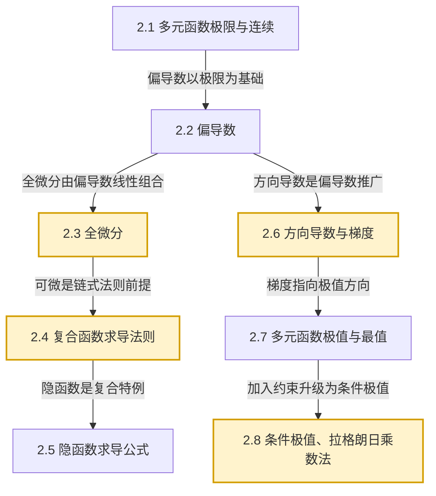

# MOC - 第2章 多元函数微分学

> [!info] 本章定位
> 第2章将 [[MOC - 高等数学A(1)]] 中建立的一元函数极限、导数、微分推广到多元函数，是多元微积分的微分学部分。本章要解决的核心问题是：**当函数依赖多个自变量时，如何描述其在某一点附近的变化率、可微性、最值与条件最值**。它是后续 [[MOC - 第3章]] 重积分换元法、[[MOC - 第4章]] 曲线曲面积分中场算子（梯度、散度、旋度）以及 [[MOC - 第6章]] 偏微分方程的求导工具基础。

## 学习路线图

## 知识点导航

| 小节 | 主题 | 核心对象 | 核心结论 |
| ---- | ---- | -------- | -------- |
| [[2.1 多元函数、极限与连续]] | 平面点集、多元函数极限、连续 | 邻域、开集、闭集、区域；$\varepsilon-\delta$ 定义 | 多元极限路径相关；连续函数有界、有最值、有介值 |
| [[2.2 偏导数]] | 固定其他变量求导 | $f_x, f_y$；高阶偏导；混合偏导 | 偏导数存在≠连续；Clairaut 定理给出混合偏导相等充分条件 |
| [[2.3 全微分]] | 增量的线性主部 | $\Delta z, \mathrm{d}z=f_x\mathrm{d}x+f_y\mathrm{d}y$ | 可微 ⟹ 连续且偏导存在；偏导连续 ⟹ 可微 |
| [[2.4 复合函数求导法则]] | 链式法则 | $\dfrac{\partial z}{\partial x}=\dfrac{\partial z}{\partial u}\dfrac{\partial u}{\partial x}+\dfrac{\partial z}{\partial v}\dfrac{\partial v}{\partial x}$ | 全微分形式不变性 |
| [[2.5 隐函数求导公式]] | 由方程确定的函数求导 | $F(x,y)=0\Rightarrow \dfrac{\mathrm{d}y}{\mathrm{d}x}=-\dfrac{F_x}{F_y}$；雅可比行列式 | 隐函数存在定理；偏导连续且 $F_y\neq 0$ |
| [[2.6 方向导数与梯度]] | 任意方向的变化率 | $\dfrac{\partial f}{\partial \ell}$；$\mathrm{grad}\,f=(f_x,f_y,f_z)$ | 方向导数 = 梯度在方向上的投影；梯度 ⊥ 等值面 |
| [[2.7 多元函数极值与最值]] | 无条件极值 | 驻点 $f_x=f_y=0$；判别式 $AC-B^2$ | 极值必要条件；充分条件判别 |
| [[2.8 条件极值、拉格朗日乘数法]] | 带约束极值 | 拉格朗日函数 $L=f+\lambda g$ | 驻点方程组 $\nabla L=0$；适用多约束 |

## 核心考点

> [!important] 必须熟练掌握
> 1. **多元函数极限的 $\varepsilon-\delta$ 定义与路径法判不存在**（路径不同极限值不同则极限不存在）
> 2. **偏导数与高阶偏导数计算**（含混合偏导求导顺序无关的 Clairaut 条件）
> 3. **全微分定义与可微性判定**（可微 ⟹ 连续；偏导连续 ⟹ 可微，反例方向不成立）
> 4. **复合函数与隐函数求导**（链式法则、$F_x/F_y$ 公式、雅可比方法）
> 5. **方向导数与梯度计算及几何意义**（梯度方向是函数增长最快方向）
> 6. **多元函数无条件极值**（驻点 + 判别式 $AC-B^2$）
> 7. **拉格朗日乘数法求条件极值**（构造拉氏函数、解驻点方程组、判定）
> 8. **最值问题（闭区域上连续函数）**：内部驻点 + 边界条件极值比较

## 重点难点

> [!warning] 易错点
> - 多元函数极限不能用"先 $x\to$ 再 $y\to$"的累次极限代替二重极限
> - **偏导数存在 ⟹ 函数连续**这一命题在多元情形下不成立
> - 可微的判定必须验证 $\lim_{\rho\to 0}\dfrac{\Delta z - (f_x\Delta x+f_y\Delta y)}{\rho}=0$，不能仅靠偏导存在
> - 链式法则树状图：中间变量个数 = 偏导项数
> - 极值判别式中 $AC-B^2$ 与二次型正定的对应
> - 拉格朗日乘数法构造时约束方程个数与乘子个数一一对应

## 自测题

> [!example]- 自测题 1
> 设 $z=f(x^2-y^2, xy)$，其中 $f$ 具有二阶连续偏导数，求 $\dfrac{\partial^2 z}{\partial x\partial y}$。
>
> **解答**：设 $u=x^2-y^2, v=xy$，则
> $$\dfrac{\partial z}{\partial x}=f_1\cdot 2x+f_2\cdot y$$
> $$\dfrac{\partial^2 z}{\partial x\partial y}=2x\cdot\dfrac{\partial f_1}{\partial y}+\dfrac{\partial f_2}{\partial y}\cdot y+f_2$$
> 其中 $\dfrac{\partial f_1}{\partial y}=-2y f_{11}+x f_{12}$，$\dfrac{\partial f_2}{\partial y}=-2y f_{21}+x f_{22}$，由 Clairaut 定理 $f_{12}=f_{21}$，整理得
> $$\dfrac{\partial^2 z}{\partial x\partial y}=-4xy f_{11}+2(x^2-y^2) f_{12}+xy f_{22}+f_2$$

> [!example]- 自测题 2
> 求函数 $u=\ln(x+y+z)$ 在点 $M_0(1,2,3)$ 处沿方向 $\vec{\ell}=(1,2,2)$ 的方向导数。
>
> **解答**：单位化 $\vec{e}_\ell=\dfrac{1}{3}(1,2,2)$。梯度
> $$\mathrm{grad}\,u=\left(\dfrac{1}{x+y+z},\dfrac{1}{x+y+z},\dfrac{1}{x+y+z}\right)$$
> 在 $M_0$ 处 $x+y+z=6$，故 $\mathrm{grad}\,u\big|_{M_0}=\left(\dfrac{1}{6},\dfrac{1}{6},\dfrac{1}{6}\right)$。
> $$\dfrac{\partial u}{\partial \ell}\bigg|_{M_0}=\mathrm{grad}\,u\cdot\vec{e}_\ell=\dfrac{1}{6}\cdot\dfrac{1+2+2}{3}=\dfrac{5}{18}$$

> [!example]- 自测题 3
> 求函数 $f(x,y)=x^3+y^3-3xy$ 的极值。
>
> **解答**：解方程组 $\begin{cases}f_x=3x^2-3y=0\\ f_y=3y^2-3x=0\end{cases}$，得驻点 $(0,0), (1,1)$。
> $f_{xx}=6x, f_{xy}=-3, f_{yy}=6y$，判别式 $AC-B^2=36xy-9$。
> - $(0,0)$：$AC-B^2=-9<0$，非极值；
> - $(1,1)$：$AC-B^2=27>0$，$A=f_{xx}=6>0$，故 $(1,1)$ 为极小值点，极小值 $f(1,1)=-1$。

> [!example]- 自测题 4
> 求表面积为 $a^2$ 的长方体体积的最大值。
>
> **解答**：设长、宽、高为 $x,y,z>0$，约束 $xy+yz+zx=a^2$，目标 $V=xyz$。
> 构造拉格朗日函数 $L=xyz+\lambda(xy+yz+zx-a^2)$，解方程组
> $$\begin{cases}yz+\lambda(y+z)=0\\ xz+\lambda(x+z)=0\\ xy+\lambda(x+y)=0\\ xy+yz+zx=a^2\end{cases}$$
> 由对称性得 $x=y=z$，代入得 $3x^2=a^2$，故 $x=y=z=\dfrac{a}{\sqrt{3}}$。
> 最大体积 $V_{\max}=\left(\dfrac{a}{\sqrt{3}}\right)^3=\dfrac{a^3\sqrt{3}}{9}$。

## 章节导航

- 上一级：[[MOC - 高等数学A(2)]]
- 上一章：[[MOC - 第1章]]
- 下一章：[[MOC - 第3章]]
- 配套习题：[[MOC - 第2章习题]]

## 相关标签

#高等数学 #多元微积分 #偏导数 #全微分 #梯度 #拉格朗日乘数法
