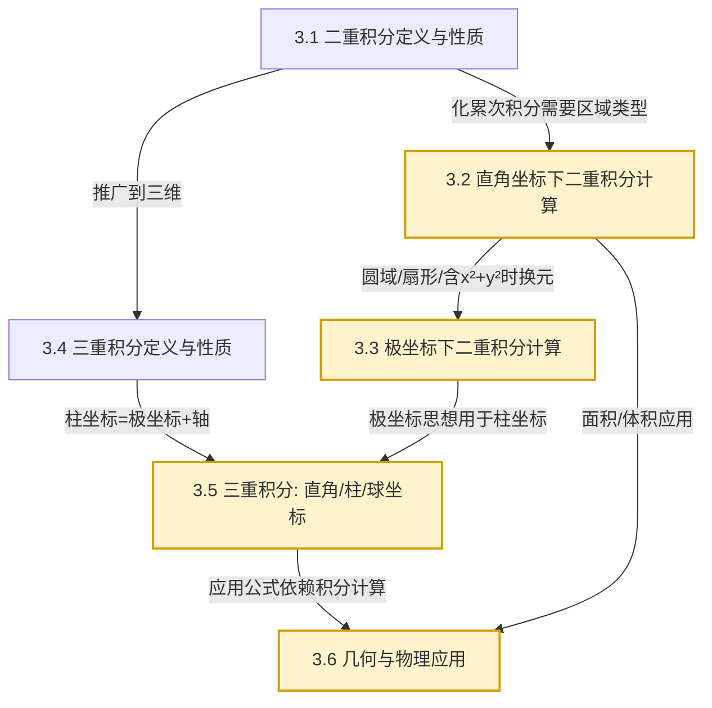

# MOC - 第3章 重积分

> [!info] 本章定位
> 第3章把 [[MOC - 高等数学A(1)]] 中一元定积分的"分割—求和—取极限"思想推广到二维与三维区域，建立**二重积分**与**三重积分**理论，并通过直角坐标、极坐标、柱坐标、球坐标四套坐标系解决多元区域上累积量的计算问题。它既是 [[3.1 二重积分定义与性质]] 的理论起点，也是 [[MOC - 第4章]] 曲线曲面积分与高斯公式的积分工具基础，还是 [[MOC - 概率论与数理统计B]] 中二维连续随机变量期望计算的直接来源。本章解决的核心问题是：**如何在非矩形/非长方体区域上计算多元函数的累积量**，以及**如何根据被积函数与区域形状选择最经济的坐标系**。

## 学习路线图

## 知识点导航

| 小节 | 主题 | 核心内容 | 重点 |
| ---- | ---- | -------- | ---- |
| [[3.1 二重积分定义与性质]] | 二重积分定义与性质 | 分割求和取极限、$\iint_D f\,dA$、可积充分条件、几何意义、线性/中值定理 | 概念根基 |
| [[3.2 直角坐标下二重积分计算]] | 直角坐标下计算 | X型/Y型区域、累次积分、积分次序交换、分块 | 计算基本功 |
| [[3.3 极坐标下二重积分计算]] | 极坐标下计算 | $x=r\cos\theta,y=r\sin\theta$、$dA=r\,dr\,d\theta$、三种极点位置 | 圆域首选 |
| [[3.4 三重积分定义与性质]] | 三重积分定义与性质 | $\iiint_\Omega f\,dV$、可积条件、性质与二重积分类比 | 推广理解 |
| [[3.5 三重积分：直角坐标、柱坐标、球坐标]] | 三重积分三套坐标系 | 先一后二/先二后一、柱坐标 $dV=r\,dr\,d\theta\,dz$、球坐标 $dV=\rho^2\sin\varphi\,d\rho\,d\varphi\,d\theta$ | 坐标系选择 |
| [[3.6 重积分几何应用与物理应用]] | 几何与物理应用 | 曲面面积、体积、质量、质心、转动惯量、引力 | 应用综合 |

## 核心考点

1. **二重积分化为累次积分**：识别 X型/Y型区域，正确写出上下限（[[3.2 直角坐标下二重积分计算]]）。
2. **交换积分次序**：由给定累次积分还原积分区域，再重新分型（[[3.2 直角坐标下二重积分计算]]）。
3. **极坐标变换**：面积元素 $dA=r\,dr\,d\theta$ 与雅可比行列式 $J=r$，三种极点位置对应三种积分限（[[3.3 极坐标下二重积分计算]]）。
4. **三重积分坐标系选择**：球对称用球坐标、轴对称用柱坐标、长方体用直角坐标（[[3.5 三重积分：直角坐标、柱坐标、球坐标]]）。
5. **球坐标体积元素**：$dV=\rho^2\sin\varphi\,d\rho\,d\varphi\,d\theta$，注意 $\varphi$ 是与 $z$ 轴正向夹角，$\theta$ 是 $xy$ 平面方位角（[[3.5 三重积分：直角坐标、柱坐标、球坐标]]）。
6. **先二后一（切片法）**：被积函数仅含 $z$ 或截面易算时使用（[[3.5 三重积分：直角坐标、柱坐标、球坐标]]）。
7. **曲面面积公式**：$S=\iint_{D_{xy}}\sqrt{1+z_x^2+z_y^2}\,dxdy$，注意投影区域与法向量关系（[[3.6 重积分几何应用与物理应用]]）。
8. **质心与转动惯量**：质量 $m=\iiint\rho\,dV$、质心 $\bar{x}=\frac{1}{m}\iiint x\rho\,dV$、转动惯量 $I_z=\iiint (x^2+y^2)\rho\,dV$（[[3.6 重积分几何应用与物理应用]]）。

## 自测题

> [!question]- 自测1（概念辨析）
> 设 $D$ 由 $y=x^2$ 与 $y=x$ 围成，将 $\iint_D f(x,y)\,dxdy$ 化为先 $y$ 后 $x$ 的累次积分。
>
> > [!success]- 解答
> > 两曲线交点：$x^2=x\Rightarrow x=0,1$，$y$ 从下边界 $x^2$ 到上边界 $x$，$x\in[0,1]$：
> > $$\int_0^1 dx\int_{x^2}^{x} f(x,y)\,dy.$$

> [!question]- 自测2（极坐标）
> 计算 $\iint_D e^{-(x^2+y^2)}\,dxdy$，其中 $D$ 为全平面。说明为何不能用直角坐标。
>
> > [!success]- 解答
> > 用极坐标 $x=r\cos\theta,y=r\sin\theta$，$dA=r\,dr\,d\theta$，$r\in[0,+\infty),\theta\in[0,2\pi]$：
> > $$I=\int_0^{2\pi}d\theta\int_0^{+\infty} e^{-r^2}r\,dr=2\pi\cdot\left[-\tfrac{1}{2}e^{-r^2}\right]_0^{+\infty}=\pi.$$
> > 直角坐标下 $\int e^{-x^2}dx$ 无初等原函数，故必须借助极坐标利用 $r\,dr$ 凑微分。

> [!question]- 自测3（三重积分坐标系选择）
> 计算 $\iiint_\Omega (x^2+y^2+z^2)\,dV$，其中 $\Omega$ 是球体 $x^2+y^2+z^2\le R^2$。
>
> > [!success]- 解答
> > 被积函数与区域均球对称，用球坐标：$x=\rho\sin\varphi\cos\theta,y=\rho\sin\varphi\sin\theta,z=\rho\cos\varphi$，$dV=\rho^2\sin\varphi\,d\rho\,d\varphi\,d\theta$，$\rho\in[0,R],\varphi\in[0,\pi],\theta\in[0,2\pi]$：
> > $$I=\int_0^{2\pi}d\theta\int_0^\pi d\varphi\int_0^R \rho^2\cdot\rho^2\sin\varphi\,d\rho=2\pi\cdot 2\cdot\frac{R^5}{5}=\frac{4\pi R^5}{5}.$$

> [!question]- 自测4（应用）
> 求上半球面 $z=\sqrt{R^2-x^2-y^2}$ 在圆盘 $x^2+y^2\le R^2$ 上的曲面面积。
>
> > [!success]- 解答
> > $z_x=-\frac{x}{\sqrt{R^2-x^2-y^2}}, z_y=-\frac{y}{\sqrt{R^2-x^2-y^2}}$，$1+z_x^2+z_y^2=\frac{R^2}{R^2-x^2-y^2}$。投影 $D:x^2+y^2\le R^2$ 用极坐标：
> > $$S=\iint_D\frac{R}{\sqrt{R^2-r^2}}\,r\,dr\,d\theta=\int_0^{2\pi}d\theta\int_0^R\frac{Rr}{\sqrt{R^2-r^2}}\,dr=2\pi R\cdot R=2\pi R^2.$$

## 章节导航

- 上一级：[[MOC - 高等数学A(2)]]
- 先修章节：[[MOC - 第2章]]（多元函数微分学，偏导数是换元与曲面面积公式基础）
- 上一章：[[MOC - 第2章]]
- 下一章：[[MOC - 第4章]]（曲线积分与曲面积分，重积分是其积分推广基础）
- 习题：[[MOC - 第3章习题]]

## 相关标签

#高等数学 #多元微积分 #重积分 #二重积分 #三重积分 #极坐标 #柱坐标 #球坐标
