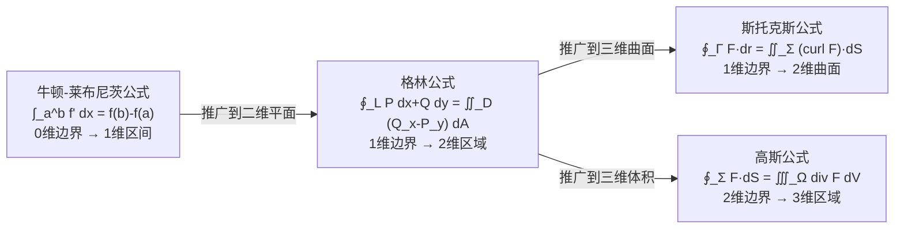

# 4.7 斯托克斯公式、散度与旋度

> [!info] 本节定位
> 本节建立空间闭曲线的第二类曲线积分与以其为边界的曲面上第二类曲面积分的桥梁——**斯托克斯公式**，并引入**旋度** $\mathrm{curl}\,\boldsymbol F$ 这一环量密度概念。它与 [[4.6 高斯公式]] 共同构成场论两大基本定理，并把 [[4.3 格林公式、积分与路径无关]] 推广到三维。本节解决的核心问题是：**何时能把沿空间闭曲线的环量转化为曲面上的面积分**，以及**如何用三大公式统一描述边界积分与区域积分的转换**。

## 一、旋度

> [!definition] 旋度
> 设向量场 $\boldsymbol{F}=(P,Q,R)$ 在某区域内 $C^1$，定义 $\boldsymbol F$ 在点 $(x,y,z)$ 的**旋度**为向量
> $$\mathrm{curl}\,\boldsymbol{F}=\nabla\times\boldsymbol{F}=\begin{vmatrix}\boldsymbol{i}&\boldsymbol{j}&\boldsymbol{k}\\\dfrac{\partial}{\partial x}&\dfrac{\partial}{\partial y}&\dfrac{\partial}{\partial z}\\P&Q&R\end{vmatrix}=\left(\frac{\partial R}{\partial y}-\frac{\partial Q}{\partial z},\ \frac{\partial P}{\partial z}-\frac{\partial R}{\partial x},\ \frac{\partial Q}{\partial x}-\frac{\partial P}{\partial y}\right).$$
> 它是一个**向量场**，刻画 $\boldsymbol F$ 在该点的环量密度（旋转趋势）。

> [!info] 旋度的物理意义
> 旋度方向是 $\boldsymbol F$ 在该点附近"绕哪个轴旋转最强"的轴方向，大小是绕该轴的环量密度。设 $M$ 为场中一点，过 $M$ 作小曲面 $\Sigma$（边界 $\Gamma$，面积 $S$，单位法向量 $\boldsymbol n$），则
> $$\mathrm{curl}\,\boldsymbol{F}\cdot\boldsymbol n=\lim_{S\to 0}\frac{\oint_\Gamma\boldsymbol{F}\cdot d\boldsymbol{r}}{S}.$$
> - $\mathrm{curl}\,\boldsymbol F=\boldsymbol 0$：$\boldsymbol F$ 为**无旋场**；
> - $\mathrm{curl}\,\boldsymbol F\ne\boldsymbol 0$：$\boldsymbol F$ 在该点有涡旋。

> [!warning] 散度是标量，旋度是向量
> 不要混淆：[[4.6 高斯公式]] 的散度 $\mathrm{div}\,\boldsymbol F=\nabla\cdot\boldsymbol F$ 是标量；本节旋度 $\mathrm{curl}\,\boldsymbol F=\nabla\times\boldsymbol F$ 是向量。两者由不同算子（点乘 vs 叉乘）作用于 $\nabla$ 得到。

## 二、斯托克斯公式

### 1. 方向规定（右手定则）

> [!definition] 边界方向与曲面侧的配合
> 设有向曲面 $\Sigma$ 的边界为空间闭曲线 $\Gamma$。**右手定则**：右手四指沿 $\Gamma$ 的方向弯曲时，拇指所指即 $\Sigma$ 的法向量方向（侧）。即：当观察者站在曲面指定侧沿边界行走时，曲面始终在左手侧。

### 2. 斯托克斯公式

> [!theorem] 斯托克斯公式
> 设 $\Sigma$ 为分片光滑的有向曲面，其边界 $\Gamma$ 为分段光滑的空间闭曲线，$\Gamma$ 的方向与 $\Sigma$ 的侧符合**右手定则**；$P(x,y,z),Q(x,y,z),R(x,y,z)$ 在包含 $\Sigma$ 的某空间区域内具有**一阶连续偏导数**，则
> $$\oint_\Gamma P\,dx+Q\,dy+R\,dz=\iint_\Sigma\left[\left(\frac{\partial R}{\partial y}-\frac{\partial Q}{\partial z}\right)dydz+\left(\frac{\partial P}{\partial z}-\frac{\partial R}{\partial x}\right)dzdx+\left(\frac{\partial Q}{\partial x}-\frac{\partial P}{\partial y}\right)dxdy\right].$$
> 向量形式：$\displaystyle\oint_\Gamma\boldsymbol{F}\cdot d\boldsymbol{r}=\iint_\Sigma(\mathrm{curl}\,\boldsymbol{F})\cdot d\boldsymbol{S}=\iint_\Sigma(\nabla\times\boldsymbol{F})\cdot\boldsymbol{n}\,dS$。

> [!warning] 三个必备条件
> 1. $\Gamma$ 必须是**闭曲线**（非闭时需补线段闭合）；
> 2. $\Gamma$ 方向与 $\Sigma$ 侧符合**右手定则**（方向不匹配则结果变号）；
> 3. $P,Q,R$ 在包含 $\Sigma$ 的区域内 $C^1$（含 $\Sigma$ 内部无奇点）。

> [!info] 记忆方法
> 右端的三个分量正是旋度 $\mathrm{curl}\,\boldsymbol F$ 的三个分量，分别乘 $dydz,dzdx,dxdy$。可用行列式记忆：
> $$\oint_\Gamma\boldsymbol{F}\cdot d\boldsymbol{r}=\iint_\Sigma\begin{vmatrix}dydz&dzdx&dxdy\\\dfrac{\partial}{\partial x}&\dfrac{\partial}{\partial y}&\dfrac{\partial}{\partial z}\\P&Q&R\end{vmatrix}.$$

> [!info] 曲面选择任意性
> 只要 $\Sigma$ 以 $\Gamma$ 为边界且 $\boldsymbol F$ 在其上 $C^1$，斯托克斯公式对任意这样的 $\Sigma$ 都成立。计算时可选最简单的曲面（如平面片）。

## 三、环量与旋度的关系

> [!definition] 环量
> 向量场 $\boldsymbol F$ 沿闭曲线 $\Gamma$ 的**环量**定义为 $\displaystyle\oint_\Gamma\boldsymbol{F}\cdot d\boldsymbol{r}$。

斯托克斯公式表明：**环量 = 旋度在曲面上的通量**。这与 [[4.6 高斯公式]] "通量 = 散度的体积分"形成对偶：

| 公式 | 边界积分 | 区域积分 | 局部量 |
| ---- | -------- | -------- | ------ |
| 高斯 | 曲面积分（通量） | 体积分 | 散度（标量） |
| 斯托克斯 | 线积分（环量） | 面积分 | 旋度（向量） |

## 四、三大公式统一

三大（实为四大）公式都表达"边界积分 = 区域积分"的统一思想，区别在于维度：

> [!abstract] 广义斯托克斯公式
> 在流形上，四大公式统一为**广义斯托克斯公式**：
> $$\int_{\partial M}\omega=\int_M d\omega,$$
> 即"微分形式 $\omega$ 在边界 $\partial M$ 上的积分等于其外微分 $d\omega$ 在 $M$ 上的积分"。
> - $M=[a,b]$，$\omega=f$：牛顿-莱布尼茨；
> - $M=D\subset\mathbb{R}^2$，$\omega=P\,dx+Q\,dy$：格林；
> - $M=\Sigma$，$\omega=P\,dx+Q\,dy+R\,dz$：斯托克斯；
> - $M=\Omega\subset\mathbb{R}^3$，$\omega=P\,dydz+Q\,dzdx+R\,dxdy$：高斯。

## 五、典型例题

> [!example] 例1：用斯托克斯公式
> 计算 $\displaystyle I=\oint_\Gamma y\,dx+z\,dy+x\,dz$，$\Gamma$ 为圆周 $\begin{cases}x^2+y^2+z^2=a^2\\x+y+z=0\end{cases}$，从 $x$ 轴正向看为逆时针。
>
> 取 $\Sigma$ 为平面 $x+y+z=0$ 上被 $\Gamma$ 所围圆盘，法向量由右手定则确定。$\boldsymbol F=(y,z,x)$，$\mathrm{curl}\,\boldsymbol F=\begin{vmatrix}\boldsymbol i&\boldsymbol j&\boldsymbol k\\\partial_x&\partial_y&\partial_z\\y&z&x\end{vmatrix}=(-1,-1,-1)$。
>
> 平面 $x+y+z=0$ 的单位法向量（与 $\Gamma$ 方向配套）$\boldsymbol n=\frac{1}{\sqrt3}(1,1,1)$ 或反向。由"从 $x$ 轴正向看逆时针"配合右手定则，取 $\boldsymbol n=\frac{1}{\sqrt3}(1,1,1)$（需验证方向，本题取使 $\mathrm{curl}\,\boldsymbol F\cdot\boldsymbol n>0$ 的方向）：
> $$\mathrm{curl}\,\boldsymbol F\cdot\boldsymbol n=(-1,-1,-1)\cdot\frac{(1,1,1)}{\sqrt3}=-\frac{3}{\sqrt3}=-\sqrt3.$$
> 若方向使结果为负，则反向后取 $+\sqrt3$。圆盘半径 $a$，面积 $\pi a^2$。由斯托克斯公式
> $$I=\iint_\Sigma(\mathrm{curl}\,\boldsymbol F\cdot\boldsymbol n)\,dS=\pm\sqrt3\cdot\pi a^2.$$
> 按"从 $x$ 轴正向看逆时针"配合右手定则，拇指指向含 $x$ 正分量的方向，取 $\boldsymbol n=(1,1,1)/\sqrt3$ 时得 $I=-\sqrt3\pi a^2$；若题目方向相反则为 $+\sqrt3\pi a^2$。本答案取 $-\sqrt3\pi a^2$，依方向严格判定。

> [!example] 例2：选择简单曲面
> 计算 $\displaystyle I=\oint_\Gamma(y-z)\,dx+(z-x)\,dy+(x-y)\,dz$，$\Gamma$ 为圆柱 $x^2+y^2=1$ 与平面 $z=0$ 的交线，从 $z$ 轴正向看逆时针。
>
> 取 $\Sigma$ 为 $z=0$ 上 $x^2+y^2\le1$ 圆盘，法向量向上 $(0,0,1)$。$\boldsymbol F=(y-z,z-x,x-y)$，$\mathrm{curl}\,\boldsymbol F$ 第三分量 $=\partial_y(x-y)-\partial_x(z-x)=-1-(-1)=0$... 注意计算：$\mathrm{curl}\,\boldsymbol F=(\partial_y(x-y)-\partial_z(z-x),\partial_z(y-z)-\partial_x(x-y),\partial_x(z-x)-\partial_y(y-z))=(-1-0,0-1,-1-(-1))=(-1,-1,0)$。
> $\mathrm{curl}\,\boldsymbol F\cdot(0,0,1)=0$，故 $I=\iint_\Sigma 0\,dS=0$。
> 直接验证：$z=0$ 时 $\boldsymbol F=(y,-x,x-y)$，$\Gamma$ 参数 $x=\cos t,y=\sin t,z=0$，$dx=-\sin t\,dt,dy=\cos t\,dt,dz=0$，被积 $=\sin t(-\sin t)+(-\cos t)\cos t=-1$，$\int_0^{2\pi}(-1)\,dt=-2\pi$。**矛盾！**
>
> 重新计算旋度第三分量：$\partial_x(z-x)-\partial_y(y-z)$ 中 $Q=z-x\Rightarrow\partial_x Q=-1$，$P=y-z\Rightarrow\partial_y P=1$，第三分量 $=\partial_x Q-\partial_y P=-1-1=-2$。故 $\mathrm{curl}\,\boldsymbol F=(-1,-1,-2)$，与 $(0,0,1)$ 点积 $=-2$。$I=\iint_\Sigma(-2)\,dS=-2\cdot\pi=-2\pi$。与直接验证一致。**关键：旋度公式第三分量是 $Q_x-P_y$，不可写反。**

> [!example] 例3：验证无旋场
> 验证 $\boldsymbol F=(2xyz,\ x^2z,\ x^2y)$ 是无旋场，并求势函数。
>
> $\mathrm{curl}\,\boldsymbol F$ 各分量：第一 $\partial_y(x^2y)-\partial_z(x^2z)=x^2-x^2=0$；第二 $\partial_z(2xyz)-\partial_x(x^2y)=2xy-2xy=0$；第三 $\partial_x(x^2z)-\partial_y(2xyz)=2xz-2xz=0$。故 $\mathrm{curl}\,\boldsymbol F=\boldsymbol 0$，$\boldsymbol F$ 无旋（在 $\mathbb{R}^3$ 单连通），存在势函数 $u$ 使 $\nabla u=\boldsymbol F$。
> $u_x=2xyz\Rightarrow u=x^2yz+\varphi(y,z)$；$u_y=x^2z+\varphi_y=x^2z\Rightarrow\varphi_y=0\Rightarrow\varphi=\psi(z)$；$u_z=x^2y+\psi'(z)=x^2y\Rightarrow\psi'=0$。故 $u=x^2yz+C$。

## 六、易错点

| 错误 | 纠正 |
| ---- | ---- |
| 旋度第三分量写成 $P_y-Q_x$ | 应为 $Q_x-P_y$（与格林公式被积一致） |
| 边界方向与曲面侧不匹配 | 必须满足右手定则，否则变号 |
| 非闭曲线直接套斯托克斯 | 需补线段闭合，最后减去补线积分 |
| 含奇点未挖洞 | 类似 [[4.6 高斯公式]]，需挖去奇点 |
| 旋度当标量、散度当向量 | 旋度是向量，散度是标量 |
| 选择曲面时忽视 $C^1$ 条件 | $\boldsymbol F$ 必须在曲面所在区域 $C^1$ |

## 七、场论小结

> [!abstract] 三大场算子与场分类
> - **梯度** $\nabla u$：标量场 → 向量场，$\mathrm{curl}(\nabla u)=\boldsymbol 0$（无旋场是某标量场的梯度场）；
> - **散度** $\nabla\cdot\boldsymbol F$：向量场 → 标量场，$\mathrm{div}(\mathrm{curl}\,\boldsymbol G)=0$（无源场是某向量场的旋度场）；
> - **旋度** $\nabla\times\boldsymbol F$：向量场 → 向量场。
>
> 场分类（在单连通区域内）：
> - **无旋场** $\mathrm{curl}\,\boldsymbol F=\boldsymbol 0$ $\Leftrightarrow$ $\boldsymbol F=\nabla u$（保守场，积分与路径无关）；
> - **无源场** $\mathrm{div}\,\boldsymbol F=0$ $\Leftrightarrow$ $\boldsymbol F=\mathrm{curl}\,\boldsymbol G$（$\boldsymbol G$ 为向量势）；
> - **调和场**：既无旋又无源 $\Leftrightarrow$ $\nabla^2 u=0$（$u$ 满足拉普拉斯方程）。

## 八、与其他章节的关联

- 上游：[[4.2 第二类曲线积分（对坐标）]] 给出环量；[[4.5 第二类曲面积分（对坐标）]] 给出面积分；[[2.6 方向导数与梯度]] 引入梯度算子 $\nabla$。
- 平行：[[4.3 格林公式、积分与路径无关]] 是斯托克斯在平面（$\Sigma\subset xOy$）的特例；[[4.6 高斯公式]] 是对偶的通量-散度形式。
- 下游：[[MOC - 第6章]] 中场论为偏微分方程（拉普拉斯方程、波动方程）的物理背景。
- 应用：电磁学（法拉第定律 $\oint\boldsymbol{E}\cdot d\boldsymbol{l}=-\frac{d\Phi}{dt}$、安培定律）、流体力学（涡量）、复变函数（柯西积分定理的高维形式）。

## 章节导航

- 返回：[[MOC - 第4章]]
- 上一节：[[4.6 高斯公式]]
- 下一章：[[MOC - 第5章]]
- 习题：[[MOC - 第4章习题]]

#高等数学 #多元微积分 #斯托克斯公式 #旋度 #环量 #场论 #三大公式
