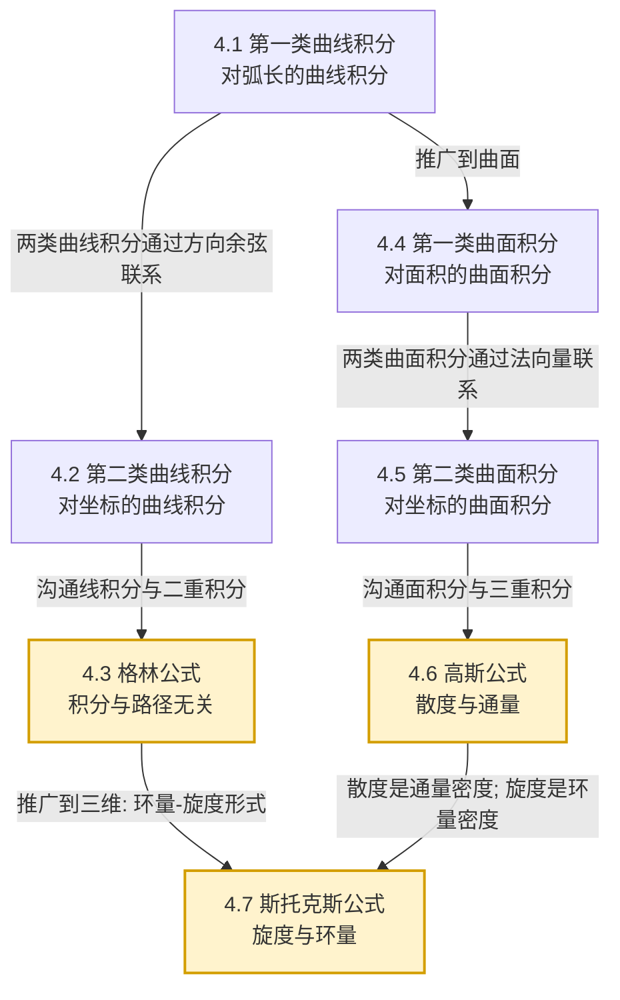

# MOC - 第4章 曲线积分与曲面积分

> [!info] 本章定位
> 第4章把 [[3.1 二重积分定义与性质]] 与 [[3.4 三重积分定义与性质]] 的积分对象从"区域"推广到"曲线"与"曲面"，建立**四类线面积分**（第一/二类曲线积分、第一/二类曲面积分），并通过**格林公式、高斯公式、斯托克斯公式**三大定理揭示低维积分与高维积分之间的转换关系。本章是 [[MOC - 高等数学A(2)]] 的核心枢纽，也是后续电磁学、流体力学、复变函数与数学物理方程的数学基础。本章解决的核心问题是：**如何沿曲线或曲面累积标量/向量量**，以及**如何借助三大公式在不同维度的积分之间转化以简化计算**。

## 学习路线图

## 知识点导航

| 小节 | 主题 | 核心内容 | 重点 |
| ---- | ---- | -------- | ---- |
| [[4.1 第一类曲线积分（对弧长）]] | 第一类曲线积分 | $\int_L f\,ds$、线密度质量、参数方程 $\sqrt{x'^2+y'^2}\,dt$、对称性 | 计算基础 |
| [[4.2 第二类曲线积分（对坐标）]] | 第二类曲线积分 | $\int_L P\,dx+Q\,dy$、变力做功、方向性、两类曲线积分关系 | 概念辨析 |
| [[4.3 格林公式、积分与路径无关]] | 格林公式 | $\oint_L P\,dx+Q\,dy=\iint_D(Q_x-P_y)\,dA$、四等价命题、全微分方程 | **核心** |
| [[4.4 第一类曲面积分（对面积）]] | 第一类曲面积分 | $\iint_\Sigma f\,dS$、面密度质量、投影法 $dS=\sqrt{1+z_x^2+z_y^2}\,dxdy$ | 计算基础 |
| [[4.5 第二类曲面积分（对坐标）]] | 第二类曲面积分 | $\iint_\Sigma P\,dydz+Q\,dzdx+R\,dxdy$、流量、侧的规定、两类关系 | 概念辨析 |
| [[4.6 高斯公式]] | 高斯公式 | $\oiint_\Sigma=\iiint_\Omega(P_x+Q_y+R_z)\,dV$、散度 $\mathrm{div}\,\boldsymbol F$ | **核心** |
| [[4.7 斯托克斯公式、散度与旋度]] | 斯托克斯公式 | $\oint_\Gamma=\iint_\Sigma(\nabla\times\boldsymbol F)\cdot d\boldsymbol S$、旋度、三大公式统一 | **核心** |

## 核心考点

1. **第一类曲线积分计算**：参数方程 $\int f\,\sqrt{x'^2+y'^2}\,dt$，注意弧长元素不能漏根号（[[4.1 第一类曲线积分（对弧长）]]）。
2. **第二类曲线积分的方向性**：起点到终点方向决定符号，反向差一个负号（[[4.2 第二类曲线积分（对坐标）]]）。
3. **格林公式应用**：$\oint_L P\,dx+Q\,dy=\iint_D(Q_x-P_y)\,dA$，要求 $L$ 为 $D$ 的**正向边界**（逆时针），且 $P,Q$ 在 $D$ 内有连续偏导（[[4.3 格林公式、积分与路径无关]]）。
4. **积分与路径无关四等价命题**：$\oint=0$ $\Leftrightarrow$ 积分与路径无关 $\Leftrightarrow$ $P\,dx+Q\,dy$ 为全微分 $\Leftrightarrow$ $Q_x=P_y$（单连通区域内）（[[4.3 格林公式、积分与路径无关]]）。
5. **第一类曲面积分投影法**：$dS=\sqrt{1+z_x^2+z_y^2}\,dxdy$，注意投影到哪个坐标面（[[4.4 第一类曲面积分（对面积）]]）。
6. **第二类曲面积分的侧与投影**：法向量方向（上/下/前/后/左/右侧）决定符号，逐片投影计算（[[4.5 第二类曲面积分（对坐标）]]）。
7. **高斯公式**：$\oiint_\Sigma P\,dydz+Q\,dzdx+R\,dxdy=\iiint_\Omega\mathrm{div}\,\boldsymbol F\,dV$，封闭曲面取**外侧**（[[4.6 高斯公式]]）。
8. **散度与通量**：$\mathrm{div}\,\boldsymbol F=P_x+Q_y+R_z$ 是通量密度，散度积分给出净通量（[[4.6 高斯公式]]）。
9. **斯托克斯公式与旋度**：$\mathrm{curl}\,\boldsymbol F=\nabla\times\boldsymbol F$，环量等于旋度在曲面上的通量，方向遵循**右手定则**（[[4.7 斯托克斯公式、散度与旋度]]）。

## 自测题

> [!question]- 自测1（第一类曲线积分）
> 计算 $\displaystyle I=\int_L (x^2+y^2)\,ds$，其中 $L$ 为圆周 $x^2+y^2=R^2$。
>
> > [!success]- 解答
> > 参数方程 $x=R\cos t,\ y=R\sin t,\ t\in[0,2\pi]$，$ds=\sqrt{R^2\sin^2 t+R^2\cos^2 t}\,dt=R\,dt$：
> > $$I=\int_0^{2\pi} R^2\cdot R\,dt=2\pi R^3.$$

> [!question]- 自测2（格林公式）
> 计算 $\displaystyle I=\oint_L (x^2+y)\,dx-(x-y^2)\,dy$，其中 $L$ 为椭圆 $\frac{x^2}{a^2}+\frac{y^2}{b^2}=1$ 取正向。
>
> > [!success]- 解答
> > $P=x^2+y,\ Q=-(x-y^2)=-x+y^2$，$Q_x-P_y=-1-1=-2$。由格林公式：
> > $$I=\iint_D(-2)\,dA=-2\cdot\pi ab=-2\pi ab.$$

> [!question]- 自测3（高斯公式）
> 计算 $\displaystyle I=\oiint_\Sigma x\,dydz+y\,dzdx+z\,dxdy$，其中 $\Sigma$ 为球面 $x^2+y^2+z^2=R^2$ 外侧。
>
> > [!success]- 解答
> > $P=x,Q=y,R=z$，$\mathrm{div}\,\boldsymbol F=1+1+1=3$。由高斯公式：
> > $$I=\iiint_\Omega 3\,dV=3\cdot\tfrac{4\pi R^3}{3}=4\pi R^3.$$

> [!question]- 自测4（斯托克斯公式）
> 计算 $\displaystyle I=\oint_\Gamma -y\,dx+x\,dy+z\,dz$，其中 $\Gamma$ 为 $x^2+y^2=1$ 与 $z=0$ 的交线，从 $z$ 轴正向看为逆时针。
>
> > [!success]- 解答
> > 取 $\Sigma$ 为 $z=0$ 上 $x^2+y^2\le 1$ 的圆盘，法向量向上 $(0,0,1)$。$P=-y,Q=x,R=z$，$\nabla\times\boldsymbol F=(0,0,2)$，$(\nabla\times\boldsymbol F)\cdot(0,0,1)=2$：
> > $$I=\iint_\Sigma 2\,dS=2\cdot\pi=2\pi.$$

## 章节导航

- 上一级：[[MOC - 高等数学A(2)]]
- 先修章节：[[MOC - 第3章]]（重积分是曲面积分与三大公式积分端的基础）、[[MOC - 第1章]]（向量与曲面方程）、[[MOC - 第2章]]（偏导数是散度旋度基础）
- 上一章：[[MOC - 第3章]]
- 下一章：[[MOC - 第5章]]
- 习题：[[MOC - 第4章习题]]

## 相关标签

#高等数学 #多元微积分 #曲线积分 #曲面积分 #格林公式 #高斯公式 #斯托克斯公式 #散度 #旋度
