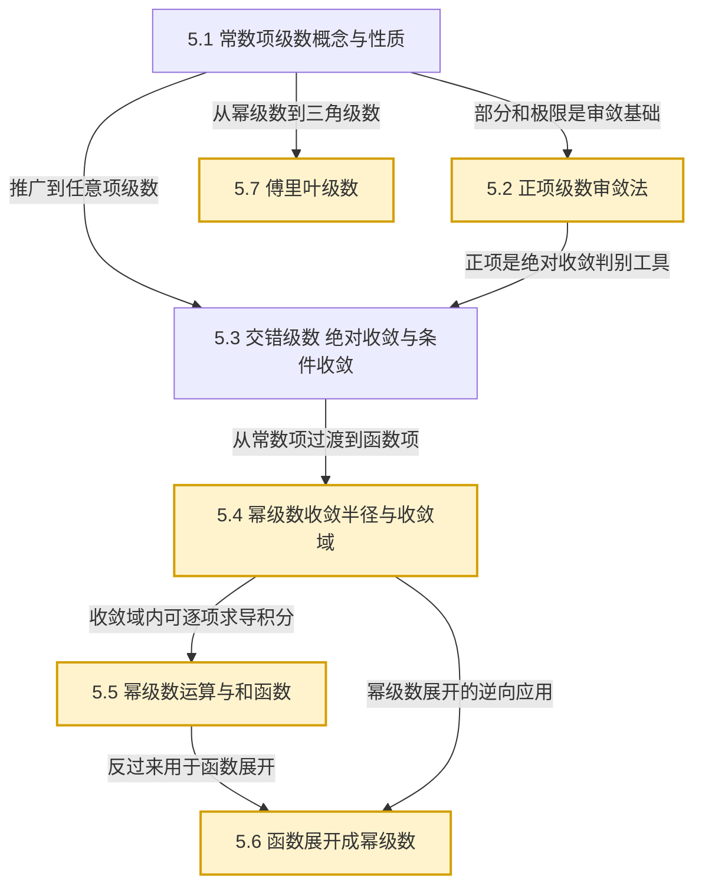

# MOC - 第5章 无穷级数

> [!info] 本章定位
> 第5章将 [[MOC - 高等数学A(1)]] 中的极限思想从有限和推广到无限和，是衔接有限运算与连续数学的桥梁。本章要解决的核心问题是：**无穷多个数能否相加？相加后的"和"如何定义？函数能否被无穷多个简单函数（幂函数或三角函数）逼近？** 由此引出三条主线：常数项级数的敛散判别、幂级数与函数的泰勒展开、傅里叶级数对周期信号的分解。它是后续数学分析、数值逼近、信号处理、微分方程幂级数解法和 [[MOC - 第6章]] 常微分方程级数解的理论基础。

## 学习路线图

## 知识点导航

| 小节 | 主题 | 核心对象 | 核心结论 |
| ---- | ---- | -------- | -------- |
| [[5.1 常数项级数概念与性质]] | 无穷和的严格定义 | 部分和 $S_n=\sum_{k=1}^n u_k$；收敛定义 | $\sum u_n$ 收敛 $\Leftrightarrow \{S_n\}$ 收敛；收敛必要条件 $\lim u_n=0$ |
| [[5.2 正项级数审敛法]] | $u_n\geq 0$ 的判别 | 比较法、比值法（达朗贝尔）、根值法（柯西） | 正项级数收敛 $\Leftrightarrow$ 部分和有界；p 级数 $\sum 1/n^p$ 当 $p>1$ 收敛 |
| [[5.3 交错级数、绝对收敛与条件收敛]] | 任意项级数的分类 | 莱布尼茨法；绝对收敛、条件收敛 | 绝对收敛 $\Rightarrow$ 收敛；绝对收敛级数满足交换律 |
| [[5.4 幂级数收敛半径与收敛域]] | 函数项级数入门 | 幂级数 $\sum a_n x^n$；收敛半径 $R$ | 阿贝尔定理；$R=\lim\left\|\dfrac{a_n}{a_{n+1}}\right\|$ 或 $R=\lim\sqrt[n]{|a_n|}$ |
| [[5.5 幂级数运算与和函数]] | 收敛区间内的解析运算 | 逐项求导、逐项积分、和函数 | 和函数在 $(-R,R)$ 内连续、可导、可积；先导后积 / 先积后导技巧 |
| [[5.6 函数展开成幂级数]] | 函数的泰勒表示 | 泰勒级数、麦克劳林级数 | 展开条件 $\lim_{n\to\infty}R_n(x)=0$；六大基本展开式 |
| [[5.7 傅里叶级数]] | 周期函数的三角分解 | 三角函数正交系；$a_0,a_n,b_n$ 系数 | 狄利克雷收敛定理；奇偶延拓；周期 $2l$ 推广 |

## 核心考点

> [!important] 必须熟练掌握
> 1. **常数项级数敛散判别**：用定义、性质、必要条件 $\lim u_n=0$ 判定（[[5.1 常数项级数概念与性质]]）
> 2. **正项级数审敛法的选择与对比**：比较法、比值法、根值法、p 级数判别法（[[5.2 正项级数审敛法]]）
> 3. **交错级数的莱布尼茨判别法**：单调递减且极限为零两条件缺一不可（[[5.3 交错级数、绝对收敛与条件收敛]]）
> 4. **绝对收敛与条件收敛的判别**：先判 $\sum|u_n|$，若发散再判原级数；区分两类级数的性质
> 5. **幂级数收敛半径与收敛域求解**：端点单独判别，会处理缺项幂级数（[[5.4 幂级数收敛半径与收敛域]]）
> 6. **幂级数和函数求法**：先导后积、先积后导；利用 $\dfrac{1}{1-x}$ 与 $\arctan x$ 等已知和函数（[[5.5 幂级数运算与和函数]]）
> 7. **函数间接展开为幂级数**：变量代换、逐项求导、逐项积分；六大基本展开式（[[5.6 函数展开成幂级数]]）
> 8. **以 $2\pi$ 为周期函数的傅里叶展开**：系数公式与狄利克雷收敛定理（[[5.7 傅里叶级数]]）
> 9. **奇偶延拓与正弦/余弦级数**：周期 $2l$ 的推广（[[5.7 傅里叶级数]]）

## 重点难点

> [!warning] 易错点
> - $\lim u_n=0$ 只是收敛**必要条件**而非充分条件（如调和级数 $\sum 1/n$ 发散）
> - 比值法与根值法在 $\rho=1$ 时失效，须换用比较法或 p 级数判别
> - 莱布尼茨法要求 $u_n$ **单调递减**到 $0$，"递减"不可省略（如 $u_n=\dfrac{(-1)^n}{n^2+(-1)^n n}$ 不满足单调性）
> - 绝对收敛 $\Rightarrow$ 收敛，但反之不成立（条件收敛的反例：$\sum \dfrac{(-1)^n}{n}$）
> - 收敛半径公式 $\lim|a_n/a_{n+1}|$ 仅适用于**不缺项**幂级数；缺项时须用比值法直接对 $\sum|u_{n+1}(x)/u_n(x)|$ 求极限
> - 端点 $x=\pm R$ 必须单独判别，不能默认包含或排除
> - 逐项求导与逐项积分后的收敛半径不变，但端点敛散性可能改变
> - 泰勒级数收敛于函数本身**当且仅当**余项 $R_n(x)\to 0$；不能仅写出级数就声称等于原函数
> - 傅里叶级数在间断点收敛于 $\dfrac{f(x_0^+)+f(x_0^-)}{2}$，而非 $f(x_0)$
> - 周期 $2l$ 函数的系数公式中积分区间为 $[-l, l]$，不要套用 $[-\pi,\pi]$

## 自测题

> [!example]- 自测题 1
> 判别级数 $\displaystyle\sum_{n=1}^{\infty}\dfrac{n\cos^2 n}{n^3+1}$ 的敛散性。
>
> **解答**：因 $0\leq \cos^2 n\leq 1$，故 $\dfrac{n\cos^2 n}{n^3+1}\leq \dfrac{n}{n^3+1}\leq \dfrac{n}{n^3}=\dfrac{1}{n^2}$。
> 由 $\sum \dfrac{1}{n^2}$（p 级数 $p=2>1$）收敛，[[5.2 正项级数审敛法|比较审敛法]] 知原级数收敛。

> [!example]- 自测题 2
> 求幂级数 $\displaystyle\sum_{n=1}^{\infty}\dfrac{x^n}{n\cdot 2^n}$ 的收敛半径、收敛区间与收敛域。
>
> **解答**：$a_n=\dfrac{1}{n\cdot 2^n}$，由 [[5.4 幂级数收敛半径与收敛域]] 公式
> $$R=\lim_{n\to\infty}\left|\dfrac{a_n}{a_{n+1}}\right|=\lim_{n\to\infty}\dfrac{(n+1)\cdot 2^{n+1}}{n\cdot 2^n}=\lim_{n\to\infty}\dfrac{2(n+1)}{n}=2$$
> 收敛区间 $(-2, 2)$。
> - $x=2$：级数为 $\sum \dfrac{1}{n}$（调和级数）发散；
> - $x=-2$：级数为 $\sum \dfrac{(-1)^n}{n}$，由 [[5.3 交错级数、绝对收敛与条件收敛|莱布尼茨法]] 收敛。
> 故收敛域为 $[-2, 2)$。

> [!example]- 自测题 3
> 将 $f(x)=\dfrac{1}{x^2-3x+2}$ 展开为 $x$ 的幂级数。
>
> **解答**：分解 $f(x)=\dfrac{1}{(x-1)(x-2)}=\dfrac{1}{x-2}-\dfrac{1}{x-1}=\dfrac{1}{1-x}-\dfrac{1}{2}\cdot\dfrac{1}{1-x/2}$。
> 由 [[5.6 函数展开成幂级数|基本展开式]] $\dfrac{1}{1-x}=\sum_{n=0}^{\infty}x^n$（$|x|<1$），$\dfrac{1}{1-x/2}=\sum_{n=0}^{\infty}\left(\dfrac{x}{2}\right)^n$（$|x|<2$），
> $$f(x)=\sum_{n=0}^{\infty}x^n-\dfrac{1}{2}\sum_{n=0}^{\infty}\dfrac{x^n}{2^n}=\sum_{n=0}^{\infty}\left(1-\dfrac{1}{2^{n+1}}\right)x^n$$
> 取交集 $|x|<1$，收敛域 $(-1,1)$。

> [!example]- 自测题 4
> 设 $f(x)=x^2$（$-\pi\leq x\leq \pi$）以 $2\pi$ 为周期延拓，求其傅里叶级数，并由此求 $\sum \dfrac{1}{n^2}$。
>
> **解答**：$f$ 为偶函数，$b_n=0$，由 [[5.7 傅里叶级数]] 系数公式
> $$a_0=\dfrac{2}{\pi}\int_0^\pi x^2\,\mathrm{d}x=\dfrac{2\pi^2}{3},\quad a_n=\dfrac{2}{\pi}\int_0^\pi x^2\cos nx\,\mathrm{d}x=\dfrac{4(-1)^n}{n^2}$$
> 由狄利克雷收敛定理 $f$ 处处连续，
> $$x^2=\dfrac{\pi^2}{3}+4\sum_{n=1}^{\infty}\dfrac{(-1)^n}{n^2}\cos nx,\quad x\in[-\pi,\pi]$$
> 令 $x=\pi$：$\pi^2=\dfrac{\pi^2}{3}+4\sum \dfrac{1}{n^2}$，故 $\sum \dfrac{1}{n^2}=\dfrac{\pi^2}{6}$。

## 章节导航

- 上一级：[[MOC - 高等数学A(2)]]
- 上一章：[[MOC - 第4章]]
- 下一章：[[MOC - 第6章]]
- 配套习题：[[MOC - 第5章习题]]

## 相关标签

#高等数学 #无穷级数 #正项级数 #幂级数 #泰勒展开 #傅里叶级数
