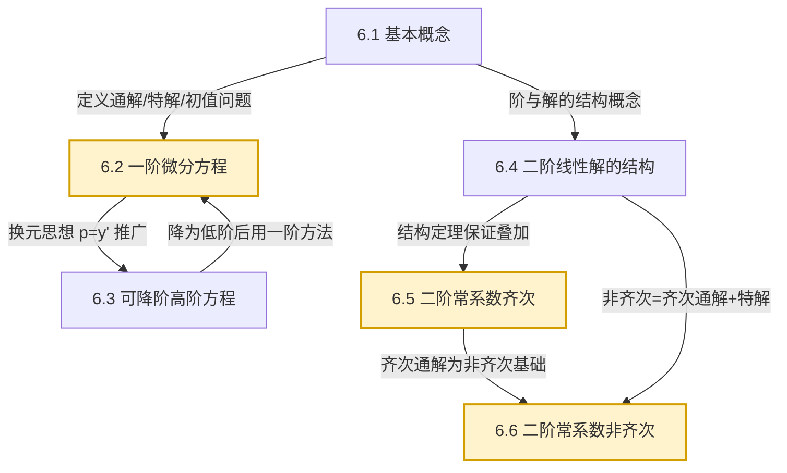

# MOC - 第6章 常微分方程

> [!info] 本章定位
> 第6章把 [[MOC - 高等数学A(1)]] 中"求导数"的逆运算系统化，建立**常微分方程**理论：从含有未知函数及其导数的关系式出发，求出未知函数本身。它以 [[MOC - 高等数学A(1)]] 的不定积分、复合函数求导、参数方程为工具，并在二阶线性方程部分用到 [[MOC - 第5章]] 中幂级数表达的思路（虽然本章以闭式解为主）。本章解决的核心问题是：**对常见类型的微分方程，如何识别其类型并套用相应解法求出通解或特解**，以及**线性微分方程解的结构为什么会带来叠加原理**。常微分方程是后续 [[MOC - 概率论与数理统计B]] 中随机过程、[[MOC - 高等数学A(2)]] 第4章场论、物理与工程建模的直接工具。

## 学习路线图

## 知识点导航

| 小节 | 主题 | 核心内容 | 重点 |
| ---- | ---- | -------- | ---- |
| [[6.1 微分方程基本概念]] | 基本概念 | 微分方程、常/偏微分、阶、通解（任意常数个数=阶数）、特解、初值问题、积分曲线 | 概念根基 |
| [[6.2 一阶微分方程]] | 一阶方程 | 可分离变量、齐次 $y'=\varphi(y/x)$、一阶线性（积分因子法）、伯努利方程 | 计算基本功 |
| [[6.3 可降阶的高阶微分方程]] | 可降阶方程 | $y^{(n)}=f(x)$、$y''=f(x,y')$（缺 $y$）、$y''=f(y,y')$（缺 $x$）三种类型与换元 | 换元技巧 |
| [[6.4 二阶线性微分方程解的结构]] | 解的结构 | 齐次/非齐次、线性相关与无关、朗斯基行列式、通解结构定理、叠加原理 | 理论核心 |
| [[6.5 二阶常系数齐次线性微分方程]] | 齐次常系数 | 特征方程 $r^2+pr+q=0$、三种特征根情形、通解形式、高阶推广 | 公式求解 |
| [[6.6 二阶常系数非齐次线性微分方程]] | 非齐次常系数 | 待定系数法两类（多项式指数型、三角指数型）、$k$ 取值规则、常数变易法简介 | 综合计算 |

## 核心考点

1. **可分离变量方程求解**：将 $dy/dx=f(x)g(y)$ 改写为 $\frac{dy}{g(y)}=f(x)dx$ 再积分，注意 $g(y)=0$ 的常数解（[[6.2 一阶微分方程]]）。
2. **一阶线性方程通解公式**：$y=e^{-\int P dx}\left[\int Q e^{\int P dx}dx+C\right]$，必须先化标准形 $y'+P(x)y=Q(x)$（[[6.2 一阶微分方程]]）。
3. **齐次方程 $y'=\varphi(y/x)$ 换元**：令 $u=y/x$ 化为可分离变量方程（[[6.2 一阶微分方程]]）。
4. **可降阶方程换元**：缺 $y$ 用 $p=y'$，缺 $x$ 用 $p=y'$ 且 $y''=p\,\frac{dp}{dy}$（[[6.3 可降阶的高阶微分方程]]）。
5. **二阶常系数齐次方程特征根法**：判别式 $\Delta=p^2-4q$ 决定三种通解形式（[[6.5 二阶常系数齐次线性微分方程]]）。
6. **非齐次待定系数法**：根据 $f(x)$ 类型与特征根比较确定 $k$ 值，设特解并代入定系数（[[6.6 二阶常系数非齐次线性微分方程]]）。
7. **解的结构定理**：非齐次通解 = 齐次通解 + 非齐次一个特解（[[6.4 二阶线性微分方程解的结构]]）。
8. **线性相关性判别**：两个解线性无关 $\Leftrightarrow$ 朗斯基行列式 $W\ne 0$（[[6.4 二阶线性微分方程解的结构]]）。

## 自测题

> [!question]- 自测1（概念辨析）
> 指出方程 $(x^2+1)y''-2xy'+(\sin x)y=e^x$ 的阶数、是否线性、是否常系数。
>
> > [!success]- 解答
> > 阶数为 2（最高阶导数为 $y''$）；线性（关于 $y,y',y''$ 整体是一次）；变系数（$y'',y',y$ 的系数 $x^2+1,-2x,\sin x$ 含自变量）。属于二阶变系数线性非齐次方程。

> [!question]- 自测2（可分离变量）
> 求 $(1+x^2)dy-2xy\,dx=0$ 的通解。
>
> > [!success]- 解答
> > 分离变量 $\frac{dy}{y}=\frac{2x}{1+x^2}dx$，两边积分
> > $$\ln|y|=\ln(1+x^2)+C_1,\quad y=C(1+x^2),\ C=\pm e^{C_1}.$$
> > 验证 $y=0$ 也是解，它含于 $C=0$ 情形，故通解 $y=C(1+x^2)$（[[6.2 一阶微分方程]]）。

> [!question]- 自测3（二阶常系数齐次）
> 求 $y''-4y'+13y=0$ 的通解。
>
> > [!success]- 解答
> > 特征方程 $r^2-4r+13=0$，$\Delta=16-52=-36<0$，共轭复根 $r=2\pm 3i$。属于第三种情形（$\alpha=2,\beta=3$）：
> > $$y=e^{2x}(C_1\cos 3x+C_2\sin 3x).$$
> > 详见 [[6.5 二阶常系数齐次线性微分方程]]。

> [!question]- 自测4（非齐次特解）
> 求 $y''+y=2\sin x$ 的一个特解。
>
> > [!success]- 解答
> > 齐次特征方程 $r^2+1=0$，$r=\pm i$。$f(x)=2\sin x$ 中 $\lambda=0,\omega=1$，$\lambda\pm i\omega=\pm i$ 是单特征根，故 $k=1$。设
> > $$y^*=x(a\cos x+b\sin x).$$
> > 求导 $y^{*\prime}=a\cos x+b\sin x+x(-a\sin x+b\cos x)$，$y^{*\prime\prime}=-2a\sin x+2b\cos x-x(a\cos x+b\sin x)$。代入方程：$y^{*\prime\prime}+y^*=-2a\sin x+2b\cos x=2\sin x$，比较得 $-2a=2, 2b=0$，即 $a=-1,b=0$。特解 $y^*=-x\cos x$。
> > 详见 [[6.6 二阶常系数非齐次线性微分方程]]。

## 章节导航

- 上一级：[[MOC - 高等数学A(2)]]
- 先修章节：[[MOC - 第5章]]（无穷级数，幂级数解法的预备）、[[MOC - 高等数学A(1)]]（不定积分与求导）
- 上一章：[[MOC - 第5章]]
- 下一章：（本课程最后一章）
- 习题：[[MOC - 第6章习题]]

## 相关标签

#高等数学 #微分方程 #一阶微分方程 #二阶常系数线性微分方程 #可降阶方程
